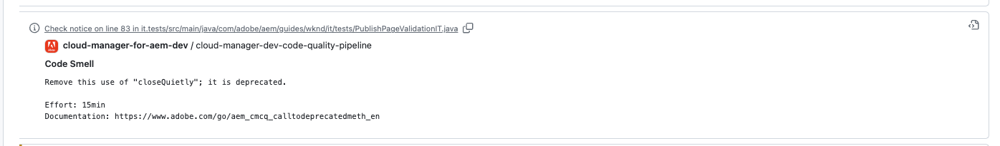
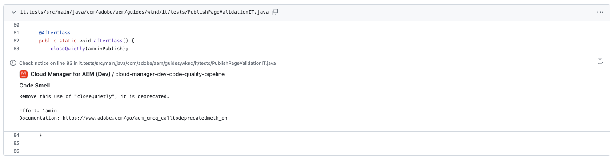
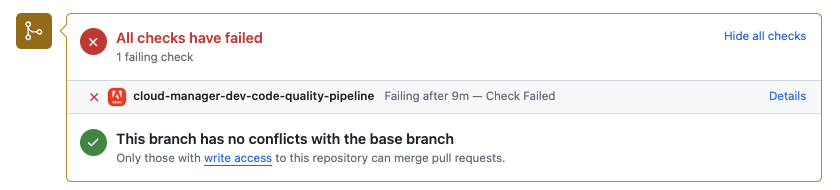

# GitHub Check Annotations {#github-annotations}

Learn how GitHub checks annotate PRs for your private repositories to provide you with helpful feedback.

## Overview {#overview}

If you are using [private repositories](private-repositories.md) for your Cloud Manager program, checks in GitHub are automatically run for every pull request. These PRs are annotated with useful information to help you understand any issues with your code as soon as possible.

[Code quality](/help/implementing/cloud-manager/code-quality-testing.md) issues detected by [SonarQube](/help/implementing/cloud-manager/custom-code-quality-rules.md) are clearly listed. 

The exact line of code with the issue is provided and you can select it to display the relevant code. These annotations cover code issues, not just those in the pull request.

All annotated lines are aggregated on the **Files Changed** tab on the GitHub pull request. Annotations for unchanged pull request files appear in their own section.

## Code Quality Pipelines {#code-quality-pipelines}

The [code quality](/help/implementing/cloud-manager/code-quality-testing.md) results are also visible in the pipeline that Cloud Manager automatically triggers at the bottom of the **Checks** tab. It is also accessible from the **Details** of the pull request check.

You can also visualize the issues in the form of a CSV. You can retrieve this CSV by [viewing the details of the pipeline execution in Cloud Manager](/help/implementing/cloud-manager/configuring-pipelines/managing-pipelines.md#view-details).
