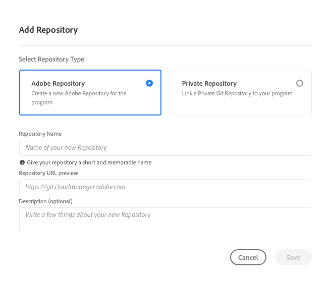
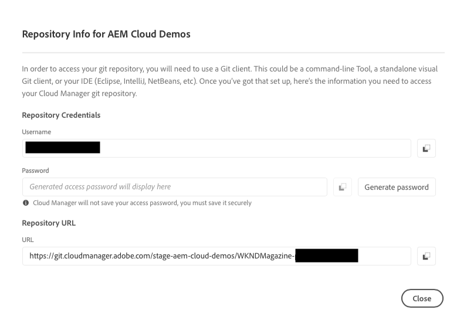
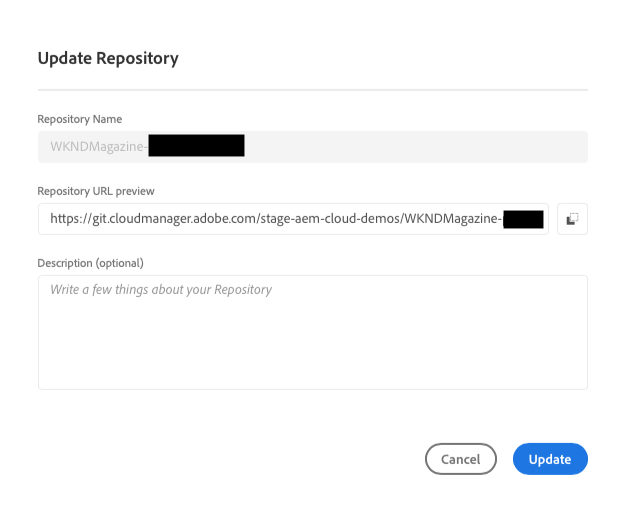
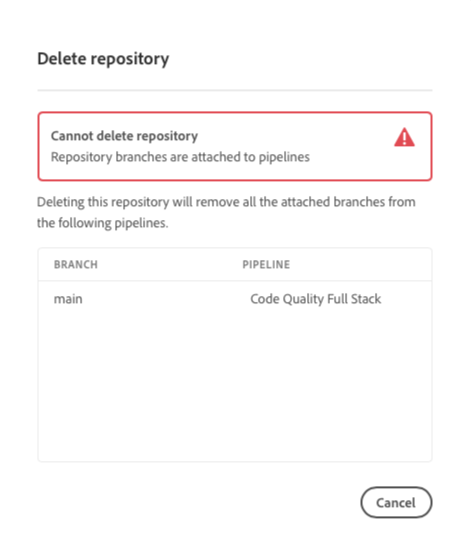

# Managing Repositories in Cloud Manager {#managing-repos} 

Learn how to create, view, and delete your git repositories in Cloud Manager.

## Overview {#overview}

Repositories are used to store and manage your project's code using Git. Every program you create in Cloud Manager has an Adobe-managed repository created for it.

You can choose to create additional Adobe-manage repositories and also add your own private repositories. All repositories associated with your program can be viewed in the **Repositories** window.

Repositories created in Cloud Manager will also be available for you to select when adding or editing pipelines. See [CI-CD Pipelines](/help/implementing/cloud-manager/configuring-pipelines/introduction-ci-cd-pipelines.md) to learn more.

There is a single primary repository or a branch for any given pipeline. With [git submodule support,](git-submodules.md) many secondary branches can be included at build time.

## Repositories Window {#repositories-window}

1. Log into Cloud Manager at [my.cloudmanager.adobe.com](https://my.cloudmanager.adobe.com/) and select the appropriate organization and program.

1. From the **Program Overview** page, select the **Repositories** tab to switch to the **Repositories** page.

1. The **Repositories** window displays all repositories associated with your program.

   

The **Repositories** window provides details about the repositories:

* The type of repository
  * **Adobe** indicates Adobe-managed repositories
  * **GitHub** indicates private GitHub repositories that you manage
* When it was created
* Pipelines that are associated with the repository

You can select the repository in the window and click the ellipsis button to take action on the selected repository.

* **[Check Branches / Create Project](#check-branches)** (only available for Adobe repositories)
* **[Copy Repository URL](#copy-url)**
* **[View &amp; Update](#view-update)**
* **[Delete](#delete)**

## Adding Repositories {#adding-repositories}

Tap or click the **Add Repository** button in the **Repositories** window to start the **Add Repository** wizard.

Cloud Manager supports both repositories managed by Adobe (**Adobe Repository**) as well as your own self-managed repositories (**Private Repository**). The required fields differ depending on the type of repository you choose to add. See the following documents for more details.

* [Adding Adobe Repositories in Cloud Manager](adobe-repositories.md)
* [Adding Private Repositories in Cloud Manager](private-repositories.md)

>[!NOTE]
>
>* A user must have the role **Deployment Manager** or **Business Owner** to be able to add a repository.
>* There is a limit of 300 repositories across all programs in any given company or IMS organization.

## Access Repo Info {#repo-info}

When viewing your repositories in the **Repositories** window, you can view the details on how to access the Adobe-managed repositories programmatically by tapping or clicking the **Access Repo Info** button in the toolbar.

The **Repository Info** window opens with the details. For more information on accessing repository information, please see the document [Accessing Repository Information.](accessing-repos.md)

## Check Branches / Create Project {#check-branches}

The **Check Branches / Create Project** action performs two functions depending on the state of the repository.

* If the repository is newly-created, the action creates a sample project based on [the AEM project archetype.](https://experienceleague.adobe.com/en/docs/experience-manager-core-components/using/developing/archetype/overview)
* If the repository already has had the sample project created, it checks the state of the repository and its branches and reports back if the sample project already exists.

## Copy Repository URL {#copy-url}

The **Copy Repository URL** action copies the URL of the repository selected in the **Repositories** window to the clipboard to be used elsewhere.

## View &amp; Update {#view-update}

The **View &amp; Update** action opens the **Update Repository** dialog. Using it you can view the **Name** and **Repository URL preview** as well as update the **Description** of the repository.

## Delete {#delete}

The **Delete** action removes the repository from your project. A repository can not be deleted if it is associated with a pipeline.

Deleting a repository will:

* Make the deleted repository name unusable for new repositories that may be created in the future.
   * The error message `Repository name should be unique within organization.` is shown in such cases.
* Make the deleted repository unavailable in Cloud Manager and unavailable for linking to a pipeline.
