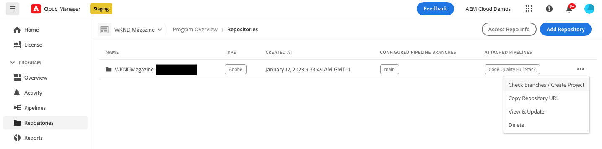
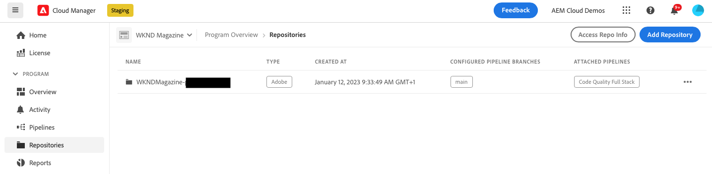
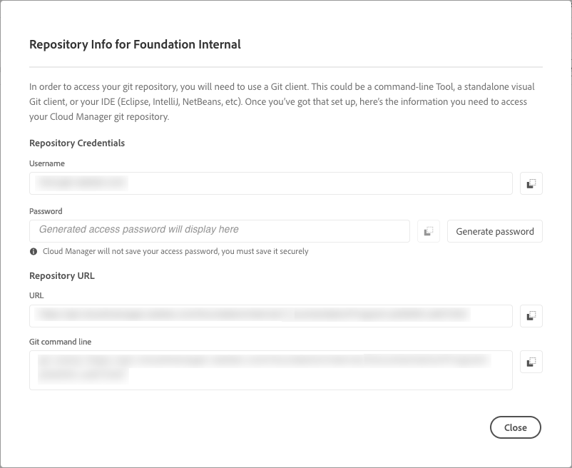
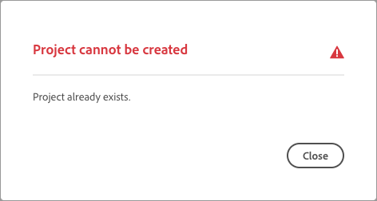
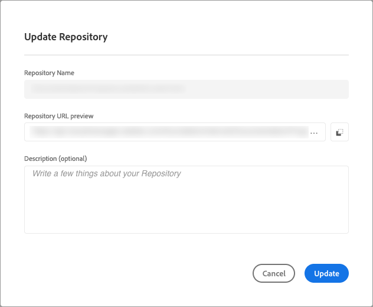
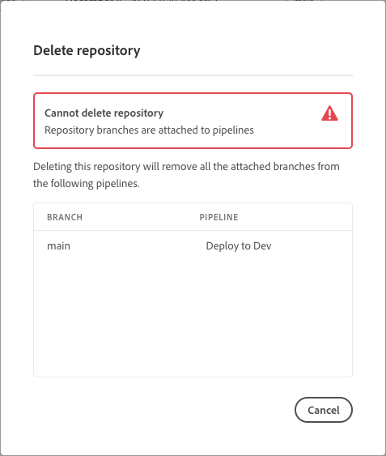

# Manage repositories in Cloud Manager {#managing-repos} 

Learn how to view, add, and delete your git repositories in Cloud Manager.

## About repositories in Cloud Manager {#overview}

Repositories in Cloud Manager are used to store and manage your project's code using Git. For every *program* you add, an Adobe-managed repository is automatically created. 

In addition, you have the option to create more Adobe-managed repositories or add your own private repositories. All repositories linked to your program can be viewed on the **Repositories** page.

Repositories created within Cloud Manager can also be selected when adding or editing pipelines. For more information on configuring pipelines, see [CI-CD Pipelines](/help/implementing/cloud-manager/configuring-pipelines/introduction-ci-cd-pipelines.md).

Each pipeline is linked to a primary repository or branch. However, with [Git submodule support](git-submodules.md), multiple secondary branches can be included during the build process.

## View the Repositories page {#repositories-window}

On the **Repositories** page, you can view details about the selected repository. This information includes the type of repository in use. If the repository is marked as **Adobe**, it indicates that it is an Adobe-managed repository. If it is labeled as **GitHub**, it refers to a private GitHub repository that you manage. Additionally, the page provides details such as when the repository was created and the pipelines associated with it.

To take action on a selected repository, you can click on the repository and use  to open a drop-down menu. For Adobe-managed repositories, you can **[Check Branches / Create Project](#check-branches)**. 

*Drop-down menu on the Repositories page.*

Other available actions on the drop-down menu include **[Copy Repository URL](#copy-url)**, **[View & Update](#view-update)**, and **[Delete](#delete)** the repository.

**To view the Repositories page:**

1. Log into Cloud Manager at [my.cloudmanager.adobe.com](https://my.cloudmanager.adobe.com/) and select the appropriate organization and program.

1. From the **Program Overview** page, on the side menu, click  **Repositories**.

1. The **Repositories** page displays all repositories associated with your selected program.

   
   *The Repositories page in Cloud Manager.*

## Add a repository {#adding-repositories}

A user must have the role **Deployment Manager** or **Business Owner** to add a repository.

On the **Repositories** page, near the upper-right corner, click **Add Repository**

*Add Repository dialog box.*

Cloud Manager supports two types of repositories: Adobe-managed repositories (**Adobe Repository**) and self-managed repositories (**Private Repository**). The required fields for setup vary depending on the type of repository you choose to add. For more information, see the following:

* [Add Adobe repositories in Cloud Manager](adobe-repositories.md)
* [Add private repositories in Cloud Manager](private-repositories.md)

There is a limit of 300 repositories across all programs in any given company or IMS organization.

## Access repository information {#repo-info}

When viewing your repositories in the **Repositories** window, you can view the details on how to access the Adobe-managed repositories programmatically by clicking the **Access Repo Info** button on the toolbar.

The **Repository Info** window opens with the details. For more information on accessing repository information, see [Accessing Repository Information](/help/implementing/cloud-manager/managing-code/accessing-repos.md).

## Check Branches / Create Project {#check-branches}

In **AEM Cloud Manager**, the **Check Branches / Create Project** action serves two purposes, depending on the current state of the repository.

* If the repository is newly created, this action generates a sample project using [the AEM project archetype](https://experienceleague.adobe.com/en/docs/experience-manager-core-components/using/developing/archetype/overview).
* If the sample project is already created in the repository, the action checks the status of the repository and its branches, providing feedback on whether the sample project already exists.

   

## Copy Repository URL {#copy-url}

The **Copy Repository URL** action copies the URL of the repository selected in the **Repositories** page to the clipboard to be used elsewhere.

## View &amp; Update a repository {#view-update}

The **View & Update** action opens the **Update Repository** dialog box, where you can view the repository's **Name** and **Repository URL preview**. Additionally, it lets you update the **Description** of the repository.

## Delete a repository {#delete}

The **Delete** action removes the repository from your project. A repository cannot be deleted if it is associated with a pipeline.

Deleting a repository makes its name unusable for any new repositories created in the future. If you attempt to add a repository using the same name of a deleted repository, you encounter the following error message:

`Repository name should be unique within organization.` 

Additionally, the deleted repository is no longer available in Cloud Manager and cannot be linked to any pipelines.

