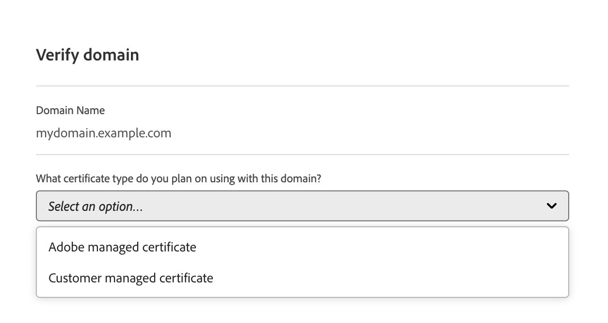
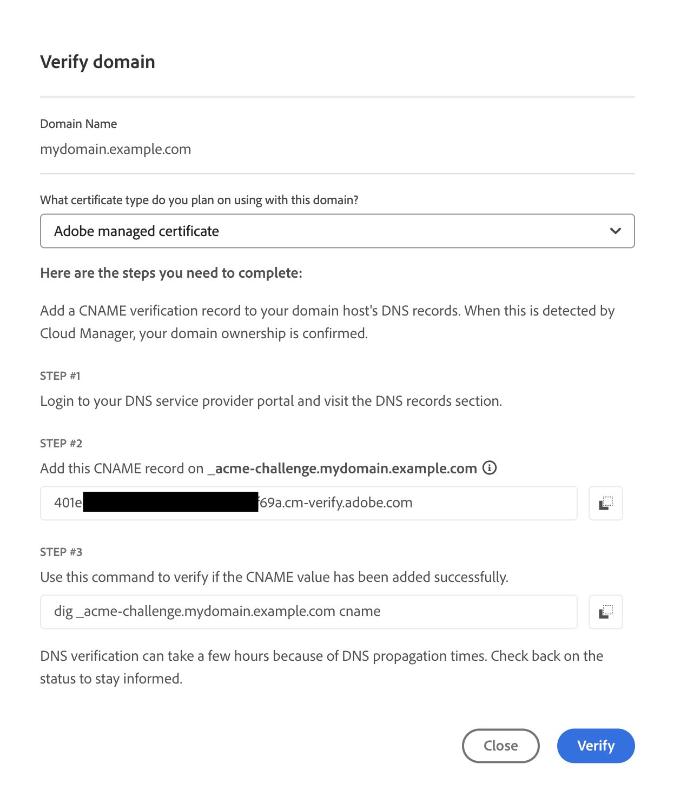
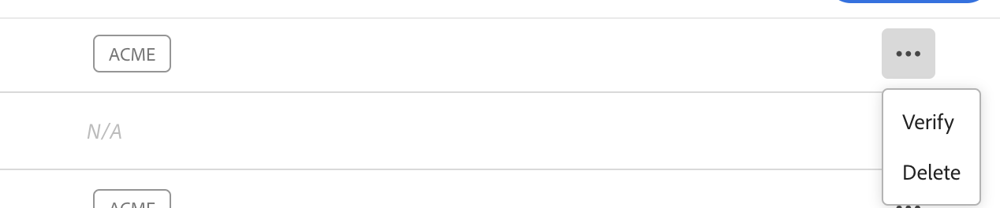

# Add an SSL certificate {#add-ssl-cert}

Learn how to add a customer managed SSL certificate or an Adobe generated and managed DV (Domain Validation) certificate using Cloud Manager's self-service tools.

See also [Troubleshoot SSL certificate errors](/help/implementing/cloud-manager/managing-ssl-certifications/troubleshoot-ssl-cert.md).

## Add an SSL certificate {#adding-an-ssl-certificate}

A certificate can take a few days to provision. As such, Adobe recommends that the certificate be provisioned well in advance of any deadline or go-live date.

Be sure you review **Certificate requirements** in [Introduction to Managing SSL Certificates](/help/implementing/cloud-manager/managing-ssl-certifications/introduction-to-ssl-certificates.md#requirements) to make sure AEM as a Cloud Service supports the certificate that you want to add.

A user must be a member of the **Business Owner** or **Deployment Manager** role to complete this task.

>[!NOTE]
>
>Customers are not permitted to upload DV (Domain Validation) certificates.

**To add an SSL certificate:**

1. Log into Cloud Manager at [my.cloudmanager.adobe.com](https://my.cloudmanager.adobe.com/) and select the appropriate organization. 

1. On the **[My Programs](/help/implementing/cloud-manager/navigation.md#my-programs)** console, select the program.

1. From the **Overview** page, navigate to the **Environments** screen.

1. From the left navigation panel, under **Services**, click **SSL Certificates**. If you do not see the left navigation panel as seen in the following image, you may need to click the hamburger icon in the upper-left corner.

   

1. Near the upper-right corner of the page, click **Add SSL Certificate**.

1. In the **Add SSL certificate** dialog box, based on [your particular use case](/help/implementing/cloud-manager/managing-ssl-certifications/introduction-to-ssl-certificates.md), do one of the following:

    | | Use case | Steps |
    | --- | --- | --- |
    | 1 | **Add an Adobe managed certificate (DV)** | **To add an Adobe managed certificate (DV):** a. Select the certificate type **Adobe managed (DV)**.  b. In the **Select domains** drop-down list, select one or more domains that you want associated with the DV certificate. No domains to select? If so, it means that you must add a custom domain. See [Add a custom domain name](/help/implementing/cloud-manager/custom-domain-names/add-custom-domain-name.md). When you are finished adding a custom domain name, return to this topic and begin at step 1 again. d. Continue to step 7. |
    | 2 | **Add a customer managed certificate (OV/EV)** | **To add a customer managed certificate (OV/EV):** a. Select the certificate type **Customer managed (OV/EV)**. b. In the **Certificate name** field, enter a name for your certificate. This field is for informational purposes only and can be any name that helps you reference your certificate easily. c. In the **Certificate**, **Private key**, and **Certificate chain** fields, paste the required values into their respective fields.  Any detected errors in values are displayed. Before you can save your certificate, you must address all errors. See [Certificate Errors](#certificate-errors) to learn more about troubleshooting common errors. d. Continue to step 7. | 

<!--
    **Add an SSL certificate:**
    1. Select the certificate type **Customer managed (OV/EV)**.
    1. In **Certificate name** field, enter a name for your certificate. This field is for informational purposes only and can be any name that helps you reference your certificate easily.
    1. In the **Certificate**, **Private key**, and **Certificate chain** fields, paste the required values into their respective fields.

        
  
    Any detected errors in values are displayed. Before you can save your certificate, you must address all errors. See [Certificate errors](#certificate-errors) to learn more about troubleshooting common errors.

    **Add a DV certificate:**
    1. Select the certificate type **Adobe managed (DV)**.

        

    1. In the **Select domains** drop-down list, select one or more domains that you want associated with the DV certificate.

        No domains to select? If so, it means that you must add a custom domain. See [Add a custom domain](#add-custom-domain). When you are finished, resume the steps from the beginning again. -->

1. In the lower-right corner of the dialog box, click **Save**.

    After the certificate is successfully issued, it shows a green check mark in the **SSL Certificates** table.

You now have added a working SSL certificate for your project. This step is often the first to set up a custom domain name.

* To set up a custom domain name, see [Add a custom domain name](/help/implementing/cloud-manager/custom-domain-names/add-custom-domain-name.md).
* To learn about updating and managing your SSL certificates in Cloud Manager, see [Manage SSL certificates](/help/implementing/cloud-manager/managing-ssl-certifications/managing-certificates.md).

<!--
### Add a custom domain {#add-custom-domain}

Before you can add an Adobe generated and managed Domain Validated (DV) certificate, you must first add a custom domain. The process for doing so is nearly the same as detailed in [Introduction to custom domain names](/help/implementing/cloud-manager/custom-domain-names/introduction.md) and [Add a custom domain name](/help/implementing/cloud-manager/custom-domain-names/add-custom-domain-name.md). However, that functionality is now slightly expanded, as described below.

1. When adding a custom domain name, in the **Verify domain** dialog box, select an **Adobe managed certificate**.

    

1. In the **Verify domain** dialog box, add a CNAME verification record to your DNS.

    

1. After the domain is created, click the ellipsis button in the list of domains and select **Verify** to verify the domain.

     

1. Resume the task [Add a DV certificate](#adding-an-ssl-certificate). -->

