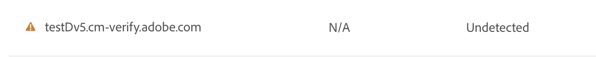
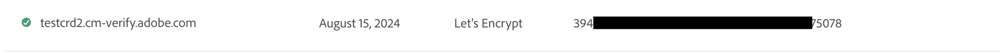
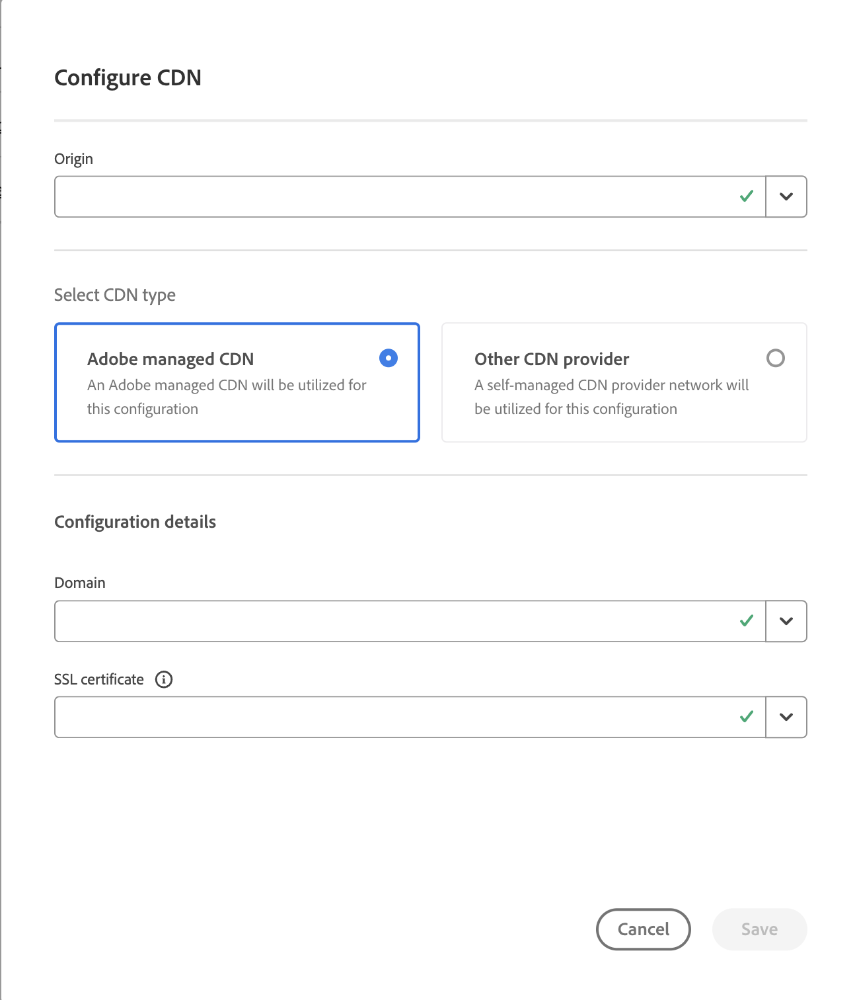

# Domain Validated (DV) Certificates {#domain-validated-certificates}

Learn how to manage domain validated (DV) certificates in Cloud Manager.

>[!NOTE]
>
>This feature is only available to [the early adopter program.](/help/implementing/cloud-manager/release-notes/current.md#early-adoption)

## Introduction {#introduction}

Cloud Manager allows you to self-service generate and manage a domain validated (DV) SSL certificate. This gives you the fastest, easiest, and most cost-effective solution to create a secure website for your online business.

Domain validated certificates are available to both [production and sandbox programs.](/help/implementing/cloud-manager/getting-access-to-aem-in-cloud/program-types.md)

## Adding a Custom Domain {#adding-domain}

To add a domain validated (DV) certificate, you must first configure your custom domain. The process is largely the same as detailed in the document [Introduction to Custom Domain Names.](/help/implementing/cloud-manager/custom-domain-names/introduction.md) However that functionality has been slightly expanded.

1. When verifying the domain, you can choose to use Adobe-manged or self-managed certificates with the domain. Choose **Adobe managed certificate** in order to add a DV certificate later.

   

1. To use an Adobe managed certificate, you need to add a CNAME record to your DNS as described in the **Verify domain** dialog.

   

1. Once the domain is created, tap or click the ellipsis button in the list of domains and select **Verify** to verify the domain.

   

## Adding a DV Certificate {#adding}

Once you have your domain correctly configured, to add a DV certificate, tap or click the **Add SSL certificate** button in the SSL Certificates window.

1. Select the option **Adobe managed (DV)**.
1. Specify the domain name in the **Select domains** drop down.
1. Tap or click **Save**.

Once successfully added the certificate will have a pending status with a yellow warning sign to its name in the **SSL Certificates** window.

Once successfully issued the certificate will have a green check mark to its name in the **SSL Certificates** window.

For more information about adding SSL certificates and the SSL Certificates window, please see the document [Adding an SSL Certificate.](add-ssl-certificate.md)

## Add CDN Configuration {#add-cdn}

This step must be completed in order to configure a domain with a SSL using Fastly CDN.

Follow these steps to add a CDN configuration using Cloud Manager.

1. Log into Cloud Manager at [my.cloudmanager.adobe.com](https://my.cloudmanager.adobe.com/) and select the appropriate organization.

1. Select the **CDN Configurations** tab and click or tap **Add** in the tool bar.

1. In the **Configure CDN** dialog, provide the necessary information.

   * Select the **Origin**. This can be:
     * A Cloud Service Environment
     * An Edge Delivery Services site
   * Select your CDN type.
   * Select the domain.
   * Select the SSL certificate.
     * Only required for Adobe-managed CDNs.

   

>![NOTE]
>
>For Adobe-managed CDNs, when using DV certificates, only sites with ACME validation are permitted.
