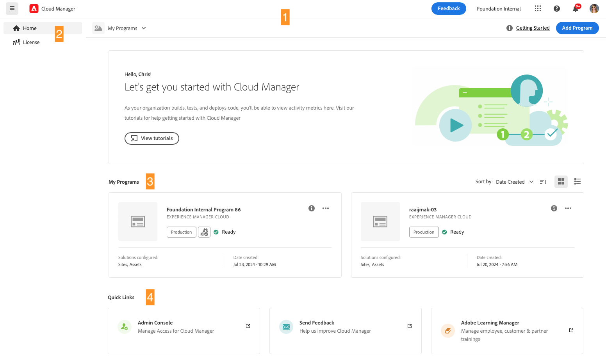
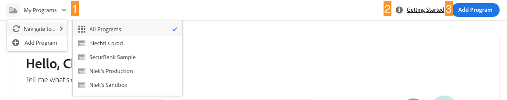
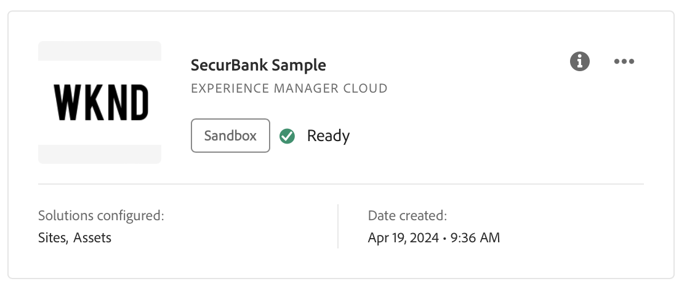
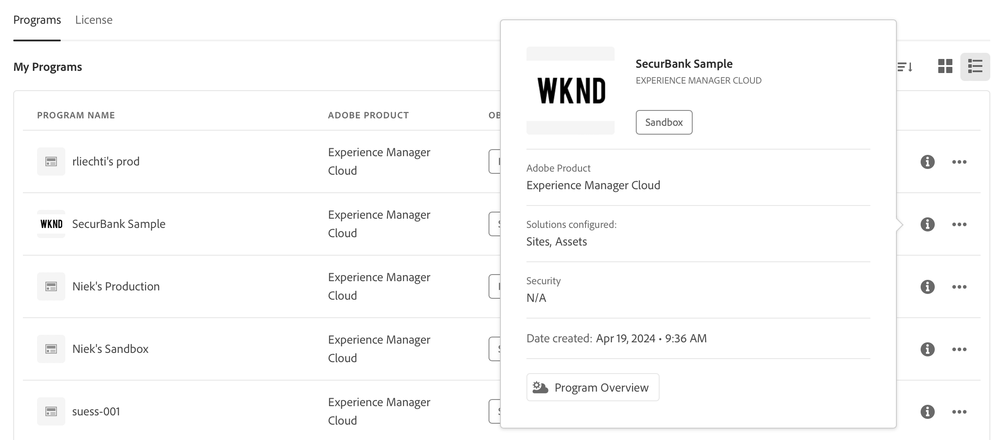
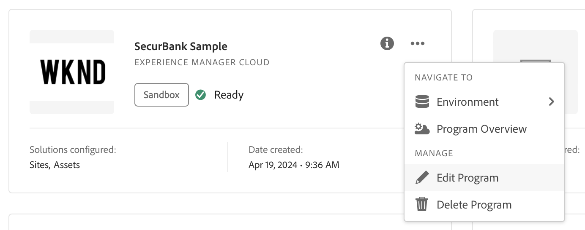
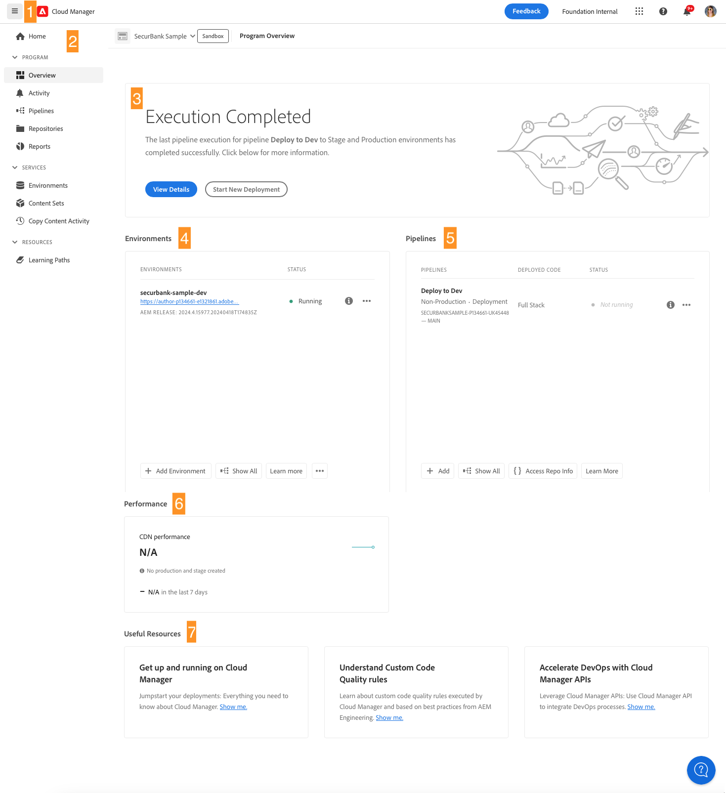
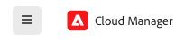
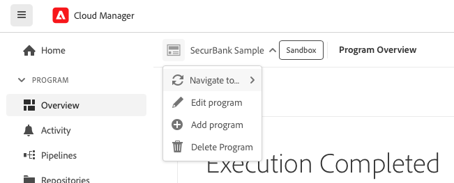

# Navigate the Cloud Manager UI {#navigation}

Learn how the Cloud Manager UI is organized and how to navigate to manage your programs and environments.

The Cloud manage UI is primarily composed of two graphical interfaces:

* [The My Programs console](#my-programs-console) is where you can view and manage all of your programs.
* [The Program Overview window](#program-overview) is where you can see the detail of and manage an individual program.

>[!TIP]
>
>Also check out the [onboarding documentation journey](/help/journey-onboarding/overview.md) for a complete overview of how to get up-and-running with AEM as a Cloud Service using Cloud Manager.

## My Programs Console {#my-programs-console}

When you log into Cloud Manager at at [my.cloudmanager.adobe.com](https://my.cloudmanager.adobe.com/) and select the appropriate organization, you arrive at the **My Programs** console.

The My Programs console provides an overview of all programs to which you have access in the selected organization. It is made up of several parts.

1. [Toolbars](#toolbars-my-programs-toolbars) for organization selection, alerts, and account settings
1. Tabs that let you toggle the current view of your programs.
   * **Home** view (default) that selects the **My Programs** view with an overview of all programs
   * **License** that accesses the [License Dashboard](/help/implementing/cloud-manager/license-dashboard.md).
   * Note that the tabs default to closed and can be revealed using  in the [Cloud Manager header](#cloud-manager-header).
1. [Statistics and call-to-action](#statistics) for an overview of your recent activity
1. [**My Programs** section](#my-programs-section) with an overview of all your programs
1. [Quick links](#quick-links-section) to access related resources easily.

>[!TIP]
>
>See [Programs and Program Types](/help/implementing/cloud-manager/getting-access-to-aem-in-cloud/program-types.md) for details on programs.

### Toolbars {#my-programs-toolbars}

There are two toolbars on top of each other. 

#### Cloud Manager header {#cloud-manager-header}

The first is the Cloud Manager header, which is persistent as you navigate Cloud Manager. It is an anchor that gives you access to settings and information that apply across Cloud Manager programs.

1. Click  (show or hide side menu) to give you access to a variety of tabs that can take you to specific parts of an individual program. Or, you can switch between the [License Dashboard](/help/implementing/cloud-manager/license-dashboard.md) and the **[My Programs](#my-programs-console)** console depending on the context.
1. Click the Adobe Cloud Manager button takes you back to the My Programs console of Cloud Manager no matter where you are in Cloud Manager.
1. Click **Feedback** to provide feedback to Adobe about Cloud Manager.
1. Click the organization selector displays the organization that you are currently signed into (in this example, Foundation Internal). Click to switch to another organization if your Adobe ID is associated with multiple.
1. Click  (Solutions switcher) to jump quickly to other Experience Cloud solutions.
1. Click  to give you quick access to learning and support resources.
1. Click  ([Notifications](/help/implementing/cloud-manager/notifications.md)) to see notifications and announcements, among other things.
1. Click the icon representing user access to your user settings. If you do not have a user picture configured, an icon is randomly assigned.

#### Program toolbar {#program-toolbar}

The program toolbar provides links to switch between Cloud Manager programs and actions appropriate to the context.

1. The **My Programs** selector opens a drop-down where you can select other programs quickly or take context-appropriate actions such as creating a new program
1. The **Getting Started** link gives you access to the [onboarding documentation journey](/help/journey-onboarding/overview.md) to get you up-and-running with Cloud Manager.
1. The action button offers context-appropriate actions such as adding a program.

### Statistics and call-to-actions {#statistics}

The statistics and call-to-action section provides aggregate data for your organization, for example, if you have successfully set up your programs, statistics of your activities over the past 90 days might show, including:

* Number of [deployments](/help/implementing/cloud-manager/deploy-code.md)
* Number of [code quality issues](/help/implementing/cloud-manager/code-quality-testing.md) identified
* Number of builds

Or if you are just beginning the setup of your org, there might be tips on next steps or documentation resources.

### My Programs section {#my-programs-section}

The main content of the **My Programs** console is the list of programs in the **My Programs** section.

The **My Programs** section lists cards representing each program. Click a card to access the **Program Overview** page of the program for details about the program.

>[!NOTE]
>
>Depending on your privileges, you may not be able to select certain programs.

To find the program you need more easily, use the sorting options.

* Sort by:
  * **Date Created** (default)
  * **Program Name**
  * **Status**
*  Ascending (default) /  Descending
*  Grid View (default)
*  List View

#### Program cards {#program-cards}

A card (or row in a table) represents every program, providing an overview of the program and quick links to take action.

* Image associated with the Program, if configured. The image above is "WKND."
* Name assigned to the Program. The image above shows "SecurBank Sample" as the program name.
* Service type:
  * **Experience Manager Cloud** &mdash; for AEM as a Cloud Service programs 
  * **Experience Manager** &mdash; for [AMS (Adobe Managed Services) programs](https://experienceleague.adobe.com/en/docs/experience-manager-cloud-manager/content/introduction)
* [Program type](/help/implementing/cloud-manager/getting-access-to-aem-in-cloud/program-types.md):
  * Sandbox
  * Production
* Status. In the image above, status is Ready with a check mark.
* Configured solutions. In the image above, Sites and Assets are the configured solutions.
* Creation date.

A production program might be badged to show additional features you chose at the time you added it, such as the following:

*  [HIPAA](/help/implementing/cloud-manager/getting-access-to-aem-in-cloud/creating-production-programs.md#security)

*  [WAF-DDOS Protection](/help/implementing/cloud-manager/getting-access-to-aem-in-cloud/creating-production-programs.md#security)

* [99.99% SLA (Service Level Agreement)](/help/implementing/cloud-manager/getting-access-to-aem-in-cloud/creating-production-programs.md#sla)

The information icon also gives quick access to additional information about the program (useful in list view).

The  icon gives you access to additional actions you can take on the program.

* Navigate to a particular  [Environment](/help/implementing/cloud-manager/manage-environments.md) of the program
* Open the  [Program Overview](#program-overview)
*  [Edit the program](/help/implementing/cloud-manager/getting-access-to-aem-in-cloud/editing-programs.md#editing)
* [Delete a sandbox program](/help/implementing/cloud-manager/getting-access-to-aem-in-cloud/editing-programs.md#delete-sandbox-program)

>[!TIP]
>
>For more information about programs and adding and managing programs, see the following:
>
>* [Programs and Program Types](/help/implementing/cloud-manager/getting-access-to-aem-in-cloud/program-types.md)
>* [Create production programs](/help/implementing/cloud-manager/getting-access-to-aem-in-cloud/creating-production-programs.md)
>* [Create sandbox programs](/help/implementing/cloud-manager/getting-access-to-aem-in-cloud/creating-sandbox-programs.md)

### Quick links section {#quick-links-section}

The quick links section gives you access to commonly used resources that are related.

## Program overview page {#program-overview}

When a program is selected in the **[My Programs](#my-programs-console)** console, you are taken to the **Program Overview** page.

The program overview gives you access to all details of a Cloud Manager program. Like the **My Programs** console, it is made of several parts.

1. [Toolbars](#program-overview-toolbar) to jump back to the My Programs console quickly, and to navigate the program
1. [Tabs](#program-tabs) to switch between different aspects of the program
1. A [call-to-action](#cta) based on the last actions of the program
1. An [overview of the environments](#environments) of the program
1. An [overview of the pipelines](#pipelines) of the program
1. An [overview of the performance](#performance) of the program
1. Links to [useful resources](#useful-resources)

### Toolbars {#program-overview-toolbar}

The toolbars for the program overview are similar to those toolbars of the [My Programs console](#my-programs-toolbars). Only the differences are illustrated here.

#### Cloud Manager header {#cloud-manager-header-2}

In the upper-left corner of the page is the Adobe Cloud Manager header. You can click  to show or hide the side menu of tabs to other areas of the software.

Click Adobe Cloud Manager to return to Home.

#### Program toolbar {#program-toolbar-2}

The program toolbar still gives you access to switch to other programs quickly, but additionally gives access to context-appropriate actions such as adding and editing the program.

The toolbar always shows the tab that you currently are on, even if you have hidden the tabs using .

### Program tabs {#program-tabs}

Each program has numerous options and data associated with it. These options and data are gathered into tabs to make navigating the program simpler. The tabs give you access to:

**Program**

*  Overview - The program overview as described in the current document
*  [Activity](/help/implementing/cloud-manager/configuring-pipelines/managing-pipelines.md#activity) - The history of pipeline runs of the program
*  [Pipelines](/help/implementing/cloud-manager/configuring-pipelines/managing-pipelines.md#pipelines) - All pipelines configured for the program
*  [Repositories](/help/implementing/cloud-manager/managing-code/managing-repositories.md) - All repositories configured for the program
*  [Reports](/help/implementing/cloud-manager/sla-reporting.md) - Metrics such as SLA data

**Services**

*  [Environments](/help/implementing/cloud-manager/manage-environments.md) - All environments configured for the program
*  [Edge Delivery Sites](/help/implementing/cloud-manager/edge-delivery/introduction-to-edge-delivery-services.md) - Manage Edge Delivery sites
*  [Domain Settings](/help/implementing/cloud-manager/custom-domain-names/introduction.md) - Manage custom domain names for the program
*  [SSL Certificates](/help/implementing/cloud-manager/managing-ssl-certifications/introduction-to-ssl-certificates.md) - Manage SSL certificates for the program
*  [Domain Mappings](/help/implementing/cloud-manager/custom-domain-names/introduction.md) - Manage Domain Mappings 
*  [IP Allow Lists](/help/implementing/cloud-manager/ip-allow-lists/introduction.md) - Define allow lists for certain IP addresses
*  [Content Sets](/help/implementing/developing/tools/content-copy.md) - Sets of content created for copy purposes
*  [Copy Content Activity](/help/implementing/developing/tools/content-copy.md) - Content copy activities
*  [Network Infrastructures](/help/security/configuring-advanced-networking.md) - Manage advanced networking options for the program

**Resources**

*  Learning Paths - Additional learning resources about Cloud Manager

By default, when you open a program you arrive on the **Overview** tab. The current tab is highlighted. Select another tab to show its details.

In the upper-left corner of the [Cloud Manager header](#cloud-manager-header-2), click  to show or hide the side menu of tabs.

### Call-to-action {#cta}

The call-to-action section gives you helpful information depending on the status of your program. For a new program, you may see next steps given and a reminder of a go-live date, [set during program creation](/help/implementing/cloud-manager/getting-access-to-aem-in-cloud/editing-programs.md).

For a live program, the status of your last deployment with links for details and starting a new deployment.

### Environments card {#environments}

The **Environments** card gives you an overview of your environments and links for quick actions.

The **Environments** card only lists three environments. Click  **Show All** to see all environments of the program.

See also [Manage Environments](/help/implementing/cloud-manager/manage-environments.md).

### Pipelines card {#pipelines}

The **Pipelines** card gives you an overview of your pipelines and links for quick actions.

The **Pipelines** card only lists three pipelines. Click  **Show All** to see all pipelines of the program.

See also [Manage Pipelines](/help/implementing/cloud-manager/configuring-pipelines/managing-pipelines.md) for details on how to manage your pipelines.

### Performance card {#performance}

The **Performance** card gives an overview of the **[CDN Dashboard](/help/implementing/cloud-manager/cdn-performance.md)**.

### Useful resources {#useful-resources}

The **Useful Resources** section provides links to additional learning resources for Cloud Manager.
