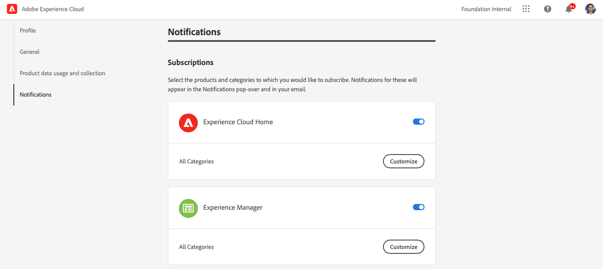
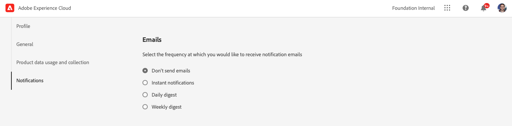

# Notifications {#notifications} 

[!UICONTROL Cloud Manager] allows the user to receive notifications when the production pipeline starts and completes (successfully or unsuccessfully), during a production deployment.

These notifications are sent through the Adobe [!UICONTROL Experience Cloud] notification system to users with the roles **Business Owner**, **Program Manager**, and **Deployment Manager**.

The notifications appear at the right end of the menu bar in the [!UICONTROL Cloud Manager] UI and throughout Adobe [!UICONTROL Experience Cloud].

The bell icon is badged when there are new notifications. Click on it to open the a panel to view the notifications.

The panel only lists the most recent notifications. Click **View All** at the bottom of the panel to see all of your notifications.

## Email Notifications {#email-notifications}

By default, notifications are available in the user interface across Adobe [!UICONTROL Experience Cloud] solutions. Individual users can also opt for these notifications to be sent through email by following these steps.

1. Click on the bell icon to reveal the notifications.
1. Click on the **Edit Preferences** icon (shaped like a gear) at the top of the notifications panel.
1. In the window that opens, click on **Notifications** in the left navigation.
   
1. Scroll down to the **Email** heading.
   
1. Select how you would like to receive your emails.
   * Don't send emails (default)
   * Instant notifications
   * Daily digest
   * Weekly digest

Once you make your selection, your choice is automatically saved with no need to click on a save or apply button.
