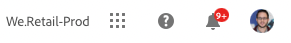
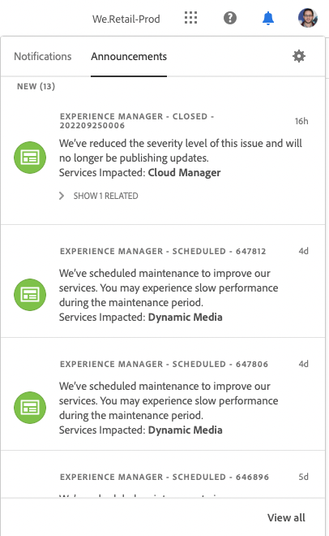
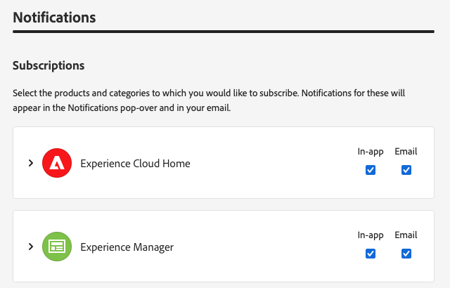
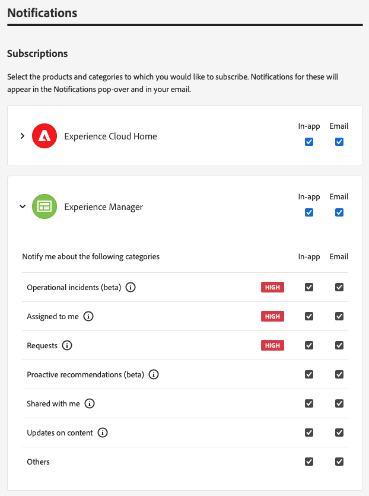
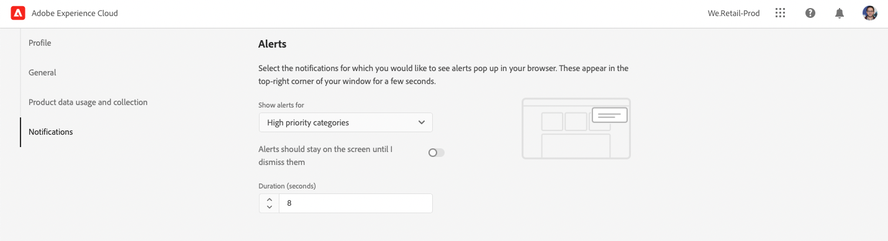

# Notifications {#notifications}

Learn how Cloud Manager notifies you of important events.

## Notifications in Cloud Manager {#cloud-manager-notifications}

[!UICONTROL Cloud Manager] sends you notifications when a production pipeline starts and completes (successfully or unsuccessfully), at the start of a production deployment.

These notifications are sent through the [!UICONTROL Experience Cloud] notification system to users in the **Business Owner**, **Program Manager**, and **Deployment Manager** roles.

The notifications appear in a sidebar within [!UICONTROL Cloud Manager] and throughout the Adobe [!UICONTROL Experience Cloud]. The bell icon in the header is badged when you have new notifications.

Click the bell icon to open the sidebar and view the notifications. The **Notifications** tab in the sidebar lists the most recent notifications such as deployment confirmations. Notifications concern your environments.

The **Announcements** tab includes Adobe product announcements. Announcements concern the product.

Click a notification or announcement to view its details. Notifications linked to activities such as pipeline deployments take you to the detail of that activity such as the pipeline execution window.

Click the **View all** option at the bottom of the panel to view all announcements in your inbox.

Click the **Mark all as read** option at the bottom of the panel to mark all unread notifications as read and clear the bell icon badging.

## Notification Configuration {#configuration}

You can customize how you receive notifications and what notifications you receive.

Click the gear icon at the top of the notifications sidebar.

This opens the **Experience Cloud preferences** window, where you can define your notification subscriptions and how you receive your notifications.

### Subscriptions {#subscriptions}

Subscriptions define for which products you receive notifications and which notifications.

By default, you will receive all notifications for all products both in the application and via email. Click the chevron next to a product name reveal the detailed options and define the types of notifications you receive for that product. Or check or uncheck the options at the product level to select/deselect all options for the product.

### Priority {#priority}

Priority alerts are marked with a **HIGH** tag and can be configured to be exclusively received as alerts. In the **Priority** section, you can define which categories qualify as priority notifications.

Use the drop-down to add to the list of categories that qualify as priority. Click the X next to the category names to remove them.

### Alerts {#alerts}

Alerts appear in the top-right corner of your window for a few seconds. Use the **Alerts** section to define for which notifications you receive alerts.

You can define the behavior of the alerts.

* **Show alerts for** - Defines the types of notifications that trigger alerts
* **Alerts should stay on the screen until I dismiss them** - Controls if the alerts should persist unless you actively dismiss them
* **Duration** - Defines how long the alert should remain on the screen if you have not chosen that they should stay on the screen.

### Emails {#emails}

Notifications are available in the web user interface across Adobe [!UICONTROL Experience Cloud] solutions. You can also opt for these notifications to be sent through email in the **Emails** section.

By default no emails are sent. You can choose to receive emails as:

* Instantly
* Daily
* Weekly

When **Instant notifications** is chosen, emails are sent immediately for every notification. For **Daily digest** and **Weekly digest** you can choose when your daily digest is sent and on which day and when your weekly digest is sent.