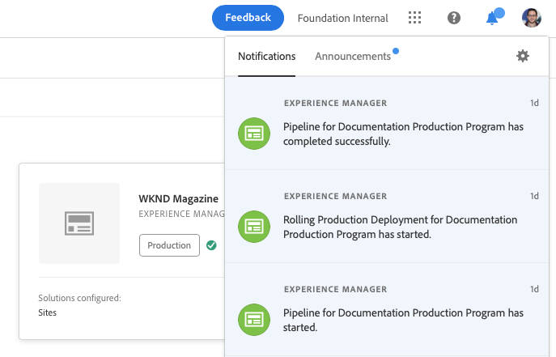

# Understanding Notifications {#notifications} 

[!UICONTROL Cloud Manager] allows the user to receive notifications when the production pipeline starts and completes (successfully or unsuccessfully), at the start of a production deployment. These notifications are sent through the Adobe [!UICONTROL Experience Cloud] Notification system.

>[!NOTE]
>
>The approval and scheduled notifications are only sent to users in the Business Owner, Program Manager, and Deployment Manager roles.

The notifications appear in a sidebar in [!UICONTROL Cloud Manager] UI (User Interface) and throughout the Adobe [!UICONTROL Experience Cloud].

Click on the bell icon from the header to open the sidebar and view the notifications, as shown in the figure below:

The sidebar lists the most recent notifications.

## Email Notifications {#email-notifications}

By default, notifications are available in the web user interface across Adobe [!UICONTROL Experience Cloud] solutions. Individual users can also opt for these notifications to be sent through email, either on an immediate or digest basis.

This will take the user to the Notifications Preferences screen in Adobe [!UICONTROL Experience Cloud].

The users can turn on email notifications and (optionally) select the types of notifications they want to receive over email.

>[!NOTE]
>You can also enable digesting from the Adobe [!UICONTROL Experience Cloud].
