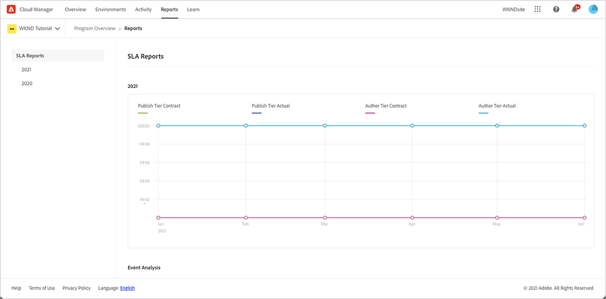
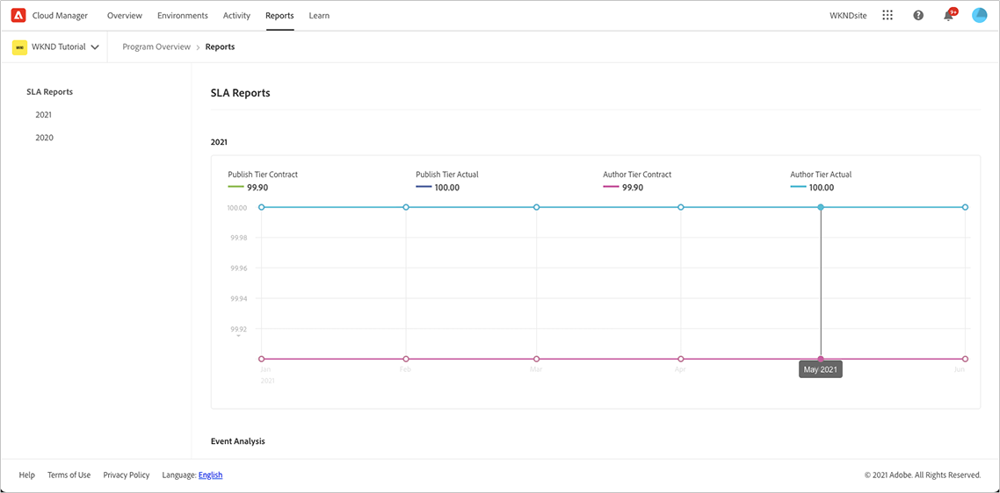

# SLA Reporting {#sla-reporting} 

Learn how to see the performance of your production AEM environment relative to the contracted Service Level Agreement (SLA).

## Introduction {#introduction}

SLA reporting data is available for every production program via the **Reports** tab. Follow these steps to access.

1. Log into Cloud Manager at [my.cloudmanager.adobe.com](https://my.cloudmanager.adobe.com/) and select the appropriate organization and program.

1. Navigate to the **Reports** tab from the **Overview** page.

1. Click on the year desired to see the SLA data graphed.

Roll your cursor over a data point to show the specific values for that point.

## SLA Metrics {#sla-metrics}

The graph of the selected year includes a number of data sets.

* **Publish Tier Contract** - This is the SLA defined in your contract with Adobe for the publish tier.

* **Publish Tier Actual** - This is the measured uptime of the production publish tier factoring incidents caused by Adobe or Adobe's vendors.

* **Author Tier Contract** - This is the SLA defined in your contract with Adobe for the author tier.

* **Author Tier Actual** - This is the measured uptime of the production author tier factoring incidents caused by Adobe or Adobe's vendors.

## Event Analysis {#event-analysis}

The **Event Analysis** section under the graph shows the set of incidents which occurred for the program during the selected year. 

Each of the incidents has a time range, a cause, and a set of comments.

