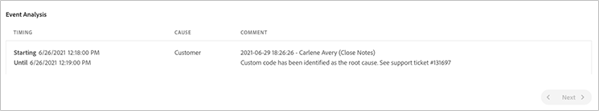

# SLA Reports {#sla-reporting} 

Learn how to see the performance of your production AEM environment relative to the contracted SLA (Service Level Agreement).

## View an SLA report {#introduction}

SLA report data tracks performance metrics for two production tiers: Author Tier and Publish Tier. 

The line graph of a selected year includes data points for each month from January to December. The following metrics are tracked.

| Metric tracked | Line color | Description |
| --- | --- | --- |
| Author Tier Actual | Light green | The measured uptime of the production Author Tier factoring incidents caused by Adobe or Adobe's vendors. |
| Author Tier Contract  | Dark blue | The SLA defined in your contract with Adobe for the Author Tier. |
| Publish Tier Actual | Orange | The measured uptime of the production Publish Tier, factoring incidents caused by Adobe or Adobe's vendors. |
| Publish Tier Contract | Red | The SLA defined in your contract with Adobe for the Publish Tier. |

**To view an SLA report:**

1. Log into Cloud Manager at [my.cloudmanager.adobe.com](https://my.cloudmanager.adobe.com/) and select the appropriate organization.

1. On the **[My Programs](/help/implementing/cloud-manager/navigation.md#my-programs)** console, select the program.

1. From the **Program Overview** page, in the left side menu, click **Reports**.

1. Click **SLA Reports**. 

    

1. Click the year desired to see a line graph of SLA data.

1. (Optional) Do any of the following:

    * Roll your cursor over a data point in the line graph to show the specific values for that point.
    * Below the line graph's year, click the Download icon to save a PNG image file of the line graph.
    * Click a metric name to see just that metric's data. Or, press `Shift` on the keyboard while selecting or deselecting one or more metric names.  

    

## Event Analysis {#event-analysis}

The **Event Analysis** section under the graph shows the set of incidents that occurred for the program during the selected year. 

Each of the incidents has a time range, a cause, and a set of comments.

## Refresh interval of SLA reports {#refresh}

SLA reporting gives you insight into the performance of your AEM production environment and is up-to-date, but not instantaneous. SLA report generation happens monthly and it is generated for new programs that are marked as `Production previous month`. It is not instant. Because of this delay, keep the following in mind as you review your SLA report:

* The reported SLA is the one that existed at the start of the month, even if SLA changed during that month.
* If there was no SLA at the start of the month because the program did not exist, the SLA that existed at the date the program was created applies.

## Preview environments {#preview}

The preview environment is intended as a tool for content authors to verify the content's final experience before publishing. Because of this functionality, preview environments are not designed with high-availability and do not have an associated SLA.
