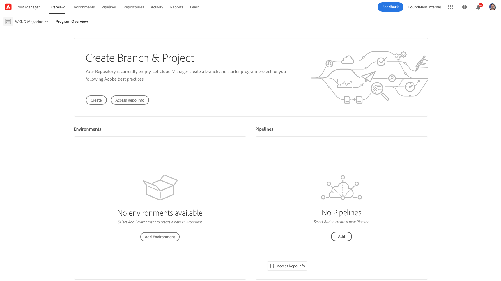
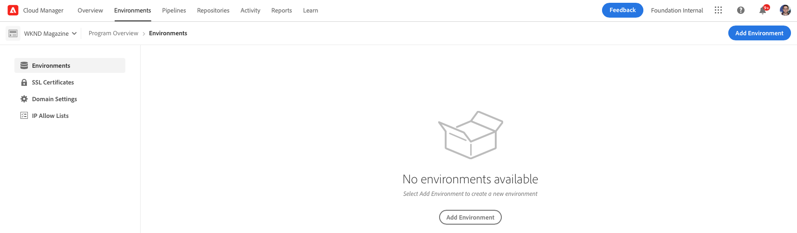
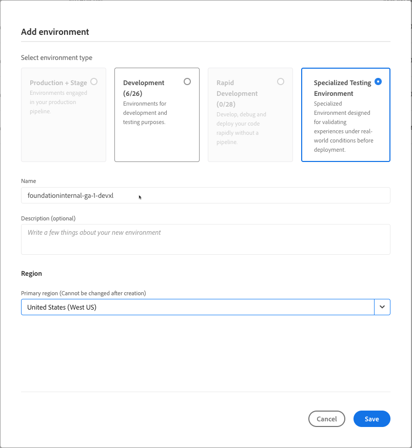

# Add a Specialized Testing Environment{#add-special-test-enviro}

>[!NOTE]
>
>>The feature described in this article is only available through the private beta program. To sign up for the private beta, see [Specialized Testing Environment](/help/implementing/cloud-manager/release-notes/current.md#specialized-test-environment).

The Specialized Testing Environment, or DevXL, is a new type of Cloud Manager environment that you can create. It is designed to support advanced use cases such as User Acceptance Testing (UAT) and performance validation. Unlike traditional Development, Rapid Development, or Staging environments, DevXL environments operate outside of the production deployment pipeline. As such, they offer you greater flexibility while maintaining strict isolation to prevent interference with production workflows. 

DevXL is built to mirror the size, scalability, and configurations of a typical Staging environment. This approach ensures that tests performed in DevXL can yield realistic insights into how code and content perform in production-like conditions. The environment also supports direct content copying from Production or Stage. It also maintains parity with Development environments in terms of deployment workflows, access controls, and network configurations.

## Key features and configurations {#key-features}

| Category | DevXL behavior |
| --- | --- |
| Purpose | UAT and performance testing. |
| Pipeline Type | Not in the production pipeline. |
| Environment Size | Matches Stage environment. |
| Isolation | Fully isolated from other environments. |
| Code Pipelines | Same as the Development environment (Validation, Build, Deploy). |
| Copy Content | Allowed from Production, Stage, or a Specialized Testing Environment. |
| Content Restore | Same as the Development environment. |
| Access Logs | Same as the Development environment. |
| Developer Console | Same as the Development environment. |
| `IP Allow List` | Same as the Development environment. |
| Networking | Same as the Development environment (Services, Domain name, SSL certificates, Advanced network). |

See also [Manage Environments](/help/implementing/cloud-manager/manage-environments.md)

## Add a Specialized Testing Environment {#add-specialized-testing-environment}

To add or edit an environment, a user must be a member of the **Business Owner** role.

**To add a Specialized Testing Environment:**

1. Log into Cloud Manager at [my.cloudmanager.adobe.com](https://my.cloudmanager.adobe.com/) and select the appropriate organization.

1. On the **[My Programs](/help/implementing/cloud-manager/navigation.md#my-programs)** console, click the program for which you want to add an environment.

1. Do one of the following: 

   * On the **[My Programs](/help/implementing/cloud-manager/navigation.md#my-programs)** console, on the **Environments** card, click **Add Environment**.
      If the **Add Environment** option is dimmed (disabled), it may be due to a lack of permissions or dependent on the licensed resources. 

   

   * On the left side panel, click  **Environments**, then on the Environments page, near the upper-right corner, click **Add Environment**.

     
   
1. In the **Add environment** dialog box, do the following:
   
   * Click **Specialized Testing Environment**.
   * Provide an environment **Name**. The environment name cannot be changed after the environment is created.
   * (Optional) Provide a **Description** for the environment.
   * Select a **Primary region** from the drop-down list. Once created, the primary region of the DevXL environment (for example, *United States (West US)*) is locked and cannot be changed.
  
   

1. Click **Save**.

   The **Overview** page now displays your new environment in the **Environments** card. You can now set up pipelines for your new environment.
