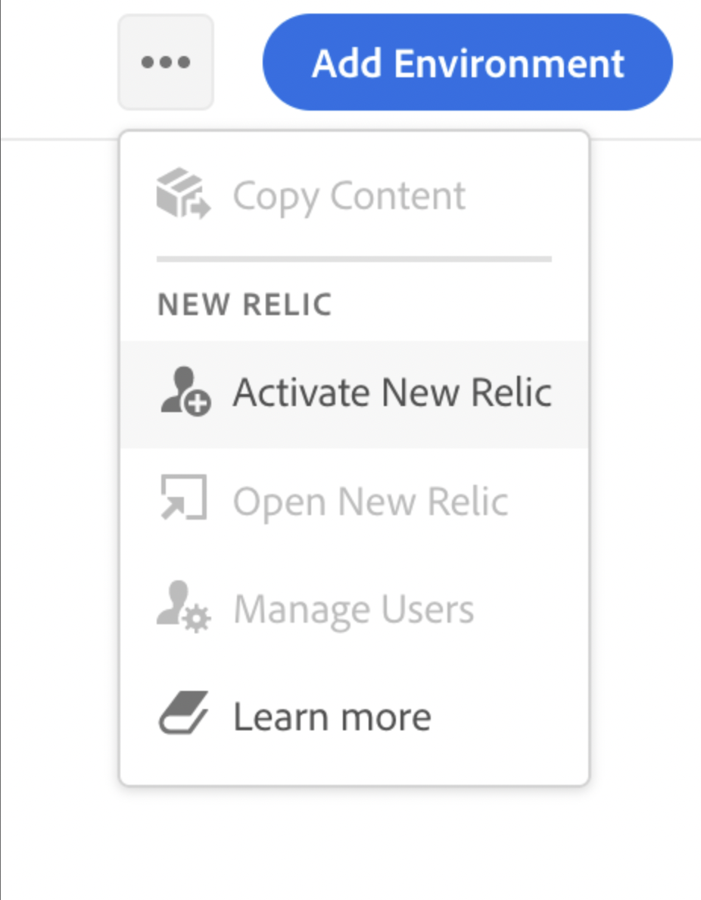
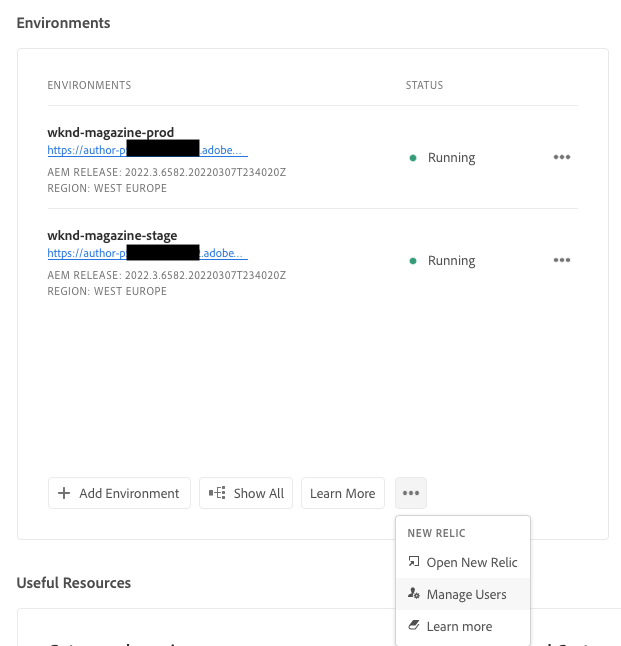
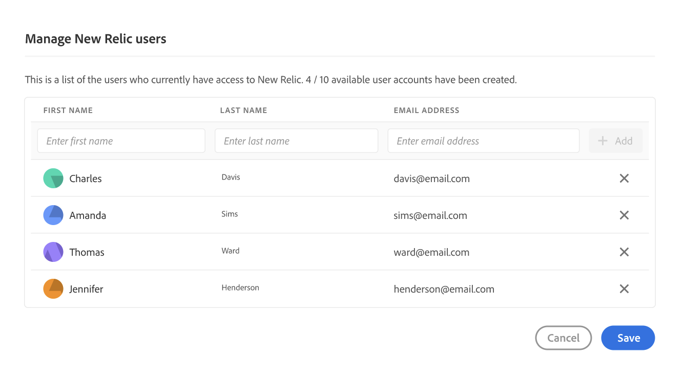
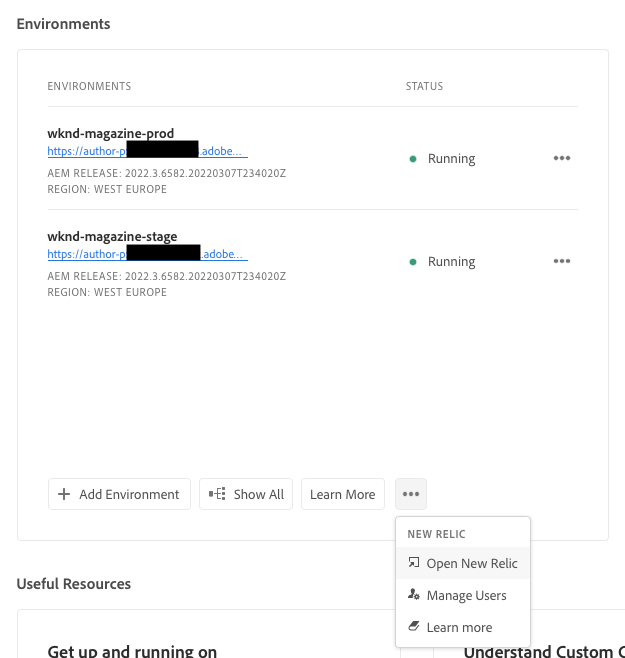

# New Relic One {#user-access}

Learn about the New Relic One application performance monitoring (APM) service for AEM as a Cloud Service and how you can access it.

## About New Relic One {#introduction}

Adobe places a great emphasis on the monitoring, availability, and performance of your application. AEM as a Cloud Service includes access to New Relic One monitoring, giving teams comprehensive visibility into system and environment performance metrics as part of the standard product offering.

This document outlines how to manage access to New Relic One application performance monitoring (APM) features in AEM as a Cloud Service environments. Effective management of these features supports optimal performance and maximizes the benefits of AEM as a Cloud Service.

When a new production program is created, the New Relic One sub-account associated with your AEM as a Cloud Service Program is automatically created. [This sub-account must be activated](#activate-sub-account) to begin ingesting data.

## Features {#transaction-monitoring}

New Relic One APM for AEM as a Cloud Service has many features.

* Direct access to a dedicated New Relic One account

* Instrumented New Relic One APM agent that shows exact method calls with line numbers, including external dependencies and databases

* Holistic performance optimization by combining key metrics from infrastructure-level monitoring and application (Adobe Experience Manager) monitoring

* AEM as a Cloud Service exposes Java Management Extensions (JMX) MBeans and health checks directly within New Relic Insights, enabling in-depth inspection of application performance and health metrics.

## Activate your New Relic One sub-account {#activate-sub-account}

For a newly created program, a New Relic One sub-account is created for you. However, you must activate it for it to ingest data. This activation is not automatic. Follow these steps to activate your sub-account.

>[!NOTE]
>
>A user in the **Business Owner** or **Deployment Manager** role must be logged in to manage the New Relic One sub-account.

1. Log into Cloud Manager at [my.cloudmanager.adobe.com](https://my.cloudmanager.adobe.com/) and select the appropriate organization.

1. On the **[My Programs](/help/implementing/cloud-manager/navigation.md#my-programs)** console, click the program for which you want to manage your New Relic One users.

1. At the bottom of the **Environments** card on the program overview page, click https://spectrum.adobe.com/static/icons/workflow_18/Smock_More_18_N.svg and select **Activate New Relic**.

   

   * You can also access the **Manage users** option. At the top of the **Environments** screen of your program, click .

1. [Run a pipeline](/help/implementing/cloud-manager/configuring-pipelines/managing-pipelines.md#running-pipelines) for the same environment to successful completion to complete the sub-account activation.

When the sub-account is deactivated, there is no data ingestion. 

## Manage New Relic One users {#manage-users}

Follow these steps to define the users of your New Relic One sub-account associated with your AEM as a Cloud Service Program.

>[!NOTE]
>
>A user in the **Business Owner** or **Deployment Manager** role must be logged in to manage New Relic One users.

1. Log into Cloud Manager at [my.cloudmanager.adobe.com](https://my.cloudmanager.adobe.com/) and select the appropriate organization.

1. Click the program for which you want to manage your New Relic One users.

1. At the bottom of the **Environments** card on the program overview page, click https://spectrum.adobe.com/static/icons/workflow_18/Smock_More_18_N.svg and select **Manage users**.

   

   * You can also access the **Manage users** option. At the top of the **Environments** screen of your program, click .

1. In the **Manage New Relic users** dialog box, enter the first and last name of the user you want to add, and click the **Add** button. Repeat this step for all users that you want to add.

   

1. To remove a New Relic One users, click the delete button at the right end of the row representing the user.

1. Click **Save** to create the users.

Once the users are defined, New Relic sends a confirmation email to each user to whom you granted access, so the user can complete the setup process and sign in.

>[!NOTE]
>
>If you are managing the New Relic One users, you must also add yourself as a user to have access yourself. Being the **Business Owner** or **Deployment Manager** does not suffice to have access to New Relic One. You must create yourself as a user too.

## Activate your New Relic One user account {#activate-user-account}

Once a New Relic One user account is created as described in the preview section [Manage New Relic One Users](#manage-users), New Relic sends those users a confirmation email to the provided address. To use those accounts, users must first activate their accounts with New Relic by resetting their passwords.

**To activate your New Relic One user account:**

1. Click the link provided in the email from New Relic.

1. On the New Relic sign in page, click **Forgot your password?**

   

1. Enter the email address where you received the confirmation email, and select **Send my reset link**.

   

1. New Relic sends you an email containing a link to confirm the account.

If you do not receive a confirmation email from New Relic, see the [troubleshooting section](#troubshooting).

## Access New Relic One {#accessing-new-relic}

Once you have [activated your New Relic account](#activate-account), you can access New Relic One by way of Cloud Manager or directly.

**To access New Relic One by way of Cloud Manager:**

1. Log into Cloud Manager at [my.cloudmanager.adobe.com](https://my.cloudmanager.adobe.com/) and select the appropriate organization.

1. Click the program for which you want to access New Relic One.

1. At the bottom of the **Environments** card on the program overview page, click https://spectrum.adobe.com/static/icons/workflow_18/Smock_More_18_N.svg and select **Open New Relic**.

   

   * You can also access New Relic. At the top of the **Environments** screen of your program, click .

1. In the new browser tab that opens, sign in to New Relic One.

**To access New Relic One directly:**

1. Navigate to New Relic's login page at [`https://login.newrelic.com/login`](https://login.newrelic.com/login)

1. Sign in to New Relic One.

### Verify your email {#verify-email}

If you are asked to verify your email during login to New Relic One, it means that your email is associated with multiple accounts. You can choose which account to access.

If you do not verify your email address, New Relic attempts to log you in with the most recently created user record associated with your email address. To avoid verifying your email during each login, click the **Remember Me** checkbox in the login screen.

For more help, open a support ticket by way of the [AEM Support Portal](https://helpx.adobe.com/enterprise/using/support-for-experience-cloud.html).

## Troubleshoot New Relic One user access {#troubleshooting}

If you were added as a New Relic One user, as described in [Manage New Relic One Users](#manage-users), and cannot locate the original account confirmation email, you can do the following troubleshooting steps.

**To troubleshoot New Relic One user access:**

1. Navigate to New Relic's login page at [`login.newrelic.com/login`](https://login.newrelic.com/login).

1. Click **[!UICONTROL Forgot your password?]**.

   

1. Enter the email address that was used to create your account, and select **Send my reset link**.

   

1. New Relic sends you an email containing a link to confirm the account.

If you complete the sign-up process and are unable to log in to your account due to email or password error messages, log a support ticket by way of the [Admin Console](https://adminconsole.adobe.com/).

If you do not receive an email from New Relic, do the following:

* Check your [spam filters](https://docs.newrelic.com/docs/accounts/accounts-billing/account-setup/create-your-new-relic-account/).
* If applicable, [add New Relic to your email allowlist](https://docs.newrelic.com/docs/accounts/accounts/account-maintenance/account-email-settings/#email-whitelist).
* If neither suggestion helps, provide feedback on the support ticket.

## Limitations {#limitations}

The following limitations apply to adding users to New Relic One:

* A maximum of 30 users can be added. If the maximum number of users has been reached, remove users to be able to add new users.
* Users added to New Relic are of the type **Restricted**. See the [New Relic documentation for details](https://docs.newrelic.com/docs/accounts/accounts-billing/new-relic-one-user-management/introduction-managing-users/#:~:text=In%20general%2C%20Admins%20take%20responsibility,Restricted%20Users%20can%20use%20them.&text=One%20or%20more%20individuals%20who,change).
* AEM as a Cloud Service only offers the New Relic One APM solution and does not provide support for alerting, logging, or API integrations.

>[!NOTE]
>
>If no activity is detected in your New Relic One sub-account for 90 days or more, the APM agent is stopped.
>
>Follow the same steps in the [Activate Your New Relic One Sub-Account](#activate-sub-account) section of this document to re-activate your New Relic One sub-account.

For more help or additional guidance on New Relic One offerings for your AEM as a Cloud Service Program, open a support ticket by way of the [AEM Support Portal](https://helpx.adobe.com/enterprise/using/support-for-experience-cloud.html).

## Frequently asked questions {#faqs}

+++**What does Adobe monitor with New Relic One?** {#adobe-monitor}

Adobe monitors the AEM as a Cloud Service author, publish and preview (where available) services via New Relic One's Java plug-in. Adobe enables custom New Relic One APM telemetry and monitoring across non-production and production AEM as a Cloud Service environments. 

Your New Relic One account is attached to a primary Adobe-maintained account and has multiple applications reporting into it: three per AEM as a Cloud Service Environment. 

* One application for the Author service per environment
* One application for the `Publish` service per environment (including Golden Publish)
* One application for the Preview service per environment

Note:

* Each application uses one license key.
* AEM as a Cloud Service environments report to only one New Relic One account.
* Full monitoring metrics and events for both New Relic One are retained for three months. <!-- CQDOC-22238 - Updated from seven days to three months. >
+++

+++**Does Adobe send alert notifications from New Relic One?** {#alerting-new-relic}

Adobe provides New Relic One access for observability purposes only and does not use it for customer alerting or internal operational alerting. Notifications for any incidents are sent using [user notification profiles](/help/journey-onboarding/notification-profiles.md).
+++

+++**Who can access the New Relic One cloud service data?** {#access-new-relic-cloud}

Full read access is granted for up to 30 members of your team. Read access includes all APM metrics collected by the New Relic One agent.
+++

+++**Is custom SSO configuration supported?** {#custom-sso}

Custom SSO configuration is not supported for the New Relic One account provisioned by Adobe.
+++

+++**What if I already have an on-premises New Relic subscription?** {#new-relic-subscription}

New Relic One is the new observability platform from New Relic and it enables Adobe support and your teams to observe, monitor, and view metrics and events, all in one place.

New Relic One provides users the ability to search across all accounts where they have access and visualize the data from all services and hosts in one view.

Adobe support monitors AEM as a Cloud Service with New Relic One and other tools, while your teams can still use New Relic for on-premises services and infrastructure. They are able to visualize the data from both Adobe New Relic One account and customer-managed New Relic accounts.

>[!NOTE]
>
>To view both data sets within New Relic One, a user must have the right permissions and use the same login methodology for both accounts (Adobe New Relic One and the customer-managed New Relic accounts).

+++

+++**The APM agent for my New Relic One account is stopped. What happened?** {#deactivated}

[APM agents are stopped](#limitations) if no activity is detected for 90 days or more. Follow the same steps in the [Activate Your New Relic One Sub-Account](#activate-sub-account) section of this document to re-activate your New Relic One sub-account.
+++
