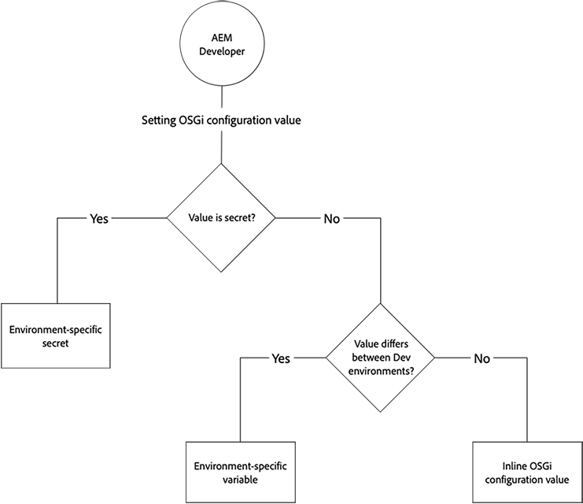
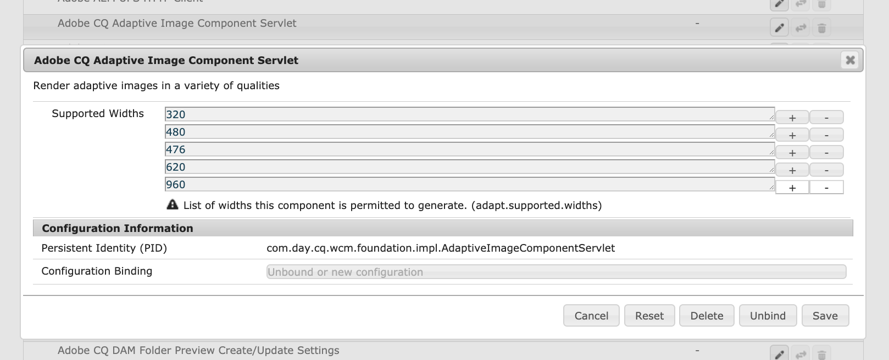
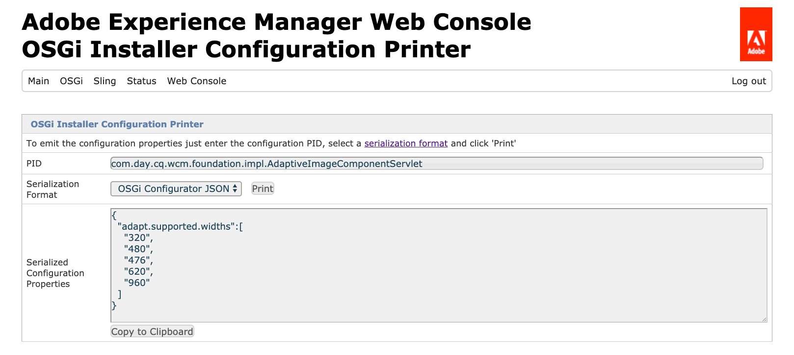

# Configuring OSGi for Adobe Experience Manager as a Cloud Service {#configuring-osgi-for-aem-as-a-cloud-service}

[OSGi](https://www.osgi.org/) is a fundamental element in the technology stack of Adobe Experience Manager (AEM). It is used to control the composite bundles of AEM and its configurations.

OSGi provides the standardized primitives that allow applications to be constructed from small, reusable, and collaborative components. These components can be composed into an application and deployed. This allows easy management of OSGi bundles as they can be stopped, installed, started individually. The interdependencies are handled automatically. Each OSGi Component is contained in one of the various bundles. For more information, see the [OSGi specification](https://help.eclipse.org/latest/index.jsp).

You can manage the configuration settings for OSGi components through configuration files that are part of an AEM code project.

>[!TIP]
>
>You can use Cloud Manager to configure environment variables. For more information, consult the documentation [here.](/help/implementing/cloud-manager/environment-variables.md)

## OSGi Configuration Files {#osgi-configuration-files}

Configuration changes are defined in the AEM Project's code packages (`ui.config`) as configuration files (`.cfg.json`) under runmode specific config folders:

`/apps/example/config.<runmode>`

The format of OSGi configuration files is JSON-based using the `.cfg.json` format defined by the Apache Sling project.

OSGi configurations target OSGi components via their Persistent Identity (PID), which defaults to the OSGi component's Java&trade; class name. For example, to provide OSGi configuration for an OSGi service implemented by:

`com.example.workflow.impl.ApprovalWorkflow.java`

an OSGi configuration file is defined at:

`/apps/example/config/com.example.workflow.impl.ApprovalWorkflow.cfg.json`

following the `cfg.json` OSGi configuration format.

>[!NOTE]
>
>Prior versions of AEM supported OSGi configuration files using different file formats such as `.cfg`, `.config` and as XML `sling:OsgiConfig` resource definitions. These formats are superseded by the `.cfg.json` OSGi configuration format.

>[!NOTE]
>
>The OSGi configs are not stored under /apps like typical AEM instances in Cloud they are stored in an external location. Check in Cloud Manager [Developer Console](https://experienceleague.adobe.com/en/docs/experience-manager-learn/cloud-service/debugging/debugging-aem-as-a-cloud-service/developer-console#configurations) to view the OSGi configs.

## Runmode Resolution {#runmode-resolution}

>[!TIP]
>
>AEM 6.x supports custom runmodes, however AEM as a Cloud Service does not. AEM as a Cloud Service support an [exact set of runmodes](./overview.md#runmodes). Any variation in OSGi configurations between AEM as a Cloud Service environments must be handled using [OSGi configuration environment variables](#environment-specific-configuration-values).

Specific OSGi configurations can be targeted to specific AEM instances by using runmodes. To use runmode, create config folders under `/apps/example` (where example is your project name), in the format:

`/apps/example/config.<author|publish>.<dev|stage|prod>/`

Any OSGi configurations in such folders are used if the runmodes defined in the config folder name match the runmodes used by AEM.

For example, if AEM is using the runmodes author and dev, configuration nodes in `/apps/example/config.author/` and `/apps/example/config.author.dev/` are applied, while configuration nodes in `/apps/example/config.publish/` and `/apps/example/config.author.stage/` are not applied.

If multiple configurations for the same PID are applicable, the configuration with the highest number of matching run modes is applied.

This rule's granularity is at a PID level. This means you cannot define some properties for the same PID in `/apps/example/config.author/` and more specific ones in `/apps/example/config.author.dev/` for the same PID. The configuration with the highest number of matching runmodes is effective for the entire PID.

>[!NOTE]
>
>A `config.preview` OSGi configuration folder **cannot** be declared in the same way a `config.publish` can be declared folder. Instead, the preview tier inherits its OSGi configuration from the publish tier's values. 

When developing locally, a runmode startup parameter, `-r`, is used to specify the runmode OSGI configuration.

```shell
$ java -jar aem-sdk-quickstart-xxxx.x.xxx.xxxx-xxxx.jar -r publish,dev
```

### Verifying runmodes

AEM as a Cloud Service runmodes are well defined based on the environment type and service. Review the [complete list of available AEM as a Cloud Service runmodes](./overview.md#runmodes).

OSGi configuration values specified by runmode can be verified by:

1. Opening the AEM as a Cloud Services environment's [Developer Console](https://experienceleague.adobe.com/docs/experience-manager-learn/cloud-service/debugging/debugging-aem-as-a-cloud-service/developer-console.html)
1. Selecting the service tier(s) to inspect, using the __Pod__ drop-down list
1. Selecting the __Status__ tab
1. Selecting __Configurations__ from the __Status Dump__ drop-down list
1. Selecting the __Get Status__ button

The resulting view displays all OSGi component configurations for the selected tier(s) with their applicable OSGi configuration values. These values can be cross-referenced with the OSGi configuration values in the AEM project's source code under `/apps/example/osgiconfig/config.<runmode(s)>`.


To verify the appropriate OSGi configuration values are applied:

1. In the Developer Console's Configuration output
1. Locate the `pid` representing the OSGi configuration to verify; this is the name of the OSGi configuration file in the AEM project's source code.
1. Inspect the `properties` list for the `pid` and verify the key and values match the OSGi configuration file in the AEM project source code for the runmode being verified.=


## Types of OSGi Configuration Values {#types-of-osgi-configuration-values}

There are three varieties of OSGi configuration values that can be used with Adobe Experience Manager as a Cloud Service.

1. **Inline values**, which are values that are hard-coded into the OSGi configuration and stored in Git. For example:

   ```json
   {
      "connection.timeout": 1000
   }
   ```

1. **Secret values**, which are values that must not be stored in Git for security reasons. For example:

   ```json
   {
   "api-key": "$[secret:server-api-key]"
   } 
   ```

1. **Environment-specific values**, which are values that vary between Development environments, and thus cannot be accurately targeted by run mode (since there is a single `dev` runmode in Adobe Experience Manager as a Cloud Service). For example:

   ```json
   {
    "url": "$[env:server-url]"
   }
   ```

   A single OSGi configuration file can use any combination of these configuration value types in conjunction. For example:

   ```json
   {
   "connection.timeout": 1000,
   "api-key": "$[secret:server-api-key]",
   "url": "$[env:server-url]"
   }
   ```

## How to Choose the Appropriate OSGi Configuration Value Type {#how-to-choose-the-appropriate-osgi-configuration-value-type}

The common case for OSGi uses inline OSGi configuration values. Environment-specific configurations are used only for specific use cases where a value differs between dev environments.



Environment-specific configurations extend the traditional, statically defined OSGi configurations that contain inline values, providing the ability to manage the OSGi configuration values externally via the Cloud Manager API. It is important to understand when the common and traditional approach of defining inline values and storing them in Git, should be used, versus abstracting the values into environment-specific configurations.

The following guidance addresses when to use non-secret and secret environment-specific configurations:

### When to Use Inline Configuration Values {#when-to-use-inline-configuration-values}

Inline configurations values are considered the standard approach, and should be used when possible. Inline configurations provide the benefits of:

* They are maintained, with governance and version history in Git
* Values are implicitly tied to code deployments
* They do not require any additional deployment considerations or coordination

Whenever defining an OSGi configuration value, start with inline values, and only select secret or environment-specific configurations if necessary for the use case.

### When to Use Non-secret Environment-specific Configuration Values {#when-to-use-non-secret-environment-specific-configuration-values}

Only use environment-specific configurations (`$[env:ENV_VAR_NAME]`) for non-secret configuration values when the values vary for the preview tier or vary across development environments. This includes local development instances and any Adobe Experience Manager as a Cloud Service development environments. Other than for setting unique values for the preview tier, avoid using non-secret environment-specific configurations for Adobe Experience Manager as a Cloud Service Stage or Production environments.

* Only use non-secret environment-specific configurations for configuration values that differ between publish and preview tier, or for values that differ between development environments, including local development instances.
* Aside from the scenario when the preview tier must vary from the publish tier, use the standard inline values in the OSGi configurations for Stage and Production non-secret values. In relation, it is not recommended to use environment-specific configurations to facilitate making configuration changes at runtime to Stage and Production environments; these changes should be introduced via source code management.

### When to use secret environment-specific configuration values {#when-to-use-secret-environment-specific-configuration-values}

Adobe Experience Manager as a Cloud Service requires the use of environment-specific configurations (`$[secret:SECRET_VAR_NAME]`) for any secret OSGi configuration values, such as passwords, private API keys, or any other values that cannot be stored in Git for security reasons.

Use secret environment-specific configurations to store the value for secrets on all Adobe Experience Manager as a Cloud Service environments, including Stage and Production.

## Creating OSGi Configurations {#creating-osgi-configurations}

There are two ways create OSGi configurations, as described below. The former approach is typically used for configuring custom OSGi components which have well-known OSGi properties and values by the developer, and the latter for AEM-provided OSGi components.

### Writing OSGi Configurations {#writing-osgi-configurations}

JSON formatted OSGi configuration files can be written by hand directly in the AEM project. This is often the quickest way to create OSGi configurations for well-known OSGi components, and especially custom OSGi components that have been designed and developed by the same developer defining the configurations. This approach can also be used to copy/paste and update configurations for the same OSGi component across various runmode folders.

1. In your IDE, open the `ui.apps` project, locate or create the config folder (`/apps/.../config.<runmode>`) which targets the runmodes the new OSGi configuration need to effect
1. In this config folder, create a `<PID>.cfg.json` file. The PID is the Persistent Identity of the OSGi component. It is usually the full class name of the OSGi component implementation. For example:
   `/apps/.../config/com.example.workflow.impl.ApprovalWorkflow.cfg.json`
   OSGi configuration factory file names use the `<factoryPID>-<name>.cfg.json` naming convention
1. Open the new `.cfg.json` file, and define the key/value combinations for the OSGi property and value pairs, following the [JSON OSGi configuration format](https://sling.apache.org/documentation/bundles/configuration-installer-factory.html#configuration-files-cfgjson-1).
1. Save your changes to the new `.cfg.json` file
1. Add and commit your new OSGi configuration file to Git

### Generating OSGi Configurations using the AEM SDK Quickstart {#generating-osgi-configurations-using-the-aem-sdk-quickstart}

The AEM SDK Quickstart Jar's AEM Web Console can be used configure OSGi components, and export OSGi configurations as JSON. This is useful for configuring AEM-provided OSGi components whose OSGi properties and their value formats may not be well understood by the developer defining the OSGi configurations in the AEM project. 

>[!NOTE] 
>
>The AEM Web Console's Configuration UI does write `.cfg.json` files into the repository. Therefore, be aware of this workflow to avoid potential unexpected behavior during local development, when the AEM Project-defined OSGi configurations may differ from the generated configurations.

1. Log in to the AEM SDK Quickstart Jar's AEM Web console at `https://<host>:<port>/system/console` as the admin user
1. Navigate to **OSGi** &gt; **Configuration**
1. To configure, locate the OSGi component and select its title to edit
   
1. Edit the OSGi configuration property values via the Web UI as needed
1. Record the Persistent Identity (PID) to safe place. This is used later to generate the OSGi configuration JSON
1. Select Save
1. Navigate to OSGi > OSGi Installer Configuration Printer
1. Paste in the PID copied in Step 5, ensure Serialization Format is set to "OSGi Configurator JSON" 
1. Select Print
1. The OSGi Configuration in JSON format will display in the Serialized Configuration Properties section
   
1. In your IDE, open the `ui.apps` project, locate or create the config folder (`/apps/.../config.<runmode>`) which targets the runmodes the new OSGi configuration need to effect.
1. In this config folder, create a `<PID>.cfg.json` file. The PID is the same value from Step 5.
1. Paste the Serialized Configuration Properties from Step 10 into the `.cfg.json` file.
1. Save your changes to the new `.cfg.json` file.
1. Add and commit your new OSGi configuration file to Git.


## OSGi Configuration Property Formats {#osgi-configuration-property-formats}

### Inline Values {#inline-values}

Inline values are formatted as standard name-value pairs, following standard JSON syntax. For example:

```json
{
   "my_var1": "val",
   "my_var2": [ "abc", "def" ],
   "my_var3": 500
}
```

### Environment-Specific Configuration Values {#environment-specific-configuration-values}

OSGi configuration should assign a placeholder for the variable that is intended to be defined per environment:

```
use $[env:ENV_VAR_NAME]
```

Customers should only use this technique for OSGi configuration properties related to their custom code; it must not be used to override Adobe-defined OSGi configuration.

>[!NOTE]
>
>Placeholders cannot be used in [repoinit statements](/help/implementing/deploying/overview.md#repoinit).

### Secret Configuration Values {#secret-configuration-values}

OSGi configuration should assign a placeholder for the secret that is intended to be defined per environment:

```
use $[secret:SECRET_VAR_NAME]
```

### Variable Naming {#variable-naming}

The following applies to both environment specific and secret configuration values.

Variables names must follow the following rules:

* Minimum length: 2
* Maximum length: 100
* Must match regex: `[a-zA-Z_][a-zA-Z_0-9]*`

Values for the variables must not exceed 2048 characters.

>[!CAUTION]
>
>There are rules related to the use of certain prefixes for variable names:
>
>1. Variable names prefixed with `INTERNAL_`, `ADOBE_`, or `CONST_` are reserved by Adobe. Any customer-set variables that start with these prefixes are ignored.
>
>1. Customers must not reference variables prefixed with `INTERNAL_` or `ADOBE_` either.
>
>1. Environment variables with the prefix `AEM_` are defined by the product as Public API to be used and set by customers.
>   While customers can use and set environment variables starting with the prefix `AEM_` they should not define their own variables with this prefix.

### Default Values {#default-values}

The following applies to both environment specific and secret configuration values.

If no per-environment value is set, at runtime the placeholder is not replaced and is left in place since no interpolation happened. To avoid this, a default value can be provided as part of the placeholder with the following syntax: 

```
$[env:ENV_VAR_NAME;default=<value>]
```

With a default value provided, the placeholder is replaced either with the per-environment value if provided or the provided default value.

### Local Development {#local-development}

The following applies to both environment specific and secret configuration values.

Variables can be defined in the local environment so they are picked up by the local AEM at runtime. For example, on Linux&reg;:

```bash
export ENV_VAR_NAME=my_value
```

It is recommended that a simple bash script is written which sets the environment variables used in the configurations and to execute it before starting AEM. Tools like [https://direnv.net/](https://direnv.net/) help with simplifying this approach. Depending on the type of the values, they might be checked into source code management, if they can be shared between everyone.

The values for secrets are read from files. Therefore for each placeholder using a secret a text file containing the secret value must be created.

For example, if `$[secret:server_password]` is used, a text file named **server_password** must be created. All these secret files must be stored in the same directory and the framework property `org.apache.felix.configadmin.plugin.interpolation.secretsdir` must be configured with that local directory.

>[!CAUTION]
>
>File extensions are not allowed for the text file.
>
>So for the above example, the text file must be named **server_password** - without a file extension.

The `org.apache.felix.configadmin.plugin.interpolation.secretsdir` is an Sling framework property; so this property is not set in the felix console (/system/console), but it is set in the sling.properties file that is used when the system boots. This file can be found in the /conf subdir of the extracted Jar/install folder (crx-quickstart/conf).

example: add this line to the end of the 'crx-quickstart/conf/sling.properties'-file to configure 'crx-quickstart/secretsdir' as secret folder:

```
org.apache.felix.configadmin.plugin.interpolation.secretsdir=${sling.home}/secretsdir
```

### Author versus Publish Configuration {#author-vs-publish-configuration}

If an OSGi property requires different values for author versus publish:

* Separate `config.author` and `config.publish` OSGi folders must be used, as described in the [Runmode Resolution section](#runmode-resolution).
* There are two options of creating the independent variable names that should be used:
  * the first option, which is recommended: in all OSGi folders (like `config.author` and `config.publish`) declared to define different values, use the same variable name. For example
  `$[env:ENV_VAR_NAME;default=<value>]`, where the default corresponds to the default value for that tier (author or publish). When setting the environment variable via [Cloud Manager API](#cloud-manager-api-format-for-setting-properties) or via a client, differentiate between the tiers using the "service" parameter as described in the [Cloud Manager API reference documentation](https://developer.adobe.com/experience-cloud/cloud-manager/reference/api/). The "service" parameter will bind the variable's value to the appropriate OSGi tier. It can be "author" or "publish" or "preview".
  * the second option, which is to declare distinct variables using a prefix such as `author_<samevariablename>` and `publish_<samevariablename>`

### Configuration Examples {#configuration-examples}

In the examples below, assume that there are three dev environments, in addition to the stage and prod environments.

**Example 1**

The intent is for the value of the OSGi property `my_var1` to be the same for stage and prod, but differ for each of the three dev environments.

<table>
<tr>
<td>
<b>Folder</b>
</td>
<td>
<b>Contents of myfile.cfg.json</b>
</td>
</tr>
<tr>
<td>
config
</td>
<td>
<pre>
{ 
 "my_var1": "val",
 "my_var2": "abc",
 "my_var3": 500
}
</pre>
</td>
</tr>
<tr>
<td>
config.dev
</td>
<td>
<pre>
{ 
 "my_var1" : "$[env:my_var1]"
 "my_var2": "abc",
 "my_var3": 500
}
</pre>
</td>
</tr>
</table>

**Example 2**

The intent is for the value of the OSGi property `my_var1` to differ for stage, prod, and for each of the three dev environments. Thus the Cloud Manager API must be called to set the value for `my_var1` for each dev env.

<table>
<tr>
<td>
<b>Folder</b>
</td>
<td>
<b>Contents of myfile.cfg.json</b>
</td>
</tr>
<tr>
<td>
config.stage
</td>
<td>
<pre>
{ 
 "my_var1": "val1",
 "my_var2": "abc",
 "my_var3": 500
}
</pre>
</td>
</tr>
<tr>
<td>
config.prod
</td>
<td>
<pre>
{ 
 "my_var1": "val2",
 "my_var2": "abc",
 "my_var3": 500
}
</pre>
</td>
</tr>
<tr>
<td>
config.dev
</td>
<td>
<pre>
{ 
 "my_var1" : "$[env:my_var1]"
 "my_var2": "abc",
 "my_var3": 500
}
</pre>
</td>
</tr>
</table>

**Example 3**

The intent is for the value of the OSGi property `my_var1` to be the same for stage, production, and just one of the dev environments, but for it to differ for the other two dev environments. In this case, the Cloud Manager API must be called to set the value of `my_var1` for each of the dev environments, including for the dev environment which should have the same value as stage and production. It will not inherit the value set in the folder **config**.

<table>
<tr>
<td>
<b>Folder</b>
</td>
<td>
<b>Contents of myfile.cfg.json</b>
</td>
</tr>
<tr>
<td>
config
</td>
<td>
<pre>
{ 
 "my_var1": "val1",
 "my_var2": "abc",
 "my_var3": 500
}
</pre>
</td>
</tr>
<tr>
<td>
config.dev
</td>
<td>
<pre>
{ 
 "my_var1" : "$[env:my_var1]"
 "my_var2": "abc",
 "my_var3": 500
}
</pre>
</td>
</tr>
</table>

Another way to accomplish this would be to set a default value for the replacement token in the config.dev folder such that it's the same value as in the **config** folder.

<table>
<tr>
<td>
<b>Folder</b>
</td>
<td>
<b>Contents of myfile.cfg.json</b>
</td>
</tr>
<tr>
<td>
config
</td>
<td>
<pre>
{ 
 "my_var1": "val1",
 "my_var2": "abc",
 "my_var3": 500
}
</pre>
</td>
</tr>
<tr>
<td>
config.dev
</td>
<td>
<pre>
{ 
 "my_var1": "$[env:my_var1;default=val1]"
 "my_var2": "abc",
 "my_var3": 500
}
</pre>
</td>
</tr>
</table>

## Cloud Manager API Format for Setting Properties {#cloud-manager-api-format-for-setting-properties}

See [Adobe Cloud Manager on the Adobe Developer Website](https://developer.adobe.com/experience-cloud/cloud-manager/docs/) for information about the Cloud Manager API, and how it should be configured. 

>[!NOTE]
>
>Ensure that the used Cloud Manager API has assigned the role "Deployment Manager - Cloud Service". Other roles are not able to execute all below commands.

>[!TIP]
>
>You can also use Cloud Manager to configure environment variables. For more information, consult [Cloud Manager Environment Variables](/help/implementing/cloud-manager/environment-variables.md).

### Setting Values via API {#setting-values-via-api}

Calling the API deploys the new variables and values to a Cloud environment, similar to a typical customer code deployment pipeline. The author and publish services are restarted and reference the new values, typically taking a few minutes.

```
PATCH /program/{programId}/environment/{environmentId}/variables
```

```json
[
        {
                "name" : "MY_VAR1",
                "value" : "plaintext value",
                "type" : "string"  <---default
        },
        {
                "name" : "MY_VAR2",
                "value" : "<secret value>",
                "type" : "secretString"
        }
]
```

>[!NOTE]
>Default variables are not set via API, but rather in the OSGi property itself.
>
>See [Cloud Manager API](https://developer.adobe.com/experience-cloud/cloud-manager/reference/api/) for more information.

### Getting values via API {#getting-values-via-api}

```
GET /program/{programId}/environment/{environmentId}/variables
```

See [Cloud Manager API](https://developer.adobe.com/experience-cloud/cloud-manager/reference/api/) for more information.

### Deleting values via API {#deleting-values-via-api}

```
PATCH /program/{programId}/environment/{environmentId}/variables
```

To delete a variable, include it with an empty value.

See [Cloud Manager API](https://developer.adobe.com/experience-cloud/cloud-manager/reference/api/) for more information.

### Getting Values via the Command Line {#getting-values-via-cli}

```bash
$ aio cloudmanager:list-environment-variables ENVIRONMENT_ID
Name     Type         Value
MY_VAR1  string       plaintext value 
MY_VAR2  secretString ****
```


### Setting values via the Command Line {#setting-values-via-cli}

```bash
$ aio cloudmanager:set-environment-variables ENVIRONMENT_ID --variable MY_VAR1 "plaintext value" --secret MY_VAR2 "some secret value"
```

### Deleting Values via the Command Line {#deleting-values-via-cli}

```bash
$ aio cloudmanager:set-environment-variables ENVIRONMENT_ID --delete MY_VAR1 MY_VAR2
```

>[!NOTE]
>
>See [the aio-cli-plugin-cloudmanager on GitHub](https://github.com/adobe/aio-cli-plugin-cloudmanager#aio-cloudmanagerset-environment-variables-environmentid) for more information on how to configure values using the Cloud Manager plugin for Adobe I/O CLI.

### Number of Variables {#number-of-variables}

Up to 200 variables per environment can be declared.

## Deployment Considerations for Secret and Environment-Specific Configuration Values {#deployment-considerations-for-secret-and-environment-specific-configuration-values}

Because the secret and environment-specific configuration values live outside of Git, and therefore, are not part of the formal Adobe Experience Manager as a Cloud Service deployment mechanisms, the customer should manage, govern, and integrate into the Adobe Experience Manager as a Cloud Service deployment process.

As mentioned above, calling the API deploys the new variables and values to Cloud environments, similar to a typical customer code deployment pipeline. The author and publish services are restarted and reference the new values, typically taking a few minutes. The quality gates and tests that are run by Cloud Manager during a regular code deployment are not performed during this process.

Typically, customers would call the API to set environment variables before deploying code that relies on them in Cloud Manager. In some situations, one might want to modify an existing variable after code has already been deployed. 

>[!NOTE]
>
>The API may not succeed when a pipeline is in use, either an AEM update or customer deployment, depending on what part of the end to end pipeline is being executed at that time. The error response will indicate that the request was not successful, although it will not indicate the specific reason.

There may be scenarios where a scheduled customer code deployment relies on existing variables to have new values, which would not be appropriate with the current code. If this is a concern, it is recommended to make variable modifications in an additive way. To do that, create new variable names instead of just changing the value of old variables so old code never references the new value. Then when the new customer release looks stable, one can choose to remove the older values.

Similarly, since a variable's values are not versioned, a rollback of code could cause it to reference newer values that cause issues. The previously mentioned additive variable strategy would help here as well.

This additive variable strategy is also useful for disaster recovery scenarios where if code from several days prior needed to be redeployed, the variable names and values it references will still be intact. This relies on a strategy where a customer waits a few days before removing those older variables, otherwise the older code would not have appropriate variables to reference.
