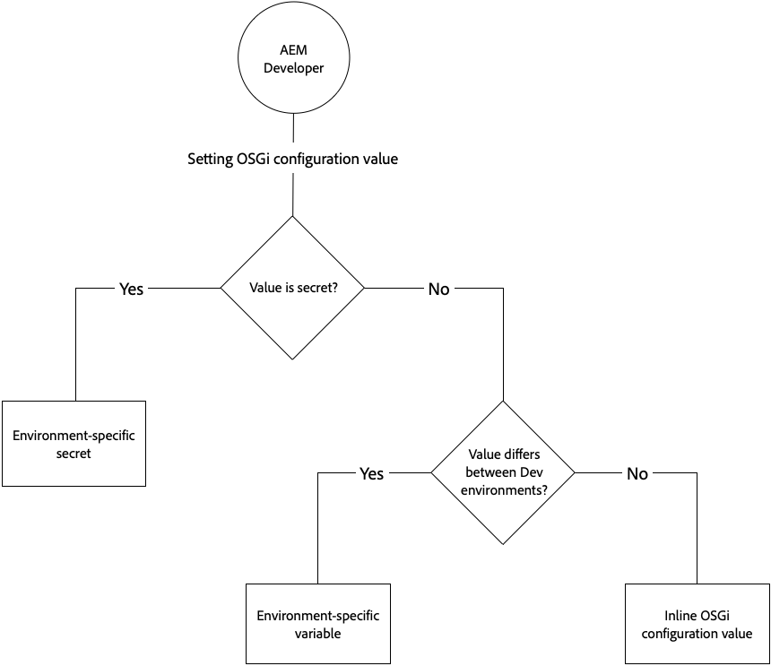

# OSGi Configurations {#osgi-configurations}

[OSGi](https://www.osgi.org/) is a fundamental element in the technology stack of Adobe Experience Manager (AEM). It is used to control the composite bundles of AEM and its configurations.

OSGi provides the standardized primitives that allow applications to be constructed from small, reusable and collaborative components. These components can be composed into an application and deployed. This allows easy management of OSGi bundles as they can be stopped, installed, started individually. The interdependencies are handled automatically. Each OSGi Component is contained in one of the various bundles. For more information, see the [OSGi specification](https://www.osgi.org/Specifications/HomePage).

You can manage the configuration settings for OSGi components through configuration files that are part of an AEM code project.

## OSGi Configuration Files {#osgi-configuration-files}

Configuration changes are defined in the AEM Project's code packages (`ui.apps`) as configuration files (`.cfg.json`) under runmode specific config folders:

`/apps/example/config.<runmode>`

The format of OSGi configuration files are JSON-based using the `.cfg.json` format defined by the Apache Sling project.

OSGi configurations target OSGi components via their Persistent Idenity (PID), which defaults to the OSGi component's Java class name. For example, to provide OSGi configuration for an OSGi service implemented by:

`com.example.workflow.impl.ApprovalWorkflow.java`

an OSGi configuration file is defined at:

`/apps/example/config/com.example.workflow.impl.ApprovalWorkflow.cfg.json`

following the [cfg.json OSGi configuration format](following the cfg.json OSGi configuration format).

> [!NOTE]
>
> Prior versions of AEM supported OSGi configuration files using different file formats such as .cfg., .config and as XML sling:OsgiConfig resource definitions. These formats are superseded by the cfg.json OSGi configuration format.

## Runmode Resolution {#runmode-resolution}

Specific OSGi configurations can be targeted to specific AEM instances by using runmodes. To use runmode, create config folders under `/apps/example` (where example is your project name), in the format:

`/apps/example/config.<author|publish>.<dev|stage|prod>/`

Any OSGi configurations in such folders will be used if the run modes defined in the config folder name match to the run modes used by AEM.

For example, if AEM is using the runmodes author and dev, configuration nodes in `/apps/example/config.author/` and `/apps/example/config.author.dev/` will be applied, while configuration nodes in `/apps/example/config.publish/` and `/apps/example/config.author.stage/` will not be applied.

If multiple configurations for the same PID are applicable, the configuration with the highest number of matching run modes is applied.

This rule's granularity is at a PID level. This means you cannot define some properties for the same PID in `/apps/example/config.author/` and more specific ones in `/apps/example/config.author.dev/` for the same PID.  The configuration with the highest number of matching run modes will be effective for the entire PID.

When developing locally, a runmode startup parameter can be passed in to dictate which runmode OSGI configuration will be used.

## Types of OSGi Configuration Values {#types-of-osgi-configuration-values}

There are three varieties of OSGi configuration values that can be used with AEM as a Cloud Service.

1. **Inline values**, which are values that are hard-coded into the OSGi configuration and stored in Git. For example:

   ```json
   {
      "connection.timeout": 1000
   }
   ```

1. **Secret values**, which are values that should not be stored in Git for security reasons. For example:

   ```json
   {
   "api-key": "$[secret:server-api-key]"
   } 
   ```

1. **Environment-specific values**, which are values that vary between Development environments, and thus cannot be accurately targeted by run mode (since there is a single `dev` runmode in AEM as a Cloud Service). For example:

   ```json
   {
    "url": "$[env:server-url]"
   }
   ```

   Note that a single OSGi configuration file can use any combination of these configuration value types in conjunction. For example:

   ```json
   {
   "connection.timeout": 1000,
   "api-key": "$[secret:server-api-key]",
   "url": "$[env:server-url]"
   }
   ```

## How to Choose the Appropriate OSGi Configuration Value Type {#how-to-choose-the-appropriate-osgi-configuration-value-type}

The common case for OSGi uses inline OSGi configuration values. Environment-specific configurations are used only for specific use cases where a value differs between dev environments.



Environment-specific configurations extend the traditional, statically-defined OSGi configurations that contain inline values, providing the ability to manage the OSGi configuration values externally via the Cloud Manager API. It is important to understand when the common and traditional approach of defining inline values and storing them in Git, should be used, versus abstracting the values into environment-specific configurations.

The following guidance addresses when to use non-secret and secret environment-specific configurations:

### When to Use Inline Configuration Values {#when-to-use-inline-configuration-values}

Inline configurations values are considered the standard approach, and should be used when possible. Inline configurations provide the benefits of:

* They are maintained, with governance and version history in Git
* Values are implicitly tied to code deployments
* They do not require any additional deployment considerations or coordination

Whenever defining an OSGi configuration value, start with inline values, any only select secret or environment-specific configurations if required for the use case.

### When to Use Non-secret Environment-specific Configuration Values {#when-to-use-non-secret-environment-specific-configuration-values}

Only use environment-specific configurations (`$[env:ENV_VAR_NAME]`) for non-secret configuration values when the values vary across development environments. This includes local development instances and any AEM as a Cloud Service Development environments. Avoid using non-secret environment-specific configurations for AEM as a Cloud Service Stage or Production environments.

* Only use non-secret environment-specific configurations for configuration values that differ between development environments, including local development instances.
* Instead, use the standard inline values in the OSGi configurations for Stage and Production non-secret values.  Related to this, it is not recommended to use environment-specific configurations to facilitate making configuration changes at runtime to Stage and Production environments; these changes should be introduced via source code management.

### When to use secret environment-specific configuration values {#when-to-use-secret-environment-specific-configuration-values}

AEM as a Cloud Service requires the use of environment-specific configurations (`$[secret:SECRET_VAR_NAME]`) for any secret OSGi configuration values, such as passwords, private API keys, or any other values that cannot be stored in Git for security reasons.

Use secret environment-specific configurations to store the value for secrets on all AEM as a Cloud Service environments, including Stage and Production.

### Adding a New Configuration to the Repository {#adding-a-new-configuration-to-the-repository}

#### What You Need to Know {#what-you-need-to-know}

To add a new configuration to the repository you need to know the following:

1. The **Persistent Identity** (PID) of the service.

   Reference the **Configurations** field in the Web console. The name is shown in brackets after the bundle name (or in the **Configuration Information** towards the bottom of the page).

   For example, create a node `com.day.cq.wcm.core.impl.VersionManagerImpl.` to configure **AEM WCM Version Manager**.

   

1. Whether a specific [run mode](/help/sites-deploying/configure-runmodes.md) is required. Create the folder:

    * `config` - for all run modes
    * `config.author` - for the author environment
    * `config.publish` - for the publish environment
    * `config.<run-mode>` - as appropriate

1. Whether a **Configuration** or **Factory Configuration** is necessary.
1. The individual parameters to be configured; including any existing parameter definitions that will need to be recreated.

   Reference the individual parameter field in the Web console. The name is shown in brackets for each parameter.

   For example, create a property
   `versionmanager.createVersionOnActivation` to configure **Create Version on Activation**.

   

1. Does a configuration already exist in `/libs`? To list all configurations in your instance, use the **Query** tool in CRXDE Lite to submit the following SQL query:

   `select * from sling:OsgiConfig`

   If so, this configuration can be copied to ` /apps/<yourProject>/`, then customized in the new location.

## Creating the Configuration in the Repository {#creating-the-configuration-in-the-repository}

To actually add the new configuration to the repository:

1. Use CRXDE Lite to navigate to:

   ` /apps/<yourProject>`

1. If not already existing, create the `config` folder ( `sling:Folder`):

    * `config` - applicable to all run modes
    * `config.<run-mode>` - specific to a particular run mode

1. Under this folder create a node:

    * Type: `sling:OsgiConfig`
    * Name: the persistent identity (PID);

      for example for AEM WCM Version Manager use `com.day.cq.wcm.core.impl.VersionManagerImpl`

   >[!NOTE]
   >
   >When making a Factory Configuration append `-<identifier>` to the name.
   >
   >As in: `org.apache.sling.commons.log.LogManager.factory.config-<identifier>`
   >
   >Where `<identifier>` is replaced by free text that you (must) enter to identify the instance (you cannot omit this information); for example:
   >
   >`org.apache.sling.commons.log.LogManager.factory.config-MINE`

1. For each parameter that you want to configure, create a property on this node:

    * Name: the parameter name as shown in the Web console; the name is shown in brackets at the end of the field description. For example, for `Create Version on Activation` use `versionmanager.createVersionOnActivation`
    * Type: as appropriate.
    * Value: as required.

   You only need to create properties for the parameters that you want to configure, others will still take the default values as set by AEM.

1. Save all changes.

   Changes are applied as soon as the node is updated by restarting the service (as with changes made in the Web console).

>[!CAUTION]
>
>You must not change anything in the `/libs` path.

>[!CAUTION]
>
>The full path of a configuration must be correct for it to be read at startup.


## Configuration Property Format In Source Control {#configuration-property-format-in-source-control}

Creating a new OSGI configuration property is described in the [Adding a new configuration to the repository](#creating-the-configuration-in-the-repository) section above. Follow those steps and modify the syntax as outlined in the sub-sections below:

### Inline Values {#inline-values}

As one might expect, inline values are formatted as standard name-value pairs, following standard JSON syntax. For example:

```json
 {

 "my_var1": "val",
 "my_var2": "abc",
 "my_var3": 500

}
```

### Environment Specific Configuration Values {#environment-specific-configuration-values}

OSGi configuration should assign a placeholder for the variable that is intended to be defined per environment:

```
use $[env:ENV_VAR_NAME]
```

Customers should only use this technique for OSGI configuration properties related to their custom code; it should not be used to override Adobe-defined OSGI configuration.

### Secret Configuration Values {#secret-configuration-values}

OSGi configuration should assign a placeholder for the secret that is intended to be defined per environment:

```
use $[secret:SECRET_VAR_NAME]
```

### Variable Naming {#variable-naming}

The following applies to both environment specific and secret configuration values.

Variables names should follow the following rules:

* minimum length: 2
* maximum length: 100
* must match regex: `[a-zA-Z_][a-zA-Z_0-9]*`

Values for the variables should not exceed 2048 characters.

### Default Values {#default-values}

The following applies to both environment specific and secret configuration values.

If no per-environment value is set, at runtime the placeholder will not be replaced and left in place since no interpolation happened. To avoid this, a default value can be provided as part of the placeholder with the following syntax: 

```
$[env:ENV_VAR_NAME;default=<value>]
```

With a default value provided, the placeholder will be replaced either with the per-environment value if provided or the provided default value.

### Local Development {#local-development}

The following applies to both environment specific and secret configuration values.

Variables can be defined in the local environment so they are picked up by the local AEM at runtime. For example, on Linux:

```bash
export ENV_VAR_NAME=my_value
```

It is recommended that a simple bash script is written which sets the environment variables used in the configurations and to execute it before starting AEM. Tools like [https://direnv.net/](https://direnv.net/) help with simplifying this approach. Depending on the type of the values, they might be checked into source code management, if they can be shared between everyone.

The values for secrets are read from files. Therefore for each placeholder using a secret a text file containing the secret value needs to be created.

For example if `$[secret:server_password]` is used, a text file named **server_password** needs to be created. All these secret files need to be stored in the same directory and the framework property `org.apache.felix.configadmin.plugin.interpolation.secretsdir` needs to be configured with that local directory.

### Author versus Publish Configuration {#author-vs-publish-configuration}

If an OSGI property requires different values for author versus publish:

* separate `config.author` and `config.publish` OSGi folders should be used, as described in the [Runmode Resolution section](#runmode-resolution).
* independent variable names should be used. It is recommended to use a prefix such as author_<variablename> and publish_<variablename> where the variable names are the same

### Configuration Examples {#configuration-examples}

In the examples below, assume that there are 3 dev environments, in addition to the stage and prod environments.

**Example 1**

The intent is for the value of the OSGI property `my_var1` to be the same for stage and prod, but differ for each of the 3 dev environments.

| **Folder**  | **Contents of myfile.cfg.json**  |
|---|---|
|  config | { 
 "my_var1": "val",
 "my_var2": "abc",
 "my_var3": 500
}  |
|  config.dev | { 
 "my_var1" : "$[env:my_var1]"
 "my_var2": "abc",
 "my_var3": 500
}  |