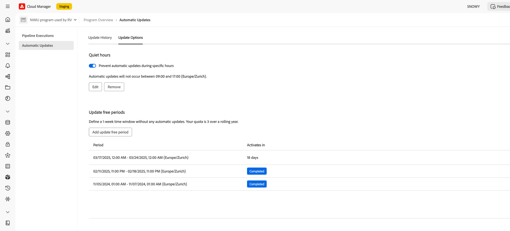
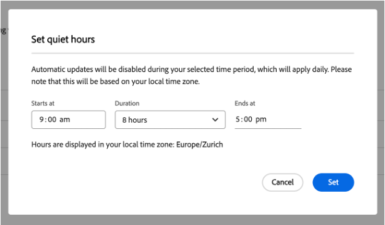
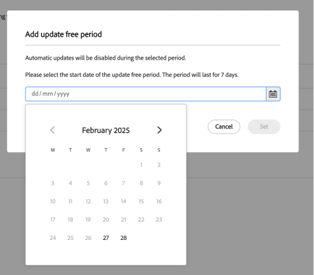

# Quiet hours and Update free periods {#quiet-hours-update-free-periods}

>[!NOTE]
>This feature will be available as a **Limited Availability** feature starting with September 29th. Email [aemcs-update-free@adobe.com](mailto:aemcs-update-free@adobe.com) to have the feature activated on your programs.

The AEM as a Cloud Service [automatic maintenance updates](/help/implementing/deploying/aem-version-updates.md) ensure that your instances stay secure and up to date with the latest maintenance releases. That said, in some cases (like go-live events) you might need to "protect" those critical working hours from any potential disruptions. As such, AEM as a Cloud Service offers the option to set a time frame where automatic updates do not occur for your ongoing programs.

You can configure these time frames by using two scheduling options:

* **Quiet hours** - You can define a daily time interval (up to 8 hours) where updates will not occur.
* **Update free periods** - You can define a 7 day time period where updates will not occur. You can have up to three update free periods within a 12-month time frame.

The update free periods and quiet hours features are configured on a "per program" basis.

Additionally, for information on scheduled AEM as a Cloud Service automatic maintenance periods, please refer to the [Experience Manager Releases Roadmap](https://experienceleague.adobe.com/en/docs/experience-manager-release-information/aem-release-updates/update-releases-roadmap) page.

## Quiet hours {#quiet-hours}

By using the quiet hours feature you can define a time window during the day without any automatic updates. All maintenance updates will shift to occur outside of the configured time window. If, for example, an update is scheduled during your specified quiet hours, it will automatically start after the quiet hour interval ends. The configured time interval cannot exceed 8 hours so that updates can still occur daily.

You can define these quiet hours **per program**, using your local timezone.

### How to configure the quiet hours interval {#configure-quiet-hours}

The quiet hours interval can be configured by using the AEM Cloud Manager interface as follows:

Go to **Activities>Automatic Updates>Update Options**.

1. Make sure the **Prevent automatic updates during specific hours** option is toggled.
2. Click **Edit**.
3. Set the quiet hours interval in the configuration window.

Once set, your specified start and end hours will apply to every calendar day moving forward. You can either disable or re-configure the quiet hours time value as needed.

## Update free periods {#update-free-periods}

By using the update free periods feature you can define a 7 day time frame where updates will not occur. Once configured, all maintenance updates will automatically shift to occur outside of the defined time frame. You can have up to three update free periods within a 12-month interval. Additionally, update free periods can be designated up to one year in advance.

Keep in mind when configuring this option that (at least) a one-week time interval between periods is mandatory in order to facilitate automatic updates. As such, this one week time interval is automatically enforced and will be added to the calendar between the update free periods you configured. This can result in some calendar days being unavailable for selection.

You can define the update free periods **per program**.

### How to configure the update free periods {#configure-update-free-periods}

The update free periods feature can be configured by using the AEM Cloud Manager interface as follows:

Go to **Activities>Automatic Updates>Update Options**.

1. Go to the Update free periods section.
2. Click **Add Update free period**.
3. Select a one week update free period from the calendar.

An **Active** icon will be displayed near the currently active update free period and a **Complete** icon near the completed update free periods.
