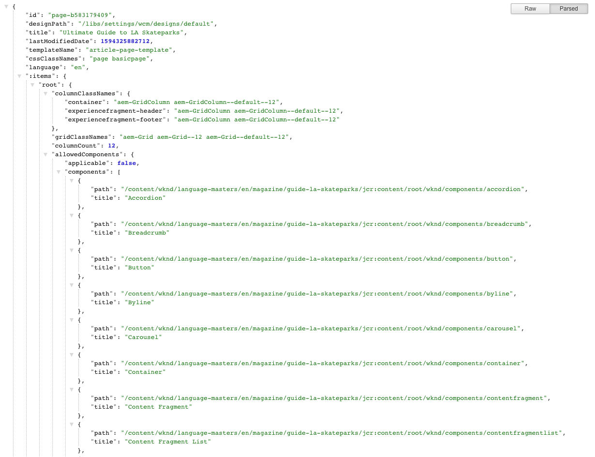
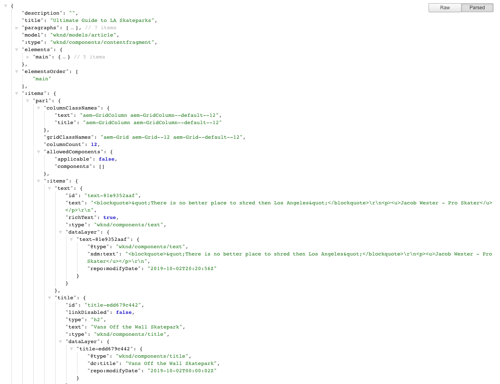

# JSON Exporter for Content Services {#json-exporter-for-content-services}

AEM Content Services are designed to generalize the description and delivery of content in/from AEM beyond the focus of web pages.

They provide the delivery of content to channels that are not traditional AEM web pages, using standardized methods that can be consumed by any client. These channels can include:

* Single Page Applications
* Native Mobile Applications
* Other channels and touch-points external to AEM

With content fragments that use structured content, you can provide content services by using the JSON exporter to deliver the contents of an(y) AEM page in JSON data model format. This can then be consumed by your own applications.

## JSON Exporter with Content Fragment Core Components {#json-exporter-with-content-fragment-core-components}

Using the AEM JSON exporter you can deliver the contents of an(y) AEM page in JSON data model format. This can then be consumed by your own applications.

Within AEM the delivery is achieved using the selector `model` and `.json` extension.

`.model.json`

1. For example, a URL such as:

   ```shell
   http://localhost:4502/content/wknd/language-masters/en/magazine/guide-la-skateparks.model.json
   ```

1. Will deliver content such as:

   

You can alternatively deliver the contents of a structured content fragment by targeting it specifically.

This is done using the entire path to the fragment (via the `jcr:content`); for example, with a suffix such as.

`.../jcr:content/root/container/container/contentfragment.model.json`

Your page can contain either a single content fragment or multiple components of various types. You can also use mechanisms such as list components to automatically search for relevant content.

* For example, a URL such as:

  ```shell
  http://localhost:4502/content/wknd/language-masters/en/magazine/guide-la-skateparks/jcr:content/root/container/container/contentfragment.model.json
  ```

* Will deliver content such as:

  

  >[!NOTE]
  >
  >You can [adapt your own components](enabling-json-exporter.md) to access and use this data.

  >[!NOTE]
  >
  >Although not a standard implementation, [multiple selectors are supported](enabling-json-exporter.md#multiple-selectors), but `model` must be the first.

### Further Information {#further-information}

* Assets HTTP API
  * [Assets HTTP API](/help/assets/developer-reference-material-apis.md)
* Sling Models:
  * [Sling Models - Associating a model class with a resource type since 130](https://sling.apache.org/documentation/bundles/models.html#associating-a-model-class-with-a-resource-type-since-130)
* AEM with JSON:
  * [Enabling JSON Export for a Component](enabling-json-exporter.md)

## Related Documentation {#related-documentation}

* [Content Fragments](/help/sites-cloud/administering/content-fragments/overview.md)
* [Content Fragment Models](/help/sites-cloud/administering/content-fragments/content-fragment-models.md)
* [Authoring with Content Fragments](/help/sites-cloud/authoring/fragments/content-fragments.md)
* [Core Components](https://experienceleague.adobe.com/docs/experience-manager-core-components/using/introduction.html) and the [Content Fragment component](https://experienceleague.adobe.com/docs/experience-manager-core-components/using/components/content-fragment-component.html)
