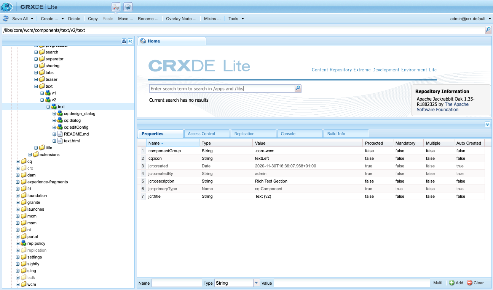
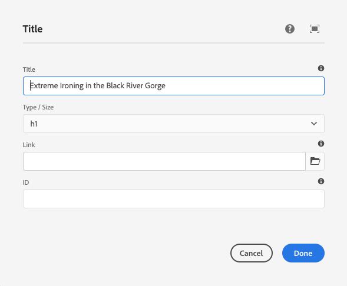
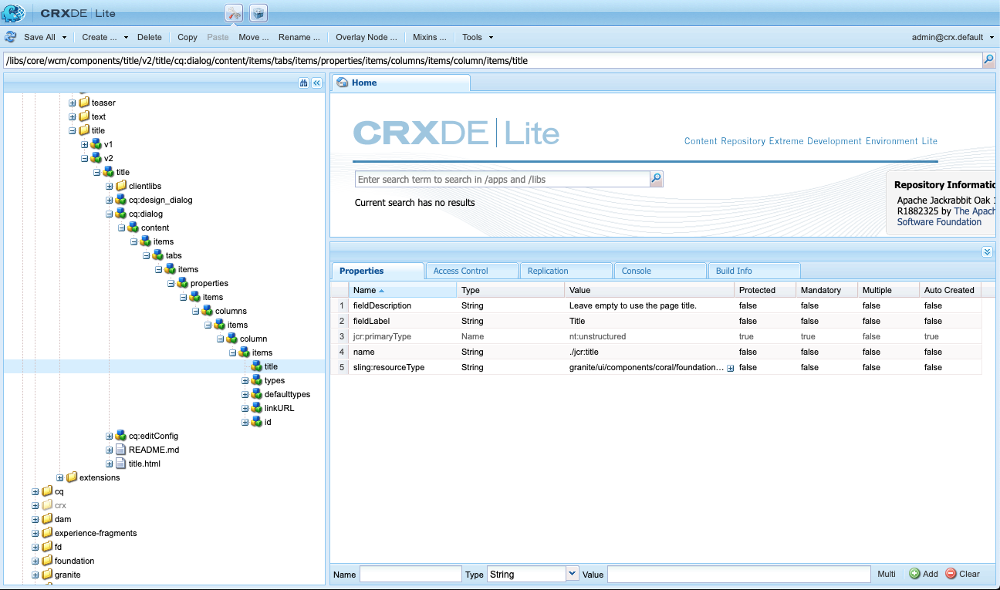
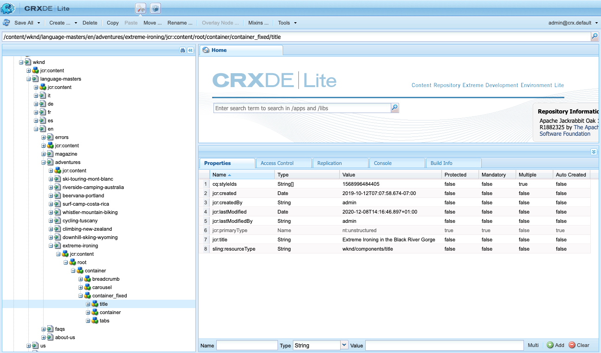
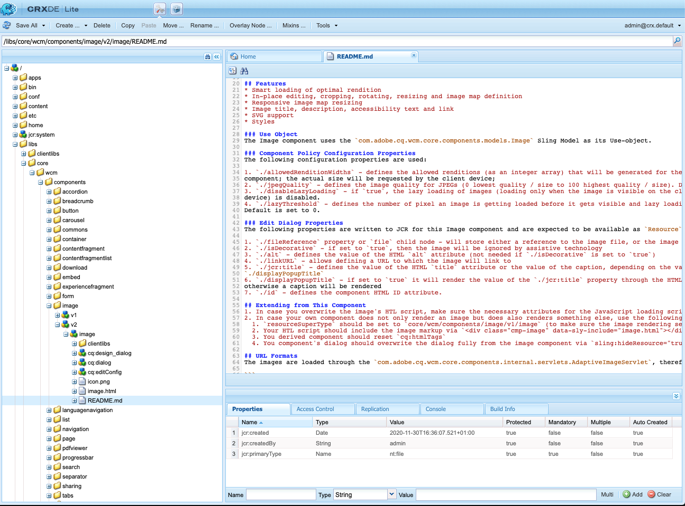
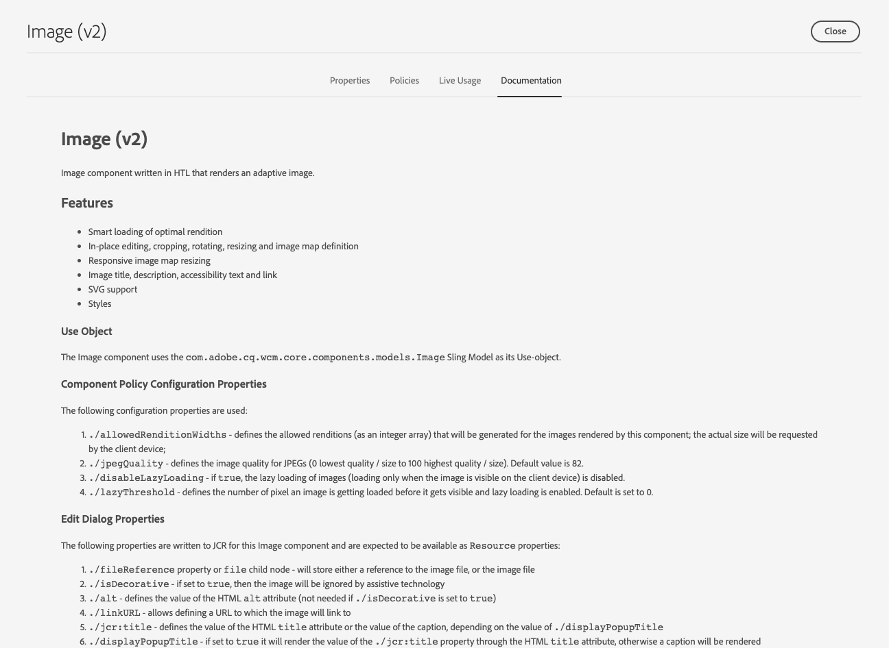

# Components Reference Guide {#components-reference-guide}

Components are at the core of building an experience in AEM. The [Core Components](https://experienceleague.adobe.com/docs/experience-manager-core-components/using/introduction.html) and the [AEM Project Archetype](https://experienceleague.adobe.com/docs/experience-manager-core-components/using/developing/archetype/overview.html) make it simple to get started with a tool set of ready-made, robust components. The [WKND Tutorial](/help/implementing/developing/introduction/develop-wknd-tutorial.md) takes the developer through how to use these tools and how to build custom components to create an AEM site.

>[!TIP]
>
>Before references this document, make sure you have completed the [WKND Tutorial](/help/implementing/developing/introduction/develop-wknd-tutorial.md) and are thus familiar with the [Core Components](https://experienceleague.adobe.com/docs/experience-manager-core-components/using/introduction.html) and the [AEM Project Archetype](https://experienceleague.adobe.com/docs/experience-manager-core-components/using/developing/archetype/overview.html).

Because the WKND Tutorial covers most use cases, this document is intended only as a supplement to those resources. It gives in-depth technical specifics about how components are structured and configured in AEM and is not intended as a getting started guide.

## Overview {#overview}

This section covers key concepts and issues as an introduction to the details needed when developing your own components.

### Planning {#planning}

Before starting to actually configure or code your component you should ask:

* What exactly do you need the new component to do?
* Do you need to create your component from scratch, or can you inherit the basics from an existing component?
* Will your component require logic to select/manipulate the content?
  * Logic should be kept separate from the user interface layer. HTL is designed to help ensure this happens.
* Will your component need CSS formatting?
  * CSS formatting should be kept separate from the component definitions. Define conventions for naming your HTML elements so that you can modify them through external CSS files.
* What security implications may your new component introduce?

### Reusing Existing Components {#reusing-components}

Before you invest time in creating an entirely new component, consider customizing or extending existing components. [The Core Components](https://experienceleague.adobe.com/docs/experience-manager-core-components/using/introduction.html) offer a suite of flexible, robust, and well-tested production-ready components.

#### Extending Core Components {#extending-core-components}

The Core Components also offer [clear customization patterns](https://experienceleague.adobe.com/docs/experience-manager-core-components/using/developing/customizing.html) that you can use to adapt them to the needs of your own project.

#### Overlaying Components {#overlying-components}

Components can also be redefined with an [overlay](/help/implementing/developing/introduction/overlays.md) based on the search path logic. However in such case, the [Sling Resource Merger](/help/implementing/developing/introduction/sling-resource-merger.md) will not be triggered and `/apps` must define the entire overlay.

#### Extending Component Dialogs {#extending-component-dialogs}

It is also possible to override a component dialog using the Sling Resource Merger and defining the property `sling:resourceSuperType`.

This means you only need to redefine the required differences, as opposed to redefining the entire dialog.

### Content Logic and Rendering Markup  {#content-logic-and-rendering-markup}

Your component is rendered with [HTML](https://www.w3schools.com/htmL/html_intro.asp). Your component must define the HTML needed to take the required content and then render it as required, on both the author and publish environments.

It is recommended to keep the code responsible for markup and rendering separate from the code that controls the logic used to select the component's content.

This philosophy is supported by [HTL](https://experienceleague.adobe.com/docs/experience-manager-htl/content/overview.html), a templating language that is purposely limited to ensure a real programming language is used to define the underlying business logic. This mechanism highlights the code that is called for a given view and, if necessary, allows specific logic for different views of the same component.

This (optional) logic can be implemented in different ways and is invoked from HTL with specific commands:

* Using Java - [The HTL Java Use-API](https://experienceleague.adobe.com/docs/experience-manager-htl/content/java-use-api.html) enables an HTL file to access helper methods in a custom Java class. This lets you use Java code to implement the logic for selecting and configuring the component content.
* Using JavaScript - [The HTL JavaScript Use-API](https://experienceleague.adobe.com/docs/experience-manager-htl/using/htl/use-api-javascript.html) enables a HTL file to access helper code written in JavaScript. This lets you use JavaScript code to implement the logic for selecting and configuring the component content.
* Using Client-Side Libraries - Modern websites rely heavily on client-side processing driven by complex JavaScript and CSS code. See the document [Using Client-Side Libraries on AEM as a Cloud Service](/help/implementing/developing/introduction/clientlibs.md) for more information.

## Component Structure {#structure}

The structure of an AEM component is powerful and flexible. The main parts are:

* [Resource Type](#resource-type)
* [Component Definition](#component-definition)
* [Properties and Child Nodes of a Component](#properties-and-child-nodes-of-a-component)
* [Dialogs](#dialogs)
* [Design Dialogs](#design-dialogs)

### Resource Type {#resource-type}

A key element of the structure is the resource type.

* The content structure declares intentions.
* The resource type implements them.

This is an abstraction that helps to ensure that even when the look and feel changes over time, that the intention stays the time.

### Component Definition {#component-definition}

The definition of a component can be broken down as follows:

* AEM components are based on [Sling](https://sling.apache.org/documentation.html).
* AEM components are located under `/libs/core/wcm/components`.
* Project/Site specific components are located under `/apps/<myApp>/components`.
* AEM standard components are defined as `cq:Component` and have the key elements:
  * jcr Properties - A list of jcr properties. These are variable and some may be optional though the basic structure of a component node, its properties, and subnodes are defined by the `cq:Component` definition.
  * Resources - These define static elements used by the component.
  * Scripts - These are used to implement the behavior of the resulting instance of the component.

#### Vital Properties {#vital-properties}  

* **Root Node**:
  * `<mycomponent> (cq:Component)` - Hierarchy node of the component.
* **Vital Properties**:
  * `jcr:title` - Component title; for example, used as a label when the component is listed in the [Components Browser](/help/sites-cloud/authoring/page-editor/editor-side-panel.md#components-browser) and [Components Console](/help/sites-cloud/authoring/components-console.md).
  * `jcr:description` - Description for the component; used as mouse-over hint in the Components Browser and Components Console.
  * See the section [Component Icon](#component-icon) for details.
* **Vital Child Nodes**:
  * `cq:editConfig (cq:EditConfig)` - Defines the edit properties of the component and enables the component to appear in the Components Browser.
    * If the component has a dialog, it will automatically appear in the Components browser or Sidekick, even if the cq:editConfig does not exist.
  * `cq:childEditConfig (cq:EditConfig)` - Controls author UI aspects for child components that do not define their own `cq:editConfig`.
  * `cq:dialog (nt:unstructured)` - Dialog for this component. Defines the interface allowing the user to configure the component and/or edit content.
  * `cq:design_dialog (nt:unstructured)` - Design editing for this component.

#### Component Icon {#component-icon}

The icon or abbreviation for the component is defined via JCR properties of the component when the component is created by the developer. These properties are evaluated in the following order and the first valid property found is used.

1. `cq:icon` - String property pointing to a standard icon in the [Coral UI library](https://opensource.adobe.com/coral-spectrum/examples/#icon) to display in the component browser.
    * Use the value of the HTML attribute of the Coral icon.
1. `abbreviation` - String property to customize the abbreviation of the component name in the component browser.
    * The abbreviation should be limited to two characters.
    * Providing an empty string will build the abbreviation from first two characters of the `jcr:title` property.
        * For example, "Im" for "Image".
        * The localized title is used to build the abbreviation.
    * The abbreviation is only translated if the component has an `abbreviation_commentI18n` property, which is then used as translation hint.
1. `cq:icon.png` or `cq:icon.svg` - Icon for this component, which is shown in the Component Browser.
    * 20 x 20 pixels is the size of icons of standard components.
        * Larger icons are downsized (client-side).
    * The recommended color is rgb(112, 112, 112) &gt; #707070.
    * The background of standard component icons is transparent.
    * Only `.png` and `.svg` files are supported.
    * If importing from the file system via Eclipse plugin, filenames need to be escaped as `_cq_icon.png` or `_cq_icon.svg` for example.
    * `.png` takes precedent over `.svg` if both are present.

If none of the above properties (`cq:icon`, `abbreviation`, `cq:icon.png` or `cq:icon.svg`) are found on the component:

* The system will search for the same properties on the super components following the `sling:resourceSuperType` property.
* If nothing or an empty abbreviation is found at the super component level, the system will build the abbreviation from the first letters of the `jcr:title` property of the current component.

To cancel the inheritance of icons from super components, setting an empty `abbreviation` property on the component will revert to the default behavior.

The [Component Console](/help/sites-cloud/authoring/components-console.md#component-details) displays how the icon for a particular component is defined.

#### SVG Icon Example {#svg-icon-example}

```xml
<?xml version="1.0" encoding="utf-8"?>
<!DOCTYPE svg PUBLIC "-//W3C//DTD SVG 1.1//EN" "https://www.w3.org/Graphics/SVG/1.1/DTD/svg11.dtd">
<svg version="1.1" id="Layer_1" xmlns="https://www.w3.org/2000/svg" xmlns:xlink="https://www.w3.org/1999/xlink" x="0px" y="0px"
     width="20px" height="20px" viewBox="0 0 20 20" enable-background="new 0 0 20 20" xml:space="preserve">
    <ellipse cx="5" cy="5" rx="3" ry="3" fill="#707070"/>
    <ellipse cx="15" cy="5" rx="4" ry="4" fill="#707070"/>
    <ellipse cx="5" cy="15" rx="5" ry="5" fill="#707070"/>
    <ellipse cx="15" cy="15" rx="4" ry="4" fill="#707070"/>
</svg>
```

### Properties and Child Nodes of a Component {#properties-and-child-nodes-of-a-component}

Many of the nodes/properties needed to define a component are common to both UIs, with differences remaining independent so that your component can work in both environments.

A component is a node of type `cq:Component` and has the following properties and child nodes:

|Name|Type|Description|
|---|---|---|
|`.`|`cq:Component`|This represents the current component. A component is of node type `cq:Component`.|
|`componentGroup`|`String`|This represents the group under which the component can be selected in the [Components Browser](/help/sites-cloud/authoring/page-editor/editor-side-panel.md#components-browser). A value beginning with `.` is used for components that are not available for selection from the UI such as base components from which other components inherit.|
|`cq:isContainer`|`Boolean`|This indicates whether the component is a container component and therefore can contain other components such as a paragraph system.|
|`cq:dialog`|`nt:unstructured`|This is the definition of the edit dialog for the component.|
|`cq:design_dialog`|`nt:unstructured`|This is the definition of the design dialog for the component.|
|`cq:editConfig`|`cq:EditConfig`|This defines the [edit configuration of the component](#edit-behavior).|
|`cq:htmlTag`|`nt:unstructured`|This returns additional tag attributes that are added to the surrounding HTML tag. Enables addition of attributes to the automatically generated divs.|
|`cq:noDecoration`|`Boolean`|If true, the component is not rendered with automatically generated div and css classes.|
|`cq:template`|`nt:unstructured`|If found, this node is used as a content template when the component is added from the Components Browser.|
|`jcr:created`|`Date`|This is the date of creation of the component.|
|`jcr:description`|`String`|This is the description of the component.|
|`jcr:title`|`String`|This is the title of the component.|
|`sling:resourceSuperType`|`String`|When set, the component inherits from this component.|
|`component.html`|`nt:file`|This is the HTL script file of the component.|
|`cq:icon`|`String`|This value points to the [icon of the component](#component-icon) and appears in the Components Browser.|

If you look at the **Text** component, you can see several of these elements:



Properties of particular interest include:

* `jcr:title` - This is the title of the component used to identify the component within the Components Browser.
* `jcr:description` - This is the description for the component.
* `sling:resourceSuperType` - This indicates the path of inheritance when extending a component (by overriding a definition).

Child nodes of particular interest include:

* `cq:editConfig` - This controls visual aspects of the component when editing.
* `cq:dialog` - This defines the dialog for editing content of this component.
* `cq:design_dialog` - This specifies the design editing options for this component.

### Dialogs {#dialogs}

Dialogs are a key element of your component as they provide an interface for authors to configure the component on a content page and provide input for that component. See the [authoring documentation](/help/sites-cloud/authoring/page-editor/edit-content.md) for details on how content authors interact with components.

Depending on the complexity of the component your dialog may need one or more tabs.

Dialogs for AEM components:

* Are `cq:dialog` nodes of type `nt:unstructured`.
* Are located under their `cq:Component` nodes and next to their component definitions.
* Define the dialog for editing content of this component.
* Are defined using Granite UI components.
* Are rendered server-side (as Sling components), based on their content structure and the `sling:resourceType` property.
* Contain a node structure describing the fields within the dialog
  * These nodes are `nt:unstructured` with the required `sling:resourceType` property.  



Within the dialog, individual fields are defined:



### Design Dialogs {#design-dialogs}

Design dialogs are similar to the dialogs used to edit and configure content, but they provide the interface for template authors to pro-configure and provide design details for that component on a page template. Page templates are then used by the content authors to create content pages. See the [template documentation](/help/sites-cloud/authoring/page-editor/templates.md) for details on how templates are created.

[Design dialogs are used when editing a page template](/help/sites-cloud/authoring/page-editor/templates.md), though they are not needed for all components. For example, the **Title** and **Image Components** both have design dialogs, whereas the **Social Media Sharing Component** does not.

### Coral UI and Granite UI {#coral-and-granite}

Coral UI and Granite UI define the look and feel of AEM.

* [Coral UI](https://opensource.adobe.com/coral-spectrum/documentation/) provides a consistent UI across all cloud solutions.
* [Granite UI](https://helpx.adobe.com/experience-manager/6-5/sites/developing/using/reference-materials/granite-ui/api/jcr_root/libs/granite/ui/index.html) provides Coral UI markup wrapped into Sling components for building UI consoles and dialogs.

Granite UI provides a large range of the basic widgets needed to create your dialog on the authoring environment. When necessary you can extend this selection and create your own widget.

For additional details see the following resources:

* [Structure of the AEM UI](/help/implementing/developing/introduction/ui-structure.md)

### Customizing Dialog Fields {#customizing-dialog-fields}

<!--
Content not found

>[!TIP]
>
>See the [AEM Gems session](https://docs.adobe.com/content/ddc/en/gems/customizing-dialog-fields-in-touch-ui.html) on customizing dialog fields.
-->

To create a widget for use in a component dialog requires you to create a Granite UI field component.

If you consider your dialog as a simple container for a form element, then you can also see the primary content of your dialog content as form fields. Creating a new form field requires you to create a resource type; this is equivalent to creating a component. To help you in that task, Granite UI offers a generic field component to inherit from (using `sling:resourceSuperType`):

`/libs/granite/ui/components/coral/foundation/form/field`

More specifically Granite UI provides a range of field components that are suitable for use in dialogs, or more generally speaking in [forms](https://helpx.adobe.com/experience-manager/6-5/sites/developing/using/reference-materials/granite-ui/api/jcr_root/libs/granite/ui/components/foundation/form/index.html).

Once you have created your resource type, you can instantiate your field by adding a new node in your dialog, with the property `sling:resourceType` referring to the resource type you have just introduced.

#### Access to Dialog Fields {#access-to-dialog-fields}

You can also use render conditions (`rendercondition`) to control who has access to specific tabs/fields in your dialog; for example:

```text
+ mybutton
  - sling:resourceType = granite/ui/components/coral/foundation/button
  + rendercondition
    - sling:resourceType = myapp/components/renderconditions/group
    - groups = ["administrators"]
```

## Using Components {#using-components}

After you have create a component, you must enable it to use it. Using it shows how the structure of the component relates to the structure of the resulting content in the repository.

### Adding your Component to the Template {#adding-your-component-to-the-template}

After a component has been defined it must be made available for use. To make a component available for use in a template, you must enable the component in the policy of the layout container of the template.

See the [template documentation](/help/sites-cloud/authoring/page-editor/templates.md) for details on how templates are created.

### Components and the Content They Create {#components-and-the-content-they-create}

If we create and configure an instance of the **Title** component on the page: `/content/wknd/language-masters/en/adventures/extreme-ironing.html`


Then we can see the structure of the content created within the repository:



In particular, if you look at the actual text of a **Title Component**:

* The content contains a `jcr:title` property holding the actual text of the title that the author entered.
* It also contains a `sling:resourceType` reference to the component definition.

The properties defined are dependent on the individual definitions. Although they can be more complex than above they still follow the same basic principles.

## Component Hierarchy and Inheritance {#component-hierarchy-and-inheritance}

Components within AEM are subject to the **Resource Type Hierarchy**. This is used to extend components using the property `sling:resourceSuperType`. This enables the component to inherit from another component.

See the section [Reusing Components](#reusing-components) for more information.

## Edit Behavior {#edit-behavior}

This section explains how to configure the edit behavior of a component. This includes attributes such as actions available for the component, characteristics of the in.place editor, and the listeners related to events on the component.

The edit behavior of a component is configured by adding a `cq:editConfig` node of type `cq:EditConfig` below the component node (of type `cq:Component`) and by adding specific properties and child nodes. The following properties and child nodes are available:

* `cq:editConfig` node properties
* [`cq:editConfig` child nodes](#configuring-with-cq-editconfig-child-nodes):
  * `cq:dropTargets` (node type `nt:unstructured`): defines a list of drop targets that can accept a drop from an asset of the content finder (a single drop target is allowed)
  * `cq:inplaceEditing` (node type `cq:InplaceEditingConfig`): defines an in-place editing configuration for the component
  * `cq:listeners` (node type `cq:EditListenersConfig`): defines what happens before or after an action occurs on the component

There are many existing configurations in AEM. You can easily search for specific properties or child nodes using the Query tool in **CRXDE Lite**.

### Component Placeholders {#component-placeholders}

Components must always render some HTML that is visible to the author, even when the component has no content. Otherwise it might visually disappear from the editor's interface, making it technically present but invisible on the page and in the editor. In such a case the authors won't be able to select and interact with the empty component.

For this reason, components should render a placeholder as long as they do not render any visible output when the page is rendered in the page editor (when the WCM mode is `edit` or `preview`).
The typical HTML markup for a placeholder is the following:

```HTML
<div class="cq-placeholder" data-emptytext="Component Name"></div>
```

The typical HTL script that renders the above placeholder HTML is the following:

```HTML
<div class="cq-placeholder" data-emptytext="${component.properties.jcr:title}"
     data-sly-test="${(wcmmode.edit || wcmmode.preview) && isEmpty}"></div>
```

In the previous example, `isEmpty` is a variable that is true only when the component has no content and is invisible to the author.

To avoid repetition, Adobe recommends that implementers of components use an HTL template for these placeholders, [like the one provided by the Core Components](https://github.com/adobe/aem-core-wcm-components/blob/master/content/src/content/jcr_root/apps/core/wcm/components/commons/v1/templates.html).

The usage of the template in the previous link is then done with the following line of HTL:

```HTML
<sly data-sly-use.template="core/wcm/components/commons/v1/templates.html"
     data-sly-call="${template.placeholder @ isEmpty=!model.text}"></sly>
```

In the previous example, `model.text` is the variable that is true only when the content has content and is visible.

An example usage of this template can be seen in the Core Components, [such as in the Title Component](https://github.com/adobe/aem-core-wcm-components/blob/master/content/src/content/jcr_root/apps/core/wcm/components/title/v2/title/title.html#L27).

### Configuring with cq:EditConfig Child Nodes {#configuring-with-cq-editconfig-child-nodes}

#### Dropping Assets into a Dialog - cq:dropTargets {#cq-droptargets}

The `cq:dropTargets` node (node type `nt:unstructured`) defines the drop target that can accept a drop from an asset dragged from the content finder. It is a node of type `cq:DropTargetConfig`.

The child node of type `cq:DropTargetConfig` defines a drop target in the component.

### In-Place Editing - cq:inplaceEditing {#cq-inplaceediting}

An in-place editor allows the user to edit content directly in the content flow, without the need to open a dialog. For example, the standard **Text** and **Title** components both have an in-place editor.

An in-place editor is not necessary/meaningful for every component type.

The `cq:inplaceEditing` node (node type `cq:InplaceEditingConfig`) defines an in-place editing configuration for the component. It can have the following properties:

|Property Name|Property Type|Property Value|
|---|---|---|
|`active`|`Boolean`|`true` to enable the in-place editing of the component.|
|`configPath`|`String`|Path of the editor configuration, which can be specified by a configuration node|
|`editorType`|`String`|The available types are: `plaintext` for non HTML content, `title` converts graphical titles into a plaintext before editing begins, and `text` uses the Rich Text Editor|

The following configuration enables the in-place editing of the component and defines `plaintext` as the editor type:

```text
    <cq:inplaceEditing
        jcr:primaryType="cq:InplaceEditingConfig"
        active="{Boolean}true"
        editorType="plaintext"/>
```

### Handling Field Events - cq:listeners {#cq-listeners}

The method of handling events on dialog fields is done with listeners in a custom [client library](/help/implementing/developing/introduction/clientlibs.md).

To inject logic into your field, you should:

* Have your field marked with a given CSS class (the hook).
* Define in your client library a JS listener hooked on that CSS class name (this ensures that your custom logic is scoped to your field only, and does not affect other fields of the same type).

To achieve this you need to know about the underlying widget library with which you want to interact. [See the Coral UI documentation](https://opensource.adobe.com/coral-spectrum/documentation/) to identify to which event you want to react.

The `cq:listeners` node (node type `cq:EditListenersConfig`) defines what happens before or after an action on the component. The following table defines its possible properties.

|Property Name|Property Value|
|---|---|
|`beforedelete`|The handler is triggered before the component is removed.|
|`beforeedit`|The handler is triggered before the component is edited.|
|`beforecopy`|The handler is triggered before the component is copied.|
|`beforeremove`|The handler is triggered before the component is moved.|
|`beforeinsert`|The handler is triggered before the component is inserted.|
|`beforechildinsert`|The handler is triggered before the component is inserted inside another component (containers only).|
|`afterdelete`|The handler is triggered after the component is removed.|
|`afteredit`|The handler is triggered after the component is edited.|
|`aftercopy`|The handler is triggered after the component is copied.|
|`afterinsert`|The handler is triggered after the component is inserted.|
|`aftermove`|The handler is triggered after the component is moved.|
|`afterchildinsert`|The handler is triggered after the component is inserted inside another component (containers only).|

>[!NOTE]
>
>In the case of nested components there are certain restrictions on actions defined as properties on the `cq:listeners` node. For nested components, the values of the following properties **must** be `REFRESH_PAGE`:
>
>* `aftermove`
>* `aftercopy`

The event handler can be implemented with a custom implementation. For example, (where `project.customerAction` is a static method):

`afteredit = "project.customerAction"`

The following example is equivalent to the `REFRESH_INSERTED` configuration:

`afterinsert="function(path, definition) { this.refreshCreated(path, definition); }"`

With the following configuration the page is refreshed after the component has been deleted, edited, inserted or moved:

```text
    <cq:listeners
        jcr:primaryType="cq:EditListenersConfig"
        afterdelete="REFRESH_PAGE"
        afteredit="REFRESH_PAGE"
        afterinsert="REFRESH_PAGE"
        afterMove="REFRESH_PAGE"/>
```

### Field Validation {#field-validation}

Field validation in Granite UI and the Granite UI widgets is done by using the `foundation-validation` API. See the [`foundation-valdiation` Granite documentation](https://helpx.adobe.com/experience-manager/6-5/sites/developing/using/reference-materials/granite-ui/api/jcr_root/libs/granite/ui/components/coral/foundation/clientlibs/foundation/js/validation/index.html) for details.

### Detecting Availability of the Dialog {#dialog-ready}

If you have a custom JavaScript that must be run only when the dialog is available and ready, you should listen for the `dialog-ready` event.

This event is triggered  whenever the dialog loads (or re-loads) and is ready for use, which means whenever there is a change (create/update) in the DOM of the dialog.

`dialog-ready` can be used to hook in JavaScript custom code that performs customizations on the fields inside a dialog or similar tasks.

## Preview Behavior {#preview-behavior}

The [WCM Mode](https://www.adobe.io/experience-manager/reference-materials/cloud-service/javadoc/com/day/cq/wcm/api/WCMMode.html) cookie is set when switching to Preview mode even when the page is not refreshed.

For components with a rendering that are sensitive to the WCM Mode, they need to be defined to refresh themselves specifically, then rely on the value of the cookie.

## Documenting Components {#documenting-components}

As a developer, you want easy access to component documentation so that you can quickly understand the component's:

* Description
* Intended use
* Content structure and properties
* Exposed APIs and extension points
* Etc.

For this reason, it is quite easy to make any existing documentation markdown you have available within the component itself.

All you need to do is place a `README.md` file in the component structure.



This markdown will then be displayed in the [Component Console](/help/sites-cloud/authoring/components-console.md).



The supported markdown is the same as that for [Content Fragments](/help/sites-cloud/administering/content-fragments/overview.md).
