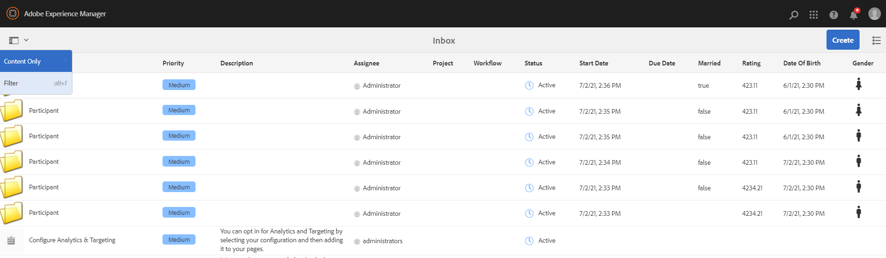

# Configure search filters for Inbox {#configure-search-filters-inbox}

You can configure search filters for Inbox items. Base your search criteria on a specific Inbox column to filter the results.

For example, to filter the Inbox items based on a Date of Birth Inbox column range, you can use the Date Range predicate to define the date range.

The following are the available predicate types for Inbox:

* Range Predicate

* Text Predicate

* Date Range Predicate

* Options Property Predicate

>[!NOTE]
>
>Ensure that you are a member of the `workflow-administrators` group to configure search filters for Inbox.

## Create or open a customized configuration {#creating-opening-customized-configuration}

1. Navigate to **[!UICONTROL Tools]**, **[!UICONTROL General]**, **[!UICONTROL Search Forms]**.

1. Select the **[!UICONTROL Inbox Search Rail]** configuration and tap **[!UICONTROL Edit]**.
1. Incorporate the predicate configuration changes using **[!UICONTROL Edit Search Forms]**.
1. Select **[!UICONTROL Done]** to save the configuration.

## Delete a customized configuration {#delete-customized-configuration}

To delete a customized configuration:

1. Navigate to **[!UICONTROL Tools]**, **[!UICONTROL General]**, **[!UICONTROL Search Forms]**.

1. Select the **[!UICONTROL Inbox Search Rail]** configuration and tap **[!UICONTROL Delete]**.

## Configure Range Predicate {#range-predicate}

You can filter Inbox items to search for a number range within an Inbox column using the Range Predicate. You can also choose to include decimal values for numbers.

To configure a Range Predicate:

1. Open the [form for configuration](#creating-opening-customized-configuration).
1. Tap the **[!UICONTROL Select Predicate]** tab and drag **[!UICONTROL Range Predicate]** to the form.
1. In the **[!UICONTROL Settings]** tab, select the Inbox column name to base your search on, from **[!UICONTROL Column Name]** field.
1. Specify the label for the filter in the **[!UICONTROL Filter Label]** field. Select the **[!UICONTROL Enable Decimal Values]** checkbox to accept decimal values for numbers while defining the range.
1. Specify an optional description for the configuration and tap **[!UICONTROL Done]** to save it.

The configuration changes reflect when you open the Filters page. The filter label that you specified in step 4 displays as the label with an option to define the maximum and minimum values. When you press the Enter key, [!DNL Experience Manager] applies the search criteria on the column name specified in step 3 and returns the Inbox items.

>[!NOTE]
>
>The article lists the latest user interface options. The option names will be updated on the user interface in the upcoming release.

## Configure Text Predicate {#text-predicate}

Filter Inbox items to search for a text string within an Inbox column using the Text Predicate.

To configure a Text Predicate:

1. Open the [form for configuration](#creating-opening-customized-configuration).
1. Tap the **[!UICONTROL Select Predicate]** tab and drag **[!UICONTROL Text Predicate]** to the form.
1. In the **[!UICONTROL Settings]** tab, select the Inbox column name to base your search on, from **[!UICONTROL Column Name]** field.
1. Specify the text that displays in the Search text box as a placeholder text in the **[!UICONTROL Search Text Box Placeholder]** field.
1. Specify an optional description for the configuration and tap **[!UICONTROL Done]** to save it.

The configuration changes reflect when you open the Filters page. When you press the Enter key, [!DNL Experience Manager] applies the search text specified in step 4 on the column name specified in step 3 and returns the Inbox items.

## Configure Date Range Predicate {#date-range-predicate}

You can filter Inbox items to search for a date range within an Inbox column using the Date Range Predicate.

To configure a Date Range Predicate:

1. Open the [form for configuration](#creating-opening-customized-configuration).
1. Tap the **[!UICONTROL Select Predicate]** tab and drag **[!UICONTROL Date Range Predicate]** to the form.
1. In the **[!UICONTROL Settings]** tab, select the Inbox column name to base your search on, from **[!UICONTROL Column Name]** field.
1. Specify the label for the date range filter in the **[!UICONTROL Filter Label]** field.
1. Specify the start date and end date labels for the filter.
1. Specify an optional description for the configuration and tap **[!UICONTROL Done]** to save it.

The configuration changes reflect when you open the Filters page. The filter label that you specified in step 4 displays as the label for the date range filter along with the start date and end date labels specified in step 5. [!DNL Experience Manager] applies the search criteria on the column name specified in step 3 and returns the Inbox items.

## Configure Custom Column Options Predicate {#custom-column-options-predicate}

You can filter Inbox items to search for a custom option within an Inbox column using the Custom Column Options Predicate.

To configure a Custom Column Options Predicate:

1. Open the [form for configuration](#creating-opening-customized-configuration).
1. Tap the **[!UICONTROL Select Predicate]** tab and drag **[!UICONTROL Custom Column Options Predicate]** to the form.
1. In the **[!UICONTROL Settings]** tab, select the Inbox column name to base your search on, from **[!UICONTROL Column Name]** field.
1. Specify the label for the custom column options filter in the **[!UICONTROL Filter Label]** field.
1. Select the **[!UICONTROL Single Select]** checkbox to enable the selection of just one option while applying filter on an Inbox column.
1. In the **[!UICONTROL Add Options]** section:
   1. Select **[!UICONTROL Manual]** to define the filter search options manually. Tap **[!UICONTROL Add Filter Options]** to define the first option. Specify the label for the column option and the option value text to search for. For example, if you want to search for **Female** as a value in an Inbox column, you can specify **F** as label for the column option and add **Female** as the option value text. Similarly, you can add more filter options.
   1. Select **[!UICONTROL JSON Path]** to define options using a JSON file path. The following is a sample JSON file to define filter options:

      ```JSON
          {
         "options":[
            {
            "text":"Female",
            "value":"F"
            },
            {
            "text":"Male",
            "value":"M"
            }
          ]
        }

      ```

   1. Select **[!UICONTROL CRX Options Path]** to define options using the CRX repository paths. Tap **[!UICONTROL Add Option Paths]** to add multiple paths. The following is a sample to define `Male` and `Female` filter options:

      ```JSON          
         <gender jcr:primaryType="sling:OrderedFolder">
                        <male
                            jcr:primaryType="nt:unstructured"
                            jcr:title="Male"
                            value="M"/>
                        <female
                            jcr:primaryType="nt:unstructured"
                            jcr:title="Female"
                            value="F"/>
                    </gender>

      ```

1. Specify an optional description for the configuration and tap **[!UICONTROL Done]** to save it.

The configuration changes reflect when you open the Filters page. The filter label that you specified in step 4 displays as the label for the Custom Column Option Predicate. [!DNL Experience Manager] applies the search criteria defined in step 6 on the column name specified in step 3 and returns the Inbox items.

The following video illustrates the steps to filter a column based on the `true` and `false` option values.

>[!VIDEO](https://video.tv.adobe.com/v/335679)

## View search filters based on predicates {#view-search-filters-for-predicates}

You can view search filters based on predicates. Select **[!UICONTROL Filter]** on the Inbox page. The filters display in the left pane. You can then specify the search criteria to filter Inbox items. 



For more information on managing predicate configurations, see [Configuring Search Forms](search-forms.md).
