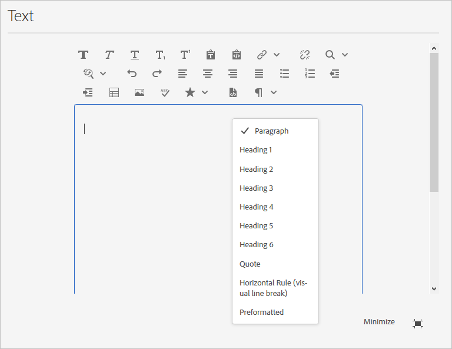
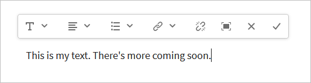

# Configure the Rich Text Editor {#configure-the-rich-text-editor}

The Rich Text Editor (RTE) provides authors with a wide range of functionality to edit text content. Icons, selection boxes, toolbar, and menus are provided for a WYSIWYG text-editing experience. Administrators configure the RTE to enable, disable, and extend the features available in the authoring components. See how authors [use RTE for authoring](/help/sites-cloud/authoring/page-editor/rich-text-editor.md) web content.

The RTE concepts and steps required to configure it are listed below.

|Understand RTE concepts|Enable required features|Configure individual functionalities|
|---|---|---|
| [Understand the interface](#understand-rte-ui) | [Understand and set config locations](#understand-the-configuration-paths-and-locations) | [Configure plug-ins](#enable-rte-functionalities-by-activating-plug-ins) |
| [Types of editing modes](#editingmodes) | [Activate plug-ins](/help/implementing/developing/extending/configure-rich-text-editor-plug-ins.md#activateplugin) | [Set feature properties](#aboutplugins) |
| [About plug-ins](#aboutplugins) | [Configure RTE toolbars](#dialogfullscreen) | [Configure the paste modes](/help/implementing/developing/extending/configure-rich-text-editor-plug-ins.md#textstyles) |

## Understand the user interface available to authors {#understand-rte-ui}

The RTE interface offers a [responsive design](/help/sites-cloud/authoring/page-editor/responsive-layout.md) for authoring environment. The interface is designed for use on touch and desktop devices.



*Figure: Rich Text Editor toolbar with all the available options enabled.*

The toolbar provides the options for the WYSIWYG authoring experience. [!DNL Experience Manager] administrators can configure the options available in the toolbar on the interface. A comprehensive set of editing options are available by default in [!DNL Experience Manager]. Developers can customize [!DNL Experience Manager] to add more editing options.

## Various modes of editing {#editingmodes}

Authors can create and edit textual content in [!DNL Experience Manager] using the different modes of components. The toolbar options for authoring and formatting content and the user experience of RTE-enabled components in different editing mode varies based on RTE configurations.

|Editing mode|Editing area|Recommended features to be enabled|
|--- |--- |--- |
|Inline|In-place editing for quick, minor edits; Format without opening a dialog box.|Minimal RTE features.|
|RTE full-screen|Covers entire page.|All the required RTE features.|
|Dialog|Dialog box on top of the page content but does not cover the entire page.| Judiciously enable features.|
|Dialog full-screen|Same as full-screen mode; contains fields of the dialog alongside RTE.|All the required RTE features.|

>[!NOTE]
>
>The source-edit feature is not available in inline editing mode. You cannot drag images in the full-screen mode. All other features work in all the modes.

### Inline editing {#inline-editing}

To edit the content within a page, open the content with a slow double-click . A compact toolbar with basic options is presented.



*Figure: Inline editing with basic options in the toolbar.*

### Full-screen editing {#full-screen-editing}

[!DNL Experience Manager] components can be opened in full-screen view that hides the page content and occupies the available screen. Consider full-screen editing a detailed version of the inline editing as it offers the most editing options. It can be opened by clicking , from the compact toolbar when using the inline editing mode.

In the dialog full-screen mode, along with a detailed RTE toolbar, the options and components available in a dialog are also available. It is applicable only for a dialog that contains RTE alongside other components.


*Figure: The detailed RTE toolbar when editing in full-screen mode.*

### Dialog editing {#dialog-editing}

When a component is double-clicked a dialog box opens for editing the contents. The dialog box opens on top of the existing page. In some specific scenarios, the dialog opens as a pop-up window. For example, when a Text component is part of a column in a multicolumn page layout and the area available for the dialog is less.


*Figure: Dialog editing mode.*

## About RTE plug-ins and the associated features {#aboutplugins}

The functionality is made available via a series of plug-ins, each with:

* A `features` property that is,

  * Used to activate, or deactivate, basic functionality for that plug-in.
  * Configured using a standardized procedure.

* Where appropriate, more properties and options requiring specialized configuration.

Basic features of the RTE are activated, or deactivated, by the value of the `features` property on a node specific to the appropriate plug-in.

The following table lists the current plug-ins, showing:

* Plug-in IDs with a link to API documentation. ID is used as the node name when [activating a plug-in](/help/implementing/developing/extending/configure-rich-text-editor-plug-ins.md#activateplugin).
* Permitted values for the `features` property.
* A description of the functionality provided by the plug-in.

|Plug-in ID|features|Description|
|--- |--- |--- |
|edit| `cut`, `copy`, `paste-default`, `paste-plaintext`, `paste-wordhtml`| [Cut, copy and, the three paste modes](/help/implementing/developing/extending/configure-rich-text-editor-plug-ins.md#textstyles).|
|findreplace|`find`, `replace`| Find and replace.|
|format| `bold`, `italic`, `underline` | [Basic text formatting](configure-rich-text-editor-plug-ins.md#textstyles).|
|image|`image`|Basic image support (drag from content or Content Finder). Depending on the browser, the support has different behaviors for authors|
|keys| - |To define this value, see [tab size](configure-rich-text-editor-plug-ins.md#tabsize).|
|justify|`justifyleft`, `justifycenter`, `justifyright` |Paragraph alignment.|
|links|`modifylink`, `unlink`, `anchor`|[Hyperlinks and anchors](configure-rich-text-editor-plug-ins.md#linkstyles).|
|lists|`ordered`, `unordered`, `indent`, `outdent` | This plug-in controls both [indentation and lists](configure-rich-text-editor-plug-ins.md#indentmargin); including nested lists.|
|misctools| `specialchars`, `sourceedit` |Miscellaneous tools let authors to enter [special characters](configure-rich-text-editor-plug-ins.md#spchar) or edit the HTML source. Also, you can add a [range of special characters](configure-rich-text-editor-plug-ins.md#definerangechar) if you want to define your own list.|
|Paraformat|`paraformat`|The default paragraph formats are Paragraph, Heading 1, Heading 2, and Heading 3 (`<p>`, `<h1>`, `<h2>`, and `<h3>`). You can [add more paragraph formats](configure-rich-text-editor-plug-ins.md#paraformats) or extend the list.|
|spellcheck| `checktext` | [Language aware spell checker](configure-rich-text-editor-plug-ins.md#adddict).|
|styles| `styles` | Support for styling using a CSS class. [Add new text styles](configure-rich-text-editor-plug-ins.md#textstyles) if you want to add (or extend) your own range of styles for use with text.|
| subsuperscript | `subscript`, `superscript` | Extensions to the basic formats, adding sub-script and super-script. |
| table | `table`, `removetable`, `insertrow`, `removerow`, `insertcolumn`, `removecolumn`, `cellprops`, `mergecells`, `splitcell`, `selectrow`, `selectcolumns` | See [configure table styles](configure-rich-text-editor-plug-ins.md#tablestyles) to add your own styles for entire tables or individual cells. |
| undo | `undo`, `redo` | History size of [undo and redo](configure-rich-text-editor-plug-ins.md#undohistory) operations.|

>[!NOTE]
>
>The full-screen plug-in is not supported in dialog mode. Use of the `dialogFullScreen` setting to configure the toolbar for full-screen mode.

## Understand the configuration paths and locations {#understand-the-configuration-paths-and-locations}

The [mode of RTE editing and the interface](#editingmodes) that you provide for your authors decide the location for the configuration details when you are [activating the RTE plug-ins](configure-rich-text-editor-plug-ins.md#activateplugin). The locations are:

* Inline mode: `cq:editConfig/cq:inplaceEditing`.
* Full-screen mode: `cq:editConfig/cq:inplaceEditing`.
* Dialog mode: `cq:dialog`.
* Full-screen dialog mode: `cq:dialog`.

>[!NOTE]
>
>Do not name the node under `cq:inplaceEditing` as `config`. On `cq:inplaceEditing` node, define the following properties:
>
>* **Name**: `configPath`
>* **Type**: `String`
>* **Value**: path of the node containing the actual configuration
>
>Do not name the RTE configuration node as `config`. Otherwise, the RTE configurations take effect for only the administrators and not for the users in the group `content-author`.

Configure the following properties that apply in Dialog editing mode:

* `useFixedInlineToolbar`: You can make the RTE toolbar fixed instead of floating. Set this Boolean property defined on the RTE node with sling:resourceType= `cq/gui/components/authoring/dialog/richtext` to `True`. When this property is set to `True`, the rich text editing is started on the `foundation-contentloaded` event. To prevent this, set the property `customStart` to `True` and trigger the `rte-start` event to start RTE editing. When this property is `true`, RTE does not start on clicking and this is the default behavior.

* `customStart`: Set this Boolean property defined on the RTE node to `True`, to control when to start RTE by triggering the event `rte-start`.

* `rte-start`: Trigger this event on the `contenteditable-div` of RTE, when to start editing RTE. It works only if `customStart` has been set to `true`.

When RTE is used in the touch-enabled dialog, set the property `useFixedInlineToolbar` to `true` to avoid issues.

## Enable RTE functionalities by activating plug-ins {#enable-rte-functionalities-by-activating-plug-ins}

RTE functionalities are made available via a series of plug-ins, each with features property. You can configure the features property to enable or disable the various features of each plug-in.

For detailed configurations of the RTE plug-ins, see [how to activate and configure the RTE plug-ins](configure-rich-text-editor-plug-ins.md).

<!-- TBD ENGREVIEW: To confirm if the sample works in CS or not?
**Sample**: Download [this sample configuration](/help/sites-administering/assets/rte-sample-all-features-enabled-10.zip) that illustrates how to configure RTE. In this package all the features are enabled. -->

The [Core Components text component](https://experienceleague.adobe.com/docs/experience-manager-core-components/using/components/text.html#the-text-component-and-the-rich-text-editor) lets template editors to configure many RTE plug-ins using the user interface as content policies, eliminating the need for technical configuration. Content policies can work with RTE UI configurations as described in this document. For more information, see [create page templates](/help/sites-cloud/authoring/page-editor/templates.md) and the [Core Components developer documentation](https://experienceleague.adobe.com/docs/experience-manager-core-components/using/developing/developing.html).

>For reference purposes, the default Text components (delivered as part of a standard installation) can be found at:
>
>* `/libs/wcm/foundation/components/text`
>* `/libs/foundation/components/text`
>
>To create your own text component, copy the above component instead of editing these components.

## Configure RTE toolbar {#dialogfullscreen}

[!DNL Experience Manager] lets you configure the interface for the Rich Text Editor differently for the different editing modes. The default settings are provided below. You can override these defaults based on your requirements. You customize only the toolbar features that you want to provide to your authors. You need not specify all the toolbar configurations.

To configure the toolbar for `dialogFullScreen`, use the following sample configuration.

```java
<uiSettings jcr:primaryType="nt:unstructured">
  <cui jcr:primaryType="nt:unstructured">
    <inline
      jcr:primaryType="nt:unstructured"
      toolbar="[format#bold,format#italic,format#underline,#justify,#lists,links#modifylink,links#unlink,#paraformat]">
      <popovers jcr:primaryType="nt:unstructured">
        <justify
          jcr:primaryType="nt:unstructured"
          items="[justify#justifyleft,justify#justifycenter,justify#justifyright,justify#justifyjustify]"
          ref="justify"/>
        <lists
          jcr:primaryType="nt:unstructured"
          items="[lists#unordered,lists#ordered,lists#outdent,lists#indent]"
          ref="lists"/>
        <paraformat
          jcr:primaryType="nt:unstructured"
          items="paraformat:getFormats:paraformat-pulldown"
          ref="paraformat"/>
      </popovers>
    </inline>
    <dialogFullScreen
      jcr:primaryType="nt:unstructured"
      toolbar="[format#bold,format#italic,format#underline,justify#justifyleft,justify#justifycenter,justify#justifyright,justify#justifyjustify,lists#unordered,lists#ordered,lists#outdent,lists#indent,links#modifylink,links#unlink,table#createoredit,#paraformat,image#imageProps]">
      <popovers jcr:primaryType="nt:unstructured">
        <paraformat
          jcr:primaryType="nt:unstructured"
          items="paraformat:getFormats:paraformat-pulldown"
          ref="paraformat"/>
      </popovers>
    </dialogFullScreen>
    <tableEditOptions
      jcr:primaryType="nt:unstructured"
      toolbar="[table#insertcolumn-before,table#insertcolumn-after,table#removecolumn,-,table#insertrow-before,table#insertrow-after,table#removerow,-,table#mergecells-right,table#mergecells-down,table#mergecells,table#splitcell-horizontal,table#splitcell-vertical,-,table#selectrow,table#selectcolumn,-,table#ensureparagraph,-,table#modifytableandcell,table#removetable,-,undo#undo,undo#redo,-,table#exitTableEditing,-]">
    </tableEditOptions>
  </cui>
</uiSettings>
```

Different user interface settings are used for the inline mode and full-screen mode. The toolbar property specifies the option of the toolbar.

For example, if the option is itself a feature (for example, `Bold`), it is specified as `PluginName#FeatureName` (for example, `links#modifylink`).

If the option is a pop over (containing some features of a plug-in), it is specified as `#PluginName` (for example, `#format`).

Separators (`|`) between a group of option can be specified with `-`.

The pop-up node under inline or full-screen mode contains a list of the pop overs being used. Each child node under the `popovers` node is named after the plug-in (for example, format). It has a property 'items' containing a list of features of the plug-in (for example, format#bold).

## RTE user interface settings and content policies {#rtecontentpolicies}

Administrators can control the RTE options using content policies, say instead of doing the configuration as described above. Content policies define the design properties of a component when used as part of an [editable template](/help/sites-cloud/authoring/page-editor/templates.md). For example, if a text component that uses the RTE is used with an editable template, the content policy can define that the bold option be available and a few paragraph formatting options be available. Content policies are reusable and can be applied across multiple templates.

The available options in the RTE flow downstream from the user interface configurations to the content policies.

* User interface configuration settings define which options are available to the content policies.
* If the user interface configuration of the RTE removed or does not enable an item, the content policy cannot configure it.
* An author has access to only such functionality as is made available by the user interface configurations and the content policies.

As an example, you can see the [Text Core Component documentation](https://experienceleague.adobe.com/docs/experience-manager-core-components/using/components/text.html#the-text-component-and-the-rich-text-editor).

## Customize mapping between toolbar icons and commands {#iconstoolbar}

You can customize the mapping between Coral icons displayed on the RTE toolbar and the available commands. You cannot use any other icons besides Coral icons.

1. Create a node named `icons` under `uiSettings/cui`.

1. Create nodes for individual icons under it.
1. On each of the individual icon nodes, specify a Coral icon and a command to map to the icon.

Below is a sample snippet to map the command `Bold` to the Coral icon named `textItalic`.

```java
<text jcr:primaryType="nt:unstructured" sling:resourceType="cq/gui/components/authoring/dialog/richtext" name="./text" useFixedInlineToolbar="{Boolean}true">
    <rtePlugins jcr:primaryType="nt:unstructured">
        <format jcr:primaryType="nt:unstructured" features="bold,italic"/>
    </rtePlugins>
    <uiSettings jcr:primaryType="nt:unstructured">
        <cui jcr:primaryType="nt:unstructured">
            <inline jcr:primaryType="nt:unstructured"
                toolbar="[format#bold,format#italic,format#underline,links#modifylink,links#unlink]">
            </inline>
            <icons jcr:primaryType="nt:unstructured">
                <bold jcr:primaryType="nt:unstructured"
                    command="format#bold"
                    icon="textItalic"/>
            </icons>
        </cui>
    </uiSettings>
</text>
```

## Known limitations {#known-limitations}

[!DNL Experience Manager] RTE capability has the following limitations:

* RTE capabilities are supported only in [!DNL Experience Manager] component dialogs. RTE is not supported on wizards or Foundation-forms.

* [!DNL Experience Manager] does not work on Hybrid devices. <!-- TBD: Check. This is not mentioned in Known Issue /help/release-notes/known-issues.md-->

* Do not name the RTE configuration node `config`. Otherwise, the RTE configuration takes effect for only the administrators and not for the users in the group `content-author`.

* RTE does not support embedding content in an inline frame or an iframe.

## Best practices and tips {#best-practices-and-tips}

* For a floating dialog, enable only the plug-ins without a pop-up dialog. Plug-ins without pop-up are smaller in size and are most suitable for a floating dialog.
* Enable the plug-ins with larger pop-up, such as the `Paste` plug-in, only in the full-screen dialog mode or in full-screen mode. Plug-ins with large pop-up need more screen real-estate to provide a good authoring experience.
* If you are using custom plug-ins for CoralUI3 RTE, use `rte.coralui3` library.

>[!MORELIKETHIS]
>
>* [Configure RTE plug-ins](configure-rich-text-editor-plug-ins.md)
>* [Use Rich Text Editor for authoring](/help/sites-cloud/authoring/page-editor/rich-text-editor.md)
>* [Configure RTE for accessible sites](rte-accessible-content.md)
