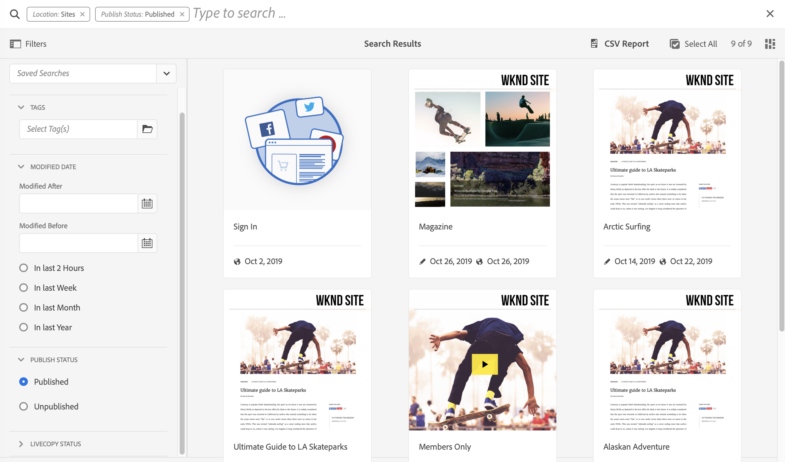
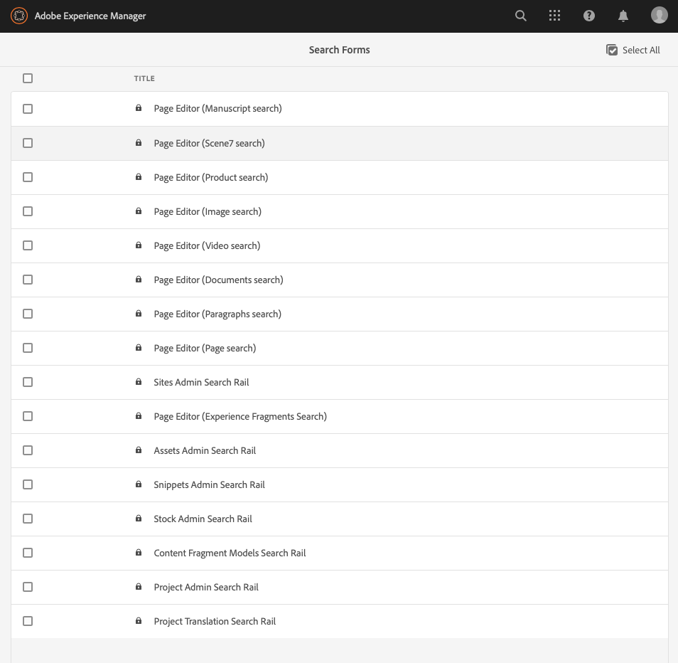
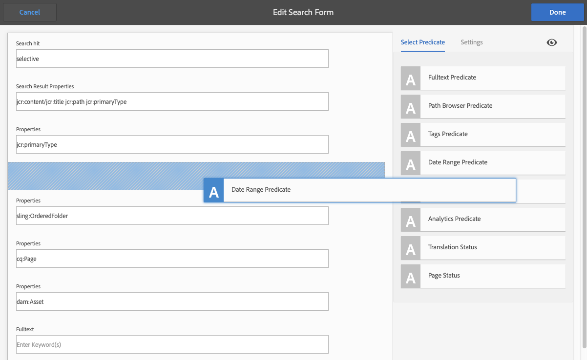
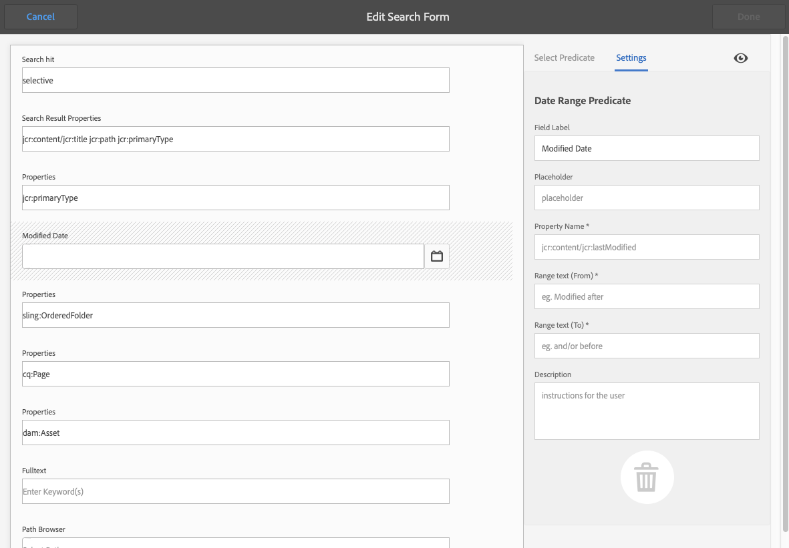
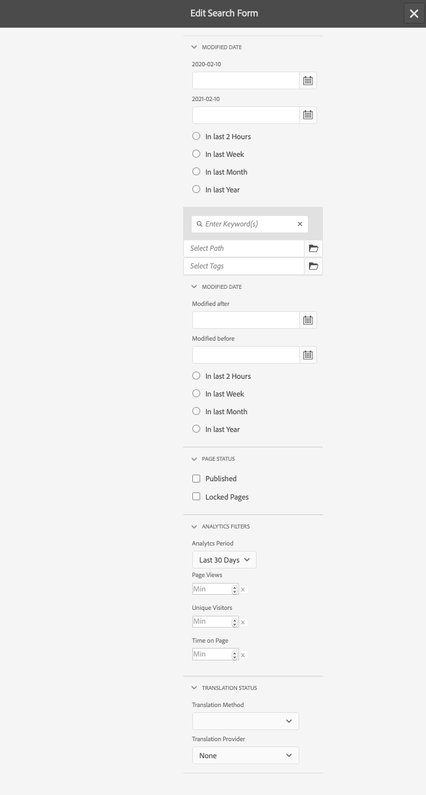
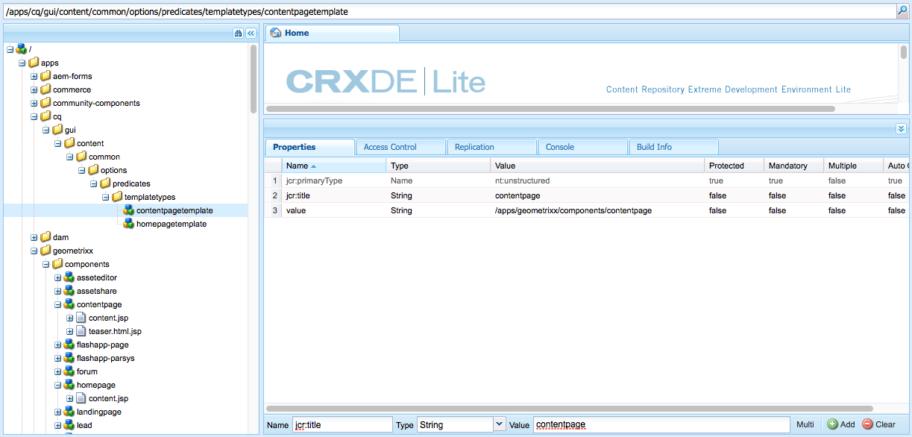
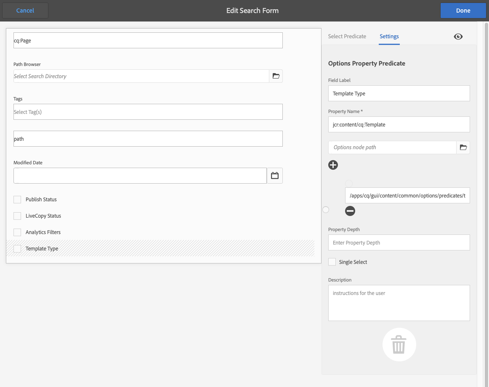
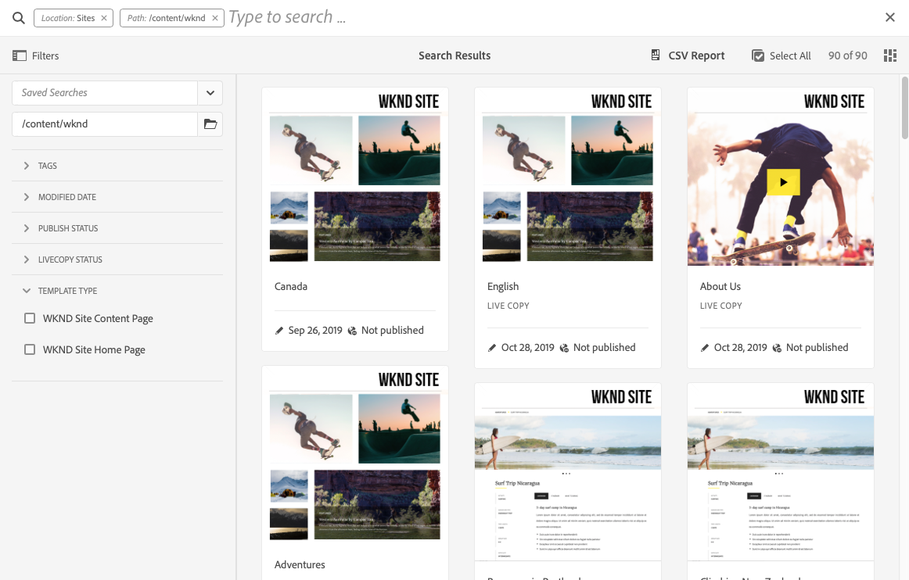

# Configuring Search Forms {#configuring-search-forms}

Adobe Experience Manager as a Cloud Service comes with a powerful [Search](/help/sites-cloud/authoring/getting-started/search.md) mechanism. 

In combination with this there are a also set of predefined options to help you to filter your content. These hold predefined facets such as **Modified Date**, **Publish Status**, or **Livecopy Status** to help you quickly drill down to the resources you need.

Together these aim to help you locate your content quickly and easily from:

* [Search and Filter](/help/sites-cloud/authoring/getting-started/search.md#search-and-filter)
* [Rail Selector](/help/sites-cloud/authoring/getting-started/basic-handling.md#rail-selector)
* the [Assets Browser](/help/sites-cloud/authoring/fundamentals/environment-tools.md#assets-browser) (when editing pages)

>[!NOTE]
>
>You can configure the underlying [Content Search and Indexing](/help/operations/indexing.md) service.

Using **Search Forms**, you can customize, and extend, these panels, according to your specific needs. 

The **Search Forms** provide an out-of-the-box selection of [predicates](#predicates-and-their-settings) that you can combine and define. The [dialogs for configuring these forms](#configuring-your-search-forms) can be accessed via:

* **Tools**
  * **General**
    * **Search Forms**

## Default Forms {#default-forms}

When you first access the **Search Forms** console you can see that all the configurations have a padlock symbol. This indicates that the corresponding configuration is the default (out-of-the-box) configuration - and cannot be deleted. Once you have customized, and saved, a configuration the lock will disappear. It will reappear when you [delete your customized configuration](#deleting-a-configuration-to-reinstate-the-default), in which case the default (and the padlock indicator) will be reinstated.

The default configurations (listed alphabetically) available are:

* **Assets Admin Search Rail**
* **Page Editor (Documents search)**
* **Page Editor (Experience Fragments Search)**
* **Page Editor (Image search)**
* **Page Editor (Manuscript search)**
* **Page Editor (Page search)**
* **Page Editor (Paragraphs search)**
* **Page Editor (Product search)**
* **Page Editor (Scene7 search)**
* **Page Editor (Video search)**
* **Project Admin Search Rail**
* **Project Translation Search Rail**
* **Sites Admin Search Rail**
* **Snippets Admin Search Rail**
* **Stock Admin Search Rail**
* **Content Fragment Models Search Rail**
* **Project Admin Search Rail**
* **Project Translation Search Rail**

>[!NOTE]
>
>For further details about Asset related search forms, see [Assets - Search Facets](/help/assets/search-facets.md)

## Predicates and Their Settings {#predicates-and-their-settings}

### Predicates {#predicates}

The following predicates are available, dependent on the configuration:

<table>
 <tbody>
  <tr>
   <th>Predicate</th>
   <th>Purpose</th>
   <th>Settings</th>
  </tr>
  <tr>
   <td>Analytics</td>
   <td>Search/filter capabilities in the Sites browser when showing analytics powered data. Analytics search filters load up to match the mapped customized analytics columns.</td>
   <td>
    <ul>
     <li>Field Label</li>
     <li>Description</li>
    </ul> </td>
  </tr>
  <tr>
   <td>Approval Status</td>
   <td>Search according to approval status.</td>
   <td>
    <ul>
     <li>Field Label</li>
     <li>Property Name*</li>
     <li>Description</li>
    </ul> 
   </td>
  </tr>
  <tr>
   <td>Author</td>
   <td>Search according to author.</td>
   <td>
    <ul>
     <li>Placeholder</li>
     <li>Property Name*</li>
     <li>Description</li>
    </ul> 
   </td>
  </tr>
  <tr>
   <td>Checked Out By</td>
   <td>Search for assets checked out by a specific user.</td>
   <td>
    <ul>
     <li>Field Label</li>
     <li>Placeholder</li>
     <li>Description</li>
    </ul> 
   </td>
  </tr>
  <tr>
   <td>Checkout Status</td>
   <td>Search for assets with a specific checkout status.</td>
   <td>
    <ul>
     <li>Field Label</li>
     <li>Property Name*</li>
     <li>Description</li>
    </ul> 
   </td>
  </tr>
  <tr>
   <td>Components</td>
   <td>Allows an author to search/filter for pages that have a specific component on it. For example an image gallery.  </td>
   <td>
    <ul>
     <li>Placeholder</li>
     <li>Property Name*</li>
     <li>Property Depth</li>
     <li>Description</li>
    </ul> </td>
  </tr>
  <tr>
   <td>Date Range</td>
   <td>Search for resources created within a specified range for a date property. In the Search panel, you can specify Start and End dates.</td>
   <td>
    <ul>
     <li>Field Label</li>
     <li>Placeholder</li>
     <li>Property Name*</li>
     <li>Range text (From)*</li>
     <li>Range text (To)*</li>
     <li>Description</li>
    </ul> </td>
  </tr>
  <tr>
   <td>Expiry Status</td>
   <td>Search resources based on expiry status.</td>
   <td>
    <ul>
     <li>Field Label</li>
     <li>Property Name*</li>
     <li>Description</li>
    </ul> </td>
  </tr>
  <tr>
   <td>File Size</td>
   <td>Filter resources based on their size.</td>
   <td>
    <ul>
     <li>Field Label</li>
     <li>Property Name*</li>
     <li>Option Path</li>
     <li>Description</li>
    </ul> </td>
  </tr>
  <tr>
   <td>File Type</td>
   <td>Search assets based on the file/mime type.</td>
   <td>
    <ul>
     <li>Field Label</li> 
     <li>Property Name*</li>
     <li>Mimetype Path</li>
     <li>Description</li>
    </ul> 
   </td>
  </tr>
  <tr>
   <td>Fulltext</td>
   <td>Search predicate for full-text searches. It is mapped with the ´jcr:contains´ operator.</td>
   <td>
    <ul>
     <li>Placeholder</li>
     <li>Property Name</li>
     <li>Description</li>
    </ul> </td>
  </tr>
  <tr>
   <td>Group</td>
   <td>Search predicate for group (only used within the Insights Predicate).</td>
   <td>
    <ul>
     <li>Field Label</li>
     <li>Description</li>
    </ul> </td>
  </tr>
  <tr>
   <td>Hidden Filter</td>
   <td>A filter on property and value, not visible to the user.</td>
   <td>
    <ul>
     <li>Property Name*</li>
     <li>Property Value*</li>
     <li>Description</li>
    </ul> </td>
  </tr>
  <tr>
   <td>Insights</td>
   <td>Search according to a selection of Insights parameters.</td>
   <td>This is a complex predicate composed from multiple predicates:
    <ul>
     <li>Group</li>
     <li>Range</li>
     <li>Options</li>
    </ul> 
   </td>
  </tr>
  <tr>
   <td>Member of collection</td>
   <td>Search for assets that are members of a collection</td>
   <td>
    <ul>
     <li>Description</li>
    </ul> 
   </td>
  </tr>
  <tr>
   <td>Multi Value Property</td>
   <td>Search on multiple values of a specified property.</td>
   <td>
    <ul>
     <li>Field Label</li>
     <li>Placeholder</li>
     <li>Property Name*</li>
     <li>Delimiter Support</li>
     <li>Input Delimiters</li>
     <li>Ignore Case</li>
     <li>Description</li>
    </ul> 
   </td>
  </tr>
  <tr>
   <td>Options</td>
   <td>
The options are content nodes created by the user.
 
See <a href="#addinganoptionspredicate">Adding an Options Predicate</a> for more information.
 </td>
   <td>
    <ul>
     <li>Field Label</li>
     <li>Property Name*</li>
     <li>Single Select</li>
     <li>Add Options</li>
     <li>Manual</li>
     <li>Description</li>
    </ul> </td>
  </tr>
  <tr>
   <td>Options Property</td>
   <td>Search on one, or more, properties of the option.</td>
   <td>
    <ul>
     <li>Field Label</li>
     <li>Property Name*</li>
     <li>Options node path</li>
     <li>Property Depth</li>
     <li>Single Select</li>
     <li>Description</li>
    </ul> </td>
  </tr>
  <tr>
   <td>Page Status</td>
   <td>Filter pages according to their status.</td>
   <td>
    <ul>
     <li>Field Label</li>
     <li>Publish Property Name*</li>
     <li>Locked Pages Property Name*</li>
     <li>Description</li>
    </ul> </td>
  </tr>
  <tr>
   <td>Path</td>
   <td>Filter according to specific path. You can specify multiple paths as options.</td>
   <td>
    <ul>
     <li>Field Label</li>
     <li>Add Search Paths</li>
     <li>Description</li>
    </ul> </td>
  </tr>
  <tr>
   <td>Path Browser</td>
   <td>Provide a path browser to search under a predefined root path.</td>
   <td>
    <ul>
     <li>Placeholder</li>
     <li>Root path</li>
     <li>Description</li>
    </ul> 
   </td>
  </tr>
  <tr>
   <td>Path Hidden</td>
   <td>A filter on path, not visible to the user.</td>
   <td>
    <ul>
     <li>Property Name (`path`)</li>
     <li>Property Value (`/content/dam`)</li>
    </ul> 
   </td>
  </tr>
  <tr>
   <td>Property</td>
   <td>Search on a specified property.</td>
   <td>
    <ul>
     <li>Field Label</li>
     <li>Placeholder</li>
     <li>Property Name</li>
     <li>Partial Search</li>
     <li>Ignore Case</li>
     <li>Description</li>
    </ul> 
   </td>
  </tr>
  <tr>
   <td>Publish Status</td>
   <td>Filter resources based on their publish status.</td>
   <td>
    <ul>
     <li>Field Label</li>
     <li>Property Name*</li>
     <li>Description</li>
    </ul> </td>
  </tr>
  <tr>
   <td>Range</td>
   <td>Search resources that lie within a specified range. In the Search panel, you can specify minimum and maximum values for the range.</td>
   <td>
    <ul>
     <li>Field Label</li>
     <li>Property Name*</li>
     <li>Description</li>
    </ul> </td>
  </tr>
  <tr>
   <td>Rating</td>
   <td>Search for resources according to their average rating.  </td>
   <td>
    <ul>
     <li>Field Label</li>
     <li>Property Name*</li>
     <li>Option Path</li>
     <li>Description</li>
    </ul> </td>
  </tr>
  <tr>
   <td>Relative Date</td>
   <td>Filter resources based on the relative date of their creation. For example, 1 week ago, 1 month ago.</td>
   <td>
    <ul>
     <li>Field Label</li>
     <li>Property Name*</li>
     <li>Relative Date</li>
     <li>Description</li>
    </ul> </td>
  </tr>
  <tr>
   <td>Slider Range</td>
   <td>A common search predicate extending the range predicate with the slider capability. The value of the property searched on must be between the slider limits.</td>
   <td>
    <ul>
     <li>Field Label</li>
     <li>Property Name*</li>
     <li>Options node path</li>
     <li>Description</li>
    </ul> </td>
  </tr>
  <tr>
   <td>Status</td>
   <td>Search according to the approval and checkout status.</td>
   <td>This is a complex predicate composed from multiple predicates:
    <ul>
     <li>Approval Status</li>
     <li>Checkout Status</li>
    </ul> 
   </td>
  </tr>
  <tr>
   <td>Tags</td>
   <td>Search based on tags.</td>
   <td>
    <ul>
     <li>Field Lavel</li>
     <li>Placeholder</li>
     <li>Property Name*</li>
     <li>Show match all tags option</li>
     <li>Root tags path</li>
     <li>Description</li>
    </ul> </td>
  </tr>
  <tr>
   <td>Templates</td>
   <td>Search according to the selected template.</td>
   <td>
    <ul>
     <li>Placeholder</li>
     <li>Property Name*</li>
     <li>Description</li>
    </ul> 
   </td>
  </tr>
  <tr>
   <td>Translation Status</td>
   <td>Search according to the translation status.</td>
   <td>
    <ul>
     <li>Field Label</li>
    </ul> 
   </td>
  </tr>
 </tbody>
</table>

<!--
  <tr>
   <td>Date ???</td>
   <td>Slider-based search of assets based on a date property.</td>
   <td>
    <ul>
     <li>Field Label</li>
     <li>Property Name*</li>
     <li>Description</li>
    </ul> </td>
  </tr>
  <tr>
   <td>Asset Last Modified ?????</td>
   <td>Date the asset was last modified.  </td>
   <td>A customized predicate, based on the Date Predicate.</td>
  </tr>
  <tr>
   <td>Range Options ???</td>
   <td>A specific search predicate for Assets and the same as common Slider Predicate. Is still available due to backward compatibilty issues.</td>
   <td>
    <ul>
     <li>Field Label</li>
     <li>Property Name*</li>
     <li>Option Path</li>
     <li>Description</li>
    </ul> </td>
  </tr>
  <tr>
   <td>Tag </td>
   <td>Search assets based on tags. You can configure the Path property to populate various tags in the Tags list.</td>
   <td>
    <ul>
     <li>Field Label</li>
     <li>Property Name*</li>
     <li>Option Path</li>
     <li>Description</li>
    </ul> </td>
  </tr>
-->

>[!NOTE]
>
>The common search predicates are defined in:
>  `/libs/cq/gui/components/common/admin/customsearch/searchpredicates`
>
>This information is for reference only, you must not make changes to `/libs`.

<!--
>* Search predicates related only to siteadmin (classic UI) are located under:
> `/libs/cq/gui/components/siteadmin/admin/searchpanel/searchpredicates`
>   * These are deprecated and only available for backward compatibility.
>
-->

### Predicate Settings {#predicate-settings}

Dependent on the predicate a selection of settings are available for configuration, including:

* **Field Label**

  The label that will appear as the collapsible header or as the field label of the predicate.

* **Description**

  Descriptive details for the user.

* **Placeholder**

  Empty text or the place holder of the predicate in case no filtering text is entered.

* **Property Name**

  The property to be searched on. It uses a relative path and the wildcards `*/*/*` specify the depth of the property relative to the `jcr:content` node (each asterisk represents one node level).

  If you want to search only on a first level child node of the resource that has the `x` property on the `jcr:content` node use `*/jcr:content/x`

* **Property Depth**

  The maximum depth to search for that property within the resources. So a search on that property can be performed on a resource and recursive children until the level of the children equals specified depth.

* **Property Value**

  The property value as an absolute string or as an expression language; for example, `cq:Page` or

  `${empty requestPathInfo.suffix ? "/content" : requestPathInfo.suffix}`.

* **Range Text**

  The label of the range field in the **Date Range** predicate.

* **Option Path**

  The user can select the path using the Path Browser in the predicate setting tab. After selecting the **+** icon is used to add the selection to the list of valid options (then the **-** icon to remove if required).

  The options are content nodes created by the user, having the following structure:

  `(jcr:primaryType = nt:unstructured, value (String), jcr:title (String))`

* **Options node path**
  Effectively the same as the **Options Path**, only this is in the common predicate field, the other is specific for assets.

* **Single Select**
  If checked, the options are rendered as checkboxes that allow for only a single selection. If mistakenly selected, a checkbox can be deselected.

* **Publish and Live Copy Property Name(s)**
  The labels for the publish and live copy checkboxes for the Sites specific predicate.

* The &ast; on the field labels in the **Settings** tab means the fields are mandatory and if left blank an error message will appear.

## Configuring Your Search Forms {#configuring-your-search-forms}

### Creating/Opening a Customized Configuration {#creating-opening-a-customized-configuration}

1. Navigate to **Tools**, **General**, **Search Forms**.

1. Select the configuration that you want to customize.
1. Use the **Edit** icon to open the configuration for updating.
1. If a new customization you will probably want to [add new predicate fields and define the settings](#add-edit-a-predicate-field-and-define-field-settings) as required. If an existing customization you can select an existing field and [update the settings](#add-edit-a-predicate-field-and-define-field-settings).
1. Select **Done** to save the configuration. Your changes can be seen next time the configuration is used.

   >[!NOTE]
   >
   >The customized configurations are stored (as appropriate) under:
   >
   >* `/apps/cq/gui/content/facets/<option>`
   >* `/apps/commerce/gui/content/facets/<option>`

### Add/Edit a Predicate Field and Define Field Settings {#add-edit-a-predicate-field-and-define-field-settings}

You can add or edit fields and define/update their settings:

1. [Open the customized configuration](#creating-opening-a-customized-configuration) for updating.
1. If you want to add a new field, open the **Select Predicate** tab and drag the required predicate to the required location. For example, the **Date Range Predicate**:

   

1. Depending on whether:

    * You are adding a new field:

      After adding the predicate the **Settings** tab will open and show the properties that can be defined.

    * You want to update an existing predicate:

      Select the predicate field (on the right), then open the **Settings** tab.

   For example, the settings for the **Date Range Predicate**:

   

1. Make your changes as required and confirm with **Done**. Your changes can be seen next time the configuration is used.

### Previewing the Search Configuration {#previewing-the-search-configuration}

1. Select the Preview icon:

   

1. This will display the search forms as they will be shown (fully expanded) in the Search column of the appropriate console.

   

1. **Close** the preview to return and finish the configuration.

### Deleting a Predicate Field {#deleting-a-predicate-field}

1. [Open the customized configuration](#creating-opening-a-customized-configuration) for updating.
1. Select the predicate field (on the right), open the **Settings** tab and then select the **Delete** icon (bottom left).

   

1. A dialog will request confirmation of the delete action.

1. Confirm this and any other changes with **Done**.

### Deleting a Configuration (to Reinstate the Default) {#deleting-a-configuration-to-reinstate-the-default}

Once you have customized a configuration this will override the defaults. You can resinstate the default configuration by deleting your customized configuration.

>[!NOTE]
>
>You cannot delete the default configurations.

Deleting a customized configuration is done from the console:

1. Select the required configuration (for example, **Page Editor (Paragraphs search)**) and then the **Delete** icon in the toolbar:

   

1. The customized configuration will be deleted and the default reinstated (this is indicated by the reappearance of the padlock symbol in the console).

### Adding Options Predicates {#adding-options-predicates}

Option predicates (Options, Options Property) allow you to configure an item to be searched for. They are usually used to search for something directly under the page; for example, a property on the page node.

The following example (to search according to the template used to create a page), illustrates the steps involved:

1. Create the node defining the property to be searched on.

   You will need a root node holding definitions of the individual options to be available to the user.

   The nodes for the individual options need the properties:

    * `jcr:title` - the field label to be shown in the search rail
    * `value` - the property value to be searched on

   

   >[!NOTE]
   >
   >You ***must*** not change anything in the `/libs` path.
   >
   >This is because the content of `/libs` is overwritten the next time you upgrade your instance (and may well be overwritten when you apply either a hotfix or feature pack).
   >
   >The recommended method for configuration and other changes is:
   >
   >1. Recreate the required item, as it exists in `/libs`, under `/apps`. In this case from:
   >1. `/libs/cq/gui/content/common/options/predicates`
   >1. Make any changes within `/apps.`

1. Open the **Search Forms** console and select the configuration you want to update. For example, **Sites Admin Search Rail**. Then select **Edit**.

1. Depending on the configuration add an **Options** or **Options Property** to the configuration.
1. Update the fields, in particular:

    * **Property Name**

      Specific the node property to be searched for on the target nodes. For example:

      `jcr:content/cq:template`

    * **Option node path**

      Select the path to where your options are held. For example:

      `/apps/cq/gui/content/common/options/predicates/templatetype`

   

1. Select **Done** to save your configuration.
1. Navigate to the appropriate console (in this example, **Sites**) and open the **Search - Filters** rail. The newly defined search forms, together with the various options will be visible. Select the required option to see the search results.

   

## User Permissions {#user-permissions}

The following table lists the permissions required to perform edit, delete, and preview actions on search forms.

<table>
 <thead>
  <tr>
   <td><strong>Action</strong></td>
   <td><strong>Permissions</strong></td>
  </tr>
 </thead>
 <tbody>
  <tr>
   <td>Edit </td>
   <td>Read, Write permissions on the <code>/apps </code>node.</td>
  </tr>
  <tr>
   <td>Delete</td>
   <td>Read, Write, Delete permissions on the <code>/apps</code> node</td>
  </tr>
  <tr>
   <td>Preview</td>
   <td>Read, Write, Delete permissions on the <code>/var/dam/content</code> node.  Read, Write permissions on the <code>/apps</code> node.</td>
  </tr>
 </tbody>
</table>
