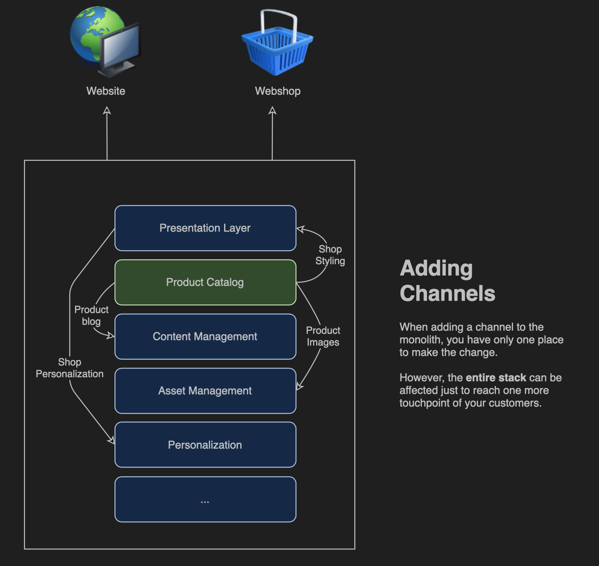
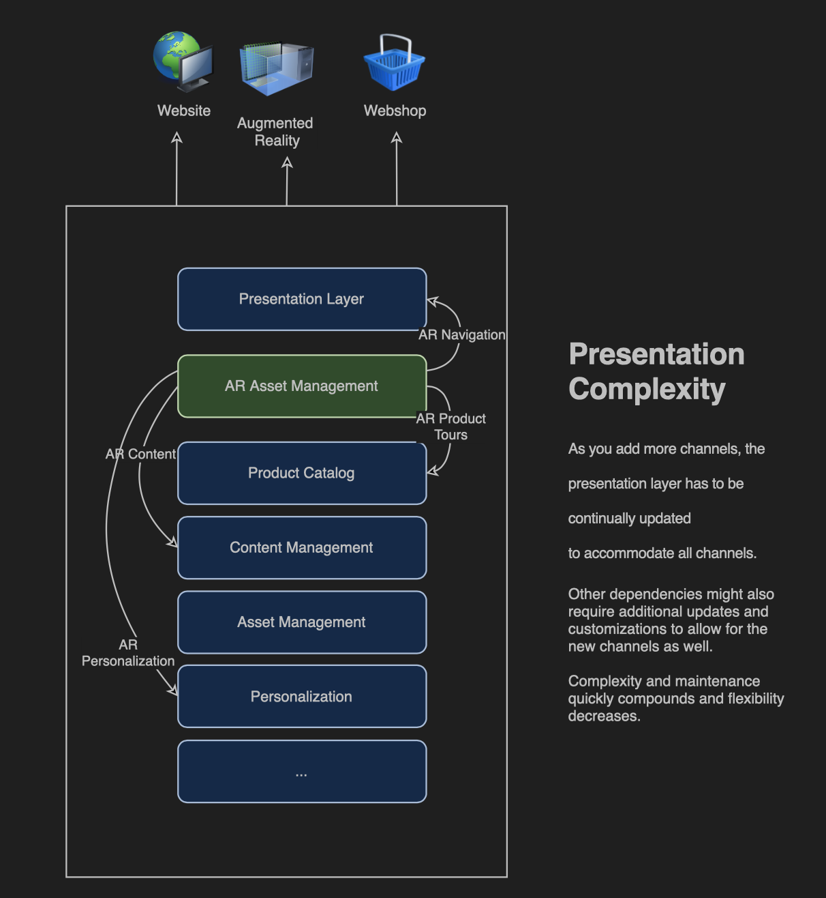
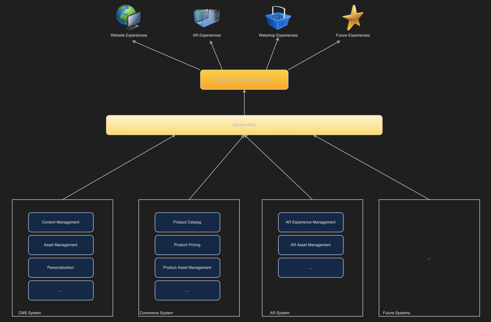

# Learn About CMS Headless Development {#learn-about}

In this part of the [AEM Headless Developer Journey,](#overview.md) learn about headless technology and when to use it.

## Objective {#objective}

This document helps you understand headless content delivery and why it should be used. After reading you should:

* Understand the basic concepts and terminology of headless content delivery
* Understand why and when headless is required
* Know at a high-level how headless concepts are used and how they interrelate

## Monolithic Content Delivery {#monolith}

Ever since the rise of easy-to-use, large-scale content management systems (CMSes), organizations have leveraged them as a central location to manage messaging, branding, and communications. Using the CMS as a central point for administering experiences improved efficiency by eliminating the need to duplicate tasks in disparate systems.

In such a monolithic CMS, all of the functionality for manipulating your content is in the CMS. The advantage is that you have one system to maintain and one place to deploy your changes.

So if you want to add a new channel or support new types of experiences, you only have one place to make your changes.

The complexity of the dependencies within the monolith quickly become apparent as you see that other items in the stack need to be adjusted to accommodate.

## Limits of Monolithic Delivery {#limits}

The monolith approach inherently creates a silo where all experiences land in one system. Changes or additions at one level of the silo require changes at other levels making changes time-intensive and costly.

This is particularly true of your presentation layer, which in traditional CMSes, is tightly bound to the CMS. Any new channel generally means at a minimum an update to the presentation layer, which affects all other channels.

The limitations of this natural silo are apparent as you realize how much effort an time is required to coordinate changes across all levels of your silo/monolith.

Users expect engagement no matter what the platform or touch point, requiring agility in how you deliver your experiences.  This multichannel approach is the standard of digital experiences and a monolithic approach can be simply too inflexible.

## Where's the Head? {#where-is-the-head}

The head of any system is generally the output renderer of that system, typically in the form of a GUI. A headless server for example is likely sitting in a rack in a server room somewhere and has no monitor attached. To access it you have to remotely connect into it. In this case, the monitor is the head as it takes care of rendering the output of the server. You as the consumer of the service, provide your own head (the monitor).

When we talk about a headless CMS, the CMS manages the content and continues to deliver it to consumers. However a headless CMS omits the final output rendering, leaving the presentation of the content to the consuming service.

The consuming services, be they AR experiences, your webshop, mobile experiences, PWAs, etc. provide their own rendering. They take care of providing their own heads for your content.

## Decoupling {#decoupling}

Headless delivery is possible by exposing a set of robust and flexible APIs that all of your experiences can tap.

Headless is an example of decoupling your content from its presentation. Or in a more generic sense, decoupling the front end from the back end of your service stack.

In a headless setup, the presentation layer (the head) is decoupled from the content management (the tail). The two only interact through API calls.

This decoupling means that each consuming service (the front end) can build its experience based on the same content delivered over the APIs, ensuring content reuse and consistency. Consuming services can then implement their own presentation layers, allowing the content management layer (the back end) to easily scale horizontally.

## Technological Underpinnings {#technology}

A headless approach allows you to build a technology stack that can easily and quickly adapt to future digital experience demands.

APIs for CMSes in the past often were REST-based. And there is still a need for robust REST APIs. REST ensures stateless representation of your content. However REST requests can be large and verbose. If you have multiple consumers making REST calls for all of your channels this verbosity compounds and performance can be affected.

Headless content delivery often makes use of GraphQL APIs. GraphQL allows for a similar stateless transfer, but allows for more targeted queries, improving performance. Whatever your API, an API-based solution allows you leverage the latest browser and other web technologies such as progressive web apps (PWA).

Typically, content is rendered on the client side. This normally means someone calls up your content on a mobile device and then that mobile device (the client) is responsible for rendering the content you serve. If the device is old or otherwise slow, your digital experience is likewise slow.

Decoupling means that there can be more control over such client-side performance concerns. Server-side rendering (SSR) transfers the responsibility of rendering the content from the client's browser to the server. This allows you as the provider of the content be able to offer a level of guaranteed performance to your audience if that is what is required.

## Organizational Challenges {#organization}

Headless opens up a world of flexibility for delivering your digital experiences. But this flexibility can also present its own challenge.

Having so many different channels can mean that they have their own presentation systems. Even though they all consume the same content through the same APIs, the experience can be different because of the different presentations. Concern and care must be given to ensuring the consistency of the customer experience.

By implementing careful design systems, sharing pattern libraries, and leveraging reusable design components as well as established, open client-side frameworks, consistent experiences can be ensured.

## The Future is Headless and the Future is Now {#future}

Digital experiences will continue to define how brands interact with customers. What is exciting about headless design is the flexibility it give us to respond to evolving customer expectations.

It is impossible to predict the future, but headless gives you the agility to react to whatever the future brings.

## What's Next {what-is-next}

You should continue your AEM headless journey by next reviewing the document [Getting Started with AEM Headless as a Cloud Service](getting-started.md) where you will learn how to set up the necessary tools and how to begin thinking about how AEM approaches headless content delivery and its prerequisites.

## Additional Resources {#additional-resources}

While it is recommended that you move on to the next part of the headless development journey by reviewing the document [Getting Started with AEM Headless as a Cloud Service,](getting-started.md) the following are some additional resources that do a deeper dive on some concepts mentioned in this document.
