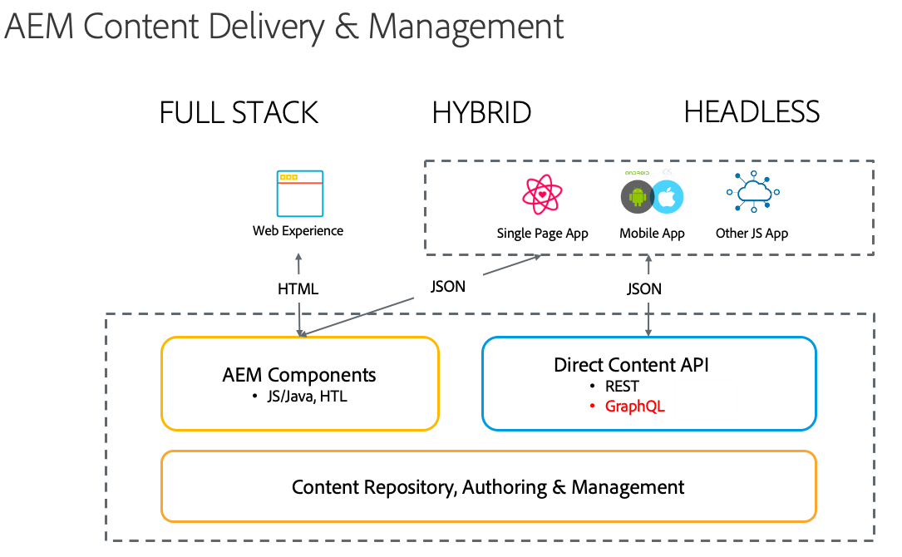

# Headless Development for AEM Sites as a Cloud Service {#headless-development}

Using powerful features like Content Models, Content Fragments, and the GraphQL API, AEM as a Cloud Service allows you to manage your experiences centrally and serve them across channels.

## Overview {#overview}

Headless implementation is increasingly becoming important for delivering experiences to your audience is, wherever they are and regardless of channel.

Headless implementation forgoes page and component management as is traditional in full stack and hybrid solutions and focuses on the creation of channel-neutral, reusable fragments of content and their cross-channel delivery. It is a modern and dynamic development pattern for implementing web experiences.

## Comparing Headful and Headless{#headful-headless}

This document focuses on the full headless implementation model of AEM. However headful versus headless need not be a binary choice in AEM. Headless features can be used to manage and deliver your content to a variety of endpoints while also enabling your content authors to edit single page applications. All in AEM.

>[!TIP]
>
>See the document [Headful and Headless in AEM](/help/implementing/developing/headful-headless.md) for more information.

## AEM as a Cloud Service and Headless {#aem-headless}

AEM as a Cloud Service is a flexible tool for the headless implementation model by offering three powerful services:

1. Content Models
   * Content Models are structured representation of content.
   * These are defined by information architects in the AEM Content Fragment Model editor.
   * Content Models serve as a basis for Content Fragments.
1. Content Fragments
   * Content Fragments are instantiations of content models.
   * These are created by content authors using the AEM Content Fragment editor.
   * They are stored in AEM Assets and managed in Assets Admin UI.
1. Content API for delivery
   * The AEM GraphQL API supports Content Fragment delivery.
   * The AEM Assets REST API supports Content Fragment CRUD operations.
   * Direct content delivery is also possible with the [Content Fragment Core Component's JSON export.](https://docs.adobe.com/content/help/en/experience-manager-core-components/using/components/content-fragment-component.html)

## Headless Getting Started Guides {#getting-started}  

The Headless Getting Started Guides lay out a simple path for for creating, managing, and delivering experiences using AEM as a Cloud Service in five steps. Each guide builds on the previous, so it is recommended to explore them thoroughly and in order.

1. [Creating a Configuration](getting-started/create-configuration.md)
1. [Creating a Content Fragment Model](getting-started/create-content-model.md)
1. [Creating an Assets Folder](getting-started/create-assets-folder.md)
1. [Creating a Content Fragment](getting-started/create-content-fragment.md)
1. [Accessing and Delivering Content Fragments](getting-started/create-api-request.md)

## Audience {#audience}

The tasks described in the [Headless Getting Started Guides](#getting-started) are necessary for a basic end-to-end demonstration of AEM's headless capabilities. Anyone with administrator access to a test AEM instance can follow these guides to understand headless delivery in AEM, though someone with developer experience is ideal.

However in a production situation, the tasks will be performed by different personas a varying number of times. For example:

* **Administrators** will need to set up the initial configuration and folder structure for the content normally only once or sporadically.
* **Information architects** generally will add new models as the needs of the organization evolve.
* **Content authors** will continually create new content as Content Fragments based on the models defined by the architects.

The Headless Getting Started Guides point out who would generally perform the tasks described and how frequently.

## Next Step {#next-step}

Ready to learn more? Then get started by reading the first part of the Headless Getting Started Guide: [Creating a Configuration.](getting-started/create-configuration.md)
