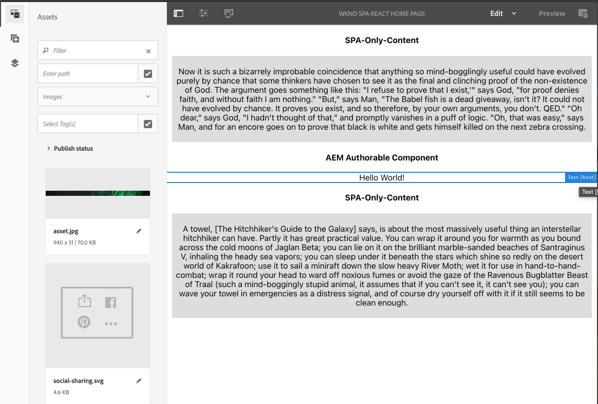
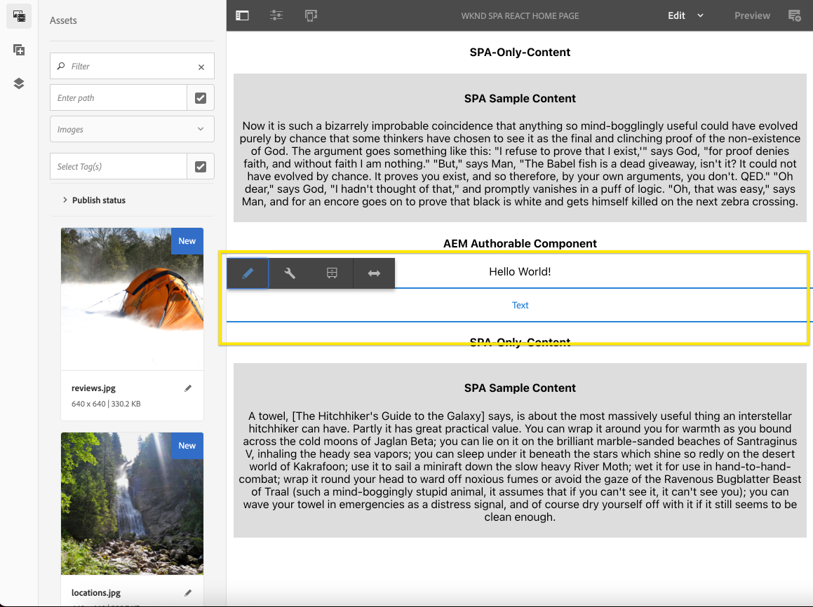
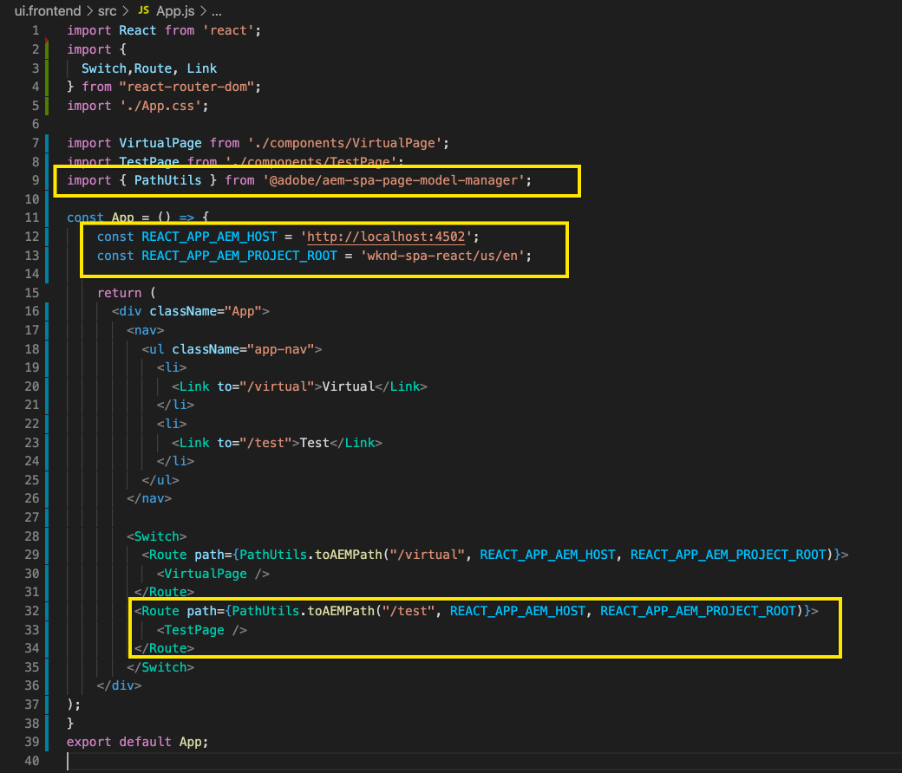

# Editing an External SPA within AEM {#editing-external-spa-within-aem}

When deciding [what level of integration](/help/implementing/developing/headful-headless.md) you would like to have between your external SPA and AEM, consider that you must be able to edit and view the SPA within AEM, often.

{{ue-over-spa}}

## Overview {#overview}

This document describes the recommended steps to upload a standalone SPA to an AEM instance, add editable sections of content, and enable authoring.

## Prerequisites {#prerequisites}

The prerequisites are simple.

* Ensure that an instance of AEM is running locally.
* Create a base AEM SPA project using [the AEM Project Archetype](https://experienceleague.adobe.com/docs/experience-manager-core-components/using/developing/archetype/overview.html?#available-properties).
  * Forms the basis of the AEM project which is updated to include the external SPA.
  * For the samples in this document, Adobe is using the starting point of [the WKND SPA project](https://experienceleague.adobe.com/docs/experience-manager-learn/sites/spa-editor/spa-editor-framework-feature-video-use.html#spa-editor).
* Have the working, external React SPA that you want to integrate at hand.

## Upload SPA to AEM Project {#upload-spa-to-aem-project}

First, you must upload the external SPA to your AEM project.

1. Replace `src` in the `/ui.frontend` project folder with your React application's `src` folder.
1. Include any additional dependencies in the app's `package.json` in the `/ui.frontend/package.json` file.
   * Ensure that the SPA SDK dependencies are of [recommended versions](/help/implementing/developing/hybrid/getting-started-react.md#dependencies).
1. Include any customizations in the `/public` folder.
1. Include any inline scripts or styles added in the `/public/index.html` file.

## Configure the Remote SPA {#configure-remote-spa}

Now that the external SPA is part of your AEM project, it must be configured within AEM.

### Include Adobe SPA SDK Packages {#include-spa-sdk-packages}

To take advantage of AEM SPA features, there are dependencies on the following three packages.

* [`@adobe/aem-react-editable-components`](https://github.com/adobe/aem-react-editable-components)
* [`@adobe/aem-spa-component-mapping`](https://www.npmjs.com/package/@adobe/aem-spa-component-mapping)
* [`@adobe/aem-spa-page-model-manager`](https://www.npmjs.com/login?next=/package/@adobe/aem-spa-model-manager)

The `@adobe/aem-spa-page-model-manager` package provides the API for initializing a Model Manager and retrieving the model from the AEM instance. This model can then be used to render AEM components using APIs from `@adobe/aem-react-editable-components` and `@adobe/aem-spa-component-mapping`.

#### Installation {#installation}

Run the following `npm` command so you can install the required packages.

```shell
npm install --save @adobe/aem-spa-component-mapping @adobe/aem-spa-page-model-manager @adobe/aem-react-editable-components
```

### ModelManager Initialization {#model-manager-initialization}

Before the app renders, the [`ModelManager`](/help/implementing/developing/hybrid/blueprint.md#pagemodelmanager) must be initialized to handle the creation of the AEM `ModelStore`.

This initialization must be done within the `src/index.js` file of your application or wherever the root of the application is rendered.

To do this initialization, you can use `initializationAsync` API provided by the `ModelManager`.

The following screenshot shows how to enable initialization of the `ModelManager` in a simple React application. The only constraint is that `initializationAsync` must be called before `ReactDOM.render()`.


In this example, the `ModelManager` is initialized and an empty `ModelStore` is created.

The `initializationAsync` can optionally accept an `options` object as a parameter:

* `path` - On initialization, the model at the defined path is fetched and stored in the `ModelStore`. This path can be used to fetch the `rootModel` at initialization, if needed.
* `modelClient` - Allows providing a custom client responsible for fetching the model.
* `model` - A `model` object passed as a parameter typically populated when using SSR.

### AEM Authorable Leaf Components {#authorable-leaf-components}

1. Create/identify an AEM component for which an authorable React component is created. In this example, it is using the WKND project's text component.

   

1. Create a simple React text component in the SPA. In this example, a new file `Text.js` has been created with the following content.

   

1. Create a configuration object so you can specify the attributes required for enabling AEM editing.

   

   * `resourceType` is mandatory to map the React component to the AEM component and enable editing when opening in the AEM Editor.

1. Use the wrapper function `withMappable`.

   

   This wrapper function maps the React component to the AEM `resourceType` specified in the config and enables editing capabilities when opened in the AEM Editor. For standalone components, it also fetches the model content for the specific node.

   >[!NOTE]
   >
   >In this example, there are separate versions of the component: AEM wrapped and unwrapped React components. The wrapped version must be used when explicitly using the component. When the component is part of a page, you can continue using the default component as currently done in the SPA editor.

1. Render content in the component.

   The JCR properties of the text component appear as follows in AEM.

   

   These values are passed as properties to the created `AEMText` React component and can be used to render the content.

   ```javascript
   import React from 'react';
   import { withMappable } from '@adobe/aem-react-editable-components';

   export const TextEditConfig = {
       // Empty component placeholder label
       emptyLabel:'Text', 
       isEmpty:function(props) {
          return !props || !props.text || props.text.trim().length < 1;
       },
       // resourcetype of the AEM counterpart component
       resourceType:'wknd-spa-react/components/text'
   };

   const Text = ({ text }) => (<div>{text}</div>);

   export default Text;

   export const AEMText = withMappable(Text, TextEditConfig);
   ```

   The following is how the component appears when the AEM configurations are complete.

   ```javascript
   const Text = ({ cqPath, richText, text }) => {
      const richTextContent = () => (
         <div className="aem_text" id={cqPath.substr(cqPath.lastIndexOf('/') + 1)} data-rte-editelement dangerouslySetInnerHTML={{__html: text}}/>
      );
      return richText ? richTextContent() : (<div className="aem_text">{text}</div>);
   };
   ```

   >[!NOTE]
   >
   >In this example, further customizations were made to the rendered component to match the existing text component. It is not related to authoring in AEM.

#### Add Authorable Components to the Page {#add-authorable-component-to-page}

After the authorable React components are created, you can use them throughout the application.

Let's take an example page where you must add a text from the WKND SPA project. For this example, you want to display the text "Hello World!" on `/content/wknd-spa-react/us/en/home.html`.

1. Determine the path of the node to be displayed.

   * `pagePath`: The page which contains the node, in this example `/content/wknd-spa-react/us/en/home`
   * `itemPath`: Path to the node within the page, in this example `root/responsivegrid/text`
     * Consists of the names of the containing items on the page.

   

1. Add component at required position in the page.

   

   The `AEMText` component can be added at the required position within the page with `pagePath` and `itemPath` values set as properties. `pagePath` is a mandatory property.

#### Verify Editing of Text Content on AEM {#verify-text-edit}

Now test the component on the running AEM instance.

1. Run the following Maven command from the `aem-guides-wknd-spa` directory so you can build and deploy the project to AEM.

```shell
mvn clean install -PautoInstallSinglePackage
```

1. On your AEM instance, navigate to `http://<host>:<port>/editor.html/content/wknd-spa-react/us/en/home.html`.



The `AEMText` component is now authorable on AEM.

### AEM Authorable Pages {#aem-authorable-pages}

1. Identify a page to be added for authoring in the SPA. This example uses `/content/wknd-spa-react/us/en/home.html`.
1. Create a file (for example, `Page.js`) for the authorable Page Component. use the Page Component that is provided in `@adobe/cq-react-editable-components`.
1. Repeat step four in the section [AEM authorable leaf components](#authorable-leaf-components). Use the wrapper function `withMappable` on the component.
1. As was done previously, apply `MapTo` to the AEM resource types for all the child components within the page.

   ```javascript
   import { Page, MapTo, withMappable } from '@adobe/aem-react-editable-components';
   import Text, { TextEditConfig } from './Text';

   export default withMappable(Page);

   MapTo('wknd-spa-react/components/text')(Text, TextEditConfig);
   ```

   >[!NOTE]
   >
   >In this example, the unwrapped React text component is used instead of the wrapped `AEMText` created previously. The reason is because when the component is part of a page/container and not stand alone, the container takes care of recursively mapping the component. And, enabling authoring capabilities and the additional wrapper is not needed for each child.

1. To add an authorable page in the SPA, follow the same steps in the section [Add Authorable Components to the Page](#add-authorable-component-to-page). Here, you can skip the `itemPath` property.

#### Verify Page Content on AEM {#verify-page-content}

To verify that the page can be edited, follow the same steps in the section [Verify Editing of Text Content on AEM](#verify-text-edit).


The page is now editable on AEM with a layout container and child Text Component.

### Virtual Leaf Components {#virtual-leaf-components}

In the previous examples, you added components to the SPA with existing AEM content. However, there are cases where content has not yet been created in AEM, but must be added later by the content author. To accommodate this scenario, the front-end developer can add components in the appropriate locations within the SPA. These components display placeholders when opened in the editor in AEM. After the content is added within these placeholders by the content author, nodes are created in the JCR structure and content is persisted. The created component allows the same set of operations as the stand-alone leaf components.

In this example, you are reusing the `AEMText` component created previously. You want new text to be added below the existing text component on the WKND home page. The addition of components is the same as for normal leaf components. However, the `itemPath` can be updated to the path where the new component must be added.

Because the new component must be added below the existing text at `root/responsivegrid/text`, the new path is `root/responsivegrid/{itemName}`.

```html
<AEMText
 pagePath='/content/wknd-spa-react/us/en/home'
 itemPath='root/responsivegrid/text_20' />
```

The `TestPage` component looks like the following after adding the virtual component.


>[!NOTE]
>
>Ensure the `AEMText` component has its `resourceType` set in the configuration so you can enable this feature.

You can now deploy the changes to AEM following the steps in the section [Verify Editing of Text Content on AEM](#verify-text-edit). A placeholder is displayed for the currently non-existing `text_20` node.



When the content author updates this component, a new `text_20` node is created at `root/responsivegrid/text_20` in `/content/wknd-spa-react/us/en/home`.


#### Requirements and Limitations {#limitations}

There are several requirements to add virtual leaf components and some limitations.

* The `pagePath` property is mandatory for creating a virtual component.
* The page node provided at the path in `pagePath` must exist in the AEM project.
* The name of the node to be created must be provided in the `itemPath`.
* The component can be created at any level.
  * If you provide an `itemPath='text_20'` in the previous example, the new node is created directly under the page, that is, `/content/wknd-spa-react/us/en/home/jcr:content/text_20`
* The path to the node where a new node is created must be valid when provided via `itemPath`.
  * In this example, `root/responsivegrid` must exist so that the new node `text_20` can be created there.
* Only leaf component creation is supported. Virtual container and page will be supported in future versions.

### Virtual Containers {#virtual-containers}

The ability to add containers, even if the corresponding container is not yet created in AEM, is supported. The concept and approach is similar to [virtual leaf components](#virtual-leaf-components).

The front-end developer can add the container components in appropriate locations within the SPA and these components display placeholders when opened in the editor in AEM. The author can then add components and their content to the container which creates the required nodes in the JCR structure.

For example, if a container exists at `/root/responsivegrid`, and the developer wants to add a child container:


The `newContainer` does not yet exist in the AEM.

When editing the page containing this component in AEM, an empty placeholder for a container is displayed into which the author can add content.


Once the author adds a child component to the container, the new container node is created with the corresponding name in the JCR structure.


More components and content can be added to the container now as the author requires and the changes are persisted.

#### Requirements and Limitations {#container-limitations}

There are several requirements to add virtual containers and some limitations.

* The policy for determining which components can be added are inherited from the parent container.
* The immediate parent of the container to be created must exist in AEM.
  * If the container `root/responsivegrid` exists in the AEM container, then a new container can be created by providing the path `root/responsivegrid/newContainer`.
  * However `root/responsivegrid/newContainer/secondNewContainer` is not possible.
* Only one new level of component can be created at a time.

## Additional Customizations {#additional-customizations}

If you followed the previous examples, your external SPA is now editable within AEM. However there are additional aspects of your external SPA that you can further customize.

### Root Node ID {#root-node-id}

By default, you can assume that the React application is rendered inside a `div` of element ID `spa-root`. If necessary, this syntax can be customized.

For example, assume you have a SPA in which the application is rendered inside a `div` of element ID `root`. This syntax must be reflected across three files.

1. In the `index.js` of the React application (or where `ReactDOM.render()` is called)

   

1. In the `index.html` of the React application

   

1. In the AEM app's page component body via two steps:

   1. Create a `body.html` for the page component.

     

   1. Add the root element in the new `body.html` file.

     

### Editing a React SPA with Routing {#editing-react-spa-with-routing}

If the external React SPA application has multiple pages, [it can use routing to determine the page/component to render](/help/implementing/developing/hybrid/routing.md). The basic use case is to match the currently active URL against the path provided for a route. To enable editing on such routing enabled applications, the path to be matched against must be transformed to accommodate AEM-specific info.

In the following example, you have a simple React application with two pages. The page to be rendered is determined by matching the path provided to the router against the active URL. For example, if you are on `mydomain.com/test`, `TestPage` is rendered.


To enable editing within AEM for this example SPA, the following steps are required.

1. Identify the level which would act as the root on AEM.

   * For your sample, consider wknd-spa-react/us/en as the root of the SPA. This root means that everything before that path is AEM only pages/content.

1. Create a page at the required level.

   * In this example, the page to be edited is `mydomain.com/test`. `test` is in the root path of the app. This root path must be preserved when creating the page in AEM as well. Therefore, you can create a page at the root level defined in the previous step.
   * The new page created must have the same name as the page to be edited. In this example, for `mydomain.com/test`, the new page created must be `/path/to/aem/root/test`.

1. Add helpers within SPA routing.

   * The created page cannot yet render the expected content in AEM. The reason is because the router expects a path of `/test` whereas the AEM active path is `/wknd-spa-react/us/en/test`. To accommodate the AEM-specific portion of the URL, you must add some helpers on the SPA side.

   

   * The `toAEMPath` helper provided by `@adobe/cq-spa-page-model-manager` can be used. It transforms the path provided for routing to include AEM-specific portions when the application is open on an AEM instance. It accepts three parameters:
     * The path required for routing
     * The origin URL of the AEM instance where the SPA is edited
     * The project root on AEM as determined in the first step

   * These values can be set as environment variables for more flexibility.

1. Verify editing the page in AEM.

   * Deploy the project to AEM and navigate to the created `test` page. The page content is now rendered and AEM components are editable.

## Framework Limitations {#framework-limitations}

The RemotePage component expects that the implementation provides an asset-manifest like the [webpack-manifest-plugin on GitHub](https://github.com/shellscape/webpack-manifest-plugin). The RemotePage component, however, has only been tested to work with the React framework (and Next.js via the remote-page-next component), and therefore does not support remotely loading applications from other frameworks, such as Angular.

## Additional Resources {#additional-resources}

The following reference material may be helpful to understand SPAs in the context of AEM.

* [Headful and Headless in AEM](/help/implementing/developing/headful-headless.md)
* [The AEM Project Archetype](https://experienceleague.adobe.com/docs/experience-manager-core-components/using/developing/archetype/overview.html)
* [The WKND SPA project](https://experienceleague.adobe.com/docs/experience-manager-learn/sites/spa-editor/spa-editor-framework-feature-video-use.html)
* [Getting Started with SPAs in AEM Using React](/help/implementing/developing/hybrid/getting-started-react.md)
* [SPA Reference Materials (API references)](/help/implementing/developing/hybrid/reference-materials.md)
* [SPA Blueprint and PageModelManager](/help/implementing/developing/hybrid/blueprint.md#pagemodelmanager)
* [SPA Model Routing](/help/implementing/developing/hybrid/routing.md)
