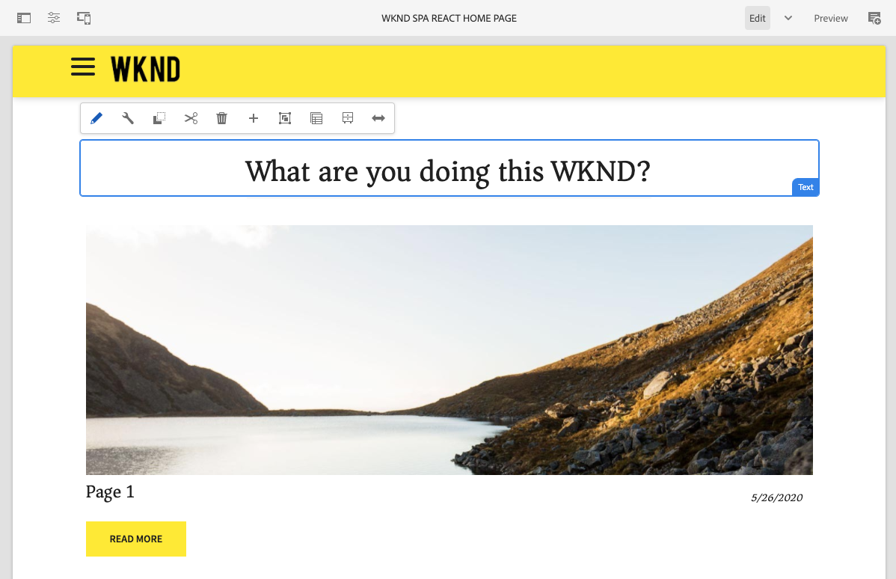

# WKND SPA Project {#wknd-spa-project}

{{ue-over-spa}}

Immerse yourself in SPA development with this multi-part tutorial leading you through project setup, component mapping, front-end development tools, and application routing to implement your own SPA.

Similar to the AEM WKND Tutorial, this SPA-focused counterpart offers an end-to-end example of building your own single-page application that is editable with AEM starting with project setup through application routing.

* [Create your first Angular SPA in AEM](https://experienceleague.adobe.com/docs/experience-manager-learn/getting-started-with-aem-headless/spa-editor/angular/overview.html)
* [Create your first React SPA in AEM](https://experienceleague.adobe.com/docs/experience-manager-learn/getting-started-with-aem-headless/spa-editor/react/overview.html)

Before you begin your own SPA project for AEM however, you may also want to review the [Developing SPAs for AEM](developing.md) document.
