# AEM as a Cloud Service Developer Console {#developer-console}

The AEM as a Cloud Service Developer Console includes a set of read-only tools for debugging cloud environments. It can be accessed through a per-environment link in Cloud Manager and offers features to view bundles, OSGi settings, services and servlets, and more.

>[!NOTE]
>
>* The AEM Developer Console (Cloud Service) should not be confused with the similarly named [*Adobe Developer Console*.](https://developer.adobe.com/developer-console/)

>[!TIP]
>
>The Developer Console is read-only. If you are working on local development using the SDK and need to modify OSGi settings or repository content, you can use:
>
>* [CRXDE Lite](/help/implementing/developing/tools/crxde.md)
>* [The Web Console](/help/implementing/developing/tools/web-console.md)


## AEM Developer Console access

To access and use the AEM Developer Console the following permissions must be given to the developer's Adobe ID via [Adobe's Admin Console](https://adminconsole.adobe.com).

1. Ensure the in the Adobe Org switcher, you can see the Adobe Org related to the environments you want to inspect in the AEM Developer Console.
1. To be able to login in to the AEM Developer Console, the developer must be a member of any of the following roles:
    + [Cloud Manager Product's __Developer - Cloud Service__ Product Profile](https://experienceleague.adobe.com/docs/experience-manager-cloud-service/content/onboarding/journey/assign-profiles-cloud-manager.html#assign-developer): In this case, the developer will see the full list of environments available under the selected AEM Developer Console URL; if a Development environment or RDE had been selected in Cloud Manager, other Development environment or RDEs in that same Program may appear.
    + [__AEM Administrators__ Product Profile on __AEM Author__](https://experienceleague.adobe.com/docs/experience-manager-cloud-service/content/onboarding/journey/assign-profiles-aem.html#aem-product-profiles): In this case, the list of environments described in the previous bullet  will be limited to the related product profiles where this role is assigned.
1. The developer must be a member of the [__AEM Users__ or __AEM Administrators__ Product Profile on AEM Author and/or Publish](https://experienceleague.adobe.com/docs/experience-manager-cloud-service/content/onboarding/journey/assign-profiles-aem.html#aem-product-profiles).
    + If this membership does not exist, the [status](#status) dumps will timeout with a 401 Unauthorized error.

>[!NOTE]
>Sometimes it can take up to 30 minutes for the Adobe IMS Product Profile membership to sync into AEM as a Cloud Service. If you are unable to access the AEM Developer Console, please wait 30 minutes and try again.
>Please clear your browser's cookies as well as application state (local storage) and re-log into AEM Developer Console

### Troubleshooting AEM Developer Console access

#### When I login I do not see listed the environment I'm looking for

Ensure the following:

+ You have selected the correct AEM Developer Console URL by clicking on the three dots for the selected environment via Cloud Manager and select AEM Developer Console.
+ You either have [Cloud Manager Product's __Developer - Cloud Service__ Product Profile](https://experienceleague.adobe.com/docs/experience-manager-cloud-service/content/onboarding/journey/assign-profiles-cloud-manager.html#assign-developer) to see the full list of environments or you are part of the [__AEM Administrators__ Product Profile on __AEM Author__](https://experienceleague.adobe.com/docs/experience-manager-cloud-service/content/onboarding/journey/assign-profiles-aem.html#aem-product-profiles) for the environment you do not find.

#### 401 Unauthorized error when dumping status

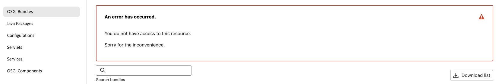

To resolve the unauthorized issue:

1. Ensure your user is a member of the appropriate Adobe IMS Product Profile (AEM Administrators or AEM Users) for the AEM Developer Console's associated AEM as a Cloud Service Product instance.
   + Remember that AEM Developer Console access 2 Adobe IMS Product Instances; the AEM as a Cloud Service Author and Publish product instances, so ensure the correct Product Profiles are used depending on which service tier requires access via AEM Developer Console.
1. Wait up to 30 minutes for the Adobe IMS Product Profile membership to sync into AEM as a Cloud Service.
1. Log in to the AEM as a Cloud Service (Author or Publish) and ensure your user and groups have properly synced into AEM.
   + AEM Developer Console requires your user record to be created in the corresponding AEM service tier for it to authenticate to that service tier.
1. Clear your browsers cookies as well as application state (local storage) and re-log into AEM Developer Console, ensuring the access token AEM Developer Console is using is correct and unexpired.

### IP restrictions {#ip-restrictions}

Access to the Developer Console depends on your ability to reach the author instance. If your organization has configured an IP allowlist on the author service in Cloud Manager, you must connect from an IP address within that allowed range.

For example, if the author instance is restricted to your corporate VPN, you can only use the Developer Console while connected to that VPN.

## Navigate to Developer Console

Developer Console is accessed per AEM as a Cloud Service environment via Cloud Manager.

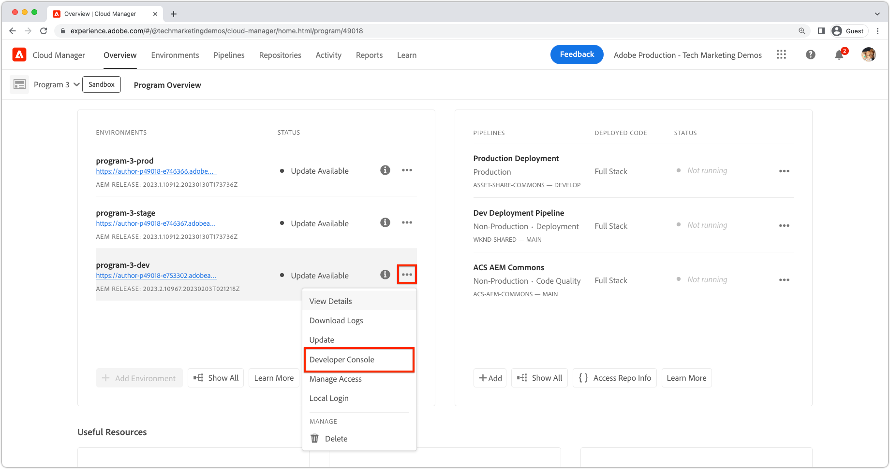

1. Navigate to __[Cloud Manager](https://my.cloudmanager.adobe.com/)__
2. Open the __Program__ that contains the AEM as a Cloud Service environment to open Developer Console.
3. Locate the __Environment__, and select the `...`.
4. Select __Developer Console__ from the dropdown list.

Or open this URL to sign in: [https://experience.adobe.com/skyline-console](https://experience.adobe.com/skyline-console)

Or use this command from the Cloud manager CLI:

```
aio cloudmanager:open-developer-console <ENVIRONMENTID> --programId <PROGRAMID>
```

## Environment / program selector

In order to use the AEM Developer Console, you must select the environment and program you want to inspect.
The selectors are located in the top left and right corner of the AEM Developer Console UI.
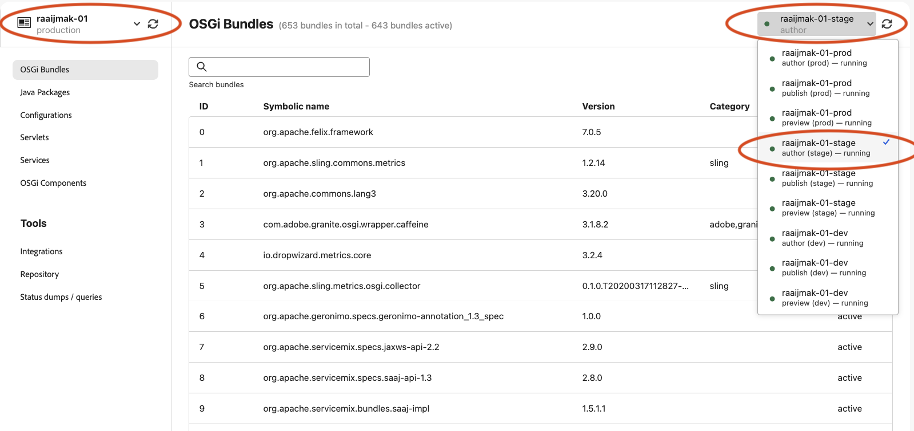

Selecting an environment will trigger a refresh of the data in the AEM Developer Console, and you will see the data for the selected environment.
When going to the repository browser, the selected environment will be used to open the repository browser in a new tab.

The refresh buttons next to the selectors trigger a browser cache clear for the programs / environment calls to cloud manager.
You may use this if a new environment has been created and you do not see it in the list of environments.
It still might take a few minutes for the new environment to be available in the AEM Developer Console.

The status lights indicate the health of the environment.
1. Red: Indicates that the environment is not healthy and unavailable (possibly hibernated).
2. Orange: the environment might be restarting or degraded (some of the pods are temporarily down, but there are still healthy pods available).
3. Green: Running, all pods are up and healthy

Once you selected an environment, you can use the tabs to navigate to the different views of the AEM Developer Console.

>[!NOTE]
>Please note, unlike the old AEM Developer console, we do not expose individual pod status anymore.
>You can see the status of each tier of the environment.
>
>
## OSGi Bundles

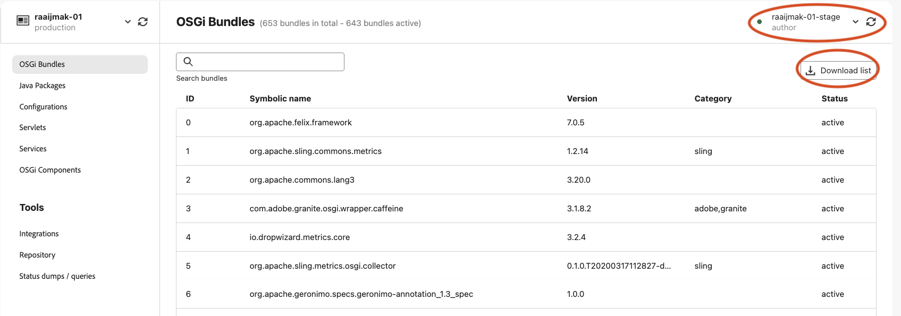

* An overview of OSGI bundles that are deployed in the selected environment type. It enables a full-text search.
* It is useful to get information of the actual state of bundles in the environment. You can get information such as exported packages, imported packages, used services and more.
* Developers want to verify on the actual environment, and check if the bundle does what they expect it to do.
* **Example use-case:** A version range of a dependency is specified in your bundle. Something is going wrong in the dependency. You want to check which version of the dependency is being wired into your bundle. To check, go to the bundle details, and use importing bundles / packages to check which bundle version or package version is being used at runtime. With this information, you can adjust your maven dependency version range or adapt your code.

To search, use the search bar. To download the list of bundles as json, click the Download list button on the top right to get a full JSON dump.
If you want to get the publish or preview dump, you can use the environment selector to select the publish or preview environment and then download the list.

## Java Packages

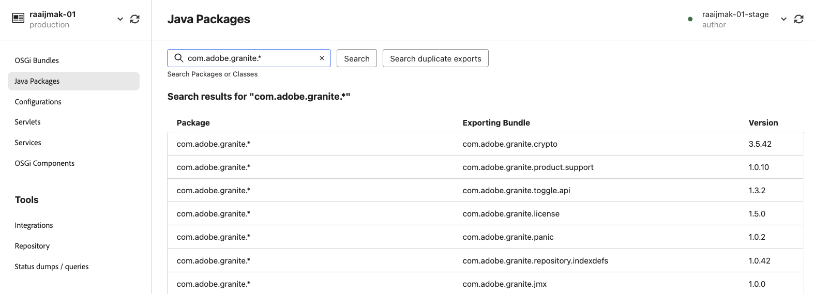

Java Packages is used to trouble shoot Bundles not be starting because of unresolved imports, or unresolved classes in scripts (HTL, JSP, etc). If Java Packages reports no bundles export a Java package (or the version does not match that imported by an OSGi bundle):

+ Ensure your project's AEM API maven dependency's version matches the environment's AEM Release version (and if possible, update everything to the latest).
+ If extra Maven dependencies are used in the Maven project
   + Determine if an alternative API provided by the AEM SDK API dependency can be used instead.
   + If the extra dependency is required, ensure it's provide as an OSGi bundle (rather than a plain Jar) and it is embedded in your project's code package, (`ui.apps`), similar to how the core OSGi Bundle is embedded in the `ui.apps` package.

Clicking on a package results into going to a package detail:

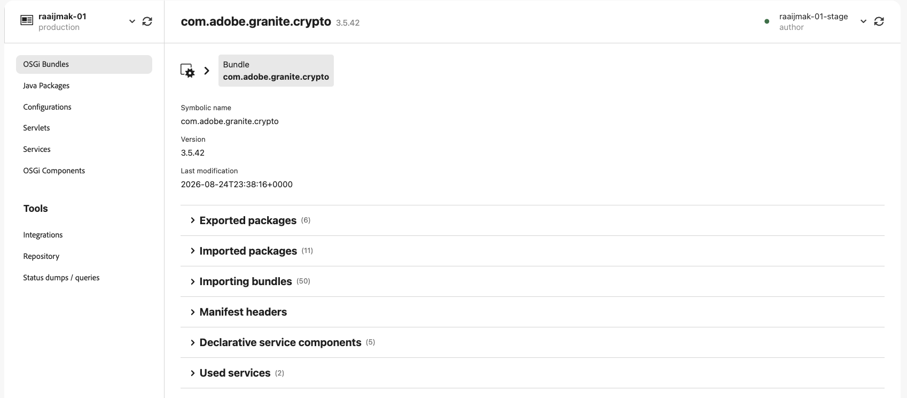

## Configurations {#configurations}

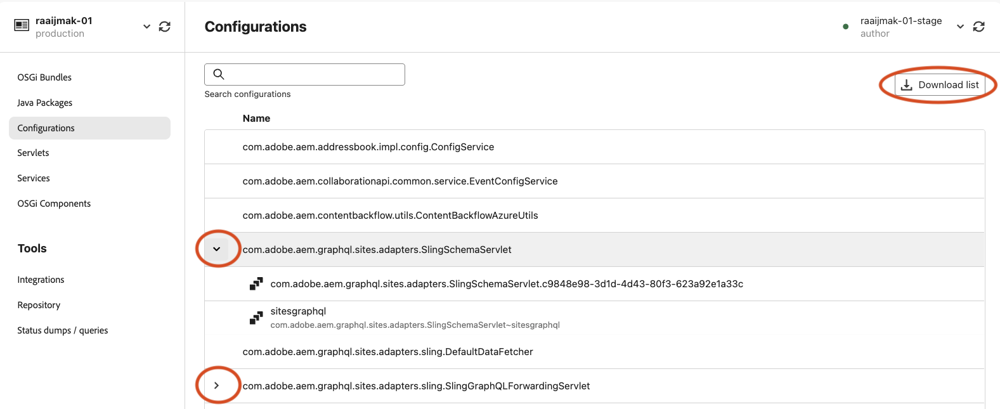

* A searchable list of configurations that are active in the environment. You can see which properties are provided by the configurations by checking out the details page.
* **Example use case:** A developer wants to make sure that the configurations they specified are actually present in the environment. If the configuration is lacking, they can check the feature model or the configuration run mode or folder.

For more information about setting up user permissions, see [Cloud Manager Documentation](https://experienceleague.adobe.com/en/docs/experience-manager-cloud-manager/content/requirements/users-and-roles).

## Servlets {#servlets}

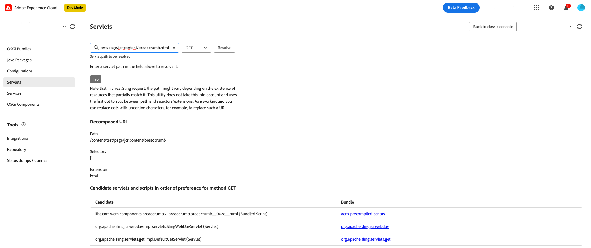

* A search prompt on which you can specify a path with selectors and an extension with either GET or POST. It then provides the results of servlets in order of preference which handles the request in Sling.
* **Example use case:** You have an OSGI servlet that should activate upon a request and print output to the response. However, instead of the expected output, the response returns empty. You need to check if some other servlet is taking precedence over your servlet due to more specific selectors, `resourceType`, extensions or ranking. You search for the expected path, and find out another servlet is active with a higher rank. Then, you decide if you can get your servlet above in rank by adding selectors, for example.

## Services {#services}

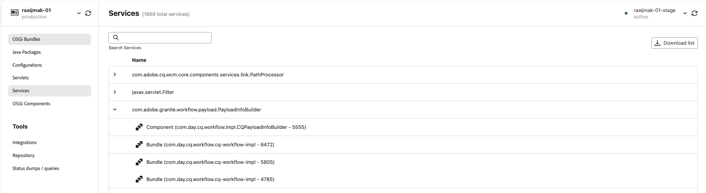

Components lists all the OSGi services. 

OSGi Services help in debugging by:

+ Listing all OSGi services in AEM, along with its providing OSGi bundle, and all OSGi bundles that consume it

## OSGi Components {#osgi-components}

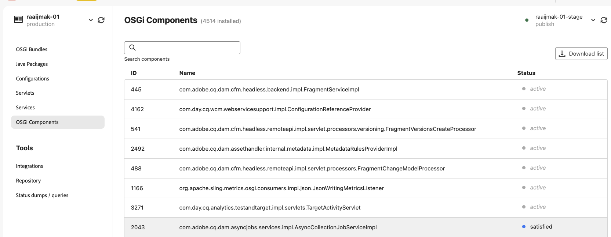

Components help in debugging by:

+ Listing all OSGi components deployed to AEM as a Cloud Service
+ Providing each OSGi component's state; including if they are active or unsatisfied
+ Providing details into unsatisfied service references may cause OSGi components from becoming active
+ Listing OSGi properties and their values bound to the OSGi component.
   + This will display actual values injected via [OSGi environment configuration variables](https://experienceleague.adobe.com/docs/experience-manager-cloud-service/content/implementing/deploying/configuring-osgi.html#environment-specific-configuration-values).

## Integrations {#integrations}

* System Admins have the capability to generate, rename, and delete, service-credentials and developer tokens.
* More information about this can be found here: [Generating Access Tokens for Server-Side APIs](./generating-access-tokens-for-server-side-apis.md).

## Repository {#repository}

* Opens the [Repository browser](/help/implementing/developing/tools/repository-browser.md).
* Notice: You will need to be able to login on the AEM service to access the repository browser. If you are not able to login, please contact your system administrator to get access.
* You need access granted on the tier you are trying to access. For example, if you are trying to access the repository browser on the publish tier, you need to have access (AEM Administrator or AEM User) granted on the publish tier.

## Status Dumps / Queries {#status-dumps-queries}

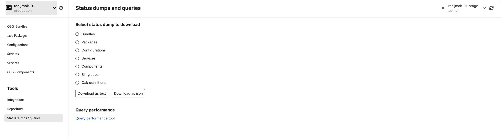

* A full text or JSON dump of the current state of bundles, packages, configurations, services, components, sling jobs or Oak definitions.
* Useful especially if the developer has discovered some unexpected state, and wants to communicate or document this state for other developers. Downloading the dump gives you a snapshot of the state for later reference.

### Sling Jobs

Sling Jobs lists all the Sling Jobs queues.

Sling Jobs help in debugging by:

+ Listing of Sling Job queues and their configurations
+ Providing insights into the number of active, queued and processed Sling jobs, which is helpful for debugging issues with Workflow, Transient Workflow and other work performed by Sling Jobs in AEM.

### Oak definitions

Oak Indexes provide a dump of the nodes defined beneath `/oak:index`. Keep in mind this does not show merged indexes, which occurs when an AEM index is modified.

Oak Indexes help in debugging by:

+ Listing all Oak Index definitions providing insights into how search queries are executed in AEM. Keep in mind, that modified to AEM indexes are not reflected here. This view is only helpful for indexes that are solely provided by AEM, or solely provided by the custom code.

### Query performance tool

* Queries help provide insights into what and how search queries are executed on AEM.
* Queries only works when a specific pod is selected, as it opens that pod's Query Performance web console, requiring the developer to have access to log into the AEM service.

Queries helps in debugging by:

+ Explaining how queries are interpreted, analyzed and executed by Oak. This is very important when tracking why a query is slow, and understanding how it can be sped up.
+ Listing the most popular queries running in AEM, with the ability to Explain them.
+ Listing the slowest queries running in AEM, with the ability to Explain them.

More documentation can be found [here](https://experienceleague.adobe.com/en/docs/experience-manager-cloud-service/content/operations/query-and-indexing-best-practices#query-performance-tool).
