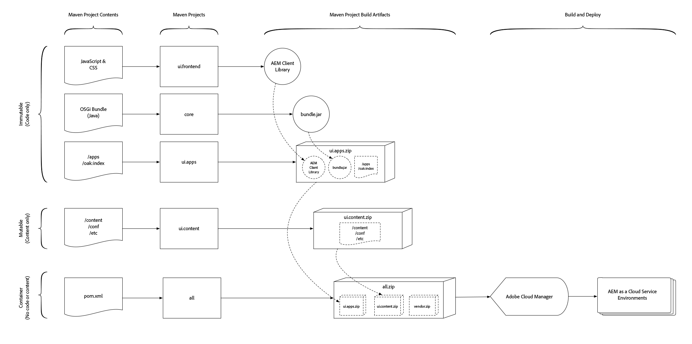
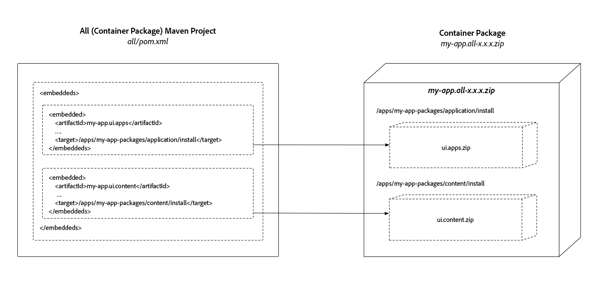

# AEM Project Structure

>[!TIP]
>
>Familiarize yourself with basic [AEM Project Archetype use](https://docs.adobe.com/content/help/en/experience-manager-core-components/using/developing/archetype/overview.html), and the [FileVault Content Maven Plug-in](https://helpx.adobe.com/experience-manager/6-5/sites/developing/using/vlt-mavenplugin.html) as this article builds upon these learnings and concepts.

This article outlines the changes required to Adobe Experience Manager Maven projects to be AEM as a Cloud Service compatible by ensuring that they respect the split of mutable and immutable content, dependencies are established to create non-conflicting, deterministic deployments and that they are packaged in a deployable structure.

AEM application deployments must be comprised of a single AEM package. This package should in turn contain sub-packages that comprise everything required by the application to function, including code, configuration and any supporting baseline content.

AEM requires a separation of **content** and **code**, which means a single content package **cannot** deploy to **both** `/apps` and runtime-writable areas (e.g. `/content`, `/conf`, `/home`, or anything not `/apps`) of the repository. Instead, the application must separate code and content into discrete packages for deployment into AEM.

The package structure outlined in this document is compatible with **both** local development deployments and AEM Cloud Service deployments.

>[!TIP]
>
>The configurations outlined in this document are provided by [AEM Project Maven Archetype 24 or later](https://github.com/adobe/aem-project-archetype/releases).

## Mutable vs. Immutable Areas of the Repository {#mutable-vs-immutable}

`/apps` and `/libs` are considered **immutable** areas of AEM as they cannot be changed (create, update, delete) after AEM starts (i.e. at runtime). Any attempt to change an immutable area at runtime will fail.

Everything else in the repository, `/content`, `/conf`, `/var`, `/etc`, `/oak:index`, `/system`, `/tmp`, etc. are all **mutable** areas, meaning they can be changed at runtime.

>[!WARNING]
>
>As in previous versions of AEM, `/libs` should not be modified. Only AEM product code may deploy to `/libs`.

### Oak Indexes {#oak-indexes}

Oak indexes (`/oak:index`) are specifically managed by the AEM as a Cloud Service deployment process. This is because the Cloud Manager must wait until any new index is deployed and fully re-indexed before switching over to the new code image.

For this reason, although Oak indexes are mutable at run time, they must be deployed as code so that they can be installed before any mutable packages are installed. Therefore `/oak:index` configurations are part of the Code Package and not part of the Content Package [as described below](#recommended-package-structure).

>[!TIP]
>
>For further details about indexing in AEM as a Cloud Service, please see the document [Content Search and Indexing](/help/operations/indexing.md).

## Recommended Package Structure {#recommended-package-structure}



This diagram provides an overview of the recommended project structure and package deployment artifacts.

The recommended application deployment structure is as follows:

### Code Packages / OSGi Bundles

+ The OSGi bundle Jar file is generated, and directly embedded in the all project.

+ The `ui.apps` package contains all the code to be deployed and only deploys to `/apps`. Common elements of the `ui.apps` package include, but are not limited to:
  + [Component definitions and HTL](https://docs.adobe.com/content/help/en/experience-manager-htl/using/overview.html) scripts
    + `/apps/my-app/components`
  + JavaScript and CSS (via [Client Libraries](/help/implementing/developing/introduction/clientlibs.md))
    + `/apps/my-app/clientlibs`
  + [Overlays](/help/implementing/developing/introduction/overlays.md) of `/libs`
    + `/apps/cq`, `/apps/dam/`, etc.
  + Fallback context-aware configurations
    + `/apps/settings`
  + ACLs (permissions)
    + Any `rep:policy` for any path under `/apps`
 
+ The `ui.config` package, contains all [OSGi configurations](/help/implementing/deploying/configuring-osgi.md):
    + Organizational folder containing run mode specific OSGi config definitions
        + `/apps/my-app/osgiconfig`
    + Common OSGi configuration folder containing default OSGi configurations that apply to all target AEM as a Cloud Service deployment targets
        + `/apps/my-app/osgiconfig/config` 
    + Run mode-specific OSGi configuration folders that contains default OSGi configurations that apply to all target AEM as a Cloud Service deployment targets
        + `/apps/my-app/osgiconfig/config.<author|publish>.<dev|stage|prod>` 
    + Repo Init OSGi configuration scripts
        + [Repo Init](#repo-init) is the recommended way to deploy (mutable) content that is logically part of the AEM application. The Repo Init OSGi configurations should be places in the appropriate `config.<runmode>` folder as outlined above, and be used to define:
            + Baseline content structures
            + Users   
            + Service Users
            + Groups
            + ACLs (permissions)


### Content Packages

+ The `ui.content` package contains all content and configuration. The Content Package, contains all the node definitions not in the `ui.apps` or `ui.config` packages, or in other words, anything not in `/apps` or `/oak:index`. Common elements of the `ui.content` package include, but are not limited to:
  + Context-aware configurations
    + `/conf`
  + Required, complex content structures (ie. Content build-out that is builds on and extends past Baseline content structures defined in Repo Init.)
    + `/content`, `/content/dam`, etc.
  + Governed tagging taxonomies
    + `/content/cq:tags`
  + Legacy etc nodes (Ideally, migrate these to non-/etc locations)
    + `/etc`

### Container Packages

+ The `all` package is a container package that ONLY includes deployable artifacts, the OSGI bundle Jar file, `ui.apps`, `ui.config` and `ui.content` packages as embeds. The `all` package must not have **any content or code** of its own, but rather delegate all deployment to the repository to its sub-packages or OSGi bundle Jar files.

  Packages are now included using the Maven [FileVault Package Maven plugin's embeddeds configuration](#embeddeds), rather than the `<subPackages>` configuration.

  For complex Experience Manager deployments, it may be desirable to create multiple `ui.apps`, `ui.config` and `ui.content` projects/packages that represent specific sites or tenants in AEM. If this is done, ensure the split between mutable and immutable content is respected, and the required content packages and OSGi bundle Jar files are embedded as sub-packages in the `all` container content package. 

  For example, a complex deployment content package structure might look like this:

  + `all` content package embeds the following packages, to create a singular deployment artifact
    + `common.ui.apps` deploys code required by **both** site A and site B
    + `site-a.core` OSGi bundle Jar required by site A
    + `site-a.ui.apps` deploys code required by site A
    + `site-a.ui.config` deploys OSGi configurations required by Site A
    + `site-a.ui.content` deploys content and configuration required by site A
    + `site-b.core` OSGi bundle Jar required by site B
    + `site-b.ui.apps` deploys code required by site B
    + `site-b.ui.config` deploys OSGi configurations required by site B
    + `site-b.ui.content` deploys content and configuration required by site B

### Extra Application Packages{#extra-application-packages}

If other AEM projects, which are themselves comprised of their own code and content packages, are used by the AEM deployment, their container packages should be embedded in the project's `all` package.

For example, an AEM project that includes 2 vendor AEM applications might look like:

+ `all` content package embeds the following packages, to create a singular deployment artifact
    + `core` OSGi bundle Jar required by the AEM application
    + `ui.apps` deploys code required by the AEM application
    + `ui.config` deploys OSGi configurations required by the AEM application
    + `ui.content` deploys content and configuration required by the AEM application
    + `vendor-x.all` deploys the everything (code and content) required by the vendor X application
    + `vendor-y.all` deploys the everything (code and content) required by the vendor Y application

## Package Types {#package-types}

Packages are to be marked with their declared package type.

+ Container packages must set their `packageType` to `container`. Container packages must not directly contain OSGi bundles, OSGi configurations and are not allowed to use [install hooks](http://jackrabbit.apache.org/filevault/installhooks.html).
+ Code (immutable) packages must set their `packageType` to `application`.
+ Content (mutable) packages must set their `packageType` to `content`.


For more information see [Apache Jackrabbit FileVault - Package Maven Plugin documentation](https://jackrabbit.apache.org/filevault-package-maven-plugin/package-mojo.html#packageType) and the [FileVault Maven configuration snippet](#marking-packages-for-deployment-by-adoube-cloud-manager) below.

>[!TIP]
>
>See the [POM XML Snippets](#xml-package-types) section below for a complete snippet.

## Marking Packages for Deployment by Adobe Cloud Manager {#marking-packages-for-deployment-by-adoube-cloud-manager}

By default, Adobe Cloud Manager harvests all packages produced by the Maven build, however since the container (`all`) package is the singular deployment artifact that contains all code and content packages, we must ensure **only** the  container (`all`) package is deployed. To ensure this, other Packages the Maven build generates must be marked with the FileVault Content Package Maven Plug-In configuration of `<properties><cloudManagerTarget>none</cloudManageTarget></properties>`.

>[!TIP]
>
>See the [POM XML Snippets](#pom-xml-snippets) section below for a complete snippet.

## Repo Init{#repo-init}

Repo Init provides instructions, or scripts, that define JCR structures, ranging from common node structures like folder trees, to users, service user, groups and ACL definition.

The key benefits of Repo Init are they have implicit permissions to perform all actions defined by their scripts, and are invoked early in the deployment lifecycle ensuring all requisite JCR structures exist by the time code is executed.

While Repo Init scripts themselves live in the `ui.config` project as scripts, they can, and should, be used to define the following mutable structures:

+ Baseline content structures
+ Service Users
+ Users
+ Groups
+ ACLs

Repo Init scripts are stored as `scripts` entries of `RepositoryInitializer` OSGi factory configurations, and thus, can be implicitly targeted by run mode, allowing for differences between AEM Author and AEM Publish Services' Repo Init scripts, or even between environments (Dev, Stage and Prod).

Repo Init OSGi configs are best written in the [`.config` OSGi configuration format](https://sling.apache.org/documentation/bundles/configuration-installer-factory.html#configuration-files-config-1) as they support multi-lines, which is an exception to the best practices of using [`.cfg.json` to define OSGi configurations](https://sling.apache.org/documentation/bundles/configuration-installer-factory.html#configuration-files-cfgjson-1).

Note that when defining Users, and Groups, only groups are considered part of the application, and integral to its function should be defined here. Organization Users and Groups should still be defined at runtime in AEM; for example, if a custom workflow assigns work to a named Group, that Group should defined in via Repo Init in the AEM application, however if the Grouping is merely organizational, such as "Wendy's Team" and "Sean's Team", these are best defined, and managed at runtime in AEM.

>[!TIP]
>
>Repo Init scripts *must* be defined in the inline `scripts` field, and the `references` configuration will not work.

The full vocabulary for Repo Init scripts is available on the [Apache Sling Repo Init documentation](https://sling.apache.org/documentation/bundles/repository-initialization.html#the-repoinit-repository-initialization-language).

>[!TIP]
>
>See the [Repo Init Snippets](#snippet-repo-init) section below for a complete snippet.

## Repository Structure Package {#repository-structure-package}

Code Packages require configuring the FileVault Maven plug-in's configuration to reference a `<repositoryStructurePackage>` that enforces correctness of structural dependencies (to ensure one code package doesn't install over another). You can [create your own repository structure package for your project](repository-structure-package.md).

This is **only required** for Code packages, meaning any Package marked with `<packageType>application</packageType>`.

To learn how to create a repository structure package for your application, see [Develop a Repository Structure Package](repository-structure-package.md).

Note that content packages (`<packageType>content</packageType>`) **do not** require this repository structure Package.

>[!TIP]
>
>See the [POM XML Snippets](#xml-repository-structure-package) section below for a complete snippet.

## Embedding Sub-packages in the Container Package{#embeddeds}

Content or code packages are placed in a special "side-car" folder and can be targeted for installation on either AEM author, AEM publish, or both, using the FileVault Maven plug-in's `<embeddeds>` configuration. Note that the `<subPackages>` configuration should not be used.

Common use-cases include:

+ ACLs/permissions that differ between AEM author users and AEM publish users
+ Configurations that are used to support activities only on AEM author
+ Code such as integrations with back-office systems, only required to run on AEM author



To target AEM author, AEM publish, or both, the package is embedded in the `all` container package in a special folder-location, in the following format:

  `/apps/<app-name>-packages/(content|application|container)/install(.author|.publish)?`

Breaking this folder structure down:

+ The 1st-level folder **must be** `/apps`.
+ The 2nd-level folder represents the application with `-packages` post-fixed to the folder name. Often there is only a single 2nd-level folder all sub-packages are embedded under, however any number of 2nd-level folders can be created to best represent the application's logical structure:
  + `/apps/my-app-packages`
  + `/apps/my-other-app-packages`
  + `/apps/vendor-packages`
  
  >[!WARNING]
  >
  >By convention, sub-package embedded folders are named with the suffix of `-packages`. This ensures that the deployment code and content packages are **not** deployed the target folder(s) of any sub-package `/apps/<app-name>/...`  which results in destructive and cyclic installation behavior.

+ The 3rd-level folder must be either
`application`, `content` or `container`
  + The `application` folder holds code packages
  + The `content` folder holds content packages
  + The `container` folder holds any [extra application packages](#extra-application-packages) that might be included by the AEM application.
  This folder name corresponds to the [package types](#package-types) of the packages it contains.
+ The 4th-level folder contains the sub-packages, and must be one of:
  + `install` to install on **both** AEM author and AEM publish
  + `install.author` to **only** install on AEM author
  + `install.publish` to **only** install on AEM publish
  Note that only `install.author` and `install.publish` are supported targets. Other run modes **are not** supported.

For example, a deployment that contains AEM author and publish specific packages may look like the following:

+ `all` Container package embeds the following packages, to create a singular deployment artifact
  + `ui.apps` embedded in `/apps/my-app-packages/application/install` deploys code to both AEM author and AEM publish
  + `ui.apps.author` embedded in `/apps/my-app-packages/application/install.author` deploys code to only AEM author
  + `ui.content` embedded in `/apps/my-app-packages/content/install` deploys content and configuration to both AEM author and AEM publish
  + `ui.content.publish` embedded in `/apps/my-app-packages/content/install.publish` deploys content and configuration to only AEM publish

>[!TIP]
>
>See the [POM XML Snippets](#xml-embeddeds) section below for a complete snippet.

### Container Package's Filter Definition {#container-package-filter-definition}

Due to the embedding of the code and content sub-packages in the container package, the embedded target paths must be added to the container project's `filter.xml` to ensure the embedded packages are included in the container package when built.

Simply add the `<filter root="/apps/<my-app>-packages"/>` entries for any 2nd-level folders that contain sub-packages to deploy.

>[!TIP]
>
>See the [POM XML Snippets](#xml-container-package-filters) section below for a complete snippet.

## Embedding 3rd-party Packages {#embedding-3rd-party-packages}

All packages must be available via the [Adobe's public Maven artifact repository](https://repo.adobe.com/nexus/content/groups/public/com/adobe/) or an accessible public, referenceable 3rd party Maven artifact repository.

If the 3rd party packages are in **Adobe's public Maven artifact repository**, no further configuration is needed for Adobe Cloud Manager to resolve the artifacts.

If the 3rd party packages are in a **public 3rd party Maven artifact repository**, this repository must be registered in the project's `pom.xml` and embedded following the method [outlined above](#embeddeds). 

3rd party application/connectors should be embedded using its `all` package as a container in your project's container (`all`) package.

Adding Maven dependencies follow standard Maven practices, and embedding of 3rd party artifacts (code and content packages) are [outlined above](#embedding-3rd-party-packages).

>[!TIP]
>
>See the [POM XML Snippets](#xml-3rd-party-maven-repositories) section below for a complete snippet.

## Package Dependencies between the `ui.apps` from `ui.content` Packages {#package-dependencies}

In order to ensure proper installation of the packages, it is recommended inter-package dependencies are established.

The general rule is packages containing mutable content (`ui.content`) should depend on the immutable code (`ui.apps`) that supports the rendering and use of the mutable content.

A notable exception to this general rule is if the immutable code package (`ui.apps` or any other), __only__ contains OSGi bundles. If so, no AEM package should declare a dependency on it. This is because immutable code packages __only__ containing OSGi bundles are not registered with AEM Package Manager, and therefore, any AEM package depending on it will have an unsatisfied dependency and fail to install.

>[!TIP]
>
>See the [POM XML Snippets](#xml-package-dependencies) section below for a complete snippet.

The common patterns for content package dependencies are:

### Simple Deployment Package Dependencies {#simple-deployment-package-dependencies}

The simple case sets the `ui.content` mutable content package to depend on the `ui.apps` immutable code package.

+ `all` has no dependencies
  + `ui.apps` has no dependencies
  + `ui.content` depends on `ui.apps`

### Complex Deployment Package Dependencies {#complex-deploxment-package-dependencies}

Complex deployments expand on the simple case, and set dependencies between the corresponding mutable content and immutable code packages. As required, dependencies can be established between immutable code packages as well.

+ `all` has no dependencies
  + `common.ui.apps.common` has no dependencies
  + `site-a.ui.apps` depends on `common.ui.apps`
  + `site-a.ui.content` depends on `site-a.ui.apps`
  + `site-b.ui.apps` depends on `common.ui.apps`
  + `site-b.ui.content` depends on `site-b.ui.apps`

## Local Development and Deployment {#local-development-and-deployment}

The project structures and organization outlined in this article is **fully compatible** local development AEM instances.

## POM XML Snippets {#pom-xml-snippets}

The following are Maven `pom.xml` configuration snippets that can be added to Maven projects to align to the above recommendations.

### Package Types {#xml-package-types}

Code and content packages, which are deployed as sub-packages, must declare a package type of **application** or **content**, depending on what they contain.

#### Container Package Types {#container-package-types}

The container `all/pom.xml` project **does not** declare a `<packageType>`.

#### Code (Immutable) Package Types {#immutable-package-types}

Code packages must set their `packageType` to `application`.

In the `ui.apps/pom.xml`, the `<packageType>application</packageType>` build configuration directives of the `filevault-package-maven-plugin` plugin declaration declares its package type.

```xml
...
<build>
  <plugins>
    <plugin>
      <groupId>org.apache.jackrabbit</groupId>
      <artifactId>filevault-package-maven-plugin</artifactId>
      <extensions>true</extensions>
      <configuration>
        <group>${project.groupId}</group>
        <name>my-app.ui.apps</name>
        <packageType>application</packageType>
        <accessControlHandling>merge</accessControlHandling>
        <properties>
          <cloudManagerTarget>none</cloudManagerTarget>
        </properties>
      </configuration>
    </plugin>
    ...
```

#### Content (Mutable) Package Types {#mutable-package-types}

Content packages must set their `packageType` to `content`.

In the `ui.content/pom.xml`, the `<packageType>content</packageType>` build configuration directive of the `filevault-package-maven-plugin` plugin declaration declares its package type.

```xml
...
<build>
  <plugins>
    <plugin>
      <groupId>org.apache.jackrabbit</groupId>
      <artifactId>filevault-package-maven-plugin</artifactId>
      <extensions>true</extensions>
      <configuration>
        <group>${project.groupId}</group>
        <name>my-app.ui.content</name>
        <packageType>content</packageType>
        <accessControlHandling>merge</accessControlHandling>
        <properties>
          <cloudManagerTarget>none</cloudManagerTarget>
        </properties>
      </configuration>
    </plugin>
    ...
```

### Marking Packages for Adobe Cloud Manager Deployment {#cloud-manager-target}

In every project generating a Package, **except** for the container (`all`) project, add `<cloudManagerTarget>none</cloudManagerTarget>` to the `<properties>` configuration of the `filevault-package-maven-plugin` plug-in declaration to ensure they **are not** deployed by Adobe Cloud Manager. The container (`all`) package should be the singular package deployed via Cloud Manager, which in turn embeds all required code and content packages.

```xml
...
<build>
  <plugins>
    <plugin>
      <groupId>org.apache.jackrabbit</groupId>
      <artifactId>filevault-package-maven-plugin</artifactId>
      <extensions>true</extensions>
      <configuration>
        ...
        <properties>
          <cloudManagerTarget>none</cloudManagerTarget>
        </properties>
      </configuration>
    </plugin>
    ...
```

### Repo Init{#snippet-repo-init}

Repo Init scripts which contain the Repo Init scripts are defined in the `RepositoryInitializer` OSGi factory configuration via the `scripts` property. Note that since these scripts defined within OSGi configurations, they can be easily scoped by run mode using the usual `../config.<runmode>` folder semantics.

Note that because scripts are typically multi-line declaration, it is easier to define them in the `.config` file, than the JSON-based `.cfg.json` format.

`/apps/my-app/config.author/org.apache.sling.jcr.repoinit.RepositoryInitializer-author.config`

```plain
scripts=["
    create service user my-data-reader-service

    set ACL on /var/my-data
        allow jcr:read for my-data-reader-service
    end

    create path (sling:Folder) /conf/my-app/settings
"]
```

The `scripts` OSGi property contains directives as defined by the [Apache Sling's Repo Init language](https://sling.apache.org/documentation/bundles/repository-initialization.html#the-repoinit-repository-initialization-language).

### Repository Structure Package {#xml-repository-structure-package}

In the `ui.apps/pom.xml` and any other `pom.xml` that declares a code package (`<packageType>application</packageType>`), add the following repository structure package configuration to the FileVault Maven plug-in. You can [create your own repository structure package for your project](repository-structure-package.md).

```xml
...
<build>
  <plugins>
    <plugin>
      <groupId>org.apache.jackrabbit</groupId>
      <artifactId>filevault-package-maven-plugin</artifactId>
      <extensions>true</extensions>
      <configuration>
        ...
        <repositoryStructurePackages>
          <repositoryStructurePackage>
              <groupId>${project.groupId}</groupId>
              <artifactId>ui.apps.structure</artifactId>
              <version>${project.version}</version>
          </repositoryStructurePackage>
        </repositoryStructurePackages>
      </configuration>
    </plugin>
    ...
```

### Embedding Sub-packages in the Container Package {#xml-embeddeds}

In the `all/pom.xml`, add the following `<embeddeds>` directives to the `filevault-package-maven-plugin` plugin declaration. Remember, **do not** use the `<subPackages>` configuration, as this will include the sub-packages in `/etc/packages` rather than `/apps/my-app-packages/<application|content|container>/install(.author|.publish)?`.

```xml
...
<plugin>
  <groupId>org.apache.jackrabbit</groupId>
  <artifactId>filevault-package-maven-plugin</artifactId>
  <extensions>true</extensions>
  <configuration>
      ...
      <embeddeds>

          <!-- Include the application's ui.apps and ui.content packages -->
          <!-- Ensure the artifactIds are correct -->

          <!-- OSGi Bundle Jar file that deploys to BOTH AEM Author and AEM Publish -->
          <embedded>
              <groupId>${project.groupId}</groupId>
              <artifactId>my-app.core</artifactId>
              <type>jar</type>
              <target>/apps/my-app-packages/application/install</target>
          </embedded>

          <!-- Code package that deploys to BOTH AEM Author and AEM Publish -->
          <embedded>
              <groupId>${project.groupId}</groupId>
              <artifactId>my-app.ui.apps</artifactId>
              <type>zip</type>
              <target>/apps/my-app-packages/application/install</target>
          </embedded>

           <!-- OSGi configuration code package that deploys to BOTH AEM Author and AEM Publish -->
          <embedded>
              <groupId>${project.groupId}</groupId>
              <artifactId>my-app.ui.config</artifactId>
              <type>zip</type>
              <target>/apps/my-app-packages/application/install</target>
          </embedded>

          <!-- Code package that deploys ONLY to AEM Author -->
          <embedded>
              <groupId>${project.groupId}</groupId>
              <artifactId>my-app.ui.apps.author</artifactId>
              <type>zip</type>
              <target>/apps/my-app-packages/application/install.author</target>
          </embedded>

          <!-- Content package that deploys to BOTH AEM Author and AEM Publish -->
          <embedded>
              <groupId>${project.groupId}</groupId>
              <artifactId>my-app.ui.content</artifactId>
              <type>zip</type>
              <target>/apps/my-app-packages/content/install</target>
          </embedded>

          <!-- Content package that deploys ONLY to AEM Publish -->
          <embedded>
              <groupId>${project.groupId}</groupId>
              <artifactId>my-app.ui.content.publish-only</artifactId>
              <type>zip</type>
              <target>/apps/my-app-packages/content/install.publish</target>
          </embedded>

          <!-- Include any other extra packages  -->
          <embedded>
              <groupId>com.vendor.x</groupId>
              <artifactId>vendor.plug-in.all</artifactId>
              <type>zip</type>
              <target>/apps/vendor-packages/container/install</target>
          </embedded>
      <embeddeds>
  </configuration>
</plugin>
...
```

### Container Package's Filter Definition {#xml-container-package-filters}

In the `all` project's `filter.xml` (`all/src/main/content/jcr_root/META-INF/vault/definition/filter.xml`), **include** any `-packages` folders that contain sub-packages to deploy:

```xml
<filter root="/apps/my-app-packages"/>
```

If multiple `/apps/*-packages` are used in the embeddeds targets, then they all must be enumerated here.

### 3rd Party Maven Repositories {#xml-3rd-party-maven-repositories}

>[!WARNING]
>
>Adding more Maven repositories may extend maven build times as additional Maven repositories will be checked for dependencies.

In the reactor project's `pom.xml`, add any necessary 3rd party public Maven repository directives. The full `<repository>` configuration should be available from the 3rd party repository provider.

```xml
<repositories>
  ...
  <repository>
      <id>3rd-party-repository</id>
      <name>Public 3rd Party Repository</name>
      <url>https://repo.3rdparty.example.com/...</url>
      <releases>
          <enabled>true</enabled>
          <updatePolicy>never</updatePolicy>
      </releases>
      <snapshots>
          <enabled>false</enabled>
      </snapshots>
  </repository>
  ...
</repositories>
```

### Package Dependencies between the `ui.apps` from `ui.content` Packages {#xml-package-dependencies}

In the `ui.content/pom.xml`, add the following `<dependencies>` directives to the `filevault-package-maven-plugin` plugin declaration.

```xml
...
<plugin>
  <groupId>org.apache.jackrabbit</groupId>
  <artifactId>filevault-package-maven-plugin</artifactId>
  <extensions>true</extensions>
  <configuration>
      ...
      <dependencies>
        <!-- Declare the content package dependency in the ui.content/pom.xml on the ui.apps project -->
        <dependency>
            <groupId${project.groupId}</groupId>
            <artifactId>my-app.ui.apps</artifactId>
            <version>${project.version}</version>
        </dependency>
      </dependencies>
    ...
  </configuration>
</plugin>
...
```

### Cleaning the Container Project's Target Folder {#xml-clean-container-package}

In the `all/pom.xml` add the `maven-clean-plugin` plug-in which will clean the target directory prior to a Maven builds.

```xml
<plugins>
  ...
  <plugin>
    <artifactId>maven-clean-plugin</artifactId>
    <executions>
      <execution>
        <id>auto-clean</id>
        <!-- Run at the beginning of the build rather than the default, which is after the build is done -->
        <phase>initialize</phase>
        <goals>
          <goal>clean</goal>
        </goals>
      </execution>
    </executions>
  </plugin>
  ...
</plugins>
```

## Additional Resources {#additional-resources}

+ [Managing Packages Using Maven](https://helpx.adobe.com/experience-manager/6-5/sites/developing/using/vlt-mavenplugin.html)
+ [FileVault Content Package Maven Plug-in](http://jackrabbit.apache.org/filevault-package-maven-plugin/)
