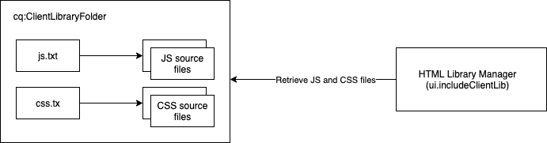

# Using Client-Side Libraries on AEM as a Cloud Service {#using-client-side-libraries}

Digital experiences rely heavily on client-side processing driven by complex JavaScript and CSS code. AEM Client-Side Libraries (clientlibs) allow you to organize and centrally store these client-side libraries within the repository. Coupled with the [front-end build process in the AEM Project archetype,](https://docs.adobe.com/content/help/en/experience-manager-core-components/using/developing/archetype/uifrontend.html) managing your front-end code for your AEM project becomes simple.

Advantages of using clientlibs in AEM include:

* Client-side code is stored in the repository like all other application code and content
* Clientlibs in AEM can aggregate all CSS and JS into one file
* Expose clientlibs via a path that is accessible through the [dispatcher](/help/implementing/dispatcher/disp-overview.md)
* Allows the rewriting of paths for referenced files or images

Clientlibs are the built-in solution for delivering CSS and Javascript from AEM.

>[!TIP]
>
>Front-end developers who are creating CSS and Javascript for AEM projects should also familiarize themselves with the [AEM Project Archetype and its automated front-end build process.](https://docs.adobe.com/content/help/en/experience-manager-core-components/using/developing/archetype/uifrontend.html)

## What Are Client-Side Libraries {#what-are-clientlibs}

Sites require JavaScript and CSS as well as static resources such as icons and web fonts to be processed client-side. A clientlib is AEM's mechanism to reference (by category if required) and serving such resources.

AEM collects the site's CSS and Javascript into a single file, in a central location, to ensure that only one copy of any resource is included in the HTML output. This maximizes the efficiency of delivery and allows such resources to be maintained centrally in the repository via proxy, keeping access secure.

## Front-End Development for AEM as a Cloud Service {#fed-for-aemaacs}

All JavaScript, CSS, and other front-end assets should be maintained in the [ui.frontend module of the AEM Project Archetype.](https://docs.adobe.com/content/help/en/experience-manager-core-components/using/developing/archetype/uifrontend.html) The flexibility of the archetype allows you to use your modern web tools of choice to create and manage these resources.

The archetype can then compile the resources into single CSS and JS files, embedding them automatically into a `cq:clientLibraryFolder` in the repository.

## Client-Side Library Folder Structure {#clientlib-folders}

A client-side library folder is a repository node of type `cq:ClientLibraryFolder`. Its definition in [CND notation](https://jackrabbit.apache.org/node-type-notation.html) is

```text
[cq:ClientLibraryFolder] > sling:Folder
  - dependencies (string) multiple
  - categories (string) multiple
  - embed (string) multiple
  - channels (string) multiple
```

* `cq:ClientLibraryFolder` nodes can be placed anywhere within the `/apps` subtree of the repository.
* Use the `categories` property of the node to identify the library categories to which it belongs.

Each `cq:ClientLibraryFolder` is populated with a set of JS and/or CSS files, along with a few supporting files (see below). Important properties of the `cq:ClientLibraryFolder` are configured as follows:

* `allowProxy`: Since all clientlibs must be stored under `apps`, this property allows access to clientlibraries ia proxy servlet. See [Locating a Client Library Folder and Using the Proxy Client Libraries Servlet](#locating-a-client-library-folder-and-using-the-proxy-client-libraries-servlet) below.
* `categories`: Identifies the categories into which the set of JS and/or CSS files within this `cq:ClientLibraryFolder` fall. The `categories` property, being multi-valued, allows a library folder to be part of more than one category (see below for how this may be useful).

If the client library folder contains one or more source files that, at runtime, they are merged into a single JS and/or CSS file. The name of the generated file is the node name with either the `.js` or `.css` file name extension. For example, the library node named `cq.jquery` results in the generated file named `cq.jquery.js` or `cq.jquery.css`.

Client library folders contain the following items:

* The JS and/or CSS source files
* Static resources that support CSS styles, such as icons, web fonts, etc.
* One `js.txt` file and/or one `css.txt` file which identify the source files to merge in the generated JS and/or CSS files



## Creating Client-Side Library Folders {#creating-clientlib-folders}

Client libraries must be located under `/apps`. This is in order to better isolate code from content and configuration.

In order for the client libraries under `/apps` to be accessible, a proxy servelt is used. The ACLs are still enforced on the client library folder, but the servlet allows for the content to be read via `/etc.clientlibs/` if the `allowProxy` property is set to `true`.

1. Open CRXDE Lite in a web browser (`https://<host>:<port>/crx/de`).
1. Select the `/apps` folder and click **Create &gt; Create Node**.
1. Enter a name for the library folder, and in the **Type** list select `cq:ClientLibraryFolder`. Click **OK** and then click **Save All**.
1. To specify the category or categories that the library belongs to, select the `cq:ClientLibraryFolder` node, add the following property, and then click **Save All**:
   * Name: `categories`
   * Type: String
   * Value: The category name
   * Multi: Selected
1. In order for the client libraries to be accessible via proxy under `/etc.clientlibs`, select the `cq:ClientLibraryFolder` node, add the following property, and then click **Save All**:
   * Name: `allowProxy`
   * Type: Boolean
   * Value: `true`
1. If you need to manage static resources, create a subfolder named `resources` below the client library folder.
   * If you store static resources under the folder `resources`, they can not be referenced on a publish instance.
1. Add source files to the library folder.
   * This is typically done by the front-end build process of the [AEM Project Archetype.](https://docs.adobe.com/content/help/en/experience-manager-core-components/using/developing/archetype/uifrontend.html)
   * You can organize source files in subfolders if desired.
1. Select the client library folder and click **Create &gt; Create file**.
1. In the file name box, type one of the following file names and click OK:
   * **`js.txt`:** Use this file name to generate a JavaScript file.
   * **`css.txt`:** Use this file name to generate a Cascading Style Sheet.
1. Open the file and type the following text to identify the root of the path of the source files:
   * `#base=*[root]*`
   * Replace `[root]` with the path to the folder that contains the source files, relative to the TXT file. For example, use the following text when the source files are in the same folder as the TXT file:
     * `#base=.`
   * The following code sets the root as the folder named mobile below the `cq:ClientLibraryFolder` node:
     * `#base=mobile`
1. On the lines below `#base=[root]`, type the paths of the source files relative to the root. Place each file name on a separate line.
1. Click **Save All**.

## Serving Client-Side Libraries {#serving-clientlibs}

Once your client library folder is [configured as required,](#creating-clientlib-folders) your clientlibs can be requested via proxy. As an example:

* You have a clientlib in `/apps/myproject/clientlibs/foo`
* You have a static image in `/apps/myprojects/clientlibs/foo/resources/icon.png`

The `allowProxy` property allows you to request:

* The clientlib via j`/etc.clientlibs/myprojects/clientlibs/foo.js`
* The static image via `/etc.clientlibs/myprojects/clientlibs/foo/resources/icon.png`

### Loading Client Libraries via HTL {#loading-via-htl}

Once your clientlibs are successfully stored and managed in their client library folder, they can be access via HTL.

Client libraries are loaded through a helper template provided by AEM, which can be accessed through `data-sly-use`. Helper templates are available in this file, which can be called through `data-sly-call`.

Each helper template expects a `categories` option for referencing the desired client libraries. That option can be either an array of string values, or a string containing a comma separated values list.

[See the HTL documentation](https://docs.adobe.com/content/help/en/experience-manager-htl/using/getting-started/getting-started.html#loading-client-libraries) for more details on loading clientlibs via HTL.

### Setting Cache Timestamps {#setting-cache-timestamps}

This is possible.

## Client Libraries on Author versus Publish {#clientlibs-author-publish}

Most clientlibs will be required on the AEM publish instance. That is, most clientlibs' purposes are to produce the end-user experience of the content. For clientlibs on publish instances, [front-end build tools](#fed-for-aemaacs) can be used and deployed via [client library folders as described above.](#creating-clientlib-folders)

However there are times when client libraries may be necessary to customize the authoring experience. For example, customizing a dialog might require deploying small bits of CSS or JS to the AEM authoring instance.

### Managing Client Libraries on Author {#clientlibs-on-author}

If you need to use client libraries on author, you can create your client libraries under `/apps` using the same methods as for publish, but write it directly under `/apps/.../clientlibs/foo` instead of creating an entire project to manage it.

You can then "hook" into the authoring JS by adding your client libraries to an out-of-the-box client library category.

## Additional Client Library Folder Features {#additional-features}

There are a number of other features that are supported by client library folders in AEM. Additional client library settings can be controlled through the **Adobe Granite HTML Library Manager** panel of the System Console at `https://<host>:<port>/system/console/configMgr`).

However, most of these are not required on AEM as a Cloud Service and as such their use is discouraged. They are are listed here for completeness.

### Additional Folder Properties {#additional-folder-properties}

Additional folder properties include allow control of dependencies and embeds, but are generally no longer needed and their use is discouraged:

* `dependencies`: This is a list of other client library categories on which this library folder depends. For example, given two `cq:ClientLibraryFolder` nodes `F` and `G`, if a file in `F` requires another file in `G` in order to function properly, then at least one of the `categories` of `G` should be among the `dependencies` of `F`.
* `embed`: Used to embed code from other libraries. If node `F` embeds nodes `G` and `H`, the resulting HTML will be a concatenation of content from nodes `G` and `H`.

### Linking to Dependencies {#linking-to-dependencies}

When the code in your client library folder references other libraries, identify the other libraries as dependencies. The `ui:includeClientLib` tag that references your client library folder causes the HTML code to include a link to your generated library file as well as the dependencies.

The dependencies must be another `cq:ClientLibraryFolder`. To identify dependencies, add a property to your `cq:ClientLibraryFolder` node with the following attributes:

* **Name:** dependencies
* **Type:** String[]
* **Values:** The value of the categories property of the cq:ClientLibraryFolder node that the current library folder depends on.

For example, the `/etc/clientlibs/myclientlibs/publicmain` has a dependency on the `cq.jquery` library. The page that references the main client library generates HTML that includes the following code:

```xml
<script src="/etc/clientlibs/foundation/cq.jquery.js" type="text/javascript">
<script src="/etc/clientlibs/mylibs/publicmain.js" type="text/javascript">
```

### Embedding Code From Other Libraries {#embedding-code-from-other-libraries}

You can embed code from a client library into another client library. At runtime, the generated JS and CSS files of the embedding library includes the code of the embedded library.

Embedding code is useful for providing access to libraries that are stored in secured areas of the repository.

#### App-Specific Client Library Folders {#app-specific-client-library-folders}

It is a best practice to keep all application-related files in their application folder below `/app`. It is also a best practice to deny access for web site visitors to the `/app` folder. To satisfy both best practices, create a client library folder below the `/etc` folder that embeds the client library that is below `/app`.

Use the categories property to identify the client library folder to embed. To embed the library, add a property to the embedding `cq:ClientLibraryFolder` node, using the following property attributes:

* **Name:** embed
* **Type:** String[]
* **Value:** The value of the categories property of the `cq:ClientLibraryFolder` node to embed.
