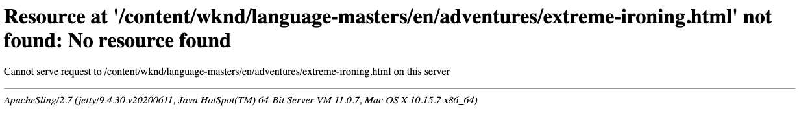

# Customizing Error Pages {#customizing-error-pages}

AEM comes with a standard error handler for handling HTTP errors; for example, by showing:

To respond to errors, AEM provides a `404.jsp` script under `/libs/sling/servlet/errorhandler`.

>[!TIP]
>
>Because AEM is based on Apache Sling, further information is available [in the Apache error handling documentation](https://sling.apache.org/documentation/the-sling-engine/errorhandling.html).

>[!NOTE]
>
>On an author instance, [CQ WCM Debug Filter](/help/implementing/deploying/configuring-osgi.md) is enabled by default. This always results in the response code 200. The default error handler responds by writing the full stack trace to the response.
>
>On a publish instance, CQ WCM Debug Filter is **always** disabled (even if configured as enabled).

## How to Customize Pages Shown by the Error Handler {#how-to-customize-pages-shown-by-the-error-handler}

You can develop your own scripts to customize the pages shown by the error handler when an error is encountered. To do this you use [AEM's standard overlay mechanism](/help/implementing/developing/introduction/overlays.md) so that your customized pages are created under `/apps` and overlay the default pages that are under `/libs`.

1. In the repository, copy the default script(s):

    * from `/libs/sling/servlet/errorhandler/`
    * to `/apps/sling/servlet/errorhandler/`

   The destination path does not exist by default, so you need to create it when doing this for the first time.

1. Navigate to `/apps/sling/servlet/errorhandler`. Here you can either:

    * edit the appropriate existing script to supply the information required. Or
    * create, and edit, a new script for the required code.

1. Save the changes and test.

>[!CAUTION]
>
>The `404.jsp` script has been specifically designed to cater to AEM authentication; in particular, to allow for system login in the case of these errors.
>
>Therefore, replacement of this script should be done with great care.

### Customizing the Response to HTTP 500 Errors {#customizing-the-response-to-http-errors}

The HTTP [500 Internal Server Error](https://www.w3.org/Protocols/rfc2616/rfc2616-sec10.html) indicates a server-side error such as the server encountering an unexpected condition which prevented it from fulfilling the request.

When request processing results in an exception, the Apache Sling framework (which AEM is built on):

* Logs the exception
* And returns in the body of the response:
  * The HTTP response code 500
  * The exception stack trace

By [customizing the pages shown by the error handler](#how-to-customize-pages-shown-by-the-error-handler) a `500.jsp` script can be created. However, it is only used if `HttpServletResponse.sendError(500)` is executed explicitly; that is, from an exception catcher.

Otherwise, the response code is set to 500, but the `500.jsp` script is not executed.

To handle 500 errors, the file name of the error handler script must be the same as the exception class (or superclass). To handle all such exceptions you can create a script `/apps/sling/servlet/errorhandler/Throwable.jsp` or `/apps/sling/servlet/errorhandler/Exception.jsp`.

>[!NOTE]
>
>In AEM as Cloud Service, the CDN serves a generic error page when a 5XX error is received from the backend. To allow the actual response of the backend to pass through you need to add the following header to the response: `x-aem-error-pass: true`.
>This works only for responses coming from AEM or the Apache/Dispatcher layer. Other unexpected errors coming from intermediate infrastructure layers will still display the generic error page.

>[!CAUTION]
>
>On an author instance, [CQ WCM Debug Filter](/help/implementing/deploying/configuring-osgi.md) is enabled by default. This always results in the response code 200. The default error handler responds by writing the full stack trace to the response.
>
>For a custom error-handler, responses with code 500 are needed - so the [CQ WCM Debug Filter must be disabled](/help/implementing/deploying/configuring-osgi.md). This ensures that the response code 500 is returned, which in turn triggers the correct Sling error-handler.
>
>On a publish instance, CQ WCM Debug Filter is **always** disabled (even if configured as enabled).
