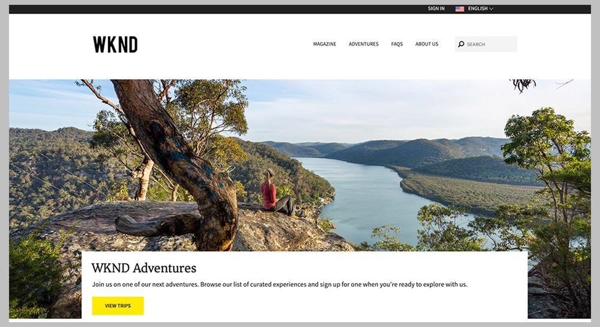

# Getting Started Developing AEM Sites - WKND Tutorial{#getting-started-developing-aem-sites-wknd-tutorial}

## Overview {#overview}

New to developing Adobe Experience Manager as a Cloud Service? Need a refresher on the latest practices? This is the place to start!

The goal for this multi-part tutorial is to teach a developer who is new to AEM how to implement a website in AEM using the latest standards and technologies. The hope is at the end of this tutorial you will understand the basic foundation of the AEM platform and knowledge of some of the common design patterns.

## WKND Developer Tutorial {#wknd-developer-tutorial}

[The WKND Developer Tutorial is available here](https://docs.adobe.com/content/help/en/experience-manager-learn/getting-started-wknd-tutorial-develop/overview.html) and guides you through creating an AEM project using the latest technologies and best practices.

## Core Concepts {#core-concepts}

The tutorial implementation leverages many powerful features of AEM. The site will be implemented using:

* [Maven AEM Project Archetype](https://docs.adobe.com/content/help/en/experience-manager-core-components/using/developing/archetype/overview.html)
* [Core Components](https://docs.adobe.com/content/help/en/experience-manager-core-components/using/introduction.html)
* [HTL](https://docs.adobe.com/content/help/en/experience-manager-htl/using/getting-started/getting-started.html)
* [Sling Models](https://sling.apache.org/documentation/bundles/models.html)
* [Editable Templates](https://docs.adobe.com/content/help/en/experience-manager-learn/sites/page-authoring/template-editor-feature-video-use.html)
* [Style System](https://docs.adobe.com/content/help/en/experience-manager-learn/sites/page-authoring/style-system-feature-video-use.html)
