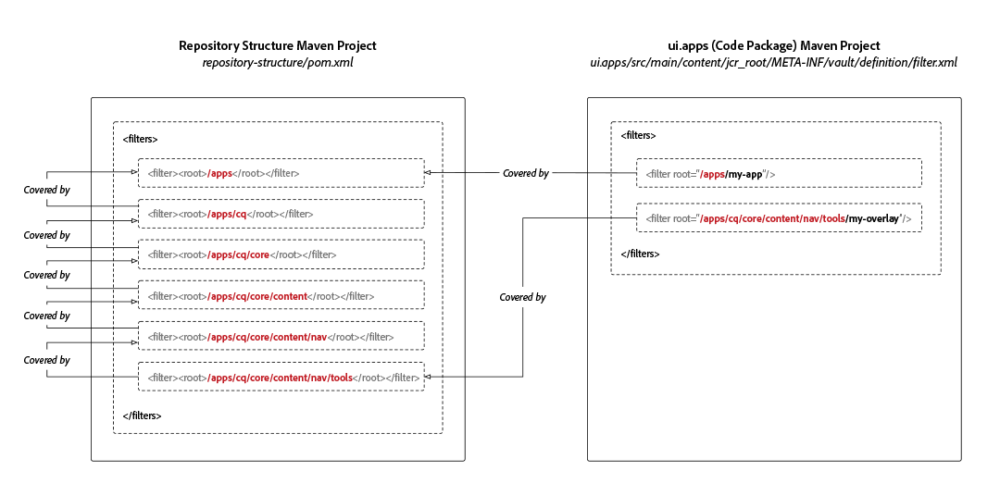

# AEM Project Repository Structure Package

Maven projects for Adobe Experience Manager as a Cloud Service require a repository structure sub-package definition whose sole purpose is to define the JCR repository roots in which the project's code sub-packages deploy into. This ensures the installation of packages in Experience Manager as a Cloud Service is automatically ordered by JCR resource dependencies. Missing dependencies may lead to scenarios where sub-structures would be installed ahead of their parent structures and therefore be unexpectedly removed, breaking the deployment.

If your code package deploys into a location **not covered** by the code package, then any ancestor resources (JCR resources closer to the JCR root) must be enumerated in the repository structure package to establish these dependencies.



The repository structure package defines the expected, common state of `/apps` which the package validator uses to determine areas "safe from potential conflicts" as they are standard roots.

The most typical paths to include in the repository structure package are:

+ `/apps` which is a system-provided node
+ `/apps/cq/...`, `/apps/dam/...`, `/apps/wcm/...`, and `/apps/sling/...` which provide common overlays for `/libs`.
+ `/apps/settings` which is the shared context-aware configuration root path

Note that this sub-package **does not have** any content and is comprised solely of a `pom.xml` defining the filter roots.

## Creating the Repository Structure Package

To create a repository structure package for you Maven project, create a new empty Maven sub-project, with the following `pom.xml`, updating the project metadata to conform with your parent Maven project.

Update the `<filters>` to include all the JCR repository path roots your code packages deploy into.

Make sure to add this new Maven sub-project to the parent projects `<modules>` list.

```xml
<?xml version="1.0" encoding="UTF-8"?>
<project xmlns="http://maven.apache.org/POM/4.0.0" xmlns:xsi="http://www.w3.org/2001/XMLSchema-instance" xsi:schemaLocation="http://maven.apache.org/POM/4.0.0 http://maven.apache.org/maven-v4_0_0.xsd">
    <modelVersion>4.0.0</modelVersion>

    <!-- ====================================================================== -->
    <!-- P A R E N T  P R O J E C T  D E S C R I P T I O N                      -->
    <!-- ====================================================================== -->
    <parent>
        <groupId>com.my-company</groupId>
        <artifactId>my-app</artifactId>
        <version>x.x.x</version>
        <relativePath>../pom.xml</relativePath>
    </parent>

    <!-- ====================================================================== -->
    <!-- P R O J E C T  D E S C R I P T I O N                                   -->
    <!-- ====================================================================== -->
    <artifactId>ui.apps.structure</artifactId>
    <packaging>content-package</packaging>
    <name>UI Apps Structure - Repository Structure Package for /apps</name>

    <description>
        Empty package that defines the structure of the Adobe Experience Manager repository the code packages in this project deploy into.
        Any roots in the code packages of this project should have their parent enumerated in the filters list below.
    </description>

    <build>
        <plugins>
            <plugin>
                <groupId>org.apache.jackrabbit</groupId>
                <artifactId>filevault-package-maven-plugin</artifactId>
                <extensions>true</extensions>
                <properties>
                    <!-- Set Cloud Manager Target to none, else this package will be deployed and remove all defined filter roots -->
                    <cloudManagerTarget>none</cloudManagerTarget>
                </properties>
                <configuration>
                    <properties>
                        <!-- Set Cloud Manager Target to none, else this package will be deployed and remove all defined filter roots -->
                        <cloudManagerTarget>none</cloudManagerTarget>
                    </properties>
                    <filters>

                        <!-- /apps root -->
                        <filter><root>/apps</root></filter>

                        <!--
                        Examples of complex roots


                        Overlays of /libs typically require defining the overlayed structure, at each level here.

                        For example, adding a new section to the main AEM Tools navigation, necessitates the following rules:

                        <filter><root>/apps/cq</root></filter>
                        <filter><root>/apps/cq/core</root></filter>
                        <filter><root>/apps/cq/core/content</root></filter>
                        <filter><root>/apps/cq/core/content/nav/</root></filter>
                        <filter><root>/apps/cq/core/content/nav/tools</root></filter>


                        Any /apps level Context-aware configurations need to enumerated here. 
                        
                        For example, providing email templates under `/apps/settings/notification-templates/com.day.cq.replication` necessitates the following rules:

                        <filter><root>/apps/settings</root></filter>
                        <filter><root>/apps/settings/notification-templates</root></filter>
                        <filter><root>/apps/settings/notification-templates/com.day.cq.replication</root></filter>
                        -->

                    </filters>
                </configuration>
            </plugin>
        </plugins>
    </build>
</project>
```

## Referencing the Repository Structure Package

To use the repository structure package, reference it via all code package (the sub-packages that deploy to `/apps`) Maven projects via the FileVault content package Maven plug-ins `<repositoryStructurePackage>` configuration.

In the `ui.apps/pom.xml`, and any other code package `pom.xml`s, add a reference to the project's repository structure package (#repository-structure-package) configuration to the FileVault package Maven plug-in.

```xml
...
<build>
  <plugins>
    <plugin>
      <groupId>org.apache.jackrabbit</groupId>
      <artifactId>filevault-package-maven-plugin</artifactId>
      <extensions>true</extensions>
      <configuration>
        ...
        <repositoryStructurePackages>
          <repositoryStructurePackage>
              <groupId>${project.groupId}</groupId>
              <artifactId>ui.apps.structure</artifactId>
              <version>${project.version}</version>
          </repositoryStructurePackage>
        </repositoryStructurePackages>
      </configuration>
    </plugin>
    ...
</build>
<dependencies>
    <!-- Add the dependency for the repository structure package so it resolves -->
    <dependency>
        <groupId>${project.groupId}</groupId>
        <artifactId>ui.apps.structure</artifactId>
        <version>${project.version}</version>
        <type>zip</type>
    </dependency>
    ...
</dependencies>
```

## Multi-Code Package Use Case

A less common, and more complex use-case, is supporting the deployment of multiple code packages that install into the same areas of the JCR repository.

For example:

+ Code package A deploys into `/apps/a`
+ Code package B deploys into `/apps/a/b`

If a package-level dependency is not established from code package B on code package A, code package B may deploy first into `/apps/a`, followed by code package B, which deploys into `/apps/a`, resulting in a removal of the previously installed `/apps/a/b`.

In this case:

+ Code package A should define a `<repositoryStructurePackage>` on the project's repository structure package (which should have a filter for `/apps`).
+ Code package B should define a `<repositoryStructurePackage>` on code package A, because code package B deploys into space shared by code package A.

## Errors and Debugging

If the repository structure packages are not set-up correctly, at Maven build an error will be reported:

```
1 error(s) detected during dependency analysis.
Filter root's ancestor '/apps/some/path' is not covered by any of the specified dependencies.
```

This indicates the breaking code package does not have a `<repositoryStructurePackage>` that lists `/apps/some/path` in its filter list.

## Additional Resources

+ [FileVault Content Package Maven Plug-in](http://jackrabbit.apache.org/filevault-package-maven-plugin/)
