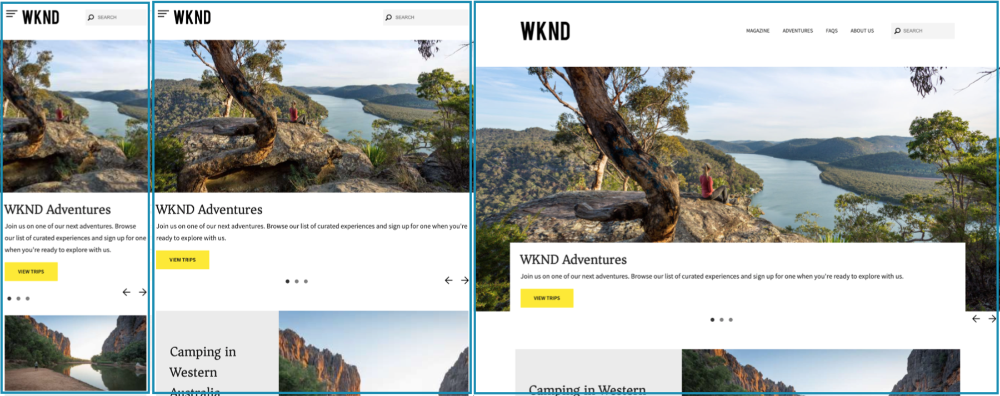
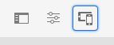
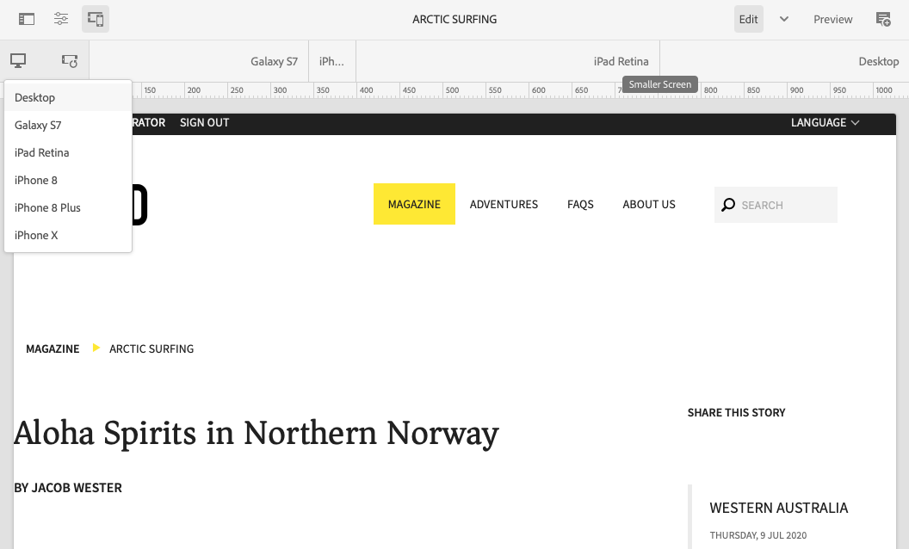

# Responsive Design {#responsive-design}

Design your experiences so that they adapt to the client viewport in which they are displayed. With responsive design, the same pages can be effectively displayed on multiple devices in both orientations. The following image demonstrates some ways in which a page can respond to changes in viewport size:

* Layout: Use single-column layouts for smaller viewports, and multiple-column layouts for larger viewports.
* Text size: Use larger text size (when appropriate, such as headings) in larger viewports.
* Content: Include only the most important content when displaying on smaller devices.
* Navigation: Device-specific tools are provided for accessing other pages.
* Images: Serving image renditions that are appropriate for the client viewport according to the window dimensions.



Develop Adobe Experience Manager (AEM) applications that generate HTML5 that adapts to multiple window sizes and orientations. For example, the following ranges of viewport widths correspond with various device types and orientations

* Maximum width of 480 pixels (phone, portrait)
* Maximum width of 767 pixels (phone, landscape)
* Width between 768 pixels and 979 pixels (tablet, portrait)
* Width between 980 pixels and 1199 pixels (tablet, landscape)
* Width of 1200px or greater (desktop)

See the following topics for information about implementing responsive design behavior:

* [Media queries](#using-media-queries)
* [Fluid grids](#developing-a-fluid-grid)
* [Adaptive images](#using-adaptive-images)

As you design, use the **Emulator** toolbar to preview your pages for various screen sizes.

## Before You Develop {#before-you-develop}

Before you develop the AEM application that supports your web pages, several design decisions should be made. For example, you need to have the following information:

* The devices you are targeting
* The target viewport sizes
* The page layouts for each of the targeted viewport size

### Application Structure {#application-structure}

The typical AEM application structure supports all responsive design implementations:

* Page components reside below `/apps/<application_name>/components`
* Templates reside below `/apps/<application_name>/templates`

## Using Media Queries {#using-media-queries}

Media queries enable the selective use of CSS styles for page rendering. AEM development tools and features enable you to effectively and efficiently implement media queries in your applications.

The W3C group provides the [Media Queries](https://www.w3.org/TR/css3-mediaqueries/) recommendation that describes this CSS3 feature and the syntax.

### Creating the CSS File {#creating-the-css-file}

In your CSS file, define media queries based on the properties of the devices that you are targeting. The following implementation strategy is effective for managing styles for each media query:

* Use a [Client Library folder](clientlibs.md) to define the CSS that is assembled when the page is rendered.
* Define each media query and the associated styles in separate CSS files. It is useful to use file names that represent the device features of the media query.
* Define styles that are common to all devices in a separate CSS file.
* In the css.txt file of the Client Library folder, order the list CSS files as is required in the assembled CSS file.

The [WKND tutorial](develop-wknd-tutorial.md) uses this strategy to define styles in the site design. The CSS file used by WKND is located at `/apps/wknd/clientlibs/clientlib-grid/less/grid.less`.

### Using Media Queries with AEM Pages {#using-media-queries-with-aem-pages}

[The WKND sample project](/help/implementing/developing/introduction/develop-wknd-tutorial.md) and [AEM Project Archetype](https://experienceleague.adobe.com/docs/experience-manager-core-components/using/developing/archetype/overview.html) use the [Page Core Component](https://experienceleague.adobe.com/docs/experience-manager-core-components/using/wcm-components/page.html), which includes the clientlibs via the page policy.

If your own page component is not based on the Page Core Component, you can also include the client library folder in the HTL or JSP script of it. Doing so will generate and reference the CSS file with the media queries needed for the responsive grid to work.

#### HTL {#htl}

```html
<sly data-sly-use.clientlib="${'/libs/granite/sightly/templates/clientlib.html'}">
<sly data-sly-call="${clientlib.all @ categories='apps.weretail.all'}"/>
```

#### JSP {#jsp}

```xml
<ui:includeClientLib categories="apps.weretail.all"/>
```

The JSP script generates the following HTML code that references the style sheets:

```xml
<link rel="stylesheet" href="/etc/designs/weretail/clientlibs-all.css" type="text/css">
<link href="/etc/designs/weretail.css" rel="stylesheet" type="text/css">
```

## Previewing for Specific Devices {#previewing-for-specific-devices}

The emulator allows you to preview your pages in different viewport sizes so you can test the behavior of your responsive design. When editing a page in the Sites Console, you can tap or click the **Emulator** icon to reveal the emulator.



In the emulator toolbar you can tap or click the **Devices** icon to reveal a drop-down menu where you can select a device. When you select a device, the page changes to adapt to the viewport size.



### Specifying Device Groups {#specifying-device-groups}

To specify the device groups that appear in the **Devices** list, add a `cq:deviceGroups` property to the `jcr:content` node of the template page of your site. The value of the property is an array of paths to the device group nodes.

For example, the template page of the WKND site is `/conf/wknd/settings/wcm/template-types/empty-page/structure`. And the `jcr:content` node beneath it includes the following property:

* Name: `cq:deviceGroups`
* Type: `String[]`
* Value: `mobile/groups/responsive`

Device group nodes are in the `/etc/mobile/groups` folder.

## Responsive Images {#responsive-images}

Responsive pages will dynamically adapt to the device on which they are rendered, offering a better experience for the user. However it is also important that assets are optimized to the breakpoint and device to minimize page load time.

[The Core Component Image Component](https://experienceleague.adobe.com/docs/experience-manager-core-components/using/wcm-components/image.html) features like adaptive image selection.

* By default, the Image Component uses the [Adaptive Image Servlet](https://experienceleague.adobe.com/docs/experience-manager-core-components/using/developing/adaptive-image-servlet.html) to deliver the proper rendition.
* [Web-Optimized Image Delivery](https://experienceleague.adobe.com/docs/experience-manager-core-components/using/developing/web-optimized-image-delivery.html) is also available via a simple checkbox in its policy, which delivers image assets from the DAM in WebP format and can reduce the download size of an image by about 25% on average.

## The Layout Container {#layout-container}

AEM's Layout Container allows you to efficiently and effectively implement responsive layout to adapt the dimensions of the page to the client viewport.

>[The GitHub documentation](https://adobe-marketing-cloud.github.io/aem-responsivegrid/) of the responsive grid is a reference that can be given to front-end developers allowing them to use the AEM grid outside of AEM, for example, when creating static HTML mock-ups for a future AEM site.

>[!TIP]
>
>Please see the document [Configuring Layout Container and Layout Mode](/help/sites-cloud/administering/responsive-layout.md) for more information on how the Layout Container works and how to enable responsive layouts for your content.

## Nested Responsive Grids {#nested-responsive-grids}

There may be occasions when you find it necessary to nest responsive grids to support your project's needs. However, keep in mind that Adobe's recommended best practice is to keep the structure as flat as possible.

When you can not avoid using nested responsive grids, make sure:

* All containers (containers, tabs, accordions, etc.) have the property `layout = responsiveGrid`.
* Do not mix the property `layout = simple` in the container hierarchy. 

This includes all the structural containers from the page template.

The column number of the inner container should never be greater than that of the outer container. The following example satisfies this condition. While the column number of the outer container is 8 for the default (desktop) screen, the column number of the inner container is 4.

>[!BEGINTABS]

>[!TAB Example Node Structure]

```text
container
  @layout = responsiveGrid
  cq:responsive
    default
      @offset = 0
      @width = 8
  container
  @layout = responsiveGrid
    cq:responsive
      default
        @offset = 0
        @width = 4
    text
      @text =" Text Column 1"
```

>[!TAB Example Resulting HTML]

```html
<div class="container responsivegrid aem-GridColumn--default--none aem-GridColumn aem-GridColumn--default--8 aem-GridColumn--offset--default--0">
  <div id="container-c9955c233c" class="cmp-container">
    <div class="aem-Grid aem-Grid--8 aem-Grid--default--8 ">
      <div class="container responsivegrid aem-GridColumn--default--none aem-GridColumn aem-GridColumn--offset--default--0 aem-GridColumn--default--4">
        <div id="container-8414e95866" class="cmp-container">
          <div class="aem-Grid aem-Grid--4 aem-Grid--default--4 ">
            <div class="text aem-GridColumn aem-GridColumn--default--4">
              <div data-cmp-data-layer="..." id="text-1234567890" class="cmp-text">
                <p>Text Column 1</p>
              </div>
            </div>
          </div>
        </div>
      </div>
    </div>
  </div>
</div>
```
>[!ENDTABS]
