# Structure of the AEM UI {#structure-of-the-aem-ui}

The AEM UI has several underlying principles and is made up of several key elements:

## Consoles {#consoles}

### Basic Layout and Resizing {#basic-layout-and-resizing}

The UI caters for both mobile and desktop devices, though rather than creating two styles, AEM uses one style that works for all screens and devices.

All modules use the same basic layout:

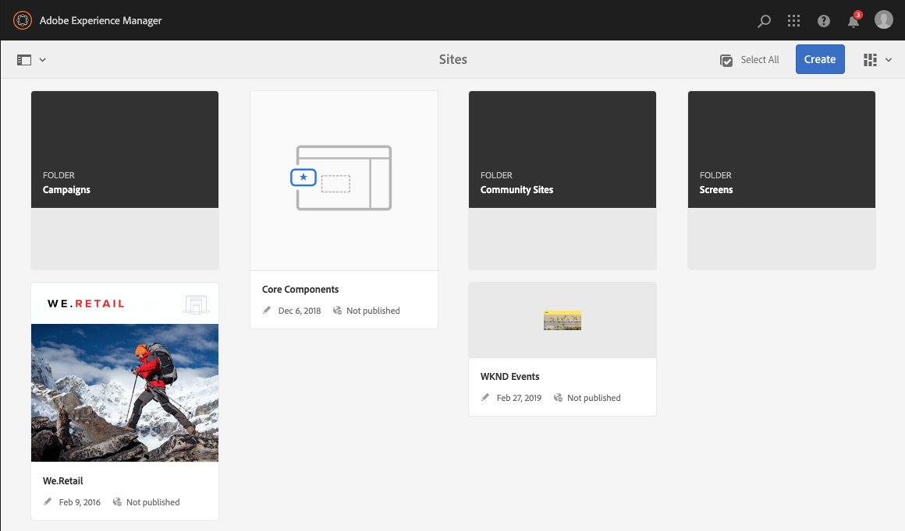

The layout adheres to a responsive design style and accommodates itself to the size of the device, or window, or both, that you are using.

For example, when the resolution goes below 1024 pixels (as on a mobile device), the display is adjusted accordingly:

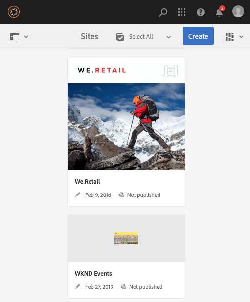

### Header Bar {#header-bar}

The header bar shows global elements including:

* The logo and the specific product/solution that you are currently using. For AEM, this element also forms a link to the Global Navigation
* Search
* Icon for accessing the help resources
* Icon for accessing other Solutions
* An indicator of &ndash; and access to &ndash; any alerts or Inbox items that are waiting for you
* The user icon, together with a link to your profile management

### Toolbar {#toolbar}

The toolbar is contextual to your location and surfaces tools relevant to controlling the view or assets in the page below. The toolbar is product-specific, but there is some commonality to the elements.

In any location, the toolbar shows the actions currently available:

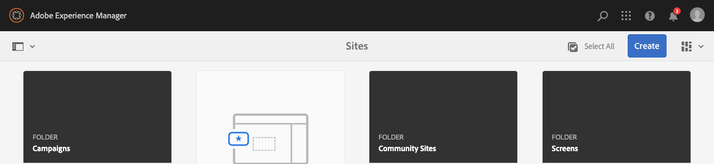

Also dependent on whether a resource is selected:

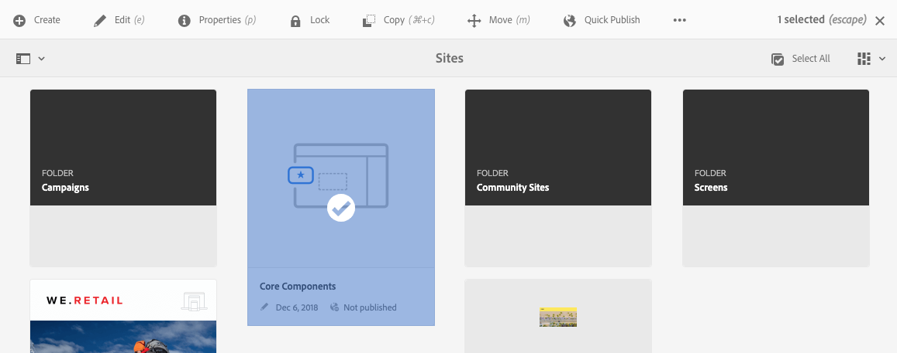

### Left Rail {#left-rail}

The left rail can be opened/hidden as required to show:

* **Content Only**
* **Content Tree**
* **Timeline**
* **References**
* **Filter**

The default is **Content Only** (rail hidden).

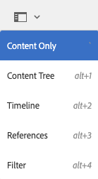

## Page Authoring {#page-authoring}

When authoring pages, the structural areas are as follows.

### Content Frame {#content-frame}

The page content is rendered in the content frame. The content frame is independent of the editor - to ensure that there are no conflicts due to CSS or JavaScript.

The content frame is on the right-hand section of the window, under the toolbar.

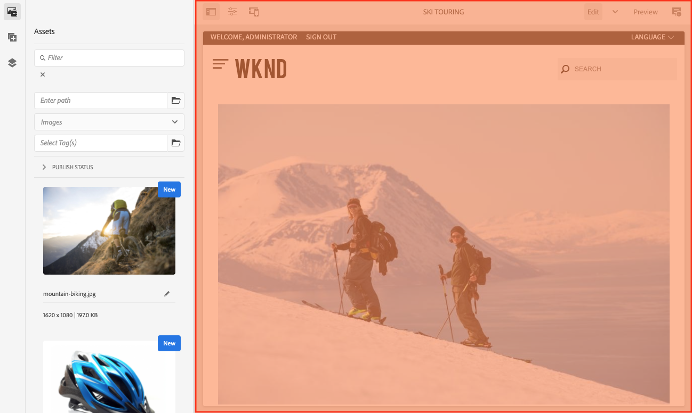

### Editor Frame {#editor-frame}

The editor frame enables the editing features.

The editor frame is a container (abstract) for all the page authoring elements. It lives on top of the content frame, and includes:

* The top toolbar
* The side panel
* All the overlays
* Any other page authoring element; for example, the component toolbar

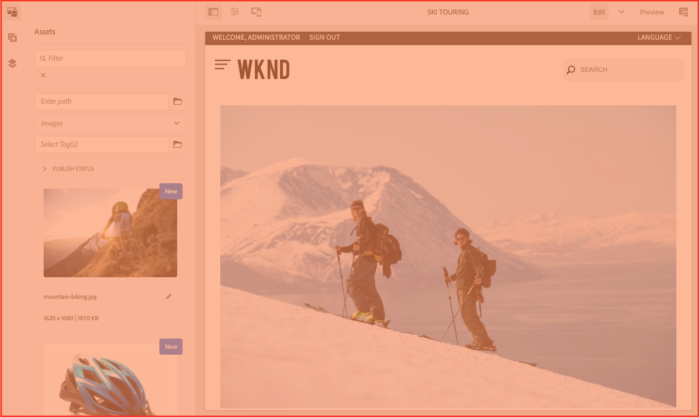

### Side Panel {#side-panel}

Contains three default tabs. The **Assets** and **Components** tabs lets you select such elements and drag them from the panel and drop them onto the page. The **Content Tree** tab lets you inspect the hierarchy of content on the page.

The side panel is hidden by default. When selected, it is either shown at the left side, or when the window width is less than 1024 pixels, it slides across to cover the entire window as, for example, on a mobile device.

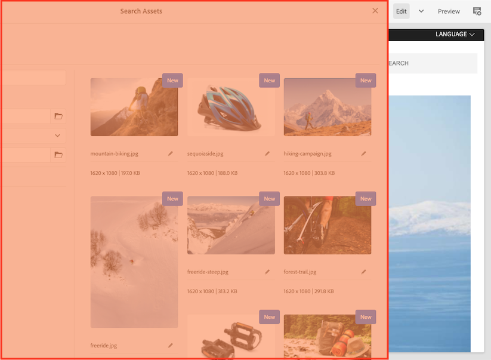

### Side Panel - Assets {#side-panel-assets}

In the Assets tab, you can select from the range of assets. Also, you can filter on a specific term, or select a group.

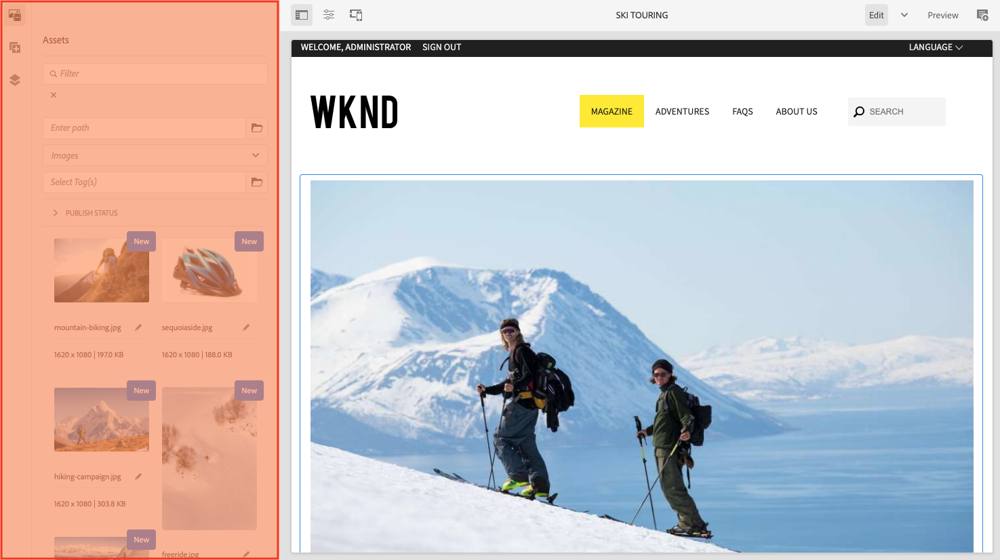

### Side Panel - Asset Groups {#side-panel-asset-groups}

In the Assets tab, there is a drop-down that you can use to select the specific asset groups.

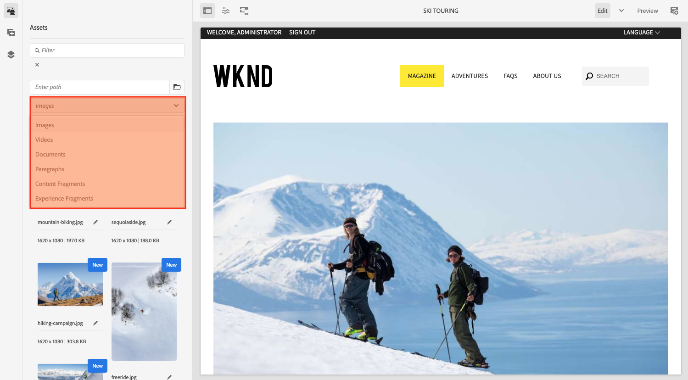

### Side Panel - Components {#side-panel-components}

In the Components tab, you can select from the range of components. Also, you can filter on a specific term, or select a group.

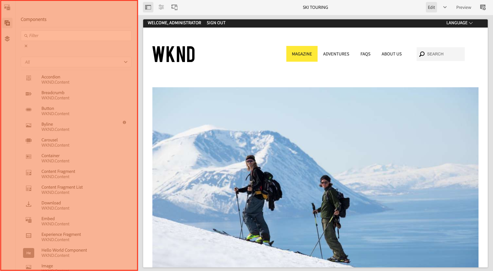

### Side Panel - Content Tree {#side-panel-content-tree}

In the Content Tree tab, you can view the hierarchy of content on the page. Clicking an entry in the tab jumps to and selects the item on the page within the editor.

### Overlays {#overlays}

Overlays the content frame and are used by the [layers](#layer) to realize the mechanics of how you can interact transparently with the components and their content.

The overlays live in the editor frame (with all other page authoring elements), though they actually overlay the appropriate components in the content frame.

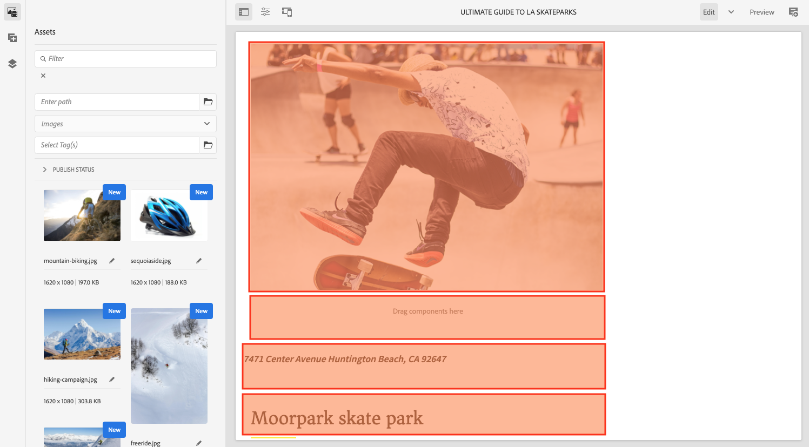

### Layer {#layer}

A layer is an independent bundle of functionality that can be activated to:

* Provide a different view of the page
* Allow you to manipulate and/or interact with a page

The layers provide sophisticated functionality for the entire page, as opposed to specific actions on an individual component.

AEM comes with several layers already implemented for page authoring; including for example, edit, preview, and annotate layers.

>[!NOTE]
>
>Layers are a powerful concept that affects the user's view of and interaction with the page content. When developing your own layers, be sure that the layer cleans up when it is exited.

### Layer Switcher {#layer-switcher}

The layer switcher lets you choose the layer you want to use. When closed, it indicates the layer currently in use.

The layer switcher is available as a drop-down from the toolbar (at the top of the window, within the editor frame).

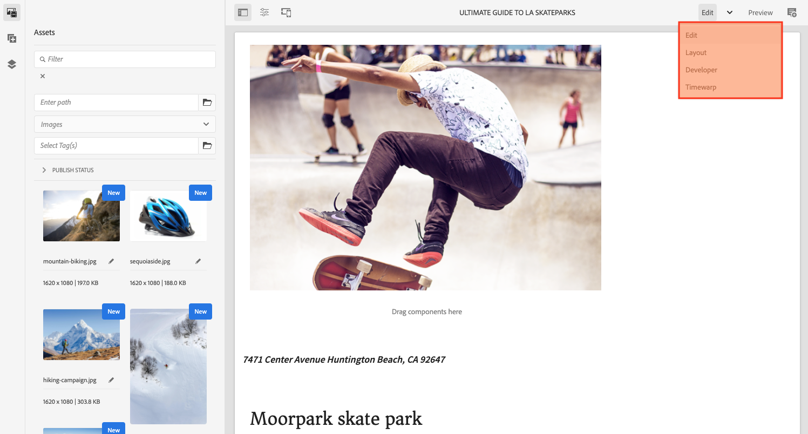

### Component Toolbar {#component-toolbar}

Each instance of a component reveals its toolbar when clicked (either once or with a slow double-click). The toolbar contains the specific actions (for example, copy, paste, open-editor) that are available for the component instance on the page.

Depending on the space available, the component toolbars are positioned at the top-, or bottom-, right corner of the appropriate component.

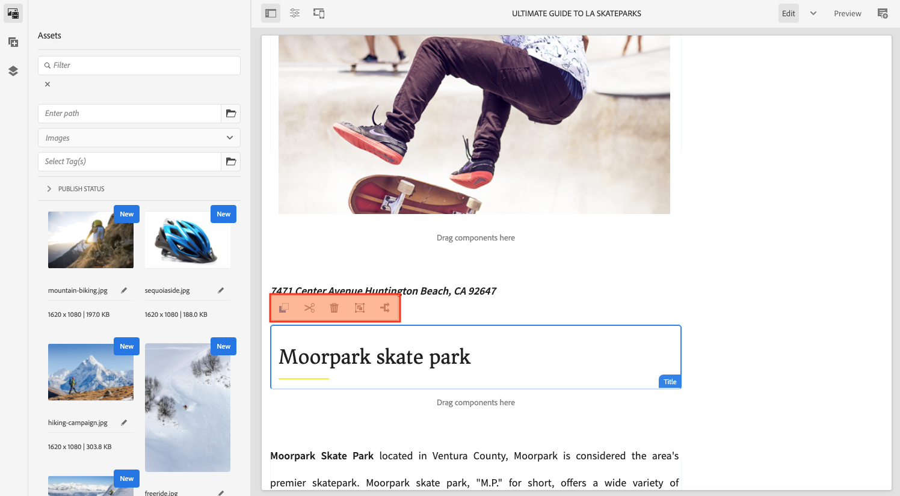

## Further Information {#further-information}

<!--For more details about the concepts around the touch-enabled UI, continue to the article [Concepts of the AEM Touch-Enabled UI](/help/sites-developing/touch-ui-concepts.md).-->

For more technical information, see the [JS documentation set](https://developer.adobe.com/experience-manager/reference-materials/6-5/jsdoc/ui-touch/editor-core/index.html) for the page editor.

### Unified Shell {#unified-shell}

See [AEM as a Cloud Service on Unified Shell](/help/overview/aem-cloud-service-on-unified-shell.md) if you are using the Unified Shell as your AEM UI. 

If you need to make, or have already made, any customizations, the Unified Shall can be disabled:

* [from the UI](/help/overview/aem-cloud-service-on-unified-shell.md#disabling-unified-shell)

* from your project code, by:

  * on `/conf/global/setting/unifiedshell`

    * setting the `Boolean` property `enable` to `false` 
