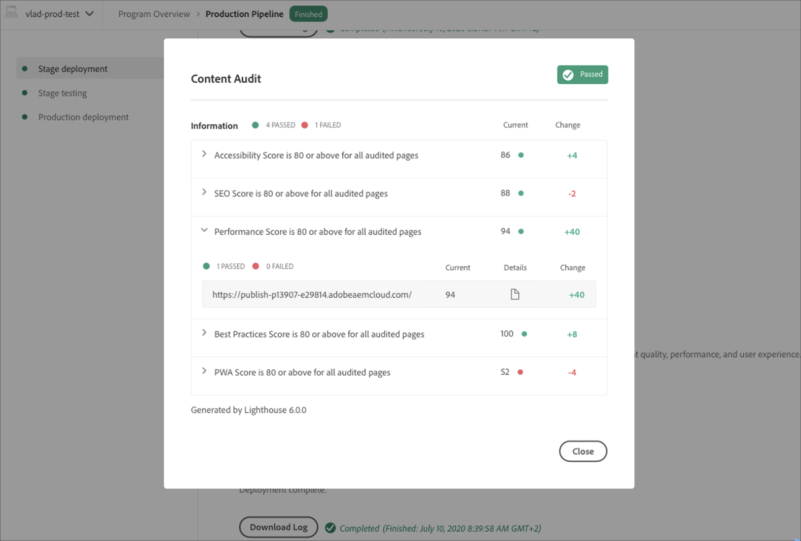
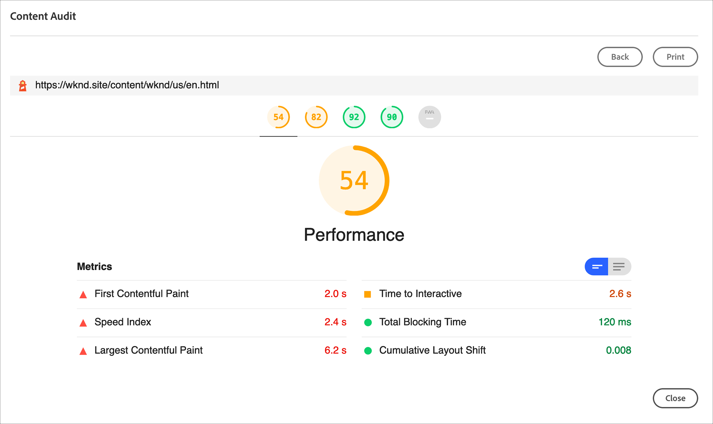

# Understanding your Test Results {#understand-test-results} 

Cloud Manager for Cloud Services pipeline executions will support execution of tests that run against the stage environment. This is in contrast to tests run during the Build and Unit Testing step which are run offline, without access to any running AEM environment. 
There are two types of tests run in this context:
* Customer-written tests 
* Adobe-written tests
* Open source tool powered by Lighthouse from Google

    >[!NOTE]
    > Both Customer-written tests and Adobe-written tests are run in a containerized infrastructure designed for running these types of tests.


## Code Quality Testing {#code-quality-testing}

As part of the pipeline the source code is scanned to ensure that deployments meet certain quality criteria. Currently, this is implemented by a combination of SonarQube and content package-level examination using OakPAL. There are over 100 rules combining generic Java rules and AEM-specific rules. The following table summarizes the rating for testing criteria:

|Name|Definition|Category|Failure Threshold|
|--- |--- |--- |--- |
|Security Rating|A = 0 Vulnerability <br/>B = at least 1 Minor Vulnerability<br/> C = at least 1 Major Vulnerability <br/>D = at least 1 Critical Vulnerability <br/>E = at least 1 Blocker Vulnerability|Critical|&lt; B|
|Reliability Rating|A = 0 Bug <br/>B = at least 1 Minor Bug <br/>C = at least 1 Major Bug <br/>D = at least 1 Critical Bug E = at least 1 Blocker Bug|Important|&lt; C|
|Maintainability Rating|Outstanding remediation cost for code smells is: <br/><ul><li>&lt;=5% of the time that has already gone into the application, the rating is A </li><li>between 6 to 10% the rating is a B </li><li>between 11 to 20% the rating is a C </li><li>between 21 to 50% the rating is a D</li><li>anything over 50% is an E</li></ul>|Important|&lt; A|
|Coverage|A mix of unit test line coverage and condition coverage using this formula: <br/>`Coverage = (CT + CF + LC)/(2*B + EL)`  <br/>where: CT = conditions that have been evaluated to 'true' at least once while running unit tests <br/>CF = conditions that have been evaluated to 'false' at least once while running unit tests <br/>LC = covered lines = lines_to_cover - uncovered_lines <br/><br/> B = total number of conditions <br/>EL = total number of executable lines (lines_to_cover)|Important|&lt; 50%|
|Skipped Unit Tests|Number of skipped unit tests.|Info|> 1|
|Open Issues|Overall issue types - Vulnerabilities, Bugs, and Code Smells|Info|&gt; 0|
|Duplicated Lines|Number of lines involved in duplicated blocks. <br/>For a block of code to be considered as duplicated: <br/><ul><li>**Non-Java projects:**</li><li>There should be at least 100 successive and duplicated tokens.</li><li>Those tokens should be spread at least on: </li><li>30 lines of code for COBOL </li><li>20 lines of code for ABAP </li><li>10 lines of code for other languages</li><li>**Java projects:**</li><li> There should be at least 10 successive and duplicated statements whatever the number of tokens and lines.</li></ul> <br/>Differences in indentation as well as in string literals are ignored while detecting duplications.|Info|&gt; 1%|
|Cloud Service Compatibility|Number of identified Cloud Service Compatibility issues.|Info|> 0|


>[!NOTE]
>
>Refer to [Metric Definitions](https://docs.sonarqube.org/display/SONAR/Metric+Definitions) for more detailed definitions.

You can download the list of rules here [code-quality-rules.xlsx](/help/implementing/cloud-manager/assets/CodeQuality-rules-latest.xlsx)

>[!NOTE]
>
>To learn more about the custom code quality rules executed by [!UICONTROL Cloud Manager], please refer to [Custom Code Quality Rules](/help/implementing/cloud-manager/custom-code-quality-rules.md).

### Dealing with False Positives {#dealing-with-false-positives}

The quality scanning process is not perfect and will sometimes incorrectly identify issues which are not actually problematic. This is referred to as a "false positive".

In these cases, the source code can be annotated with the standard Java `@SuppressWarnings` annotation specifying the rule ID as the annotation attribute. For example, one common problem is that the SonarQube rule to detect hardcoded passwords can be aggressive about how a hardcoded password is identified.

To look at a specific example, this code would be fairly common in an AEM project which has code to connect to some external service:

```java
@Property(label = "Service Password")
private static final String PROP_SERVICE_PASSWORD = "password";
```

SonarQube will then raise a Blocker Vulnerability. After reviewing the code, you identify that this is not a vulnerability and can annotate this with the appropriate rule id.

```java
@SuppressWarnings("squid:S2068")
@Property(label = "Service Password")
private static final String PROP_SERVICE_PASSWORD = "password";
```

However, on the other hand, if the code was actually this:

```java
@Property(label = "Service Password", value = "mysecretpassword")
private static final String PROP_SERVICE_PASSWORD = "password";
```

Then the correct solution is to remove the hardcoded password.

>[!NOTE]
>
>While it is a best practice to make the `@SuppressWarnings` annotation as specific as possible, i.e. annotate only the specific statement or block causing the issue, it is possible to annotate at a class level.

## Writing Functional Tests {#writing-functional-tests}

Customer-written functional tests must be packaged as a separate JAR file produced by the same Maven build as the artifacts to be deployed to AEM. Generally this would be a separate Maven module. The resulting JAR file must contain all required dependencies and would generally be created using the maven-assembly-plugin using the jar-with-dependencies descriptor. 

In addition, the JAR must have the Cloud-Manager-TestType manifest header set to integration-test. In the future, it is expected that additional header values will be supported. An example configuration for the maven-assembly-plugin is:

```java
<build>
    <plugins>
        <!-- Create self-contained jar with dependencies -->
        <plugin>
            <groupId>org.apache.maven.plugins</groupId>
            <artifactId>maven-assembly-plugin</artifactId>
            <version>3.1.0</version>
            <configuration>
                <descriptorRefs>
                    <descriptorRef>jar-with-dependencies</descriptorRef>
                </descriptorRefs>
                <archive>
                    <manifestEntries>
                        <Cloud-Manager-TestType>integration-test</Cloud-Manager-TestType>
                    </manifestEntries>
                </archive>
            </configuration>
            <executions>
                <execution>
                    <id>make-assembly</id>
                    <phase>package</phase>
                    <goals>
                        <goal>single</goal>
                    </goals>
                </execution>
            </executions>
        </plugin>
    </plugins>
```

Within this JAR file, the class names of the actual tests to be executed must end in IT. 
 
For example, a class named `com.myco.tests.aem.ExampleIT` would be executed but a class named `com.myco.tests.aem.ExampleTest` would not. 
 
The test classes need to be normal JUnit tests. The test infrastructure is designed and configured to be compatible with the conventions used by the aem-testing-clients test library. Developers are strongly encouraged to use this library and follow its best practices. Refer to [Git Link](https://github.com/adobe/aem-testing-clients) for more details.

## Custom Functional Testing {#custom-functional-test}

The Custom Functional testing step in the pipeline is always present and cannot be skipped. 

However, if no test JAR is produced by the build, the test passes by default. This step is current done immediately after the stage deployment.

>[!NOTE]
>The **Download Log** button allows access to a ZIP file containing the logs for the test execution detailed form. These logs do not include the logs of the actual AEM runtime process – those can be accessed using the regular Download or Tail Logs functionality. Refer to [Accesing and Managing Logs](/help/implementing/cloud-manager/manage-logs.md) for more details.

## Content Audit Testing {#content-audit-testing}

Content Audit is a feature available in Cloud Manager Sites Production pipelines that is powered by Lighthouse, an open source tool from Google. This feature is enabled in all Cloud Manager Production pipelines. 

It validates the deployment process and helps ensure that changes deployed:

1. Meet baseline standards for performance, accessibility, best practices, SEO (Search Engine Optimization), and PWA (Progressive Web App).

1. Do not include regressions in these dimensions.

Content Audit in Cloud Manager ensures that the end users digital experience on the site may be maintained at the highest standards. The results are informational and allow the user to see the scores and the change between the current and previous scores. This insight is valuable to determine if there is a regression that will be introduced with the current deployment.

### Understanding Content Audit Results {#understanding-content-audit-results}

Content Audit provides aggregate and detailed page-level test results via the Production Pipeline execution page.

* Aggregate level metrics measure the average score across the pages that were audited.
* Individual page level scores are also available via drill down.
* Details of the scores are available to see what are the results of the individual tests, along with guidance on how to remediate any issues that were identified during the content audit.
* A history of the test results are persisted within Cloud Manager so customers can see whether changes that are being introduced in the pipeline run include any regressions from the previous run.

#### Aggregate Scores {#aggregate-scores}

There is an aggregate level score for each test type (performance, accessibility, SEO, best practices, and PWA).

The aggregate level score takes the average score of the pages that are included in the run. The change at the aggregate level represents the average score of the pages in the current run compared to the average of the scores from the previous run, even if the collection of pages configured to be included has been changed between runs. 

Value of Change metric may be one of the following:

* **Positive value** - the page(s) have improved on the selected test since the last production pipeline run

* **Negative value** - the page(s) have regressed on the selected test since the last production pipeline run

* **No Change** - the page(s) have scored the same since the last production pipeline run

* **N/A** - there was no previous score available to compare to

   

#### Page-level Scores {#page-level-scores}

By drilling into any of the tests, more detailed page level scoring can be seen. The user will be able to see how the individual pages scored for the specific test along with the change from the previous time the test was run.
Clicking into the Details of any individual page will provide information on the elements of the page that were evaluated and guidance to fix issues if opportunities for improvement are detected. The details of the tests and associated guidance are provided by Google Lighthouse. 
   

## Local Test Execution {#local-test-execution}

As the test classes are JUnit tests, they can be run from mainstream Java IDEs like Eclipse, IntelliJ, NetBeans, and so on. 

However, when running these tests necessarily, it will be necessary to set a variety of system properties expected by the aem-testing-clients (and the underlying Sling Testing Clients). 

The system properties are as follows:

* `sling.it.instances - should be set to 2`
* `sling.it.instance.url.1 - should be set to the author URL, for example, http://localhost:4502`
* `sling.it.instance.runmode.1 - should be set to author`
* `sling.it.instance.adminUser.1 - should be set to the author admin user, e.g. admin`
* `sling.it.instance.adminPassword.1 - should be set to the author admin password`
* `sling.it.instance.url.2 - should be set to the author URL, for example, http://localhost:4503`
* `sling.it.instance.runmode.2 - should be set to publish`
* `sling.it.instance.adminUser.2 - should be set to the publish admin user, for example, admin`
* `sling.it.instance.adminPassword.2 - should be set to the publish admin password`

