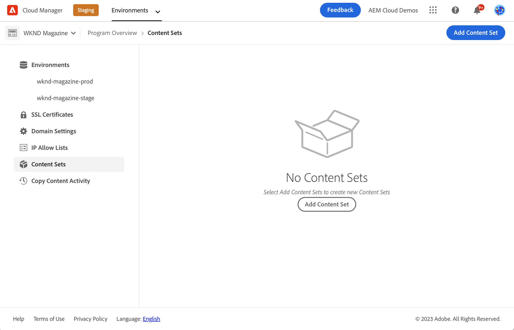
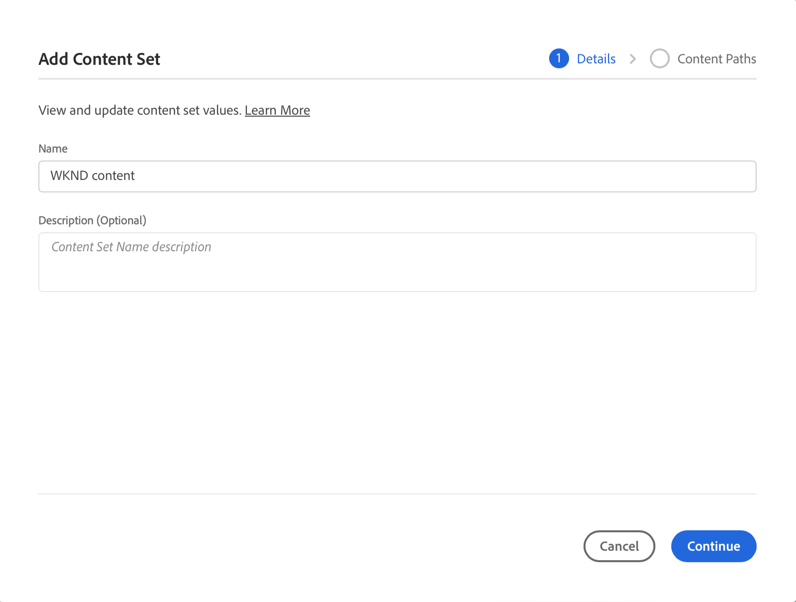
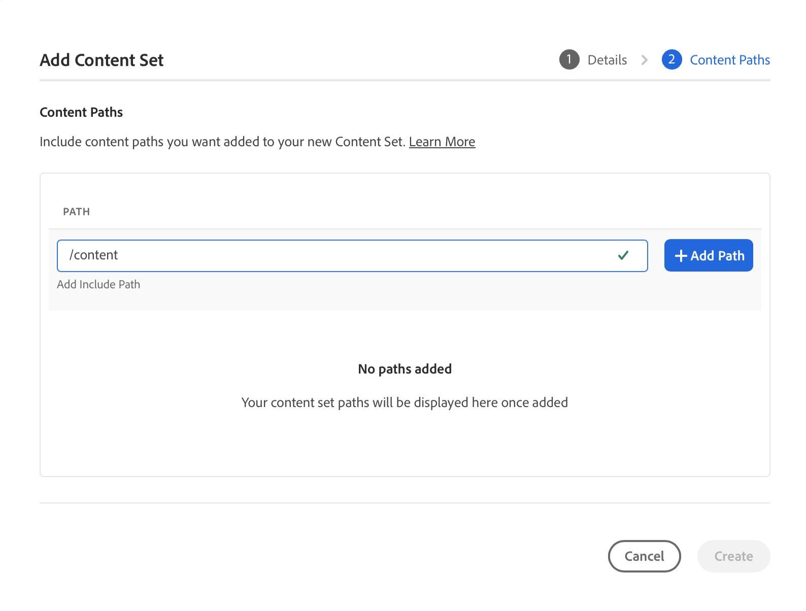
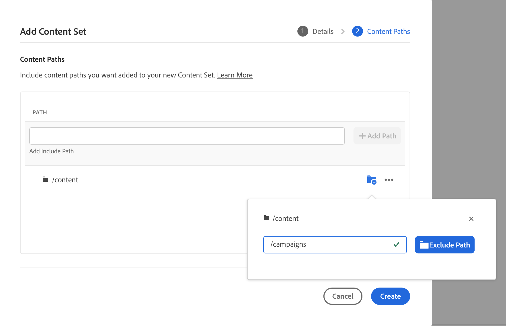
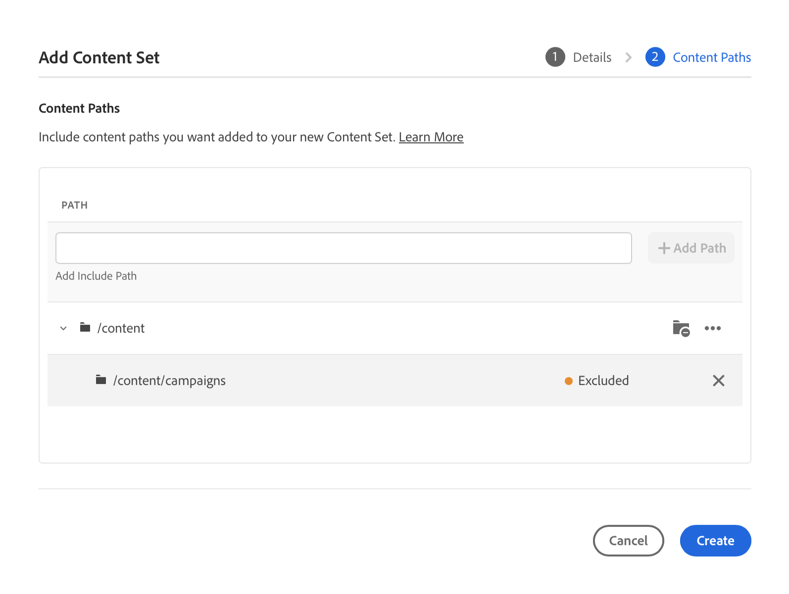
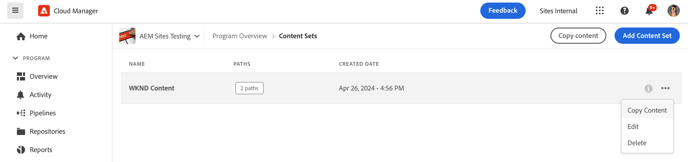
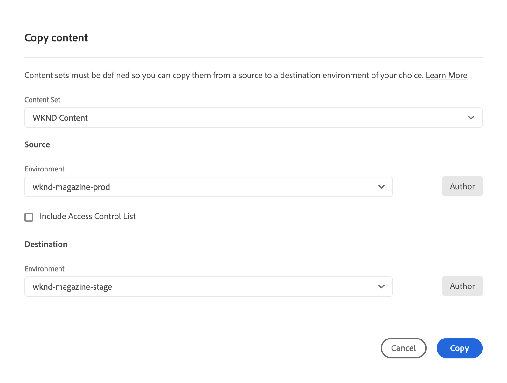
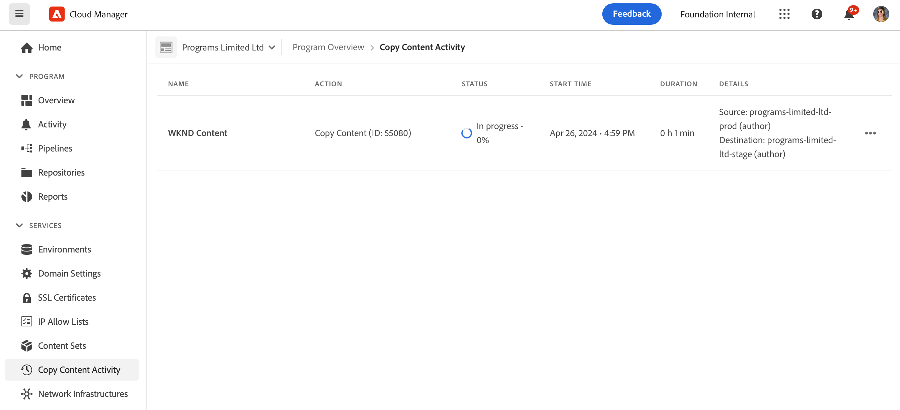
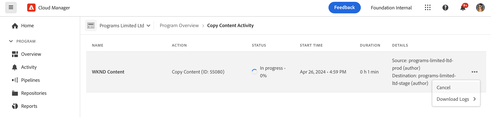
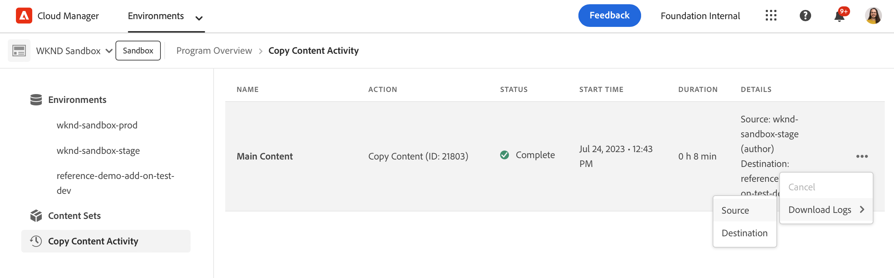

# The Content Copy Tool {#content-copy}

The content copy tool enables users to copy mutable content on-demand from their production environments on AEM as a Cloud Service to lower environments for testing purposes.

## Introduction {#introduction}

Current, real data is valuable for testing, validation, and user-acceptance purposes. The content copy tool lets you copy content from a production AEM as a Cloud Service environment to a staging, development, or [Rapid Development Environment (RDE)](/help/implementing/developing/introduction/rapid-development-environments.md) environment for such testing.

The content to copy is defined by a content set. A content set consists of a list of JCR paths that contain the mutable content to be copied from a source authoring service environment to a target authoring service environment within the same Cloud Manager program. The following paths are permitted in a content set.

```text
/content
/conf/**/settings/wcm
/conf/**/settings/dam/cfm/models
/conf/**/settings/graphql/persistentQueries
/etc/clientlibs/fd/themes
```

When copying content, the source environment is the source of truth.

* If content has been modified in the destination environment, it is overwritten by content in the source, if the paths are the same.
* If the paths are different, content from the source is merged with the content in the destination.

## Permissions {#permissions}

To use the content copy tool, certain permissions are required in both the source and target environments.

| Content Copy Feature | AEM Administrator Group | Deployment Manager Role |
|---|---|---|
| Create and modify [content sets](#create-content-set) | Not Required | Required |
| Start or cancel the [content copy process](#copy-content) | Required | Required |

For more details on permissions and how to set them, see [AEM as a Cloud Service Team and Product Profiles](/help/onboarding/aem-cs-team-product-profiles.md).

## Creating a Content Set {#create-content-set}

Before any content can be copied, a content set must be defined. After it is defined, content sets can be reused to copy content. Follow these steps so you can create a content set.

1. Log on to Cloud Manager at [my.cloudmanager.adobe.com](https://my.cloudmanager.adobe.com/) and select the appropriate organization and program.

1. Using the side navigation panel, navigate to the **Content Sets** tab from the **Overview** page.

1. At the top-right of the screen, click **Add Content Set**.

   

1. On the **Details** tab of the wizard, provide a name and description for the content set and select **Continue**.

   

1. On the **Content Paths** tab of the wizard, specify the paths of the mutable content to be included in the content set.

   1. Enter the path in the **Add Include Path** field.
   1. Click **Add Path** to add the path to the content set.
   1. Click **Add Path** again as necessary.
      * Up to 50 paths are allowed.

   

1. If you must refine or restrict your content set, subpaths can be excluded.

   1. In the list of included paths, click **Add exclude sub-paths** next to the path you want to restrict.
   1. Enter the subpath to exclude beneath the selected path.
   1. Select **Exclude Path**.
   1. Select **Add exclude sub-paths** again to add additional paths to exclude as necessary.
      * Excluded paths must be relative to the included path.
      * There is no limit on the number of excluded paths.

   

1. You can edit the specified paths, if necessary.

   1. Click the X next to excluded subpaths so you can delete them.
   1. Click the ellipsis button next to paths so you can reveal **Edit** and **Delete** options.

   

1. Select **Create** to create the content set.

The content set can now be used to copy content between environments.

## Editing a Content Set {#edit-content-set}

Follow similar steps as when creating a content step. Instead of clicking **Add Content Set**, select an existing set from the console, and select **Edit** from the ellipsis menu.


When editing your content set, you can expand the configured paths to reveal the excluded subpaths.

## Copying Content {#copy-content}

After a content set is created, you can use it to copy content. Follow these steps so you can copy content.

>[!NOTE]
> Do not use Content Copy on an environment while a [content transfer](/help/journey-migration/content-transfer-tool/using-content-transfer-tool/overview-content-transfer-tool.md) operation is running on that environment. 

1. Log into Cloud Manager at [my.cloudmanager.adobe.com](https://my.cloudmanager.adobe.com/) and select the appropriate organization and program.

1. Navigate to the **Environments** screen from the **Overview** page.

1. Navigate to the **Content Sets** page from the **Environments** screen.

1. Select a content set from the console and select **Copy Content** from the ellipsis menu.

   

   >[!NOTE]
   >
   >An environment may not be selectable if:
   >
   >* The user does not have the appropriate permissions.
   >* The environment has a running pipeline or a copy content operation in progress.
   >* The environment is hibernating or starting up.

1. In the **Copy content** dialog, specify the source and destination for your content copy action.

   

   * Content can only be copied from a higher environment to a lower environment or between development/RDE environments where the hierarchy of environments is as follows (from highest to lowest):
     * Production
     * Staging
     * Development / RDE

1. If necessary, you can also elect to **Include Access Control Lists** in your copy process.

1. Select **Copy**.

The copy process starts. The status of the copy process is reflected in the console for the selected content set.

## Content Copy Activity {#copy-activity}

You can monitor the status of your copy processes in the **Copy Content Activity** page.

1. Log into Cloud Manager at [my.cloudmanager.adobe.com](https://my.cloudmanager.adobe.com/) and select the appropriate organization and program.

1. Navigate to the **Environments** screen from the **Overview** page.

1. Navigate to the **Copy Content Activity** page from the **Environments** screen.



### Content Copy Statuses {#statuses}

Once you start copying content, the process can have one of the following statuses.

|Status|Description|
|---|---|
|In progress|Content copy operation is ongoing|
|Failed|Content copy operation failed|
|Completed|Content copy operation completed successfully|
|Canceled|User cancels a content copy operation after starting it|

### Canceling a Copy Process {#canceling}

If you must abort a content copy operation after starting it, you can optionally cancel it.

To do so, on the **Copy Content Activity** page, select the **Cancel** action from the ellipsis menu of the copy process you previously started.



>[!NOTE]
>
>When you cancel a content copy operation, it can result in a partial copy of the content in the destination environment. This situation can leave the destination environment in an unusable state.
>
>If your environment is in such a state due to cancellation, contact Adobe Customer Care for assistance.

### Accessing Logs {#accessing-logs}

You can check the logs for both the source and destination environments for any completed content copy process.

To do so, on the **Copy Content Activity** page, select the **Logs** action from the ellipsis menu of the copy process for which you would like to review the logs and then choose for which environment.



The logs are downloaded to your local machine. If the download does not commence, check your pop-up blocker settings.

## Limitations {#limitations}

The content copy tool has the following limitations.

* Content cannot be copied from a lower environment to a higher environment.
* Content can only be copied from and to authoring services.
* Cross-program content copy is not possible.
* Running concurrent content copy operations on the same environment is not possible.
* Up to 50 paths can be specified per content set. There is no limitation on excluded paths.
* Do not use the content copy tool as a cloning or mirroring tool because it cannot track moved or deleted content on the source.
* The content copy tool has no versioning capability and cannot automatically detect modified content or created content on the source environment in a content set since the last content copy operation.
  * If you want to update your destination environment with content changes only, since the last content copy operation, you must create a content set. Then, specify the paths on the source instance where changes were made since the last content copy operation.
* Version information is not included in a content copy.
