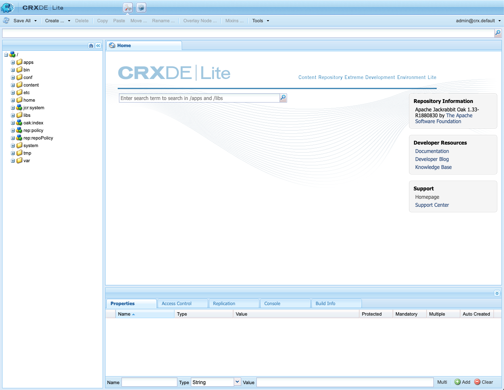

# Using CRXDE Lite {#using-crxde-lite}

CRXDE Lite is part of the AEM quickstart and is available to you to access and modify the repository in your local development environments within the browser. With CRXDE Lite, you can edit files, folders, nodes, and properties. The entire repository is accessible to you in this easy-to-use interface.

>[!NOTE]
>
>CRXDE Lite is only available in your local development environments. It is not available in AEM as a Cloud Service.

## Getting Started with CRXDE Lite {#getting-started-with-crxde-lite}

To get started with CRXDE Lite:

1. Start your local AEM development quickstart.
1. In your browser, open the URL `https://<host>:<port>/crx/de`.
1. Enter your **username** and **password**.
1. Click **OK**.

The CRXDE Lite User Interface appears as follows in your browser:

>[!TIP]
>
>You can also access CRXDE Lite from the AEM menu. From the main menu select **Tools** &gt; **General** &gt; **CRXDE Lite**.

## Overview of the User Interface {#overview-of-the-user-interface}

CRXDE Lite's user interface has many parts and has many functions.

### Top switcher bar {#top-switcher-bar}

The Top Switcher Bar lets you quickly switch between CRXDE Lite and [Package Manager](package-manager.md).

### Node Path Widget {#node-path-widget}

The Node Path Widget displays the path to the currently selected node.

You can also use it to jump to a node by entering the path by hand or pasting it from somewhere else and pressing Enter.

It also provides support for looking for nodes with specific node name. Enter the name of the node you would like to find, and wait (or select the search icon on the right-hand side). If a given node or nodes is loaded into the explorer pane, the list is displayed, and you can select the path and press Enter to navigate to it. It only works for the nodes currently loaded into the CRXDE client application in browser. If you want to search the whole repository, use **Tools** -&gt: **Query**.

### Explorer Pane {#explorer-pane}

The **Explorer Pane** displays a tree of all the nodes in the repository.

Click a node to display its properties in the **Properties** tab. After clicking a node, you can select an action in the toolbar. Click the node again to rename it.

Tree Navigation Filter (the binoculars icon) enables you to filter the nodes in the repository for which the name contains the input text. It only applies to nodes that have been loaded locally.

### Edit Pane {#edit-pane}

The **Edit Pane** lets you view the content of the currently-selected file in the repository. Each file opened is represented as its own tab in the pane.

The **Home** tab lets you search content and/or documentation and access developer documentation and Adobe support.

Double-click a file in the **Explorer Pane** to display its content in the **Edit Pane**. You can then modify it and save the changes.

Once a file is edited in the **Edit Pane**, the following tools are available on the toolbar:

* **Show in tree** - Shows the file in the repository tree.
* **Search/Replace** - Performs a search or replace.

Double-click the status line of the **Edit Pane** opens the **Go to line** dialog so you can enter a specific line number.

### Properties Tab {#properties-tab}

The **Properties Tab** displays the properties of the node that you have selected. You can add new properties or delete existing ones.

### Access Control Tab {#access-control-tab}

The **Access Control Tab** displays permissions based on the current path, repository, or principal.

The permissions are broken down into the following categories.

* **Applicable Access Control Policy** - The policies that can be applied to the current selection
* **Local Access Control Policies** - The current policies applied locally to the current selection
* **Effective Access Control Policies** - The current policies applied for the current selection, which might be set locally or inherited from parent nodes

>[!NOTE]
>
>To be able to see access control information, the user logged in to CRXDE Lite must have rights to read ACL entries.

### Replication Tab {#replication-tab}

The **Replication Tab** displays the replication status of current node. You can replicate and replicate delete the current node.

### Console Tab {#console-tab}

The **Console Tab** displays logs messages. You can configure the log level, clear the console, pin at the selected scroll position and enable/disable the displaying of messages.

### Build Info Tab {#build-info-tab}

The **Build Info Tab** displays information when a bundle is being built.

### Refresh Button {#refresh-button}

The **Refresh Button** refreshes the current selection. Changes from other users are updated in your view of the repository. Changes you have made are unaffected.

### Save All Button {#save-all-button}

The **Save All Button** saves all the changes you have made. Until you choose to save, the changes are temporary, and are lost when you exit the console.

* **Revert** - Discards all the changes that you have made on the selected node since the last save action, then reloads the current state of the repository for the selected node
* **Revert All** - Discards all the changes that you have made throughout the entire repository since the last save action, then reloads the current state of the repository

### Create Button {#create-button}

The **Create Button** is a drop-down menu to create the following under the selected node:

* Node - a node with an arbitrary node type
* File - an `nt:file` node and its nt:resource subnode
* Folder - an `nt:folder` node

### Delete Button {#delete-button}

The **Delete Button** deletes the selected node.

### Copy Button {#copy-button}

The **Copy Button** copies the selected node.

## Paste Button {#paste-button}

The **Paste Button** pastes the copied node under the selected node.

### Move Button {#move-button}

The **Move Button** moves the selected node to the node that is set through the dialog.

### Rename {#rename-button}

The **Rename Button** renames the selected node.

### Mixins {#mixins-button}

The **Mixins Button** lets you add mixin types to the node type. The mixin types are mostly used to add advanced features.

### Tools {#tools-button}

The **Tools Button** is a drop-down menu with the following tools available:

* **Server Config** - to access the Felix Console (also available at `https://<host>:<port>/system/console/configMgr`)
* **Query** - to query the repository
* **Privileges** - to view and add privileges
* **Test Access Control** - to test the permission for certain path and/or principal
* **Export Node Type** - to export node types in the system as CND notation
* **Import Node Type** - to import node types using CND notation.

### Login Widget {#login-widget}

The **Login Widget** displays the currently logged-in user.

Click it to log in or re-login as another user. The `@crx.default` represents that you are in the default (and only) workspace in the repository.

The **Preferences** option can be used to set your UI language and to view and customize the hot keys for various actions such as save, search, create note, and so on.

## Creating a Folder {#creating-a-folder}

To create a folder with CRXDE Lite:

1. Open CRXDE Lite in your browser.
1. In the Navigation pane, right-click the folder under which you want to create the new folder, select **Create ...**, then **Create Folder ...**.

1. Enter the folder **Name** and click **OK**.

1. Click **Save All** to save the changes on the server.

## Creating a Node {#creating-a-node}

To create a node with CRXDE Lite:

1. Open CRXDE Lite in your browser.
1. In the [**Exploerer Pane**](#explorer-pane), right-click the node where you want to create the new node, select **Create**, then **Create Node**.
1. Enter the **Name** and select the **Type**.
1. Click **OK**.
1. Click the [**Save All Button**](#save-all-button) to save the changes on the server.

You can now adapt the node to your needs by modifying properties or creating new nodes.

>[!NOTE]
>
>Most of the edit operations, including **Create Node**, keeps all the changes in memory, and only stores them in the repository upon saving (using the [**Save All Button**](#save-all-button)). However some operations such as move are automatically persisted.
>
>The validation with regard to whether the created node is allowed by the node type of the parent node is also carried out by the repository when saving changes. If you receive an error message while saving a node, check if the content structure is valid (for example, you cannot create an `nt:unstructured` node as a child of `nt:folder` node).

## Creating a Property {#creating-a-property}

To create a property with CRXDE Lite:

1. Open CRXDE Lite in your browser.
1. In the [**Exploerer Pane**](#explorer-pane), select the node where you want to add the new property.
1. In the [**Properties Tab**](#properties-tab) in the bottom pane, enter the **Name**, the **Type**, and the **Value**.
1. Click **Add**.
1. Click the [**Save All Button**](#save-all-button) to save the changes on the server.

## Creating a File {#creating-a-file}

To create a file with CRXDE Lite:

1. Open CRXDE Lite in your browser.
1. In the [**Exploerer Pane**](#explorer-pane), right-click the component where you want to create the file, select **Create**, then **Create File**.
1. Enter the file **Name** including its extension.
1. Click **OK**.
1. The new file opens as a tab in the [**Edit Pane**](#edit-pane).
1. Edit the file.
1. Click the [**Save All Button**](#save-all-button) to save the changes.

## Exporting and Importing Node Types {#exporting-and-importing-node-types}

With CRXDE Lite you can import and/or export node type definitions in [Compact Namespace and Node Type Definition (CND) notation](https://jackrabbit.apache.org/jcr/node-type-notation.html).

To export a node type definition in CRXDE Lite:

1. Open CRXDE Lite in your browser.
1. Select your required node.
1. Select **Tools** then **Export Node Type**.
1. The definition is displayed in CND notation in a new tab in your browser.
1. Save the information if necessary.

To import a node type definition:

1. Open CRXDE Lite in your browser.
1. Select **Tools** then **Import Node Type**.
1. A new tab opens in the [**Edit Pane**](#edit-pane) labeled **Import Node Type**.
1. Enter the CND notation for the definition in the text box of the **Import Node Type** tab.
1. Check **Allow Update** if you are updating an existing definition.
1. Click **Import**.

## Logging {#logging}

With CRXDE Lite you can display the file `error.log` that is located on the file system at `<aem-install-dir>/crx-quickstart/logs` and filter it with the appropriate log level. Proceed as follows:

1. Open CRXDE Lite in your browser.
1. In the drop-down menu on the right of the [**Console Tab**](#console-tab) at the bottom of the window, select **Server Logs**.
1. Click the **Stop** icon to display the messages.

You can:

* Adjust the log parameters in the Felix Console by clicking the **Logging Configurations** icon.
* Clear the messages by clicking the **Clear Console** icon.
* Pin the message at the current selection by clicking the **Pin Console** icon.
* Enable or disable the displaying of messages by clicking the **Stop** icon.
