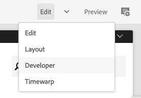
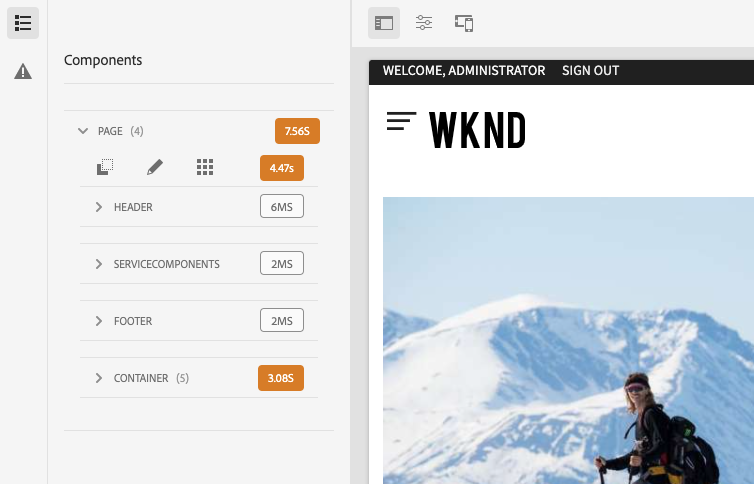
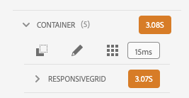
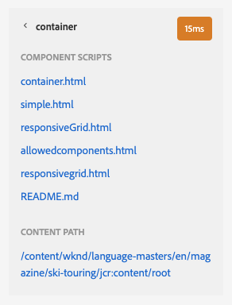
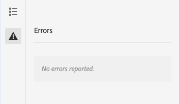

# Developer Mode {#developer-mode}

When editing pages in AEM, several [modes](/help/sites-cloud/authoring/fundamentals/environment-tools.md#page-modes) are available, including Developer mode. Developer mode opens a side panel with several tabs that provide a developer with technical information about the current page.

There are two tabs:

* **[Components](#components)** for viewing structure and performance information.
* **[Errors](#errors)** to see any problems occurring.

These help a developer to:

* **Discover** how the pages are composed.
* **Debug:** what is happening where and when, which in turn helps to resolve issues.

>[!NOTE]
>
>Developer mode:
>
>* Is not available on mobile devices or small windows on desktop (due to space restrictions).
>  * This occurs when the width is less than 1024px.  
>* Is only available to users who are members of the `administrators` group.

## Opening Developer Mode {#opening-developer-mode}

Developer mode is implemented as a side panel to the page editor. To open the panel, select **Developer** from the mode selector in the toolbar of the page editor:

The panel is divided into two tabs:

* **[Components](#components)** - This shows a component tree, similar to the [content tree](/help/sites-cloud/authoring/fundamentals/environment-tools.md#content-tree) for authors
* **[Errors](#errors)** - When problems occur, details are shown for each component.

### Components Tab {#components}

This shows a component tree that:

* Outlines the chain of components and templates rendered on the page. The tree can be expanded to show context within the hierarchy.
* Shows the server-side computational time needed to render the component.
* Allows you to expand the tree and select specific components within the tree. Selection provides access to component details; such as:
  * Repository path
  * Links to scripts (accessed in CRXDE Lite)
  * Component detail as seen in the [Components Console](/help/sites-cloud/authoring/features/components-console.md)
* Components selected in the tree are indicated by a blue border in the editor.

This components tab helps to:

* Determine and compare the rendering time per component.
* See and understand the hierarchy.
* Understand, and then improve, the page loading time by finding slow components.

Each component entry may have the following options:

* **View Details:** A link to a list that shows:
  * All component scripts used to render the component.
  * The repository content path for this specific component.

      

* **Edit Script:** A link that opens the component script in CRXDE Lite.

* **View Component Details:** Opens the details of the component within the [Components Console.](/help/sites-cloud/authoring/features/components-console.md)

Expanding a component entry by tapping or clicking the chevron can also show:

    * The hierarchy within the selected component.
    * Rendering times for the selected component in isolation, any individual components nested within it, and the combined total.

### Errors Tab {#errors}

Hopefully the **Errors** tab will always be empty (as above), but when problems occur the following details may be shown for each component:

* A warning if the component writes an entry to the error log, together with details of the error and direct links to the appropriate code within CRXDE Lite.
* A warning if the component opens an admin session.

For example, if an undefined method is called, the resulting error will be shown in the **Errors** tab and the component entry in the tree of the **Components** tab will also be marked with an indicator when an error occurs.
