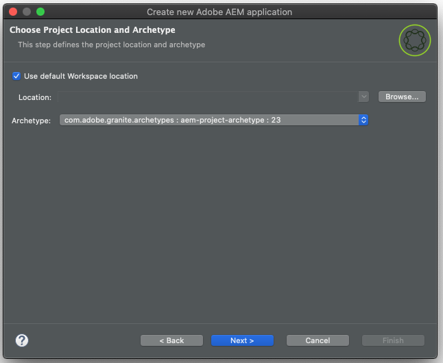

# AEM Developer Tools for Eclipse{#aem-developer-tools-for-eclipse}

 

## Overview {#overview}

The AEM Developer Tools for Eclipse is a Eclipse plugin based on the [Eclipse plugin for Apache Sling](https://sling.apache.org/documentation/development/ide-tooling.html) released under the Apache License 2.

It offers several features that make AEM development easier:

* Seamless integration with AEM instances through Eclipse Server Connector
* Synchronization for both content and OSGi bundles
* Debugging support with code hot-swapping capability
* Simple bootstrap of AEM projects via a specific Project Creation Wizard
* Easy editing of JCR properties

## Requirements {#requirements}

Before using the AEM Developer Tools, you need to:

* Download and install [Eclipse IDE for Enterprise Java Developers](https://www.eclipse.org/downloads/packages/).
* Configure your eclipse installation to ensure that you have at least 1 gigabyte of heap memory by editing your `eclipse.ini` configuration file as described in the [Eclipse FAQ](https://wiki.eclipse.org/FAQ_How_do_I_increase_the_heap_size_available_to_Eclipse).

>[!NOTE]
>
>On macOS, you need to right-click on **Eclipse.app** and then select **Show Package Contents** in order to find your `eclipse.ini`**.**

## How to Install the AEM Developer Tools for Eclipse {#how-to-install-the-aem-developer-tools-for-eclipse}

Once you have fulfilled the [requirements](#requirements) above, you can install the plugin as follows:

1. Open the [AEM Developer Tools Web Site.](https://eclipse.adobe.com/aem/dev-tools/)

1. Copy the **Installation Link**.

   Note that alternatively you can download an archive instead of using the installation link. This allows offline installation but you will miss automatic update notifications this way.

1. In Eclipse, open the **Help** menu.
1. Click **Install New Software**.
1. Click **Add...**.
1. In **Name** enter `AEM Developer Tools`.
1. In **Location** copy the installation URL.
1. Click **Add**.
1. Check both **AEM** and **Sling** plugins.
1. Click **Next**.
1. In the **Install Details** window, click **Next** again.
1. Accept the license agreements and click **Finish**.
1. Click **RestartNow** in order to restart Eclipse.

## The AEM Perspective {#the-aem-perspective}

In Eclipse a Perspective determines the actions and views available within a window and enable task-oriented interaction with resources in Eclipse. For more details about Perspective, see the [Eclipse documentation.](https://help.eclipse.org)

The AEM Development Tools for Eclipse provides an AEM Perspective that offers you full control over your AEM projects and instances. To open the AEM Perspective:

1. From the Eclipse menu bar select **Window** -&gt; **Perspective** -&gt; **Open Perspective** -&gt; **Other**.
1. Select **AEM** in the dialog and click **Open**.


## Sample Multi-Module Project {#sample-multi-module-project}

The AEM Developer Tools for Eclipse comes with a sample, multi-module project that helps you quickly get up to speed with a project setup in Eclipse, as well as serving as a best-practice guide to several AEM features. [Learn more about the Project Archetype](https://github.com/Adobe-Marketing-Cloud/aem-project-archetype).

Follow these steps to create the sample project:

1. In the **File** &gt; **New** &gt; **Project** menu, browse to the **AEM** section and select **AEM Sample Multi-Module Project**.

   

1. Click **Next**.

   >[!NOTE]
   >
   >This step might take a moment since m2eclipse needs to scan the archetype catalogs.

1. Choose `com.adobe.granite.archetypes : sample-project-archetype : <highest-number>` from the menu, then click **Next**.

   

1. Provide the following fields for the sample project:

   * **Name**
   * **Group Id**
   * **Artifact Id**
   * **appId** - You may need to expand the **Advanced** options to set this value.
   * **appTitle** - You may need to expand the **Advanced** options to set this value.
   * **Package** - You may need to expand the **Advanced** options to set this value.

   

1. Click **Next**.

1. You then configure an AEM server to which Eclipse will connect.

   In order to use the debugger feature, you need to have started AEM in debug mode - which can be achieved eg by adding the following to the command line:

   ```text
       -nofork -agentlib:jdwp=transport=dt_socket,server=y,suspend=n,address=10123
   ```

   

1. Click **Finish**. The project structure is created.

   >[!NOTE]
   >
   >On a fresh installation (more specifically, when maven dependencies have never been downloaded) you might get the project created with errors. In this case please follow the procedure describe in [Resolving Invalid Project Definition](#resolving-invalid-project-definition).

## How To Import Existing Projects {#how-to-import-existing-projects}

You can use the **New Project** feature to create the right structure for you:

1. Follow the instructions to create a [Sample Multi-Module Project](#sample-multi-module-project) and you will have the  following projects created for you, which will allow healthy separation of concerns:

   * `PROJECT.ui.apps` for `/apps` and `/etc` content
   * `PROJECT.ui.content` for `/content` that is authored
   * `PROJECT.core` for Java bundles (these will become interesting as soon as you want to add Java code)
   * `PROJECT.it.launcher` and `PROJECT.it.tests` for integration tests

1. Replace the content of your `PROJECT.ui.apps` project with the `apps` and `etc` folders of your package:

   1. In the Project Explorer panel, unfold `PROJECT.ui.apps` &gt; `src` &gt; `main` &gt; `content` &gt; `jcr_root` &gt; `apps`.
   1. Right-click on the `apps` folder and choose **Show In** &gt; **System Explorer**.
   1. Delete the `apps` and `etc` folders that you should now see and place here the `apps` and `etc` folders of your content package.
   1. In Eclipse, right-click on the `PROJECT.ui.apps` project and choose **Refresh**.

1. Then do the same for the `PROJECT.ui.content` and replace its content folder with the one of your package:

   1. In the Project Explorer panel, unfold `PROJECT.ui.content` &gt; `src` &gt; `main` &gt; `content` &gt; `jcr_root` &gt; `content`.
   1. Right-click on the deeper content folder and choose **Show In** -&gt; **System Explorer**.
   1. Delete the content folder that you should now see and place here the content folder of your content package.
   1. In Eclipse, right-click on the `PROJECT.ui.content` project and choose **Refresh**.

1. Now you have to update the `filter.xml` files of these two projects to correspond to the content of your content package. For that, open the `META-INF/vault/filter.xml` file of your content package in a separate text/code editor.

   * This is an example of how your `filter.xml` file can look:

   ```xml
   <?xml version="1.0" encoding="UTF-8"?>
   <workspaceFilter version="1.0">
       <filter root="/apps/foo"/>
       <filter root="/apps/foundation/components/bar"/>
       <filter root="/etc/designs/foo"/>
       <filter root="/content/foo"/>
       <filter root="/content/dam/foo"/>
       <filter root="/content/usergenerated/content/foo"/>
   </workspaceFilter>
   ```

1. As for the content of your package that was split into two projects, you'll also have to split these filter rules into two and update accordingly the `filter.xml` files of the two projects.

   1. In Eclipse, open `PROJECT.ui.apps/src/main/content/META-INF/filter.xml`.
   1. Replace the content of the `<workspaceFilter>` element with the rules of your package that start with `/apps` and `/etc`
      * For example:

        ```xml
        <?xml version="1.0" encoding="UTF-8"?>
        <workspaceFilter version="1.0">
           <filter root="/apps/foo"/>
           <filter root="/apps/foundation/components/bar"/>
           <filter root="/etc/designs/foo"/>
        </workspaceFilter>
        ```

   1. Then open `PROJECT.ui.content/src/main/content/META-INF/filter.xml`.
   1. Replace the rules with the ones of your package that start with `/content`.
      * For example:

        ```xml
        <?xml version="1.0" encoding="UTF-8"?>
        <workspaceFilter version="1.0">
           <filter root="/content/foo"/>
           <filter root="/content/dam/foo"/>
           <filter root="/content/usergenerated/content/foo"/>
        </workspaceFilter>
        ```

1. Make sure to save all your changes. You can now synchronize that new content to your AEM instance.

1. In the Servers panel, make sure that your connection is started, and if not start it.
1. Click on the **Clean and Publish** icon.

Once done, you should have your package running on your instance, and on save, any change automatically gets synchronized to the instance.

If you wish to re-build a package out of your project, right-click on the `PROJECT.ui.apps` or `PROJECT.ui.content` and choose **Run As** -&gt; **Maven Install**.

You now have a target folder that has been created with your package inside (called e.g. `PROJECT.ui.apps-0.0.1-SNAPSHOT.zip`).

## Troubleshooting {#troubleshooting}

### Resolving Invalid Project Definition {#resolving-invalid-project-definition}

To resolve invalid dependencies and project definition proceed as follows:

1. Select all created projects.
1. Right-click.
1. In the context menu, select **Maven** -&gt; **Update Projects**.
1. Check **Force Updates of Snapshot/Releases**.
1. Click **OK**.

Eclipse downloads the required dependencies. This may take a moment.

## More information {#more-information}

The official Apache Sling IDE tooling for Eclipse website provides you with useful information:

* The [**Apache Sling IDE tooling for Eclipse** User Guide](https://sling.apache.org/documentation/development/ide-tooling.html), this documentation will guide you through the overall concepts, server integration and deployment capabilities supported by the AEM Development Tools.
* The [Troubleshooting section](https://sling.apache.org/documentation/development/ide-tooling.html#troubleshooting).
* The [Known issues list](https://sling.apache.org/documentation/development/ide-tooling.html#known-issues).

The following official [Eclipse](https://eclipse.org/) documentation can help to set up your environment:

* [Getting Started with Eclipse](https://eclipse.org/users/)
* [Eclipse Luna Help System](https://help.eclipse.org/luna/index.jsp)
* [Maven Integration (m2eclipse)](https://www.eclipse.org/m2e/)
