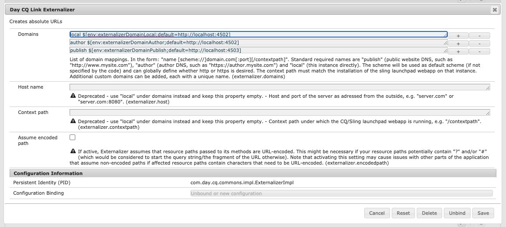

# Externalizing URLs {#externalizing-urls}

In AEM, the **Externalizer** is an OSGi service that lets you programmatically transform a resource path (for example, `/path/to/my/page`) into an external and absolute URL (for example, `https://www.mycompany.com/path/to/my/page`) by prefixing the path with a pre-configured DNS.

Because an AEM as a Cloud Service instance cannot know its externally visible URL and because sometimes a link has to be created outside of the request scope, this service provides a central place to configure those external URLs and build them.

This article explains how to configure the Externalizer service and how to use it. For technical details of the service, see [Javadocs](https://www.adobe.io/experience-manager/reference-materials/cloud-service/javadoc/com/day/cq/commons/Externalizer.html).

## Default Behavior of the Externalizer and How to Override {#default-behavior}

Out-of-the box, the Externalizer service maps a handful of domain identifiers to absolute URL prefixes matching the AEM service URLs that have been generated for the environment, such as `author https://author-p12345-e6789.adobeaemcloud.com` and `publish https://publish-p12345-e6789.adobeaemcloud.com`. The base URLs for each of these default domains are read from environment variables defined by Cloud Manager.

For reference, the default OSGi configuration for `com.day.cq.commons.impl.ExternalizerImpl.cfg.json` is effectively:

```json
{
   "externalizer.domains": [
      "local $[env:AEM_EXTERNALIZER_LOCAL;default=http://localhost:4502]",
      "author $[env:AEM_EXTERNALIZER_AUTHOR;default=http://localhost:4502]",
      "publish $[env:AEM_EXTERNALIZER_PUBLISH;default=http://localhost:4503]",
      "preview $[env:AEM_EXTERNALIZER_PREVIEW;default=http://localhost:4503]"
   ]
}
```

>[!CAUTION]
>
>The default `local`, `author`, `preview`, and `publish` Externalizer domain mappings in the OSGi configuration must be preserved with the original `$[env:...]` values listed above.
>
>Deploying a custom `com.day.cq.commons.impl.ExternalizerImpl.cfg.json` file to AEM as a Cloud Service that omits any of these out-of-the-box domain mappings may result in unpredictable application behavior.

To override the `preview` and `publish` values, use Cloud Manager environment variables as described in the article [Configuring OSGi for AEM as a Cloud Service](/help/implementing/deploying/configuring-osgi.md#cloud-manager-api-format-for-setting-properties) and setting the predefined `AEM_CDN_DOMAIN_PUBLISH` and `AEM_CDN_DOMAIN_PREVIEW` variables.

## Configuring the Externalizer Service {#configuring-the-externalizer-service}

The Externalizer service lets you centrally define the domain that can be used to programmatically prefix resource paths. The Externalizer service should only be used for applications with a single domain.

>[!NOTE]
>
>As when applying any [OSGi configurations for AEM as a Cloud Service](/help/implementing/deploying/overview.md#osgi-configuration), the following steps should be performed on a local developer instance and then committed to your project code for deployment.

To define a domain mapping for the Externalizer service:

1. Navigate to the Configuration Manager via:

   `https://<host>:<port>/system/console/configMgr`

1. Click **Day CQ Link Externalizer** to open the configuration dialog box.

   

   >[!NOTE]
   >
   >The direct link to the configuration is `https://<host>:<port>/system/console/configMgr/com.day.cq.commons.impl.ExternalizerImpl`

1. Define a **Domains** mapping. A mapping consists of a unique name that can be used in the code to reference the domain, a space, and the domain:

   `<unique-name> [scheme://]server[:port][/contextpath]`

   Where:

    * **`scheme`** is usually http or https, but can be another protocol.

        * Adobe recommends using https to enforce https links.
        * It is used if the client code does not override the scheme when asking for externalization of a URL.

    * **`server`** is the host name (either a domain name or ip address).
    * **`port`** (optional) is the port number.
    * **`contextpath`** (optional) is only set if AEM is installed as a webapp under a different context path.

   For example: `production https://my.production.instance`

   The following mapping names are predefined and must always be set as AEM relies on them:

    * `local` - the local instance
    * `author` - the authoring system DNS
    * `publish` - the public facing website DNS

   >[!NOTE]
   >
   >A custom configuration lets you add a new category, such as `production`, `staging` or even external non-AEM systems such as `my-internal-webservice`. It is useful to avoid hard coding such URLs across different places in a project's codebase.

1. Click **Save** to save your changes.

### Using the Externalizer Service {#using-the-externalizer-service}

This section shows a few examples of how the Externalizer service can be used.

>[!NOTE]
>
>No absolute links should be created in the context of HTML. Therefore, do not use this utility in such cases.

* **To externalize a path with the 'publish' domain:**

  ```java
  String myExternalizedUrl = externalizer.publishLink(resolver, "/my/page") + ".html";
  ```

  Assuming the domain mapping:

  * `publish https://www.website.com`

  * `myExternalizedUrl` ends up with the value:

  * `https://www.website.com/contextpath/my/page.html`

* **To externalize a path with the 'author' domain:**

  ```java
  String myExternalizedUrl = externalizer.authorLink(resolver, "/my/page") + ".html";
  ```

  Assuming the domain mapping:

  * `author https://author.website.com`

  * `myExternalizedUrl` ends up with the value:

  * `https://author.website.com/contextpath/my/page.html`

* **To externalize a path with the 'local' domain:**

  ```java
  String myExternalizedUrl = externalizer.externalLink(resolver, Externalizer.LOCAL, "/my/page") + ".html";
  ```

  Assuming the domain mapping:

  * `local https://publish-3.internal`

  * `myExternalizedUrl` ends up with the value:

  * `https://publish-3.internal/contextpath/my/page.html`

>[!TIP]
>
>You can find more examples in the [Javadocs](https://www.adobe.io/experience-manager/reference-materials/cloud-service/javadoc/com/day/cq/commons/Externalizer.html).
