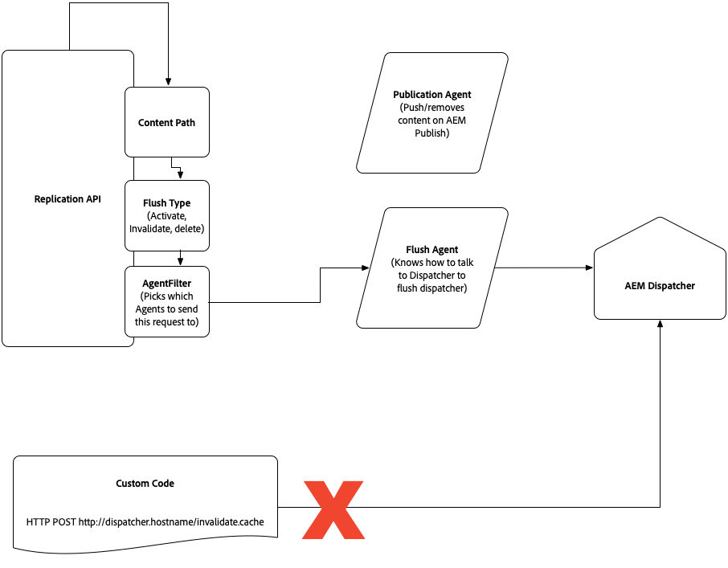

# Introduction {#intro}

Traffic passes through the CDN to an Apache web server layer, which supports modules including Dispatcher. To increase performance, Dispatcher is used primarily as a cache to limit processing on the publish nodes.
Rules can be applied to the Dispatcher configuration to modify any default cache expiration settings, resulting in caching at the CDN. Dispatcher also respects the resulting cache expiration headers if `enableTTL` is enabled in the Dispatcher configuration, implying that it refreshes specific content even outside of content being republished.

This page also describes how the Dispatcher cache is invalidated and how caching works at the browser level regarding client-side libraries.

## Caching {#caching}

### HTML/Text {#html-text}

* by default, cached by the browser for five minutes, based on the `cache-control` header emitted by the Apache layer. The CDN also respects this value.
* the default HTML/Text caching setting can be disabled by defining the `DISABLE_DEFAULT_CACHING` variable in `global.vars`:

```
Define DISABLE_DEFAULT_CACHING

```

This method is useful, for example, when your business logic requires fine-tuning of the age header (with a value based on calendar day) since by default the age header is set to 0. That said, **exercise caution when turning off default caching.**

* can be overridden for all HTML/Text content by defining the `EXPIRATION_TIME` variable in `global.vars` using the AEM as a Cloud Service SDK Dispatcher tools.
* can be overridden on a finer grained level, including controlling CDN and browser cache independently, with the following Apache `mod_headers` directives:

   ```
   <LocationMatch "^/content/.*\.(html)$">
        Header set Cache-Control "max-age=200"
        Header set Surrogate-Control "max-age=3600"
        Header set Age 0
   </LocationMatch>
   ```

   >[!NOTE]
   >The Surrogate-Control header applies to the Adobe managed CDN. If using a [customer-managed CDN](https://experienceleague.adobe.com/docs/experience-manager-cloud-service/content/implementing/content-delivery/cdn.html#point-to-point-CDN), a different header may be required depending on your CDN provider.

   Exercise caution when setting either global cache control headers or similar cache headers that match a wide regex so they are not applied to content that you must keep private. Consider using multiple directives to ensure rules are applied in a fine-grained manner. With that said, AEM as a Cloud Service removes the cache header if it detects that it has been applied to what it detects to be uncacheable by Dispatcher, as described in Dispatcher documentation. To force AEM to always apply the caching headers, one can add the **`always`** option as follows:

   ```
   <LocationMatch "^/content/.*\.(html)$">
        Header unset Cache-Control
        Header unset Expires
        Header always set Cache-Control "max-age=200"
        Header set Age 0
   </LocationMatch>

   ```

   Ensure that a file under `src/conf.dispatcher.d/cache` has the following rule (which is in the default configuration):

   ```
   /0000
   { /glob "*" /type "allow" }

   ```

* To prevent specific content from being cached **at the CDN**, set the Cache-Control header to *private*. For example, the following would prevent html content under a directory named **secure** from being cached at the CDN:

   ```
      <LocationMatch "/content/secure/.*\.(html)$">.  // replace with the right regex
      Header unset Cache-Control
      Header unset Expires
      Header always set Cache-Control "private"
     </LocationMatch>

   ```

* While HTML content set to private is not cached at the CDN, it can be cached at the Dispatcher if [Permission Sensitive Caching](https://experienceleague.adobe.com/docs/experience-manager-dispatcher/using/configuring/permissions-cache.html) is configured, ensuring that only authorized users can be served the content.

   >[!NOTE]
   >The other methods, including the [Dispatcher-ttl AEM ACS Commons project](https://adobe-consulting-services.github.io/acs-aem-commons/features/dispatcher-ttl/), does not successfully override values.

   >[!NOTE]
   >The Dispatcher might still cache content according to its own [caching rules](https://experienceleague.adobe.com/docs/experience-cloud-kcs/kbarticles/KA-17497.html). To make the content truly private, ensure that it is not cached by Dispatcher.

### Client-Side libraries (js,css) {#client-side-libraries}

* When using AEM's Client-Side library framework, JavaScript and CSS code is generated in such a way that browsers can cache it indefinitely, since any changes manifest as new files with a unique path. In other words, HTML that references the client libraries are produced as needed so customers can experience new content as it is published. The cache-control is set to "immutable" or 30 days for older browsers who do not respect the "immutable" value.
* see the section [Client-side libraries and version consistency](#content-consistency) for additional details.

### Images and any content large enough to be stored in blob storage {#images}

The default behavior for programs created after mid-May 2022 (specifically, for program ids that are higher than 65000) is to cache by default,while also respecting the request's authentication context. Older programs (program ids equal or lower than 65000) do not cache blob content by default.

In both cases, the caching headers can be overridden on a finer grained level at the Apache/Dispatcher layer by using the Apache `mod_headers` directives, for example:

   ```
      <LocationMatch "^/content/.*\.(jpeg|jpg)$">
        Header set Cache-Control "max-age=222"
        Header set Age 0
      </LocationMatch>

   ```

When modifying the caching headers at the Dispatcher layer, be cautious not to cache too widely. See the discussion in the HTML/text section [above](#html-text). Also, make sure that assets that are meant to be kept private (rather than cached) are not part of the `LocationMatch` directive filters.

JCR resources (bigger than 16KB) that are stored in blob store are typically served as 302 redirects by AEM. These redirects are intercepted and followed by CDN and the content is delivered directly from the blob store. Only a limited set of headers can be customised on these responses. For example, to customise `Content-Disposition` you should use the dispatcher directives as follows:

```
<LocationMatch "\.(?i:pdf)$">
  ForceType application/pdf
  Header set Content-Disposition inline
  </LocationMatch>

```

The list of headers that can be be customised on blob responses are:

```
content-security-policy
x-frame-options
x-xss-protection
x-content-type-options
x-robots-tag
access-control-allow-origin
content-disposition
permissions-policy
referrer-policy
x-vhost
content-disposition
cache-control
vary

```

#### New default caching behavior {#new-caching-behavior}

The AEM layer sets cache headers depending on whether the cache header has already been set and the value of the request type. If no cache control header is set, public content is cached, and authenticated traffic is set to private. If a cache control header is set, the cache headers are left untouched.

| Cache control header exists? | Request type  | AEM sets cache headers to                      |
|------------------------------|---------------|------------------------------------------------|
| No                           | public        | Cache-Control: public, max-age=600, immutable  |
| No                           | authenticated | Cache-Control: private, max-age=600, immutable |
| Yes                          | any           | unchanged                                      |

While not recommended, it is possible to change the new default behavior to follow the older behavior (program ids equal or lower than 65000) by setting the Cloud Manager environment variable `AEM_BLOB_ENABLE_CACHING_HEADERS` to false.

#### Older default caching behavior {#old-caching-behavior}

The AEM layer does not cache blob content by default.

>[!NOTE]
>Change the older default behavior to be consistent with the new behavior (program ids that are higher than 65000) by setting the Cloud Manager environment variable AEM_BLOB_ENABLE_CACHING_HEADERS to true. If the program is already live, make sure you verify that after the changes, content behaves as you expect.

Now, images in blob storage that are marked private cannot be cached at the Dispatcher using [Permission Sensitive Caching](https://experienceleague.adobe.com/docs/experience-manager-dispatcher/using/configuring/permissions-cache.html). The image is always requested from the AEM origin and served if the user is authorized.  

>[!NOTE]
>The other methods, including the [dispatcher-ttl AEM ACS Commons project](https://adobe-consulting-services.github.io/acs-aem-commons/features/dispatcher-ttl/), do not successfully override the values.

### Other content file types in node store {#other-content}

* no default caching
* default cannot be set with the `EXPIRATION_TIME` variable used for html/text file types
* cache expiration can be set with the same LocationMatch strategy described in the html/text section by specifying the appropriate regex

### Further Optimizations {#further-optimizations}

* Avoid using `User-Agent` as part of the `Vary` header. Older versions of the default Dispatcher setup (before archetype version 28) included it and Adobe recommends that you remove it by using the steps below.
   * Locate the vhost files in `<Project Root>/dispatcher/src/conf.d/available_vhosts/*.vhost`
   * Remove or comment out the line: `Header append Vary User-Agent env=!dont-vary` from all vhost files, except for default.vhost, which is read-only
* Use the `Surrogate-Control` header to control CDN caching independent from browser caching
* Consider applying [`stale-while-revalidate`](https://developer.mozilla.org/en-US/docs/Web/HTTP/Headers/Cache-Control#stale-while-revalidate) and [`stale-if-error`](https://developer.mozilla.org/en-US/docs/Web/HTTP/Headers/Cache-Control#stale-if-error) directives to allow background refresh and avoid cache misses, keeping your content fast and fresh for users.
   * There are many ways to apply these directives, but adding a 30-minute `stale-while-revalidate` to all cache control headers is a good starting point.
* Some examples follow for various content types, which can be used as a guide when setting up your own caching rules. Carefully consider and test for your specific setup and requirements:

   * Cache mutable client library resources for 12 hours and background refresh after 12 hours.
   
      ```
      <LocationMatch "^/etc\.clientlibs/.*\.(?i:json|png|gif|webp|jpe?g|svg)$">
         Header set Cache-Control "max-age=43200,stale-while-revalidate=43200,stale-if-error=43200,public" "expr=%{REQUEST_STATUS} < 400"
         Header set Age 0
      </LocationMatch>
      ```

   * Cache immutable client library resources long-term (30 days) with background refresh to avoid MISS.

      ```
      <LocationMatch "^/etc\.clientlibs/.*\.(?i:js|css|ttf|woff2)$">
         Header set Cache-Control "max-age=2592000,stale-while-revalidate=43200,stale-if-error=43200,public,immutable" "expr=%{REQUEST_STATUS} < 400"
         Header set Age 0
      </LocationMatch>
      ```

   * Cache HTML pages for five minutes with background refresh one hour on browser and 12 hours on CDN. Cache-Control headers are always added so it is important to ensure that matching html pages under /content/* are intended to be public. If not, consider using a more specific regex.

      ```
      <LocationMatch "^/content/.*\.html$">
         Header unset Cache-Control
         Header always set Cache-Control "max-age=300,stale-while-revalidate=3600" "expr=%{REQUEST_STATUS} < 400"
         Header always set Surrogate-Control "stale-while-revalidate=43200,stale-if-error=43200" "expr=%{REQUEST_STATUS} < 400"
         Header set Age 0
      </LocationMatch>
      ```

   * Cache content services/Sling model exporter json responses for five minutes with background refresh one hour on browser and 12 hours on CDN.

      ```
      <LocationMatch "^/content/.*\.model\.json$">
         Header set Cache-Control "max-age=300,stale-while-revalidate=3600" "expr=%{REQUEST_STATUS} < 400"
         Header set Surrogate-Control "stale-while-revalidate=43200,stale-if-error=43200" "expr=%{REQUEST_STATUS} < 400"
         Header set Age 0
      </LocationMatch>
      ```

   * Cache immutable URLs from the core image component long-term (30 days) with background refresh to avoid MISS.

      ```
      <LocationMatch "^/content/.*\.coreimg.*\.(?i:jpe?g|png|gif|svg)$">
         Header set Cache-Control "max-age=2592000,stale-while-revalidate=43200,stale-if-error=43200,public,immutable" "expr=%{REQUEST_STATUS} < 400"
         Header set Age 0
      </LocationMatch>
      ```

   * Cache mutable resources from the DAM like images and video for 24 hours and background refresh after 12 hours to avoid MISS.

      ```
      <LocationMatch "^/content/dam/.*\.(?i:jpe?g|gif|js|mov|mp4|png|svg|txt|zip|ico|webp|pdf)$">
         Header set Cache-Control "max-age=43200,stale-while-revalidate=43200,stale-if-error=43200" "expr=%{REQUEST_STATUS} < 400"
         Header set Age 0
      </LocationMatch>
      ```

### Analyzing CDN Cache Hit Ratio {#analyze-chr}

See the [cache hit ratio analysis tutorial](https://experienceleague.adobe.com/docs/experience-manager-learn/cloud-service/caching/cdn-cache-hit-ratio-analysis.html) for information about downloading CDN logs and analyzing your site's cache hite ratio, using a dashboard.

### HEAD request behavior {#request-behavior}

When a HEAD request is received at the Adobe CDN for a resource that is **not** cached, the request is transformed and received by the Dispatcher and/or AEM instance as a GET request. If the response is cacheable, then subsequent HEAD requests are served from the CDN. If the response is not cacheable, then subsequent HEAD requests are passed to the Dispatcher, or AEM instance, or both, for a time that depends on the `Cache-Control` TTL.

### Marketing campaign parameters {#marketing-parameters}

Website URLs frequently include marketing campaign parameters that are used to track a campaign's success. 

For environments created in October 2023 or later, to better cache requests, the CDN will remove common marketing related query parameters, specifically those matching the following regex pattern:
 
```
^(utm_.*|gclid|gdftrk|_ga|mc_.*|trk_.*|dm_i|_ke|sc_.*|fbclid|msclkid|ttclid)$
```

This functionality can be toggled on and off using a `requestTransformations` flag in [CDN configuration](https://experienceleague.adobe.com/en/docs/experience-manager-cloud-service/content/implementing/content-delivery/cdn-configuring-traffic#request-transformations).

For example, to stop removing marketing params at CDN level one should deploy `removeMarketingParams: false` using a config that contains the following section.

```
kind: "CDN"
version: "1"
metadata:
  envTypes: ["dev", "stage", "prod"]
data:
  requestTransformations:
    removeMarketingParams: false
```

In case `removeMarketingParams` functionalisty is disabled at CDN level it is still recommended to configure the Dispatcher configuration's `ignoreUrlParams` property; see [Configuring Dispatcher - Ignoring URL Parameters](https://experienceleague.adobe.com/docs/experience-manager-dispatcher/using/configuring/dispatcher-configuration.html#ignoring-url-parameters).

There are two possibilities to ignore marketing parameters. (Where the first one is preferred to ignore cache busting via query parameters):

1. Ignore all parameters and selectively allow parameters that are used. 
In the following example only `page` and `product` parameters are not ignored and the requests will be forwarded to the publisher.

```
/ignoreUrlParams {
   /0001 { /glob "*" /type "allow" }
   /0002 { /glob "page" /type "deny" }
   /0003 { /glob "product" /type "deny" }
}
```

2. Allow all parameters except the marketing parameters. The file [marketing_query_parameters.any](https://github.com/adobe/aem-project-archetype/blob/develop/src/main/archetype/dispatcher.cloud/src/conf.dispatcher.d/cache/marketing_query_parameters.any) defines a list of commonly used marketing parameters that will be ignored. Adobe will not update this file. It can be extended by users depending on their marketing providers.
```
/ignoreUrlParams {
   /0001 { /glob "*" /type "deny" }
   $include "../cache/marketing_query_parameters.any"
}
```


## Dispatcher Cache Invalidation {#disp}

In general, it is not necessary to invalidate the Dispatcher cache. Instead, you should rely on the Dispatcher refreshing its cache when content is being republished and the CDN respecting cache expiration headers.

### Dispatcher Cache Invalidation during Activation/Deactivation {#cache-activation-deactivation}

Like previous versions of AEM, publishing or unpublishing pages clears the content from the Dispatcher cache. If a caching issue is suspected, you should republish the pages in question and ensure that a virtual host is available that matches the `ServerAlias` localhost, which is required for Dispatcher cache invalidation.

>[!NOTE]
>For proper Dispatcher invalidation, make sure that requests from "127.0.0.1", "localhost", "\*.local", "\*.adobeaemcloud.com", and "\*.adobeaemcloud.net" are all matched and handled by a vhost configuration so the request can be served. You can do this task by global matching "*" in a catch-all vhost configuration following the pattern in the reference [AEM archetype](https://github.com/adobe/aem-project-archetype/blob/develop/src/main/archetype/dispatcher.cloud/src/conf.d/available_vhosts/default.vhost). Or, you can ensure that the previously mentioned list is caught by one of the vhosts.

When the publish instance receives a new version of a page or asset from the author, it uses the flush agent to invalidate appropriate paths on its Dispatcher. The updated path is removed from the Dispatcher cache, together with its parents, up to a level (you can configure this level with the [statfileslevel](https://experienceleague.adobe.com/docs/experience-manager-dispatcher/using/configuring/dispatcher-configuration.html#invalidating-files-by-folder-level)).

## Explicit invalidation of the Dispatcher cache {#explicit-invalidation}

Adobe recommends that you rely on standard cache headers to control the content delivery life cycle. However, if needed, it is possible to invalidate content directly in Dispatcher.

The following list contains scenarios where you might want to explicitly invalidate the cache (while optionally listening for the completion of the invalidation):

* After publishing content such as experience fragments or content fragments, invalidating published and cached content that references those elements.
* Notifying an external system when referenced pages have been successfully invalidated.

There are two approaches to explicitly invalidate the cache:

* The preferred approach is using Sling Content Distribution (SCD) from Author.  
* The other approach is to use the Replication API to invoke the publish Dispatcher flush replication agent.

The approaches differ in terms of tier availability, the ability to deduplicate events and event processing guarantee. The table below summarizes these options:

<table style="table-layout:auto">
 <tbody>
  <tr>
    <th>N/A</th>
    <th>Tier availability</th>
    <th>Deduplication </th>
    <th>Guarantee </th>
    <th>Action </th>
    <th>Impact </th>
    <th>Description </th>
  </tr>  
  <tr>
    <td>Sling Content Distribution (SCD) API</td>
    <td>Author</td>
    <td>Possible using either the Discovery API or enabling the <a href="https://github.com/apache/sling-org-apache-sling-distribution-journal/blob/e18f2bd36e8b43814520e87bd4999d3ca77ce8ca/src/main/java/org/apache/sling/distribution/journal/impl/publisher/DistributedEventNotifierManager.java#L146-L149">deduplication mode</a>.</td>
    <td>At least once.</td>
    <td>
     <ol>
       <li>ADD</li>
       <li>DELETE</li>
       <li>INVALIDATE</li>
     </ol>
     </td>
    <td>
     <ol>
       <li>Hierarchical/Stat Level</li>
       <li>Hierarchical/Stat Level</li>
       <li>Level Resource-Only</li>
     </ol>
     </td>
    <td>
     <ol>
       <li>Publishes content and invalidates the cache.</li>
       <li>Removes content and invalidates the cache.</li>
       <li>Invalidates content without publishing it.</li>
     </ol>
     </td>
  </tr>
  <tr>
    <td>Replication API</td>
    <td>Publish</td>
    <td>Not possible, event raised on every publish instance.</td>
    <td>Best effort.</td>
    <td>
     <ol>
       <li>ACTIVATE</li>
       <li>DEACTIVATE</li>
       <li>DELETE</li>
     </ol>
     </td>
    <td>
     <ol>
       <li>Hierarchical/Stat Level</li>
       <li>Hierarchical/Stat Level</li>
       <li>Hierarchical/Stat Level</li>
     </ol>
     </td>
    <td>
     <ol>
       <li>Publishes content and invalidates the cache.</li>
       <li>From Author/Publish Tier - Removes content and invalidates the cache.</li>
       <li><p><strong>From Author Tier</strong> - Removes content and invalidates the cache (if triggered from AEM Author tier on the Publish agent).</p>
           <p><strong>From Publish Tier</strong> - Invalidates only the cache (if triggered from AEM Publish tier on the Flush or Resource-only-flush agent).</p>
       </li>
     </ol>
     </td>
  </tr>
  </tbody>
</table>

The two actions directly related to cache invalidation are Sling Content Distribution (SCD) API Invalidate and Replication API Deactivate.

Also, from the table, you can observe that:

* SCD API is needed when every event must be guaranteed, for example, syncing with an external system that requires accurate knowledge. If there is a publish tier upscaling event at the time of the invalidation call, an extra event is raised when each new publish processes the invalidation.

* Using the Replication API is not a common use case, but can be used in cases where the trigger to invalidate the cache comes from the publish tier and not the author tier. This method might be useful if Dispatcher TTL is configured.

In conclusion, if you are looking to invalidate the Dispatcher cache, the recommended option is to use the SCD API Invalidate action from Author. Also, you can also listen for the event so you can then trigger further downstream actions.

### Sling Content Distribution (SCD) {#sling-distribution}

>[!NOTE]
>When using the instructions presented below, test the custom code in an AEM Cloud Service Dev environment and not locally.

When using the SCD action from Author, the implementation pattern is as follows:

1. From Author, write custom code to invoke the sling content distribution [API](https://sling.apache.org/documentation/bundles/content-distribution.html), passing the invalidate action with a list of paths:

```
@Reference
private Distributor distributor;

ResourceResolver resolver = ...; // the resource resolver used for authorizing the request
String agentName = "publish";    // the name of the agent used to distribute the request

String pathToInvalidate = "/content/to/invalidate";
DistributionRequest distributionRequest = new SimpleDistributionRequest(DistributionRequestType.INVALIDATE, false, pathToInvalidate);
distributor.distribute(agentName, resolver, distributionRequest);

```

* (Optionally) Listen for an event that reflects the resource being invalidated for all Dispatcher instances:


```
package org.apache.sling.distribution.journal.shared;

import org.apache.sling.discovery.DiscoveryService;
import org.apache.sling.distribution.journal.impl.event.DistributionEvent;
import org.osgi.service.component.annotations.Component;
import org.osgi.service.component.annotations.Reference;
import org.osgi.service.event.Event;
import org.osgi.service.event.EventHandler;
import org.slf4j.Logger;
import org.slf4j.LoggerFactory;

import static org.apache.sling.distribution.DistributionRequestType.INVALIDATE;
import static org.apache.sling.distribution.event.DistributionEventProperties.DISTRIBUTION_PATHS;
import static org.apache.sling.distribution.event.DistributionEventProperties.DISTRIBUTION_TYPE;
import static org.apache.sling.distribution.event.DistributionEventTopics.AGENT_PACKAGE_DISTRIBUTED;
import static org.osgi.service.event.EventConstants.EVENT_TOPIC;

@Component(immediate = true, service = EventHandler.class, property = {
        EVENT_TOPIC + "=" + AGENT_PACKAGE_DISTRIBUTED
})
public class InvalidatedHandler implements EventHandler {
    private static final Logger LOG = LoggerFactory.getLogger(InvalidatedHandler.class);

    @Reference
    private DiscoveryService discoveryService;

    @Override
    public void handleEvent(Event event) {

        String distributionType = (String) event.getProperty(DISTRIBUTION_TYPE);

        if (INVALIDATE.name().equals(distributionType)) {
            boolean isLeader = discoveryService.getTopology().getLocalInstance().isLeader();
            // process the OSGi event on the leader author instance
            if (isLeader) {
                String[] paths = (String[]) event.getProperty(DISTRIBUTION_PATHS);
                String packageId = (String) event.getProperty(DistributionEvent.PACKAGE_ID);
                invalidated(paths, packageId);
            }
        }
    }

    private void invalidated(String[] paths, String packageId) {
        // custom logic
        LOG.info("Successfully applied package with id {}, paths {}", packageId, paths);
    }
}

```

<!-- Optionally, instead of using the isLeader approach, one could add an OSGi configuration for the PID org.apache.sling.distribution.journal.impl.publisher.DistributedEventNotifierManager and property deduplicateEvent=true. But we'll stick with just one strategy and not mention it (double-check this).**review this**-->

* (Optionally) Execute business logic in the `invalidated(String[] paths, String packageId)` method above.

>[!NOTE]
>
>The Adobe CDN is not flushed when Dispatcher is invalidated. The Adobe-managed CDN respects TTLs and thus there is no need for it to be flushed.

### Replication API {#replication-api}

Presented below is the implementation pattern when using the replication API Deactivate action:

1. On the publish tier, call the Replication API to trigger the publish Dispatcher flush replication agent.

The flush agent endpoint is not configurable but rather preconfigured to point to Dispatcher, matched with the publish service running alongside the flush agent.

The flush agent can typically be triggered by custom code based on OSGi events or workflows.

```
String[] paths = …
ReplicationOptions options = new ReplicationOptions();
options.setSynchronous(true);
options.setFilter( new AgentFilter {
  public boolean isIncluded (Agent agent) {
   return agent.getId().equals("flush");
  }
});

Replicator.replicate (session,ReplicationActionType.DELETE,paths, options);
```

<!-- In general, it will not be necessary to manually invalidate content in the dispatcher, but it is possible if needed.

>[!NOTE]
>Prior to AEM as a Cloud Service, there were two ways of invalidating the dispatcher cache.
>
>1. Invoke the replication agent, specifying the publish dispatcher flush agent
>2. Directly calling the `invalidate.cache` API (for example, `POST /dispatcher/invalidate.cache`)
>
>The dispatcher's `invalidate.cache` API approach will no longer be supported since it addresses only a specific dispatcher node. AEM as a Cloud Service operates at the service level, not the individual node level and so the invalidation instructions in the [Invalidating Cached Pages From AEM](https://experienceleague.adobe.com/docs/experience-manager-dispatcher/using/configuring/page-invalidate.html) page are not longer valid for AEM as a Cloud Service.

The replication flush agent should be used. This can be done using the [Replication API](https://www.adobe.io/experience-manager/reference-materials/cloud-service/javadoc/com/day/cq/replication/Replicator.html). The flush agent endpoint is not configurable but pre-configured to point to the dispatcher, matched with the publish service running the flush agent. The flush agent can typically be triggered by OSGi events or workflows.

<!-- Need to find a new link and/or example -->
<!-- 
and for an example of flushing the cache, see the [API example page](https://helpx.adobe.com/experience-manager/using/aem64_replication_api.html) (specifically the `CustomStep` example issuing a replication action of type ACTIVATE to all available agents). 

The diagram presented below illustrates this.



If there is a concern that the dispatcher cache is not clearing, contact [customer support](https://helpx.adobe.com/support.ec.html) who can flush the dispatcher cache if necessary.

The Adobe-managed CDN respects TTLs and thus there is no need fo it to be flushed. If an issue is suspected, [contact customer support](https://helpx.adobe.com/support.ec.html) support who can flush an Adobe-managed CDN cache as necessary. -->

## Client-Side libraries and Version Consistency {#content-consistency}

Pages are composed of HTML, JavaScript, CSS, and images. Customers are encouraged to use the [Client-Side Libraries (clientlibs) framework](/help/implementing/developing/introduction/clientlibs.md) to import JavaScript and CSS resources into HTML pages, accounting for dependencies between JS libraries.

The clientlibs framework provides automatic version management. What this means is that developers can check in changes to JS libraries in source control and the latest version is made available when a customer pushes their release. Without this workflow, developers must manually change HTML with references to the new version of the library, which is especially onerous if the same library shares many HTML templates.

When the new versions of libraries are released to production, the referencing HTML pages are updated with new links to those updated library versions. After the browser cache expires for a given HTML page, there is no concern that the old libraries are loaded from the browser cache. The reason is because the refreshed page (from AEM) now is guaranteed to reference the new versions of the libraries. That is, a refreshed HTML page includes all the latest library versions.

The mechanism behind this ability is a serialized hash, which is appended to the client library link. It ensures a unique, versioned url for the browser to cache the CSS/JS. The serialized hash is only updated when the contents of the client library changes. Which means that if unrelated updates occur (that is, no changes to the underlying css/js of the client library) even with a new deployment, the reference remains the same. In turn, it ensures less disruption to the browser cache.

### Enabling Longcache versions of Client-Side Libraries - AEM as a Cloud Service SDK Quickstart {#enabling-longcache}

Default clientlib includes on an HTML page look like the following example:

```
<link rel="stylesheet" href="/etc.clientlibs/wkndapp/clientlibs/clientlib-base.css" type="text/css">

```

When strict clientlib versioning is enabled, a long-term hash key is added as a selector to the client library. As a result, the clientlib reference look like this:

```
<link rel="stylesheet" href="/etc.clientlibs/wkndapp/clientlibs/clientlib-base.lc-7c8c5d228445ff48ab49a8e3c865c562-lc.css" type="text/css">

```

Strict clientlib versioning is enabled by default in all AEM as a Cloud Service environment.

To enable strict clientlib versioning in the local SDK Quickstart, do the following:

1. Navigate to the OSGi Configuration manager `<host>/system/console/configMgr`
1. Find the OSGi Config for Adobe Granite HTML Library Manager:
   * Check the checkbox so you enable Strict Versioning
   * In the field labeled **Long term client side cache key**, enter the value of /.*;hash
1. Save the changes. It is not necessary to save this configuration in source control since AEM as a Cloud Service automatically enables this configuration in dev, stage, and production environments.
1. Anytime the contents of the client library are changed, a new hash key is generated and the HTML reference is updated.
