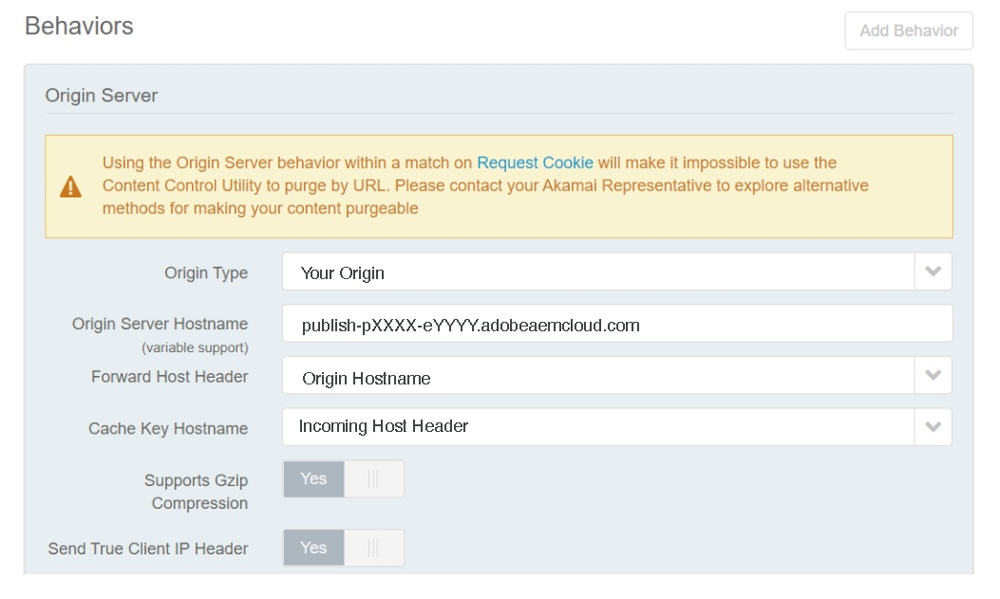
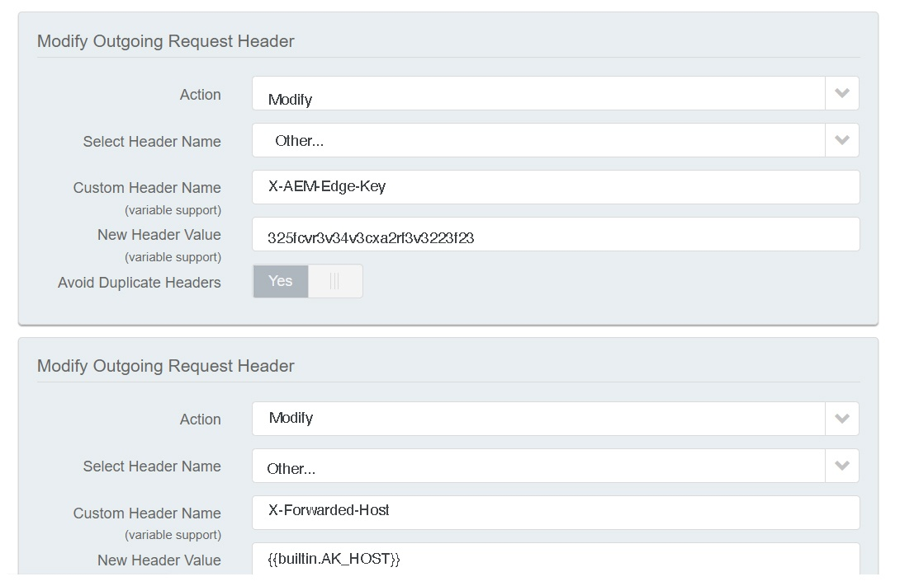
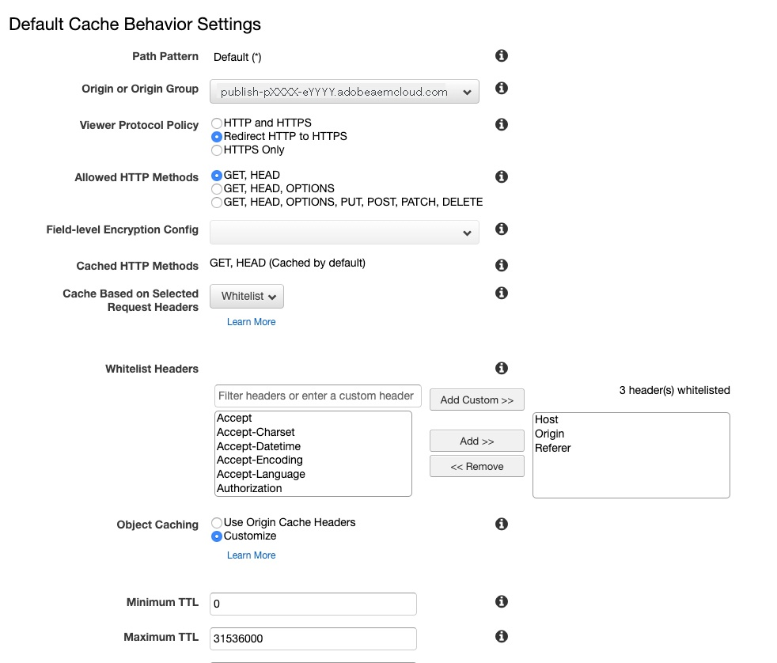
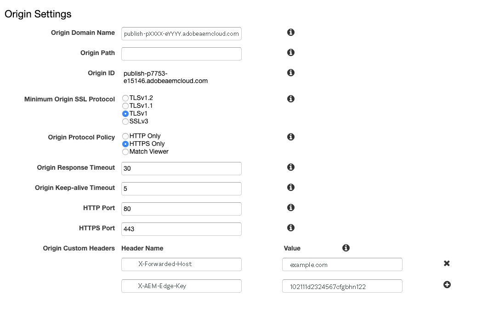
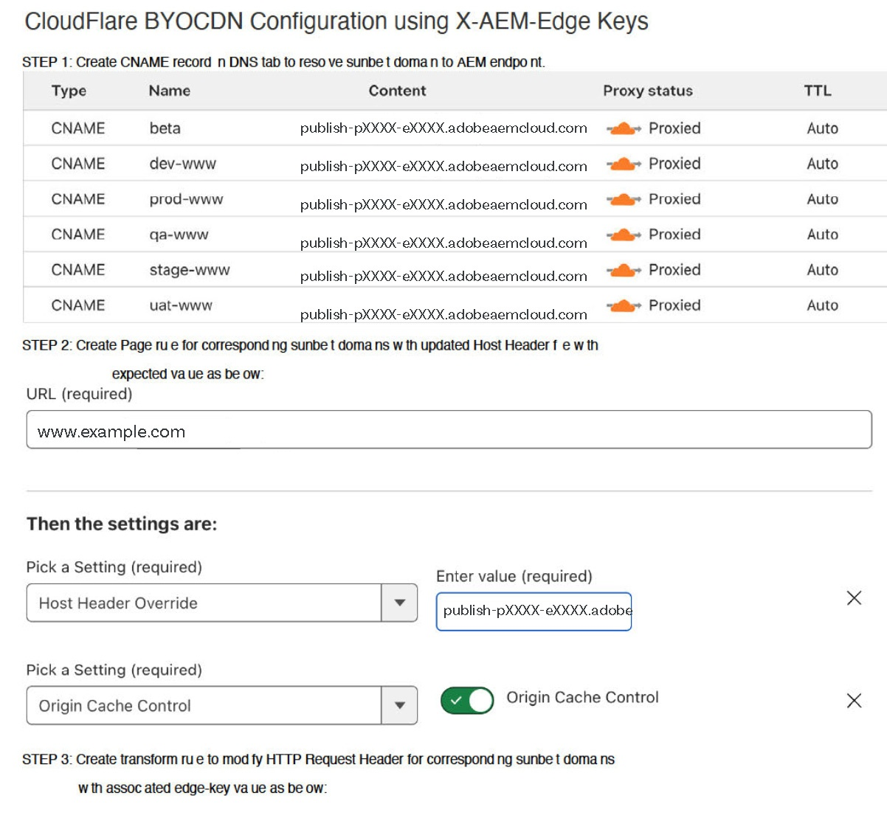
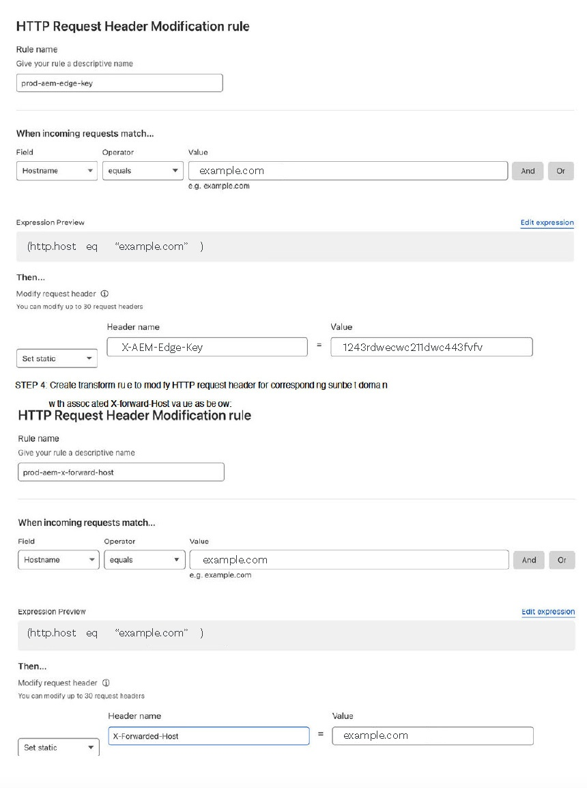

# CDN in AEM as a Cloud Service {#cdn}

>[!CONTEXTUALHELP]
>id="aemcloud_golive_cdn"
>title="CDN in AEM as a Cloud Service"
>abstract="AEM as Cloud Service is shipped with a built-in CDN. Its main purpose is to reduce latency by delivering cacheable content from the CDN nodes at the edge, near the browser. It is fully managed and configured for optimal performance of AEM applications."

AEM as a Cloud Service comes with an integrated CDN, designed to reduce latency by delivering cacheable content from edge nodes close to the user's browser. This fully managed CDN is optimized for AEM application performance.

The AEM-managed CDN meets most customers' performance and security needs. For the publish tier, customers can choose to route traffic through their own CDN, which they must manage. This option is available on a case-by-case basis, particularly when customers have existing legacy integrations with a CDN provider that are hard to replace.

Customers looking to publish to the Edge Delivery Services tier can take advantage of Adobe's managed CDN. See [Adobe Managed CDN](#aem-managed-cdn). <!-- CQDOC-21758, 5b -->


<!-- ERROR: NEITHER URL IS FOUND (HTTP ERROR 404) Also, see the following videos [Cloud 5 AEM CDN Part 1](https://experienceleague.adobe.com/docs/experience-manager-learn/cloud-service/cloud-5/cloud5-aem-cdn-part1.html) and [Cloud 5 AEM CDN Part 2](https://experienceleague.adobe.com/docs/experience-manager-learn/cloud-service/cloud-5/cloud5-aem-cdn-part2.html) for additional information about CDN in AEM as a Cloud Service. -->

## Adobe Managed CDN {#aem-managed-cdn}

<!-- CQDOC-21758, 5a -->

To prepare for content delivery using AEM's built-in CDN through Cloud Manager's self-service UI, you can take advantage of Adobe's managed CDN features. This functionality lets you handle self-service CDN management, including configuring and installing SSL certificates such as DV (Domain Validation) or EV/OV (Extended/Organization Validation) certificates. For more details on these methods, see the following:

* [Edge Delivery Services in Cloud Manager](/help/implementing/cloud-manager/edge-delivery/introduction-to-edge-delivery-services.md)
* [Introduction to custom domain names](/help/implementing/cloud-manager/custom-domain-names/introduction.md)
* [Introduction to SSL certificates](/help/implementing/cloud-manager/managing-ssl-certifications/introduction-to-ssl-certificates.md)
* [Configure a CDN](/help/implementing/cloud-manager/cdn-configurations/add-cdn-config.md)

**Restricting traffic**

By default, for an AEM-managed CDN setup, all public traffic can make its way to the publish service, for both production and non-production (development and stage) environments. You can limit traffic to the publish service for a given environment (for example, limiting staging by a range of IP addresses) by way of the Cloud Manager user interface.

See [Managing IP Allow Lists](/help/implementing/cloud-manager/ip-allow-lists/introduction.md) to learn more.

>[!CAUTION]
>
>AEM's managed CDN serves requests only from allowed IPs. If you point your own CDN to the AEM-managed CDN, then make sure the IPs of your CDN are included in the IP Allow List.

### Configure traffic at the CDN {#cdn-configuring-cloud}

You can configure traffic at the CDN in various ways, including:

* blocking malicious traffic with [Traffic Filter Rules](/help/security/traffic-filter-rules-including-waf.md) (including optionally licensable advanced WAF rules)
* modifying the nature of the [request and response](/help/implementing/dispatcher/cdn-configuring-traffic.md#request-transformations)
* applying 301/302 [client-side redirects](/help/implementing/dispatcher/cdn-configuring-traffic.md#client-side-redirectors)
* declaring [origin selectors](/help/implementing/dispatcher/cdn-configuring-traffic.md#client-side-redirectors) to reverse proxy a request to non-AEM backends

Use YAML files in Git to configure these features. And, use the Cloud Manager [Config Pipeline](/help/implementing/dispatcher/cdn-configuring-traffic.md) to deploy them.

### Configure CDN error pages {#cdn-error-pages}

You can configure a CDN error page to replace the default, unbranded page. This custom page is displayed in the rare event that AEM is unavailable. For more details, see [Configuring CDN error pages](/help/implementing/dispatcher/cdn-error-pages.md).

### Purge cached content at the CDN {#purge-cdn}

Setting TTL using the HTTP Cache-Control header is an effective approach to balance content delivery performance and content freshness. However, in scenarios where it is critical to serve updated content immediately, it may be beneficial to purge the CDN cache directly.

Read about [configuring a purge API token](/help/implementing/dispatcher/cdn-credentials-authentication.md/#purge-API-token) and [purging cached CDN content](/help/implementing/dispatcher/cdn-cache-purge.md).

### Basic authentication at the CDN {#basic-auth}

For light authentication use cases including business stakeholders reviewing content, protect content by displaying a basic auth dialog requiring a username and password. [Learn more](/help/implementing/dispatcher/cdn-credentials-authentication.md).

## Customer managed CDN points to AEM managed CDN {#point-to-point-CDN}

>[!CONTEXTUALHELP]
>id="aemcloud_golive_byocdn"
>title="Customer CDN points to AEM Managed CDN"
>abstract="AEM as Cloud Service offers an option for customers to use its existing CDN. For the publish tier, customers can optionally point to it from their own CDN, which they must manage. This scenario is allowed on a case-by-case basis, based on meeting certain pre-requisites including, but not limited to, the customer having a legacy integration with their CDN vendor that is difficult to abandon."

If a customer must use its existing CDN, they can manage it and point it to the AEM-managed CDN, providing the following are satisfied:

* The customer must have an existing CDN that would be onerous to replace.
* The customer must manage it.
* The customer must be able to configure the CDN to work with AEM as a Cloud Service - see the configuration instructions presented below.
* The customer must have engineering CDN experts that are on call in case-related issues arise.
* The customer must perform and successfully pass a load test before going to production.

Configuration instructions:

1. Point your CDN to the Adobe CDN's ingress as its origin domain. For example, `publish-p<PROGRAM_ID>-e<ENV-ID>.adobeaemcloud.com`.
1. Set SNI to the Adobe CDN's ingress.
1. Set the Host header to the origin domain. For example: `Host:publish-p<PROGRAM_ID>-e<ENV-ID>.adobeaemcloud.com`.
1. Set the `X-Forwarded-Host` header with the domain name so AEM can determine the host header. For example: `X-Forwarded-Host:example.com`.
1. Set `X-AEM-Edge-Key`. The value should be configured using a Cloud Manager config pipeline, as described in [this article](/help/implementing/dispatcher/cdn-credentials-authentication.md#CDN-HTTP-value).

   * Needed so that the Adobe CDN can validate the source of the requests and pass the `X-Forwarded-*` headers to the AEM application. For example,`X-Forwarded-For` is used to determine the client IP. So, it becomes the responsibility of the trusted caller (that is, the customer managed CDN) to ensure the correctness of the `X-Forwarded-*` headers (see the note below).
   * Optionally, access to Adobe CDN's ingress can be blocked when an `X-AEM-Edge-Key` is not present. Inform Adobe if you need direct access to Adobe CDN's ingress (to be blocked).

See the [Sample CDN vendor configurations](#sample-configurations) section for configuration examples from leading CDN vendors.

Before accepting live traffic, you should validate with Adobe's customer support that the end-to-end traffic routing is functioning correctly.

After setting the `X-AEM-Edge-Key`, you can test that the request is routed correctly as follows.

In Linux&reg;:

```
curl https://publish-p<PROGRAM_ID>-e<ENV-ID>.adobeaemcloud.com -H "X-Forwarded-Host: example.com" -H "X-AEM-Edge-Key: <PROVIDED_EDGE_KEY>"

```

In Windows:

```
curl https://publish-p<PROGRAM_ID>-e<ENV-ID>.adobeaemcloud.com --header "X-Forwarded-Host: example.com" --header "X-AEM-Edge-Key: <PROVIDED_EDGE_KEY>"

```

>[!NOTE]
>
>When using your own CDN, you do not need to install domains and certificates in Cloud Manager. The routing in the Adobe CDN is done by using the default domain `publish-p<PROGRAM_ID>-e<ENV-ID>.adobeaemcloud.com`, which should be sent in the request `Host` header. Overwriting the request `Host` header with a custom domain name may route the request incorrectly through the Adobe CDN or result in 421 errors.

>[!NOTE]
>
>Customers that manage their own CDN should ensure the integrity of the headers that are sent through to AEM's CDN. For instance, it is recommended that customers clear all `X-Forwarded-*` headers and set them to known and controlled values. For example, `X-Forwarded-For` should contain the client's IP address, while `X-Forwarded-Host` should contain the site's host.

>[!NOTE]
>
>Sandbox program environments do not support a customer provided CDN.

The extra hop between the customer CDN and the AEM CDN is only needed if there is a cache miss. By using the cache optimization strategies described in this article, the addition of a customer CDN should only introduce negligible latency.

This customer CDN configuration is supported for the publish tier, but not in front of the author tier.

### Debugging configuration

To debug a BYOCDN configuration, use the `x-aem-debug` header with a value of `edge=true`. For example:

In Linux&reg;:

```
curl https://publish-p<PROGRAM_ID>-e<ENV-ID>.adobeaemcloud.com -v -H "X-Forwarded-Host: example.com" -H "X-AEM-Edge-Key: <PROVIDED_EDGE_KEY>" -H "x-aem-debug: edge=true"

```

In Windows:

```
curl https://publish-p<PROGRAM_ID>-e<ENV-ID>.adobeaemcloud.com -v --header "X-Forwarded-Host: example.com" --header "X-AEM-Edge-Key: <PROVIDED_EDGE_KEY>" --header "x-aem-debug: edge=true"

```

This process reflects certain properties used in the request in the `x-aem-debug` response header. For example:

```
x-aem-debug: byocdn=true,edge=true,edge-auth=edge-auth,edge-key=edgeKey1,X-AEM-Edge-Key=set,host=publish-p87058-e257304-cmstg.adobeaemcloud.com,x-forwarded-host=wknd.site,adobe_unlocked_byocdn=true
```

This process allows verification of details such as the host values, edge authentication configuration, and the x-forwarded-host header value. It also identifies whether an edge key is set and which key is used if a match exists.

### Sample CDN Vendor Configurations {#sample-configurations}

Presented below are several configuration examples from several leading CDN vendors.

**Akamai**




**Amazon CloudFront**




**Cloudflare**




### Common Errors {#common-errors}

The sample configurations provided show the base settings needed. However, a customer configuration may have other impacting rules that remove, edit, or re-arrange the headers needed for AEM as a Cloud Service to serve the traffic. Below are common errors that occur when configuring a customer managed CDN to point to AEM as a Cloud Service.

**Redirection to the publish service endpoint**

When a request receives a 403 forbidden response, it means that the request is missing some required headers. A common cause for this is that the CDN is managing both apex and `www` domain traffic, but is not adding the correct header for the `www` domain. This problem can be triaged by checking your AEM as a Cloud Service CDN logs and verifying the needed request headers.

**Error 421 Misdirected redirect**

A 421 error with the message `Requested host does not match any Subject Alternative Names (SANs) on TLS certificate` indicates that the HTTP `Host` does not match any hosts listed on the certificate. This issue usually indicates that either `Host` or the SNI setting is wrong. Make sure that both `Host` as well as SNI settings point to the publish-p<PROGRAM_ID>-e.adobeaemcloud.com host.

**Too many redirects Loop**

When a page gets a "Too Many Redirect" loop, some request header is being added at the CDN that matches a redirect that forces it back to itself. As an example:

* A CDN rule is created to match either the apex domain or the www domain, and adds the X-Forwarded-Host header of the apex domain only.
* A request for an apex domain matches this CDN rule, which adds the apex domain as the X-Forwarded-Host header.
* A request is sent to the origin where a redirect matches the host header explicitly for the apex domain (for example, ^example.com).
* A rewrite rule is triggered, which rewrites the request for the apex domain to https with the www subdomain.
* That redirect is then sent to the customer's edge, where the CDN rule is re-triggered re-adding the X-Forwarded-Host header for the apex domain not the www subdomain. Then the process starts over until the request fails.

To resolve this problem, assess your SSL redirect strategy, CDN rules, redirect and rewrite rule combinations.

## Geolocation headers {#geo-headers}

The AEM managed CDN adds headers to each request with:

* country code: `x-aem-client-country`
* continent code: `x-aem-client-continent`

>[!NOTE]
>
>If there is a customer managed CDN, these headers reflect the location of the customer's CDN proxy server rather than the actual client. Customers should manage geolocation headers through their own CDN when using a customer managed CDN.  

The values for the country codes are the Alpha-2 codes described under [ISO 3166-1](https://en.wikipedia.org/wiki/ISO_3166-1).

The values for the continent codes are:

* AF Africa
* AN Antarctica
* AS Asia
* EU Europe
* NA North America
* OC Oceania
* SA South America

This information is useful for redirecting to a different URL based on the request's origin country. Use the Vary header for caching responses that depend on geo information. For example, redirects to a specific country landing page should always contain `Vary: x-aem-client-country`. If needed, you can use `Cache-Control: private` to prevent caching. See also [Caching](/help/implementing/dispatcher/caching.md#html-text).
