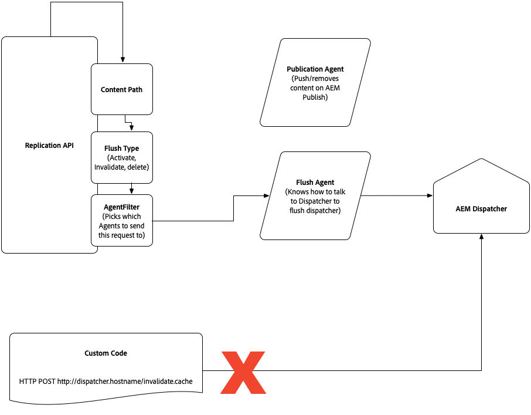

# Content Delivery in AEM as a Cloud Service {#content-delivery}

The current page details publish service content delivery in AEM as a Cloud Service. Publish service content delivery includes:

* CDN (typically managed by Adobe)
* AEM dispatcher
* AEM publish

The data flow is as follows:

1. The URL is added in the browser
1. Request made to CDN mapped in DNS to that domain
1. If content is fully cached on CDN, CDN serves it to the browser
1. If content is not fully cached, the CDN calls out (reverse proxy) to the dispatcher
1. If content is fully cached on dispatcher, dispatcher serves it to the CDN
1. If content is not fully cached, the dispatcher calls out (reverse proxy) to the AEM publish
1. The content is rendered by the browser, which may also cache it, depending on the headers

The content type HTML/text is set to expire after 300s (5 minutes) at the dispatcher layer, a threshold which both the dispatcher cache and CDN respect. During redeployments of the publish service, the dispatcher cache is cleared and subsequently warmed up before the new publish nodes accept traffic.

The sections below provide greater detail about content delivery, including CDN configuration and caching. 

Information about replication from the author service to the publish service is available [here](/help/operations/replication.md). 

## CDN {#cdn}

AEM as Cloud Service is shipped with a built-in CDN. It’s main purpose is to reduce latency by delivering cacheable content from the CDN nodes at the edge, near the browser. It is fully managed and configured for optimal performance of AEM applications.

In total, AEM offers two options:

1. AEM Managed CDN - AEM's out-of-the-box CDN. It is a tightly integrated option and does not require heavy customer investment in supporting the CDN integration with AEM.
1. Customer Managed CDN points to AEM Managed CDN  - the customer points their own CDN to AEM's out-of-the-box CDN. The customer will still need to manage their own CDN, but investment in the integration with AEM is moderate.

The first option should satisfy most of the customer performance and security requirements. Additionally, it requires minimal customer effort.

The second option will be allowed on a case-by-case basis. The decision is based on meeting certain pre-requisites including, but not limited to, the customer having a legacy integration with their CDN vendor that is difficult to abandon.

Presented below is a decision matrix to compare the two options. More detailed information can be found in the sections that follow.

| Details | AEM Managed CDN | Customer Managed CDN points to AEM CDN |
|---|---|---|
| **Customer effort** | None, it is fully integrated. Only need to point CNAME to AEM Managed CDN.| Moderate customer investment. The customer must manage its own CDN. |
| **Pre-requisites** | None | Existing CDN that is onerous to replace. Must demonstrate a successful load test prior to going live. |
| **CDN expertise** | None | Requires at least one part time engineering resource with detailed CDN knowledge that is capable of configuring the customer's CDN. |
| **Security** | Managed by Adobe. | Managed by Adobe (and optionally by the customer at their own CDN). |
| **Performance** | Optimized by Adobe. | Will benefit from some AEM CDN capabilities, but potentially a small performance hit due to the extra hop. **Note**: Hops from customer CDN to Fastly CDN likely to be efficient). |
| **Caching** | Supports cache headers applied at the dispatcher. | Supports cache headers applied at the dispatcher. |
| **Image and video compression capabilities** | Can work with Adobe Dynamic Media. | Can work with Adobe Dynamic Media or customer managed CDN image/video solution. |

### AEM Managed CDN  {#aem-managed-cdn}

Preparing for content delivery by using Adobe's out-of-the-box CDN is simple, as described below:

1. You will provide the signed SSL certificate and secret key to Adobe by sharing a link to a secure form containing this information. Please coordinate with customer support on this task.
**Note:** Aem as a Cloud Service does not support Domain Validated (DV) certificates.
1. You should inform customer support:
   * which custom domain should be associated with a given environment, as defined by the program id and environment id.
   * if any IP whitelisting is needed to restrict traffic to a given environment.
1. Customer support will then coordinate with you the timing for a CNAME DNS record, pointing their FQDN to `adobe-aem.map.fastly.net`.
1. You will be notified when the SSL certificates are expiring so you can resubmit the new SSL certificates.

**Restricting traffic**

By default, for an Adobe Managed CDN setup, all public traffic can make its way to the publish service, for both production and non-production (development and stage) environments. If you wish to limit traffic to the publish service for a given environment (for example, limiting staging by a range of IP addresses) you should work with customer support to configure these restrictions. 

### Customer CDN points to AEM Managed CDN {#point-to-point-CDN}

Supported if you want to use your existing CDN, but can't satisfy the requirements of a Customer managed CDN. In this case, you manage your own CDN, but point to Adobe's managed CDN. 

Please be aware that:

1. You must have an existing CDN. 
1. You must manage it.
1. You must be able to configure the CDN to work with Aem as a Cloud Service - see the configuration instructions below.
1. You must have engineering CDN experts that are on call in case related issues arise.
1. You must perform and successfully pass a load test before going to production.

Configuration instructions:

1. Set the `X-Forwarded-Host` header with the domain name.
1. Set Host header with the origin domain, which is Adobe's CDN's ingress. The value should come from Adobe.
1. Send the SNI header to the origin. Like the Host header, the sni header must be the origin domain.
1. Set the `X-Edge-Key`, which is needed to route traffic correctly to the AEM servers. The value should come from Adobe.

Prior to accepting live traffic, you should validate with Adobe customer support that the end-to-end traffic routing is functioning correctly.

## Caching {#caching}

Caching at the CDN can be configured by using dispatcher rules. Note that the dispatcher also respects the resulting cache expiration headers if `enableTTL` is enabled in the dispatcher configuration, implying that it will refresh specific content even outside of content being republished.

### HTML/Text {#html-text}

* by default, cached by the browser for five minutes, based on the cache-control header emitted by the apache layer. The CDN also respects this value.
* can be overridden for all HTML/Text content by defining the `EXPIRATION_TIME` variable in `global.vars` using the AEM as a Cloud Service SDK Dispatcher tools. 

You must ensure that a file under `src/conf.dispatcher.d/cache` has the following rule:

```
/0000
{ /glob "*" /type "allow" }

```

* can be overridden on a finer grained level by the following apache mod_headers directives: 

```
<LocationMatch "\.(html)$">
        Header set Cache-Control "max-age=200"
</LocationMatch>

```

You must ensure that a file under `src/conf.dispatcher.d/cache` has the following rule (which is in the default configuration):

```
/0000
{ /glob "*" /type "allow" }

```

* Note that other methods, including the [dispatcher-ttl AEM ACS Commons project](https://adobe-consulting-services.github.io/acs-aem-commons/features/dispatcher-ttl/), will not successfully override values.

### Client-Side libraries (js, css) {#client-side-libraries}

* by using AEM's Client-Side library framework, JavaScript and CSS code is generated in such a way that browsers can cache it indefinitely, since any changes manifest as new files with a unique path.  In other words, HTML that references the client libraries will be produced as needed so customers can experience new content as it is published. The cache-control is set to "immutable" or 30 days for older browsers who don't respect the "immutable" value.
* see the section [Client-side libraries and version consistency](#content-consistency) for additional details. 

### Images and any content large enough stored in blob storage {#images}

* by default, not cached
* can be set on a finer grained level by the following apache `mod_headers` directives:

```
<LocationMatch "^.*.jpeg$">
    Header set Cache-Control "max-age=222"
</LocationMatch>

```

It is necessary to ensure that a file under src/conf.dispatcher.d/cache has the following rule (which is in the default configuration):

```
/0000
{ /glob "*" /type "allow" }

```

Make sure that assets meant to be kept private rather than cached are not part of the LocationMatch directive filters.

* Note that other methods, including the [dispatcher-ttl AEM ACS Commons project](https://adobe-consulting-services.github.io/acs-aem-commons/features/dispatcher-ttl/), will not successfully override values.

### Other content file types in node store {#other-content}

* no default caching
* default cannot be set with the `EXPIRATION_TIME` variable used for html/text file types
* cache expiration can be set with the same LocationMatch strategy described in the html/text section by specifying the appropriate regex

## Dispatcher {#disp}

Traffic goes through an apache web server, which supports modules including the dispatcher. The dispatcher is used primarily as a cache to limit processing on the publish nodes in order to increase performance.

As described in the CDN's caching section, rules can be applied to dispatcher configuration to modify any default cache expiration settings. 

The rest of this section describes considerations related to dispatcher cache invalidation. For most customers,it should not be necessary to invalidate the dispatcher cache, instead relying on the dispatcher refreshing its cache upon content being republished, and the CDN respecting cache expiration headers.

### Dispatcher Cache Invalidation during Activation/Deactivation {#cache-activation-deactivation}

Like previous versions of AEM, publishing or unpublishing pages will clear the content from the dispatcher cache. If a caching issue is suspected, customers should republish the pages in question.

When the publish instance receives a new version of a page or asset from the author, it uses the flush agent to invalidate appropriate paths on its dispatcher. The updated path is removed from the dispatcher cache, together with its parents, up to a level (you can configure this with the [statfileslevel](https://docs.adobe.com/content/help/en/experience-manager-dispatcher/using/configuring/dispatcher-configuration.html#invalidating-files-by-folder-level).

### Explicit dispatcher cache invalidation {#explicit-invalidation}

In general, it won't be necessary to manually invalidate content in the dispatcher, but it is possible if needed, as described below.

Prior to AEM as a Cloud Service, there were two ways of invalidating the dispatcher cache.

1. Invoke the replication agent, specifying the publish dispatcher flush agent
2. Directly calling the `invalidate.cache` API (for example, `POST /dispatcher/invalidate.cache`)

The dispatcher's `invalidate.cache` API approach will no longer be supported since it addresses only a specific dispatcher node. AEM as a Cloud Service operates at the service level, not the individual node level and so the invalidation instructions in the [Invalidating Cached Pages From AEM](https://docs.adobe.com/content/help/en/experience-manager-dispatcher/using/configuring/page-invalidate.html) page are not longer valid for AEM as a Cloud Service . 
Instead, the replication flush agent should be used. This can be done using the Replication API. The Replication API documentation is available [here](https://helpx.adobe.com/experience-manager/6-5/sites/developing/using/reference-materials/javadoc/com/day/cq/replication/Replicator.html) and for an example of flushing the cache, see the [API example page](https://helpx.adobe.com/experience-manager/using/aem64_replication_api.html) specifically the `CustomStep` example issuing a replication action of type ACTIVATE to all available agents. The flush agent endpoint is not configurable but pre-configured to point to the dispatcher, matched with the publish service running the flush agent. The flush agent can typically be triggered by OSGi events or workflows.

The diagram presented below illustrates this.



If there is a concern that the dispatcher cache isn't clearing, contact [customer support](https://helpx.adobe.com/support.ec.html) who can flush the dispatcher cache if necessary.

The Adobe-managed CDN respects TTLs and thus there is no need fo it to be flushed. If an issue is suspected, [contact customer support](https://helpx.adobe.com/support.ec.html) support who can flush an Adobe-managed CDN cache as necessary.

## Client-Side libraries and Version Consistency {#content-consistency}

Pages are composed of of HTML, Javascript, CSS, and images. Customers are encouraged to leverage the Client-Side Libraries (clientlibs) framework to import Javascript and CSS resources into HTML pages, taking into account dependencies between JS libraries.

The clientlibs framework provides automatic version management, meaning that developers can check in changes to JS libraries in source control and the latest version will be made available when a customer pushes their release. Without this, developers would need to manually change HTML with references to the new version of the library, which is especially onerous if many HTML templates share the same library.

When the new versions of libraries are released to production, the referencing HTML pages are updated with new links to those updated library versions. Once the browser cache has expired for a given HTML page, there is no concern that the old libraries will be loaded from the browser cache since the refreshed page (from AEM) now is guaranteed to reference the new versions of the libraries. In other words, a refreshed HTML page will include all the latest library versions.

The mechanism for this is a serialized hash, which is appended to the client library link, ensuring a unique, versioned url for the browser to cache the CSS/JS. The serialized hash is only updated when the contents of the client library changes. This means that if unrelated updates occur (i.e no changes to the underlying css/js of the client library) even with a new deployment, the reference remains the same, ensuring less disruption to the browser cache.

### Enabling Longcache versions of Client Side Libraries - AEM as a Cloud Service SDK Quickstart {#enabling-longcache}

Default clientlib includes on an HTML page look like the following example:

```
<link rel="stylesheet" href="/etc.clientlibs/wkndapp/clientlibs/clientlib-base.css" type="text/css">

```

When strict clientlib versioning is enabled, a long term hash key is added as a selector to the client library. As a result, the clientlib reference look like this:

```
<link rel="stylesheet" href="/etc.clientlibs/wkndapp/clientlibs/clientlib-base.lc-7c8c5d228445ff48ab49a8e3c865c562-lc.css" type="text/css">

```

Strict clientlib versioning is enabled by default in all AEM as a Cloud Service environments.

To enable strict clientlib versioning in the local SDK Quickstart perform the following actions:

1. Navigate to the OSGi Configuration manager `<host>/system/console/configMgr`
1. Find the OSGi Config for Adobe Granite HTML Library Manager:
   * Check the checkbox to enable Strict Versioning
   * In the field labeled Long term client side cache key, enter the value of /.*;hash
1. Save the changes. Note that it is not necessary to save this configuration in source control since AEM as a Cloud Service will automatically enable this configuration in dev, stage and production environments.
1. Any time the contents of the client library are changed, a new hash key is generated and the HTML reference will be updated.
