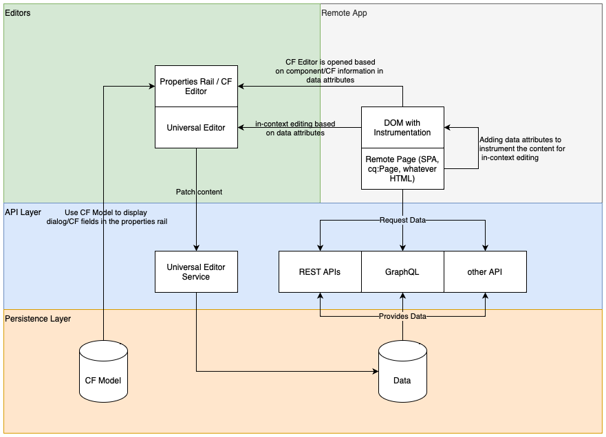

# Universal Editor Architecture {#architecture}

Learn about the architecture of the Universal Editor and how data flows between its services and layers.

## Architecture Building Blocks {#building-blocks}

The Universal Editor is made up of four essential building blocks that interact to allow content authors to edit any aspect of any content in any implementation so you can deliver exceptional experiences, increase content velocity, and provide a state-of-the-art developer experience.

1. [Editors](#editors)
1. [Remote App](#remote-app)
1. [API Layer](#api-layer)
1. [Persistence Layer](#persistence-layer)

This document outlines each of these building blocks and how they exchange data.

>[!TIP]
>
>To see the Universal Editor and its architecture in action, see [Getting Started with the Universal Editor in AEM](getting-started.md) to learn how to get access to the Universal Editor and how to start instrumenting your first AEM app to use it.

### Editors {#editors}

* **Universal Editor** - The Universal Editor uses an instrumented DOM to allow in-place editing of content. See [Attributes and Types](attributes-types.md) for details regarding the necessary metadata. See the document [Getting Started with the Universal Editor in AEM](getting-started.md) for an example of the instrumentation in AEM.
* **Properties Panel** - Some properties of components can be not edited in-context, for example, rotation time of a carousel or which accordion tab shall be always opened or closed. To allow for editing of such component information, a form-based editor is provided in the side panel of the editor.

### Remote App {#remote-app}

To make an app in-context editable within the Universal Editor, the DOM must be instrumented. The remote app must render certain attributes in the DOM. See [Attributes and Types](attributes-types.md) for details regarding the necessary metadata. See the document [Getting Started with the Universal Editor in AEM](getting-started.md) for an example of the instrumentation in AEM.

The Universal Editor strives for a minimal SDK, thus the instrumentation is the responsibility of the remote app implementation.

### API Layer {#api-layer}

* **Content Data** - For the Universal Editor, neither the source systems of the content data nor the way it is consumed is important. It is only important to define and provide the required attributes using in-context editable data.
* **Persisting Data** - For each editable data there is a URN identifier. This URN is used to route the persistence to the right system and resource.

### Persistence Layer {#persistence-layer}

* **Content Fragment Model** - To support the panel for editing Content Fragment properties, the Content Fragment Editor, and form-based editors, models per component and content fragment are required.
* **Content** - Content can be stored anywhere, such as in AEM, Magento, and so on. 

## Universal Editor Service and Backend System Dispatch {#service}

The Universal Editor dispatches all content changes to a centralized service called the Universal Editor Service. This service, running on Adobe I/O Runtime, loads plugins available in the Extension Registry based on the provided URN. The plugin is responsible for communicating to the backend and returning a unified response.

## Rendering Pipelines {#rendering-pipelines}

### Server Side Rendering {#server-side}

### Static Site Generation {#static-generation}

### Client Side Rendering {#client-side}

