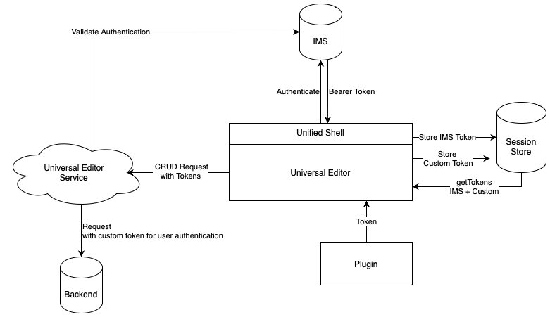

# Universal Editor Authentication {#authentication}

Learn how the Universal Editor authenticates.

## Options {#options}

The Universal Editor uses Adobe's Identity Management System (IMS) authentication, which is provided via the Unified Shell.

All applications/remote pages are responsible for authentication to required backend systems. The Universal Editor service needs this authentication to backend systems to perform CRUD operations as it is a standalone service.

Depending on how you are using the Universal Editor, there are different options of implementation.

* [Standard Flow](#standard-flow) - For AEM as a Cloud Service or AMS using IMS
* [Third-Party Flow](#third-party-flow) - For AEM on-premise or AMS without IMS

## Standard Flow {#standard-flow}

This is the solution for AEM as a Cloud Service and AMS using IMS to use the Universal editor.

To use the Universal Editor, the user must be logged into the Unified Shell which authenticates against IMS. The provided IMS token is stored in the users session store.

Whenever a user performs a CRUD operation, a call is sent to the Universal Editor service with the IMS bearer token in the HTTP header. The Universal Editor service then uses the bearer token to authenticate the request against the AEM backend system to execute operations in the user's name.


## Third-Party Flow {#third-party-flow}

This is the solution for AEM on premise, AMS without IMS, and other third-party systems to use the Universal Editor.

To use third-party backend systems, the IMS bearer token can not be used to authenticate the Universal Editor service against the backend, therefore additional tokens must be included in the request.



1. The user logs in via IMS to the Unified Shell.
1. The Unified Shell stores the IMS token in the session store.
1. The Universal Editor triggers the [plugin](#plugin) to retrieve a token based on the contract.
1. The token is stored in the session store as well.
1. On CRUD operations, the Universal Editor sends the IMS token and the token that belongs to the connection defined via the [`itemid`.](attribute-types.md)
1. The Universal Editor service validates the IMS token to ensure only authenticated users are passed through the service.
1. The Universal Editor service passes the IMS token and the custom token to the plugin.
1. The custom [plugin](#plugin) decides which tokens will be passed to the backend system to authenticate the request.

### Plugin {#plugin}

The plugin uses an extension point via the extensibility framework.

#### Contracts {#contracts}

The code of the plugin is executed in an iFrame. The return value is just an object of following type.

```text
type RequestForToken: {
    connectionURI: string;
}
 
type LoginToken: {
    connectionURI: string;
    token: string;
}
```

#### Example for AEM {#aem-example}

1. When triggered, the plugin extension an iFrame is opened.
1. In the iFrame, a form for username and password is shown where the user can enter their local AEM credentials.
1. Upon submitting the form, a basic authentication token is calculated based on the provided data.
1. The plugin returns the basic authentication token to the Universal Editor where it is stored in the session store and is used for all connections to the backend system.

## Additional Resources {#additional-resources}

To learn more about the Universal Editor, see these documents.

* [Universal Editor Introduction](introduction.md) - Learn how the Universal Editor enables editing any aspect of any content in any implementation in order to deliver exceptional experiences, increase content velocity, and provide a state-of-the-art developer experience.
* [Authoring Content with the Universal Editor](authoring.md) - Learn how easy and intuitive it is for content authors to create content using the Universal Editor.
* [Getting Started with the Universal Editor in AEM](getting-started.md) - Learn how to get access to the Universal Editor and how to start instrumenting your first AEM app to use it.
* [Universal Editor Architecture](architecture.md) - Learn about the architecture of the Universal Editor and how data flows between its services and layers.
* [Attributes and Types](attribute-types.md) - Learn about the data attributes and types that the Universal Editor requires.
