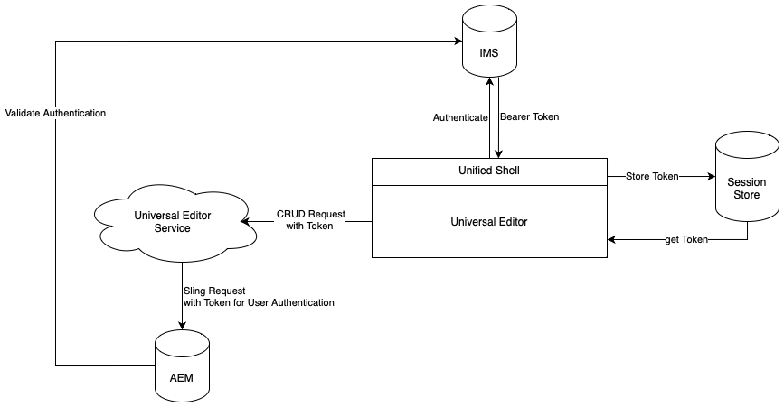

# Universal Editor Authentication {#authentication}

Learn how the Universal Editor authenticates.

## Options {#options}

The Universal Editor uses Adobe's Identity Management System (IMS) authentication, which is provided via the Unified Shell.

All applications/remote pages are responsible for authentication to required backend systems. The Universal Editor service needs this authentication to backend systems to perform CRUD operations as it is a standalone service.

## Standard Flow {#standard-flow}

This is the solution for AEM as a Cloud Service and AMS using IMS to use the Universal editor.

To use the Universal Editor, the user must be logged into the Unified Shell which authenticates against IMS. The provided IMS token is stored in the users session store.

Whenever a user performs a CRUD operation, a call is sent to the Universal Editor service with the IMS bearer token in the HTTP header. The Universal Editor service then uses the bearer token to authenticate the request against the AEM backend system to execute operations in the user's name.

