# Authoring Content with the Universal Editor {#authoring}

Learn how easy and intuitive it is for content authors to create content using the Universal Editor.

## Introduction {#introduction}

The Universal Editor enables editing any aspect of any content in any implementation so you can deliver exceptional experiences, increase content velocity, and provide a state-of-the-art developer experience.

To do this, the Universal Editor provides content authors with an intuitive UI that requires minimal training to simply be able to jump in and begin editing content. This document describes the authoring experience of the Universal Editor.

>[!TIP]
>
>For a more detailed introduction to the Universal Editor, see the document [Universal Editor Introduction.](introduction.md)

>[!NOTE]
>
>The Universal Editor is still in development. It currently cannot edit all content types.

## Prepare the App {#prepare-app}

To author content for an app using the Universal Editor, the app must be instrumented by a developer to support the editor.

>[!TIP]
>
>See [Getting Started with the Universal Editor in AEM](getting-started.md) for an example of how to configure an AEM app to work with the Universal Editor.

## Sign In {#sign-in}

Once the app is instrumented to work with the Universal Editor, you will need to sign into the Universal Editor. You will need an Adobe ID to sign in and [have access to the Universal Editor.](getting-started.md#request-access)

After you are signed in, enter the URL of the page you want to edit in the [location bar.](#location-bar) so you can start editing content such as [text content](#text-mode) or [media content.](#media-mode)

## Understand The UI {#ui}

The UI is divided into five main areas.

* [The Experience Cloud header](#experience-cloud-header)
* [The Universal Editor header](#universal-editor-header)
* [The mode rail](#mode-rail)
* [The editor](#editor)
* [The component rail](#component-rail)

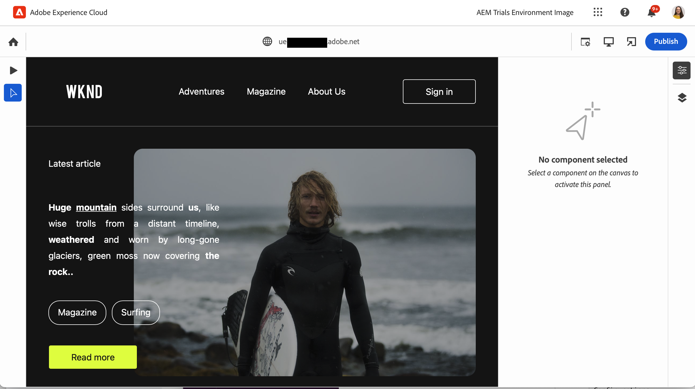

### The Experience Cloud Header {#experience-cloud-header}

The Experience Cloud header is always present at the top of the screen. It is an anchor that tells you where you are within Experience Cloud and helps you navigate to other Experience Cloud apps.

#### Experience Manager {#experience-manager}

Select the Adobe Experience Cloud link at the left of the header to navigate to the root of your Experience Manager solution to access tools such as [Cloud Manager,](/help/onboarding/cloud-manager-introduction.md) [Cloud Acceleration Manager,](/help/journey-migration/cloud-acceleration-manager/introduction/overview-cam.md) and [Software Distribution.](https://experienceleague.adobe.com/docs/experience-cloud/software-distribution/home.html)

#### Organization {#organization}

This displays the organization you are currently signed into. Tap or click to switch to another organization if your Adobe ID is associated with multiple.

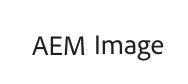

#### Solutions {#solutions}

Tapping or clicking the solutions switcher lets you quickly jump to other Experience Cloud solutions.

#### Help {#help}

The help icon provides quick access to learning and support resources.

#### Notifications {#notifications}

This icon is badged with the number of currently assigned incomplete [notifications.](/help/implementing/cloud-manager/notifications.md)

#### User Properties {#user-properties}

Tap or click the icon representing your user to access your user settings. If you do not have a user picture configured, an icon is randomly assigned.

### The Universal Editor Header {#universal-editor-header}

The Universal Editor header is always present at the top of the screen just below [the Experience Cloud header.](#experience-cloud-header) It gives you quick access to navigate to another page to edit and to publish the current page.

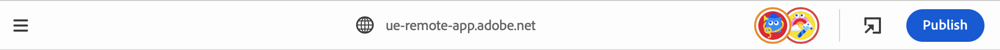

#### The Hamburger Menu {#hamburger-menu}

The hamburger menu is not yet implemented.

#### Location Bar {#location-bar}

The location bar shows you the address of the page you are editing. Tap or click to enter the address of another page to edit.

>[!TIP]
>
>Use the hot key `L` to open the address bar.

>[!NOTE]
>
>Any page that you wish to edit with the Universal Editor must be [instrumented to support he Universal Editor.](getting-started.md)

#### Emulator Settings {#emulator}

Tap or click the emulation icon to define how the Universal Editor renders the page.

Tapping or clicking the emulation icon reveals the options.

By default the editor will open in desktop layout where the height and width are automatically defined by the browser.

You can also chose to emulate a mobile device and within the Universal Editor:

* Define its orientation
* Define the width and height
* Change the orientation

#### Open App Preview {#open-app-preview}

Tap or click the open app preview icon to open the page you are currently editing in its own browser tab, free of the editor to preview your content.

>[!TIP]
>
>Use the hot key `O` (the letter O) to open the app preview.

#### Publish {#publish}

Tap or click the publish button so you can publish the changes to the content live for consumption by your readers.

>[!TIP]
>
>See the document [Publishing Content with the Universal Visual Editor](publishing.md) for more information on publishing with the Universal Editor.

### The Mode Rail {#rail}

The mode rail is always present along the left side of the editor. It allows easy switching the editor between different editing modes.

#### Preview Mode {#preview-mode}

In preview mode, the page rendered in the editor as it would be seen on your published service. This allows the content author to navigate the content by clicking links, etc.

>[!TIP]
>
>Use the hot key `P` to switch to preview mode.

#### Text Mode {#text-mode}

In text mode, the content author can click to select text content.

* You can [edit plain text](#editing-content) in place.
* You can also [edit rich text](#editing-rich-text) in place with additional formatting options displayed in the component rail.

>[!TIP]
>
>Use the hot key `T` to switch to text mode.

#### Media Mode {#media-mode}

In media mode, the content author can click to select media content.

 Details of the content are displayed in the component rail and the author can also [edit the media content.](#editing-media)

>[!TIP]
>
>Use the hot key `M` to switch to media mode.

#### Component Mode {#component-mode}

In component mode, the content author can click to select [Content Fragments.](/help/assets/content-fragments/content-fragments.md)

When you select a Content Fragment, the details of it are displayed in the component rail where you can [edit the Content Fragment.](#edit-content-fragment)

>[!TIP]
>
>Use the hot key `C` to switch to component mode.

### The Editor {#editor}

The editor occupies most of the window and is where the page specified in [the location bar](#location-bar) is rendered.

* If the editor is in an editing mode such as [text mode](#text-mode) or [media mode,](#media-mode) the content will be editable, but you cannot follow links.
* If the editor is in [preview mode,](#preview-mode) the content will be navigable and you can follow links, but you cannot edit the content.

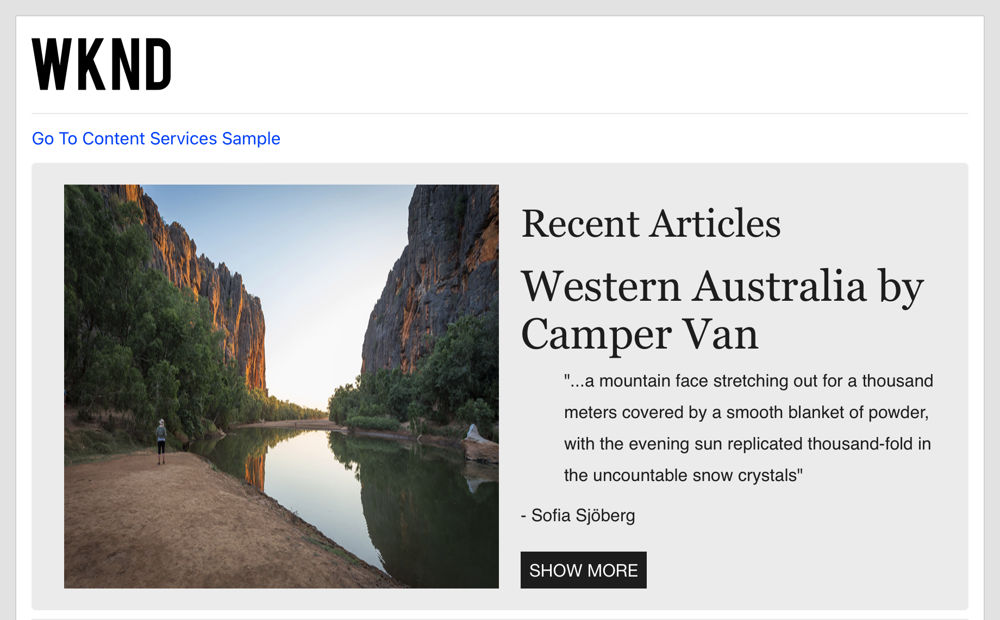

### Component Rail {#component-rail}

The component rail is always present along the right side of the editor. Depending on its mode, it can show details for a component selected in the content or the hierarchy of the page contents.

#### Properties Mode {#properties-mode}

In properties mode, the rail shows the properties of the component currently selected in the editor. This is the default mode of the component rail when a page is loaded.

Depending on the type of component you select, details can be displayed and modified in the properties rail.

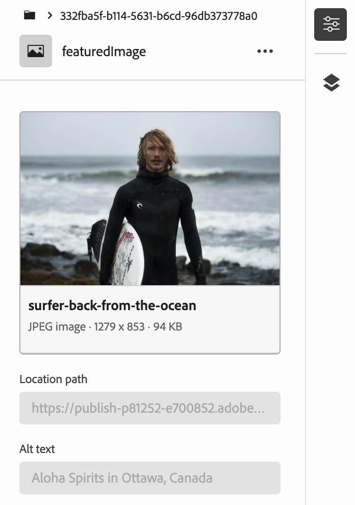

Note that not all components have details that can be shown and/or edited.

>[!TIP]
>
>Use the hot key `D` to switch to properties mode.

#### Content Tree Mode {#content-tree-mode}

In content tree mode, the rail shows the hierarchy of the page content.

When selecting an item in the content tree, the editor scrolls to that content and selects it.

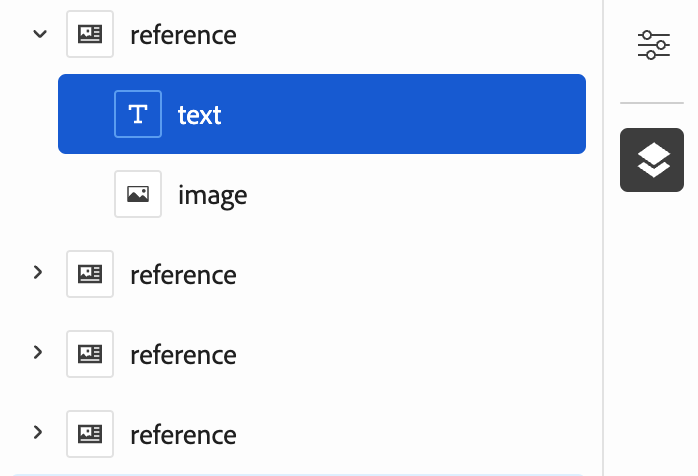

>[!TIP]
>
>Use the hot key `F` to switch to content tree mode.

#### Edit {#edit}

When in [component mode,](#component-mode) if you select a [Content Fragment,](/help/assets/content-fragments/content-fragments.md) the edit option appears on the component rail.

Tapping or clicking the edit button opens the [Content Fragment editor](/help/assets/content-fragments/content-fragments-managing.md#opening-the-fragment-editor) in a new tab, allowing you access to the full power of the Content Fragment Editor.

You can also edit details of the Content Fragment within the component rail depending on the needs of your workflow.

>[!TIP]
>
>Use the hot key `E` to edit a selected component.

#### Add {#add}

If you select a container component either in the content tree or in the editor, the add option appears on the component rail.

Tapping or clicking the add button opens a drop-down menu of components that are available to [add to the selected container.](#adding-components)

>[!TIP]
>
>Use the hot key `A` to add a component to a selected container component.

#### Delete {#delete}

If you select a component within a container component either in the content tree or in the editor, the delete option appears on the component rail.

Tapping or clicking the delete button [deletes the component.](#deleting-components)

>[!TIP]
>
>Use the hot key `Shift+Backspace` to delete a selected component from a container.

## Editing Content {#editing-content}

Editing content is simple and intuitive. In editing modes ([text mode](#text-mode), [media mode](#media-mode), and [component mode](#component-mode)), as you mouse over content in the editor, editable content is highlighted with a blue box.

Note that in edit mode, tapping or clicking on content attempts to select it for editing. If you wish to navigate your content by following links, switch to [preview mode.](#preview-mode)

Depending on the [mode](#mode-rail) you are in and the content you select, you may have different in place editing options and you may be able to review additional properties for the content using the [component rail.](#component-rail)

### Editing Plain Text {#edit-plain-text}

If you are in [text mode](#text-mode) and select a plain text component, you can edit the text in place.

Simply type to update the content. Press enter/return or tap or click outside of the text box to save your changes.

### Editing Rich Text {#edit-rich-text}

If you are in [text mode](#text-mode) and select a rich text component, you can edit the text in place.

Simply type to update the content. Press enter/return or tap or click outside of the text box to save your changes.

Additionally, formatting options and details on your text are available in the component rail.

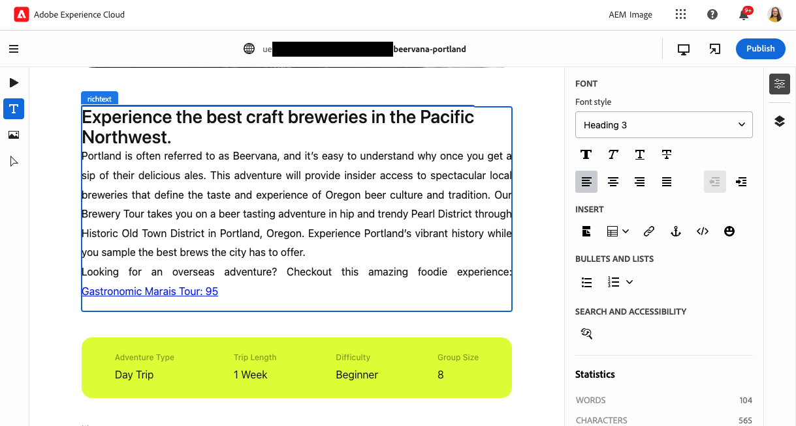

Formatting changes are saved to you content automatically.

### Editing Media {#edit-media}

If you are in [media mode](#media-mode) and you select an image, you can view its details in the component rail.

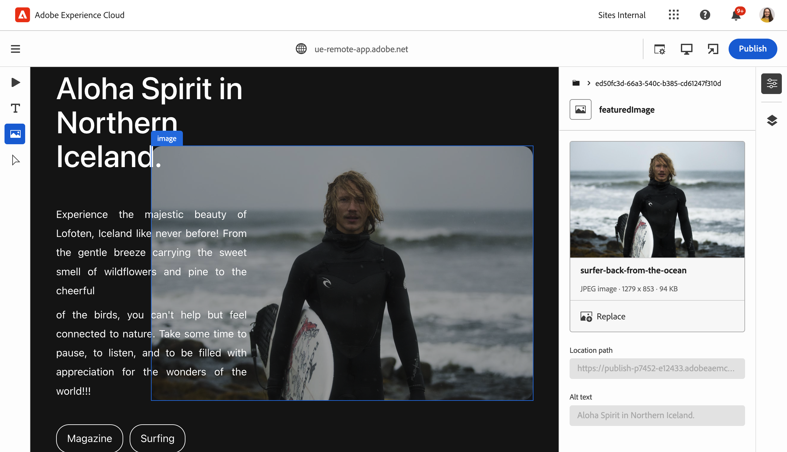

Tap or click the **Replace** button below the preview of the selected image in the component rail to replace the image with another from your library of assets.

1. The [asset selector](/help/assets/asset-selector.md#using-asset-selector) window opens to allow you to select an asset.
1. Tap or click to select a new asset.
1. Tap or click **Select** to return to the component rail where the asset was replaced.

Changes are saved to your content automatically.

>[!TIP]
>
>Use the hot key `R` to open the asset selector to replace the selected image.

### Editing Content Fragments {#edit-content-fragment}

If you are in [component mode](#component-mode) and you select a [Content Fragment,](/help/sites-cloud/administering/content-fragments/overview.md) you can edit its details in the component rail.

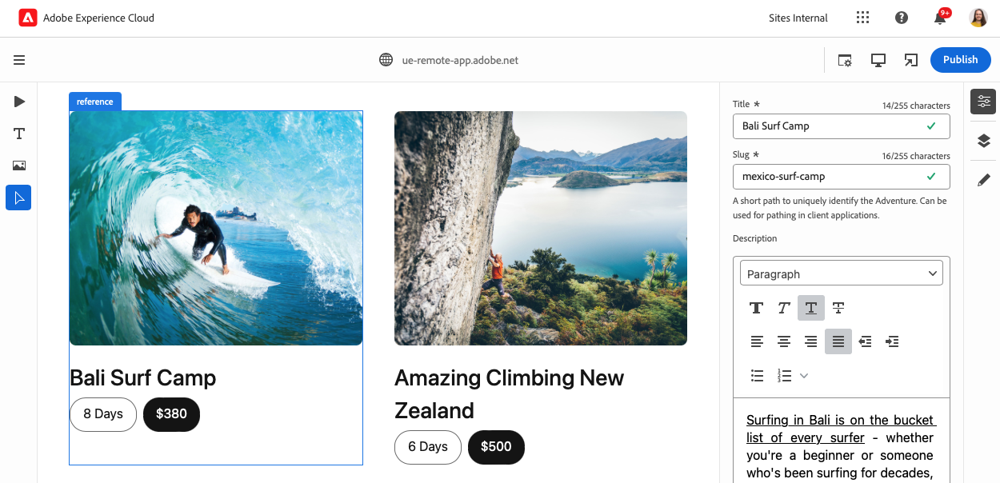

The fields defined in the content model of the selected Content Fragment are displayed and editable in the component rail.

Changes are saved to your content automatically.

If you wish to edit your Content Fragment in the [Content Fragment editor](/help/sites-cloud/administering/content-fragments/authoring.md) instead, click the [edit button](#edit) in the mode rail.

### Adding Components to Containers {#adding-components}

1. Select a container component in the content tree or in the editor.
1. Then tap or click the add icon in the component rail.

   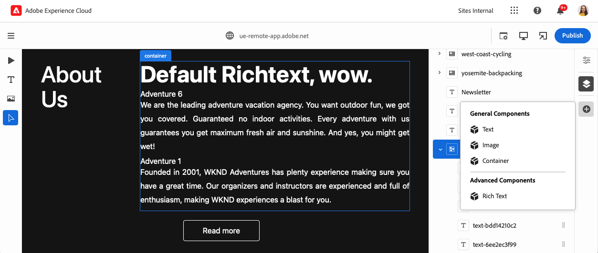

The component is inserted into the container and can be edited in the editor.

### Deleting Components from Containers {#deleting-components}

1. Select a container component in the content tree or in the editor.
1. Tap or click the chevron icon of the container to expand its contents in the content tree.
1. Then, in the content tree, select a component within the container.
1. Tap or click the delete icon in the component rail.

   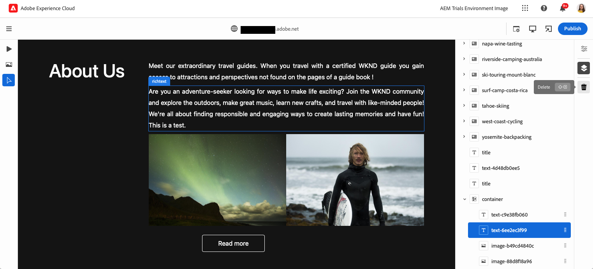

The selected component deleted.

### Reordering Components in Containers {#reordering-components}

1. Select a container component in the content tree or in the editor.
1. If not already in [content tree mode,](#content-tree-mode) switch to it.
1. Tap or click the chevron icon of the container to expand its contents in the content tree.
1. Drag handle icons next to the components within the container show that you can rearrange them. Drag the components to reorder them within the container.

   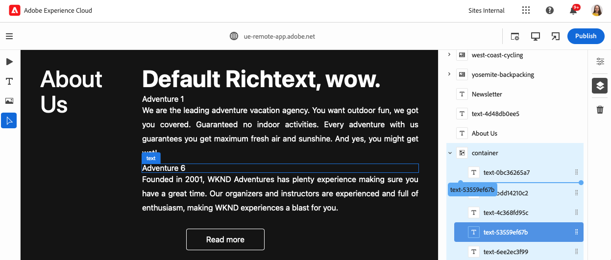
1. The dragged component turns gray in the component tree, while your insertion point is represented by a blue line. Release the component to place it in its new location.

The components are reordered in both the content tree and in the editor

## Previewing Content {#previewing-content}

When you are finished editing content, you often want to navigate it to see how it looks in the content of other pages. In [preview mode](#preview-mode) you can click links to navigate your content as a reader would. The content is rendered in the editor as it would be published.

Note that in preview mode, tapping or clicking on content reacts as it would to a reader of the content. If you wish to select the content for editing, switch to an editing mode such as [text mode](#text-mode) or [media mode.](#media-mode)

## Additional Resources {#additional-resources}

To learn more about the Universal Editor, see these documents.

* [Universal Editor Introduction](introduction.md) - Learn how the Universal Editor enables editing any aspect of any content in any implementation so you can deliver exceptional experiences, increase content velocity, and provide a state-of-the-art developer experience.
* [Publishing Content with the Universal Editor](publishing.md) - Learn how the Universal Visual Editor publishes content and how your apps can handle the published content.
* [Getting Started with the Universal Editor in AEM](getting-started.md) - Learn how to get access to the Universal Editor and how to start instrumenting your first AEM app to use it.
* [Universal Editor Architecture](architecture.md) - Learn about the architecture of the Universal Editor and how data flows between its services and layers.
* [Attributes and Types](attributes-types.md) - Learn about the data attributes and types that the Universal Editor requires.
* [Universal Editor Authentication](authentication.md) - Learn how the Universal Editor authenticates.
