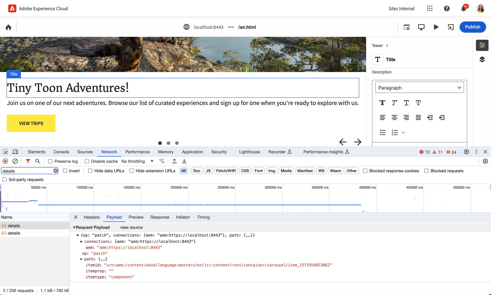

# Universal Editor Calls {#calls}

Learn about the different types of calls made to your app by the Universal Editor to help you when debugging.

## Overview {#overview}

The Universal Editor communicates with your instrumented app through a series of defined calls. This is transparent to and has no effect on the end user experience.

For the developer, however, understanding these calls and what they do can be valuable when debugging your application when using the Universal Editor. If you have instrumented your app and it is not behaving as anticipated, it can be helpful to open the **Network** tab of the developer tools in your browser and inspect the calls as you edit content in your app.



* The **Payload** of the call contains details of what is being updated by the editor including identifying what to update and how to update it.
* The **Response** includes details of what exactly was updated by the editor service. This is to facilitate refreshing the content in the editor. In certain cases, like a `move` call, the entire page must be refreshed.

Once a call is completed successfully, events are triggered that include the request's and response's payload, which can be customized for your own app. Please see the document [Universal Editor Events](/help/implementing/universal-editor/events.md) for more details.

The following is a list of the types of calls that the Universal Editor makes to your app along with sample payloads and responses.

## Update {#update}

An `update` call occurs when you edit content in your app using the Universal Editor. The `update` persists the changes.

Its payload includes details of what to write back to the JCR.

* `resource`: The JCR path to be updated
* `prop`: The JCR property that is being updated
* `type`: The JCR value type of the property being updated
* `value`: The updated data

>[!BEGINTABS]

>[!TAB Sample Payload]

```json
{
  "connections": [
    {
      "name": "aem",
      "protocol": "aem",
      "uri": "https://localhost:8443"
    }
  ],
  "target": {
    "resource": "urn:aem:/content/wknd/language-masters/en/jcr:content/root/container/carousel/item_1571954853062",
    "type": "text",
    "prop": "jcr:title"
  },
  "value": "Tiny Toon Adventures"
}
```

>[!TAB Sample Response]

```json
{
  "updates": [
    {
      "resource": "urn:aem:/content/wknd/language-masters/en/jcr:content/root/container/carousel/item_1571954853062",
      "prop": "jcr:title",
      "type": "text"
    }
  ]
}
```

>[!ENDTABS]

## Details {#details}

A `details` call occurs when loading your app in the Universal Editor to retrieve the app's content.

Its payload includes the data to be rendered as well as details of what the data represent (the schema) so they can be rendered in the Universal Editor.

* For a component, the Universal Editor only retrieves a `data` object, since the schema of the data is defined in the app.
* For Content Fragments, the Universal Editor also retrieves a `schema` object since the Content Fragment Model is defined in the JCR.

>[!BEGINTABS]

>[!TAB Sample Payload]

```json
{
  "connections": [
    {
      "name": "aem",
      "protocol": "aem",
      "uri": "https://localhost:8443"
    }
  ],
  "target": {
    "resource": "urn:aem:/content/wknd/language-masters/en/jcr:content/root/container/carousel/item_1571954853062",
    "type": "component",
    "prop": ""
  }
}
```

>[!TAB Sample Response]

```json
{
  "data": {
    "jcr:primaryType": "nt:unstructured",
    "jcr:title": "Tiny Toon Adventures",
    "fileReference": "/content/dam/wknd-shared/en/adventures/riverside-camping-australia/adobestock-216674449.jpeg",
    "cq:panelTitle": "WKND Adventures",
    "actionsEnabled": "true",
    "jcr:lastModifiedBy": "admin",
    "titleFromPage": "false",
    "jcr:description": "<p>With WKND Adventures, you don't just see the world you experinece it.</p>\r\n",
    "jcr:lastModified": "Fri Jan 19 2024 11:05:59 GMT+0100",
    "descriptionFromPage": "true",
    "sling:resourceType": "wknd/components/teaser",
    "textIsRich": "true",
    "cq:styleIds": [
      "1555543212672"
    ],
    "actions": {
      "jcr:primaryType": "nt:unstructured",
      "item0": {
        "jcr:primaryType": "nt:unstructured",
        "link": "/content/wknd/language-masters/en/adventures",
        "text": "View Trips"
      }
    }
  }
}
```

>[!ENDTABS]

## Add {#add}

An `add` call occurs when you place a new component in your app using the Universal Editor.

Its payload includes a `path` object containing where the content should be added.

It also includes a `content` object with additional objects for endpoint-specific details of the content to be stored [for each plugin](/help/implementing/universal-editor/architecture.md). For example if your app is based on content from AEM and Magento, the payload would contain a data object for each system.

>[!BEGINTABS]

>[!TAB Sample Payload]

```json
{
  "connections": [
    {
      "name": "aemconnection",
      "protocol": "aem",
      "uri": "https://author-pXXXX-eYYYYY.adobeaemcloud.com"
    }
  ],
  "target": {
    "container": {
      "resource": "urn:aemconnection:/content/wknd/language-masters/en/universal-editor-container/jcr:content/root/container",
      "type": "container",
      "prop": ""
    }
  },
  "content": {
    "name": "text",
    "aem": {
      "page": {
        "resourceType": "wknd/components/text",
        "template": {
          "text": "Default Text"
        }
      }
    }
  }
}
```

>[!TAB Sample Response]

```json
{
  "updates": [
    {
      "resource": "urn:aemconnection:/content/wknd/language-masters/en/universal-editor-container/jcr:content/root/container",
      "type": "container"
    }
  ],
  "resource": "urn:aemconnection:/content/wknd/language-masters/en/universal-editor-container/jcr:content/root/container/text_1138559521"
}
```

>[!ENDTABS]

## Move {#move}

A `move` call occurs when you move a component within your app using the Universal Editor.

Its payload includes a `from` object defining where the component was and a `to` object defining where it was moved.

>[!BEGINTABS]

>[!TAB Sample Payload]

```json
{
  "connections": [
    {
      "name": "aemconnection",
      "protocol": "aem",
      "uri": "https://author-pXXXX-eYYYYY.adobeaemcloud.com"
    }
  ],
  "from": {
    "container": {
      "resource": "urn:aemconnection:/content/wknd/language-masters/en/universal-editor-container/jcr:content/root/container",
      "type": "container",
      "prop": ""
    },
    "component": {
      "resource": "urn:aemconnection:/content/wknd/language-masters/en/universal-editor-container/jcr:content/root/container/image_275525847",
      "type": "media",
      "prop": "fileReference"
    }
  },
  "to": {
    "container": {
      "resource": "urn:aemconnection:/content/wknd/language-masters/en/universal-editor-container/jcr:content/root/container",
      "type": "container",
      "prop": ""
    }
  }
}
```

>[!TAB Sample Response]

```json
{
  "updates": [
    {
      "resource": "urn:aemconnection:/content/wknd/language-masters/en/universal-editor-container/jcr:content/root/container",
      "type": "container"
    }
  ]
}
```

>[!ENDTABS]

## Remove {#remove}

A `remove` call occurs when you delete a component within your app using the Universal Editor.

Its payload includes the path of the object that is removed.

>[!BEGINTABS]

>[!TAB Sample Payload]

```json
{
  "connections": [
    {
      "name": "aemconnection",
      "protocol": "aem",
      "uri": "https://author-pXXXX-eYYYYY.adobeaemcloud.com"
    }
  ],
  "target": {
    "component": {
      "resource": "urn:aemconnection:/content/wknd/language-masters/en/universal-editor-container/jcr:content/root/container/text_593170193",
      "type": "text",
      "prop": "text"
    },
    "container": {
      "resource": "urn:aemconnection:/content/wknd/language-masters/en/universal-editor-container/jcr:content/root/container",
      "type": "container",
      "prop": ""
    }
  }
}
```

>[!TAB Sample Response]

```json
{
  "updates": [
    {
      "resource": "urn:aemconnection:/content/wknd/language-masters/en/universal-editor-container/jcr:content/root/container",
      "prop": "",
      "type": "container"
    }
  ]
}
```

>[!ENDTABS]

## Publish {#publish}

A `publish` call occurs when you click the **Publish** button in the Universal Editor to publish the content that you have edited.

The Universal Editor iterates over the content and generates a list of references that must also be published.

>[!BEGINTABS]

>[!TAB Sample Payload]

```json
{
  "connections": [
    {
      "name": "aemconnection",
      "protocol": "aem",
      "uri": "https://author-pXXXX-eYYYYY.adobeaemcloud.com"
    }
  ],
  "references": [
    "urn:aemconnection:/content/dam/wknd-shared/en/magazine/arctic-surfing/aloha-spirits-in-northern-norway/jcr:content/data/master",
    "urn:aemconnection:/content/dam/wknd-shared/en/adventures/bali-surf-camp/bali-surf-camp/jcr:content/data/master",
    "urn:aemconnection:/content/dam/wknd-shared/en/adventures/climbing-new-zealand/climbing-new-zealand/jcr:content/data/master",
    "urn:aemconnection:/content/dam/wknd-shared/en/adventures/cycling-southern-utah/cycling-southern-utah/jcr:content/data/master",
    "urn:aemconnection:/content/dam/wknd-shared/en/adventures/cycling-tuscany/cycling-tuscany/jcr:content/data/master",
    "urn:aemconnection:/content/dam/wknd-shared/en/adventures/downhill-skiing-wyoming/downhill-skiing-wyoming/jcr:content/data/master",
    "urn:aemconnection:/content/dam/wknd-shared/en/adventures/napa-wine-tasting/napa-wine-tasting/jcr:content/data/master",
    "urn:aemconnection:/content/dam/wknd-shared/en/adventures/riverside-camping-australia/riverside-camping-australia/jcr:content/data/master",
    "urn:aemconnection:/content/dam/wknd-shared/en/adventures/ski-touring-mont-blanc/ski-touring-mont-blanc/jcr:content/data/master",
    "urn:aemconnection:/content/dam/wknd-shared/en/adventures/surf-camp-in-costa-rica/surf-camp-costa-rica/jcr:content/data/master",
    "urn:aemconnection:/content/dam/wknd-shared/en/adventures/tahoe-skiing/tahoe-skiing/jcr:content/data/master",
    "urn:aemconnection:/content/dam/wknd-shared/en/adventures/west-coast-cycling/west-coast-cycling/jcr:content/data/master",
    "urn:aemconnection:/content/dam/wknd-shared/en/adventures/yosemite-backpacking/yosemite-backpacking/jcr:content/data/master",
    "urn:aemconnection:/content/wknd/us/en/newsletter/jcr:content/root/container/title",
    "urn:aemconnection:/content/wknd/us/en/newsletter/jcr:content/root/container/text",
    "urn:aemconnection:/content/wknd/language-masters/en/universal-editor-container/jcr:content/root/title",
    "urn:aemconnection:/content/wknd/language-masters/en/universal-editor-container/jcr:content/root/container",
    "urn:aemconnection:/content/wknd/language-masters/en/universal-editor-container/jcr:content/root/container/image",
    "urn:aemconnection:/content/wknd/language-masters/en/universal-editor-container/jcr:content/root/container/text",
    "urn:aemconnection:/content/wknd/language-masters/en/universal-editor-container/jcr:content/root/container/image_229050934",
    "urn:aemconnection:/content/wknd/language-masters/en/universal-editor-container/jcr:content/root/container/image_2123678383",
    "urn:aemconnection:/content/wknd/language-masters/en/universal-editor-container/jcr:content/root/container/text_1668104604",
    "urn:aemconnection:/content/wknd/language-masters/en/universal-editor-container/jcr:content/root/container/text_1138559521",
    "urn:aemconnection:/content/wknd/language-masters/en/universal-editor-container/jcr:content/root/container/image_275525847"
  ]
}
```

>[!TAB Sample Response]

```json
{
  "publishes": [
    "/content/dam/wknd-shared/en/magazine/arctic-surfing/aloha-spirits-in-northern-norway",
    "/content/dam/wknd-shared/en/adventures/bali-surf-camp/bali-surf-camp",
    "/content/dam/wknd-shared/en/adventures/climbing-new-zealand/climbing-new-zealand",
    "/content/dam/wknd-shared/en/adventures/cycling-southern-utah/cycling-southern-utah",
    "/content/dam/wknd-shared/en/adventures/cycling-tuscany/cycling-tuscany",
    "/content/dam/wknd-shared/en/adventures/downhill-skiing-wyoming/downhill-skiing-wyoming",
    "/content/dam/wknd-shared/en/adventures/napa-wine-tasting/napa-wine-tasting",
    "/content/dam/wknd-shared/en/adventures/riverside-camping-australia/riverside-camping-australia",
    "/content/dam/wknd-shared/en/adventures/ski-touring-mont-blanc/ski-touring-mont-blanc",
    "/content/dam/wknd-shared/en/adventures/surf-camp-in-costa-rica/surf-camp-costa-rica",
    "/content/dam/wknd-shared/en/adventures/tahoe-skiing/tahoe-skiing",
    "/content/dam/wknd-shared/en/adventures/west-coast-cycling/west-coast-cycling",
    "/content/dam/wknd-shared/en/adventures/yosemite-backpacking/yosemite-backpacking",
    "/content/wknd/us/en/newsletter",
    "/content/wknd/language-masters/en/universal-editor-container"
  ]
}
```

>[!ENDTABS]

## Additional Resources {#additional-resources}

* [Universal Editor Events](/help/implementing/universal-editor/events.md)

