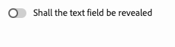
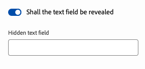

# Customizing and Extending the Universal Editor {#customizing-extending}

Learn about the different extension points and other features that allow you to customize the authoring experience of the Universal Editor to support the needs of your content authors.

## Overview {#overview}

The Universal Editor allows for two types of adaptation for your project's needs.

* [Customizing the Universal Editor](#customizing) - The standard functionality of the Universal Editor can be adapted via several customization configurations.
* [Extending the Universal Editor UI](#extending) - The UI of the Universal Editor can also be extended using the App Builder to meet your projects needs.

Both types are detailed in the following sections.

## Customizing the Universal Editor {#customizing}

The Universal Editor offers several built-in options to customize its functionality.

### Disabling Publishing {#disable-publish}

Certain authoring workflows require content to be reviewed before it is published. In such situations, the option to publish should not be available to any authors.

The **Publish** button can therefore be suppressed entirely in an app by adding the following metadata.

```html
<meta name="urn:adobe:aue:config:disable" content="publish"/>
```

### Filtering Components {#filtering-components}

You can restrict the allowed components per container in the Universal Editor using component filters. Please see the document [Filtering Components](help/implementing/universal-editor/filtering.md) for more information.

### Conditionally Show and Hide Components in Properties Panel {#conditionally-hide}

Although a component or components may generally be available to your authors, there may be certain situations where it does not make sense. In such cases, you can hide components in the properties panel by adding a `condition` attribute to the [fields of the component model.](/help/implementing/universal-editor/field-types.md#fields)

Conditions can be defined using [JsonLogic schema.](https://jsonlogic.com/) If the condition is true, then the field will be displayed. If the condition is false, then the field will be hidden.

>[!BEGINTABS]

>[!TAB Sample Model]

```json
 {
    "id": "conditionally-revealed-component",
    "fields": [
      {
        "component": "boolean",
        "label": "Shall the text field be revealed?",
        "name": "reveal",
        "valueType": "boolean"
      },
      {
        "component": "text-input",
        "label": "Hidden text field",
        "name": "hidden-text",
        "valueType": "string",
        "condition": { "===": [{"var" : "reveal"}, true] }
      }
    ]
 }
```

>[!TAB Condition False]



>[!TAB Condition True]



>[!ENDTABS]

### Custom Preview URLs {#custom-preview-urls}

You can specify a custom preview URL via a `urn:adobe:aue:config:preview` meta configuration, which will open when clicking the **Open page** button in the [editor’s top-right toolbar.](/help/sites-cloud/authoring/universal-editor/navigation.md#universal-editor-toolbar)

This is particularly useful for applications with specific preview requirements, such as those [using Edge Delivery Services with WYSIWYG authoring.](/help/edge/wysiwyg-authoring/authoring.md)

To do so, simply include the desired preview URL in a meta tag of the instrumented app like the following example.

```html
<meta name="urn:adobe:aue:config:preview" content="https://wknd.site"/>
```

## Extending the Universal Editor UI {#extending}

As an Adobe Experience Cloud service, the Universal Editor's UI can be extended using the App Builder and Experience Manager.

UI extensions are JavaScript applications built with Adobe App Builder that can be embedded in UI applications that run under Adobe Experience Cloud unified shell, such as the Universal Editor. You can add your own buttons and actions to the header menu and properties panel as well as create your own events for the Universal Editor.

If you would like to explore these possibilities, please see the following resources:

1. [UI Extensibility](https://developer.adobe.com/uix/docs/) - This is the developer documentation for UI extension.
1. [UI Extensibility Guides](https://developer.adobe.com/uix/docs/guides/) - Step-by-step instructions on how to develop your own extension
1. [The Universal Editor Extension Points](https://developer.adobe.com/uix/docs/services/aem-universal-editor/) - Universal Editor-specific extension point documentation

>[!TIP]
>
>If you prefer learning by example, please see the [AEM UI extensibility tutorial.](https://experienceleague.adobe.com/en/docs/experience-manager-learn/cloud-service/developing/extensibility/ui/overview) Though it focuses on extending the Content Fragment console, the concepts for implementing a UI extension in the Universal Editor are the same.

[Using Extension Manager in AEM Sites,](https://developer.adobe.com/uix/docs/extension-manager/) you can enable or disable your extensions on a per-instance basis, access Adobe's first-party extensions including those for the Universal Editor, and much more.
