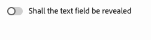
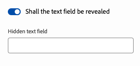

# Customizing the Universal Editor {#customizing}

Learn about the different options to customize the Universal Editor to support the needs of your content authors.

>[!TIP]
>
>The Universal Editor also offers many [extension points,](/help/implementing/universal-editor/extending.md) allowing you to expand its functionality to meet your project needs.

## Disabling Publishing {#disable-publish}

Certain authoring workflows require content to be reviewed before it is published. In such situations, the option to publish should not be available to any authors.

The **Publish** button can therefore be suppressed entirely in an app by adding the following metadata.

```html
<meta name="urn:adobe:aue:config:disable" content="publish"/>
```

## Disabling Publishing to Preview {#publish-preview}

Certain authoring workflows might preclude the publication to the [preview service](/help/sites-cloud/authoring/sites-console/previewing-content.md) (if available).

The **Preview** option in the publish window can therefore be suppressed entirely in an app by adding the following metadata.

```html
<meta name="urn:adobe:aue:config:disable" content="publish-preview"/>
```

## Disabling Open Page {#open-page}

The **Open Page** button can be suppressed entirely in an app by adding the following metadata.

```html
<meta name="urn:adobe:aue:config:disable" content="header-open-page" />
```

## Disabling Duplicate Button {#duplicate-button}

Certain authoring workflow might need to limit the ability of the content author to duplicate components. You can disable the [duplicate icon](/help/sites-cloud/authoring/universal-editor/navigation.md#duplicate) by adding the following metadata.

```html
<meta name="urn:adobe:aue:config:disable" content="duplicate"/>
```

## Disabling Copy and Paste {#copy-paste}

Certain authoring workflow might need to limit the ability of the content author to copy and paste components. You can disable the [copy and paste icons](/help/sites-cloud/authoring/universal-editor/authoring.md#copy-paste) by adding the following metadata.

```html
<meta name="urn:adobe:aue:config:disable" content="copy"/>
```

## Changing Your Endpoint {#custom-endpoint}

If you would like not to use the Universal Editor Service, which is hosted by Adobe, but your own hosted version, you can set this in a meta tag. Please see the document [Getting Started with the Universal Editor in AEM](/help/implementing/universal-editor/getting-started.md##configuration-settings) for details.

## Filtering Components {#filtering-components}

You can restrict the allowed components per container in the Universal Editor using component filters. Please see the document [Filtering Components](/help/implementing/universal-editor/filtering.md) for more information.

## Conditionally Show and Hide Components in Properties Panel {#conditionally-hide}

Although a component or components may generally be available to your authors, there may be certain situations where it does not make sense. In such cases, you can hide components in the properties panel by adding a `condition` attribute to the [fields of the component model](/help/implementing/universal-editor/field-types.md#fields).

Conditions can be defined using [JsonLogic schema](https://jsonlogic.com/). If the condition is true, then the field will be displayed. If the condition is false, then the field will be hidden.

>[!BEGINTABS]

>[!TAB Sample Model]

```json
 {
    "id": "conditionally-revealed-component",
    "fields": [
      {
        "component": "boolean",
        "label": "Shall the text field be revealed?",
        "name": "reveal",
        "valueType": "boolean"
      },
      {
        "component": "text-input",
        "label": "Hidden text field",
        "name": "hidden-text",
        "valueType": "string",
        "condition": { "===": [{"var" : "reveal"}, true] }
      }
    ]
 }
```

>[!TAB Condition False]



>[!TAB Condition True]



>[!ENDTABS]

## Custom Preview URLs {#custom-preview-urls}

You can specify a custom preview URL via a `urn:adobe:aue:config:preview` meta configuration, which will open when clicking the **Open page** button in the [editor's top-right toolbar](/help/sites-cloud/authoring/universal-editor/navigation.md#universal-editor-toolbar).

To do so, simply include the desired preview URL in a meta tag of the instrumented app like the following example.

```html
<meta name="urn:adobe:aue:config:preview" content="https://wknd.site"/>
```
