# Universal Editor Overview for AEM Developers {#developer-overview}

If you are an AEM developer interested in how the Universal Editor works and how to use it in your project, this document gives you an end-to-end introduction by leading you through instrumenting the WKND project to work with the Universal Editor.

## Purpose {#purpose}

This document serves as a developer's introduction to both how the Universal Editor functions and how to instrument your application to work with it.

It does this by taking a standard example that most AEM developer's are familiar with, the Core Components and the WKND site, and instruments a few example components to be editable using the Universal editor.

>[!TIP]
>
>This document takes extra steps to illustrate how the Universal Editor works and is intended to deepen the developer's understanding of the editor. It therefore does not take the most direct route to instrumenting an app, but the most illustrative of the Universal Editor and how it works.
>
>If you want to get up-and-running as quickly as possible, please see the [Getting Started with the Universal Editor in AEM](/help/implementing/universal-editor/getting-started.md) document.

## Prerequisites {#prerequisites}

To follow along with this overview, you need the following available.

* [A local development instance of AEM as a Cloud Service](https://experienceleague.adobe.com/docs/experience-cloud/software-distribution/home.html)
  * Your local development instance must be [configured with HTTPS for development purpose on `localhost`.](https://experienceleague.adobe.com/docs/experience-manager-learn/foundation/security/use-the-ssl-wizard.html)
  * [The WKND demo site must be installed.](https://github.com/adobe/aem-guides-wknd)
* [Access to the Universal Editor](/help/implementing/universal-editor/getting-started.md#onboarding)
* [A local Universal Editor service](/help/implementing/universal-editor/local-dev.md) running for development purposes
  * Make sure to direct your browser to [accept the local services self-signed certificate.](/help/implementing/universal-editor/local-dev.md#editing)

Beyond general familiarity with web development, this document assumes basic familiarity with AEM development. If you are not experienced with AEM development, consider reviewing [the WKND tutorial before continuing.](/help/implementing/developing/introduction/develop-wknd-tutorial.md)

## Start AEM and Sign In to the Universal Editor {#sign-in}

If you haven't already, you must have your local AEM development instance running with WKND installed and HTTPS enabled as [detailed in the prerequisites.](#prerequisites) This overview assumes that your instance is running at `https://localhost:8443`.

1. Open the main WKND English language master page in the AEM Editor.

   ```text
   https://localhost:8443/editor.html/content/wknd/language-masters/en.html
   ```

1. In the **Page Information** menu of the editor, select **View as Published**. This opens the same page in a new tab with the AEM Editor disabled.

   ```text
   https://localhost:8443/content/wknd/language-masters/en.html?wcmmode=disabled
   ```

1. Copy this link.

1. Now sign in to the Universal Editor.

   ```text
   https://experience.adobe.com/#/aem/editor
   ```

1. Paste the link that you copied previously of the WKND content into the **Site URL** field of the Universal Editor and click **Open**.

   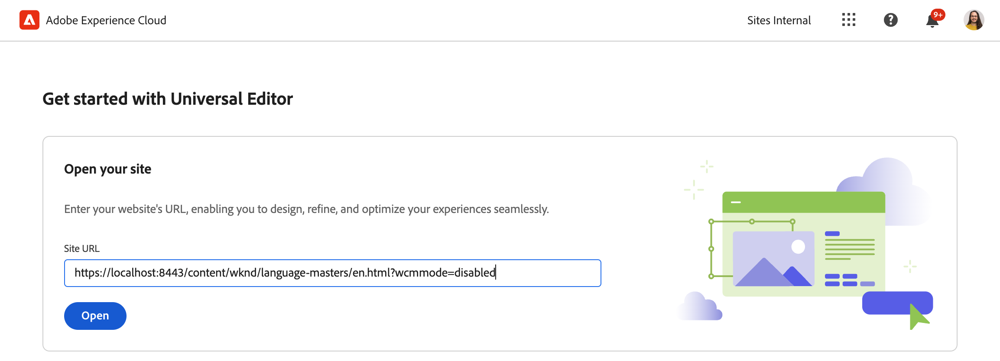

## Universal Editor Attempts to Load the Content {#sameorigin}

The Universal Editor loads content to be edited in a frame. AEM's default settings for X-Frame options prevent this, which can clearly be seen in the browser as an error and detailed in the console output when trying to load your local copy of WKND.

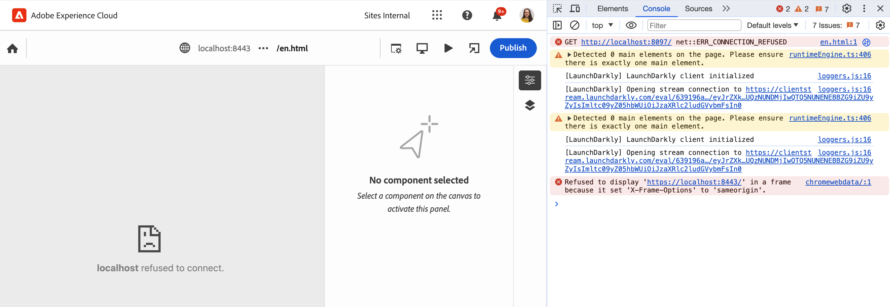

The X-Frame option `sameorigin` prevents rendering AEM pages within a frame. You must remove this header to allow the pages to be loaded in the Universal Editor.

1. Open the Configuration Manager.

   ```text
   https://localhost:8443/system/console/configMgr
   ```

1. Edit the OSGi configuration `org.apache.sling.engine.impl.SlingMainServlet`

   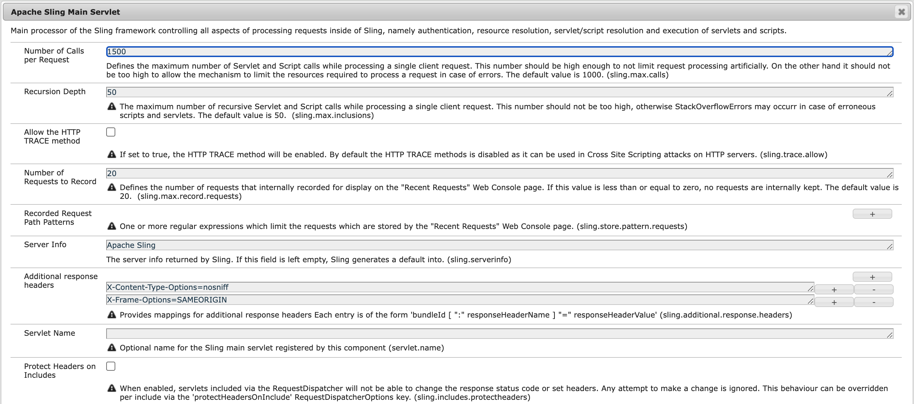

1. Delete the property `X-Frame-Options=SAMEORIGIN` of the property **Additional response headers**.

1. Save the changes.

Now if you reload the Universal Editor, you see that your AEM page loads.

>[!TIP]
>
>* See the document [Getting Started with the Universal Editor in AEM](/help/implementing/universal-editor/getting-started.md#sameorigin) for more details on this OSGi configuration.
>* See the document [Configuring OSGi for Adobe Experience Manager as a Cloud Service](/help/implementing/deploying/configuring-osgi.md) for details on OSGi in AEM.

## Handling Same Site Cookies {#samesite-cookies}

When the Universal Editor loads your page, it loads to the AEM sign-in page to ensure that you are authenticated to make changes.

However, you can not successfully sign in. Showing the browser console, you can see that the browser has blocked input on the frame

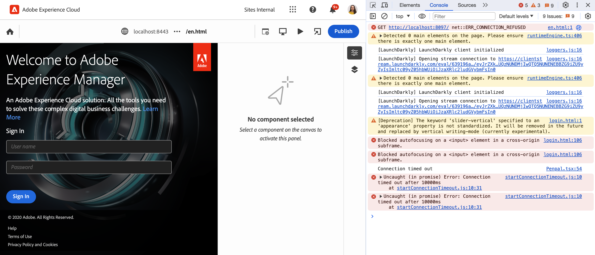

The login token cookie is sent to AEM as a third-party domain. Therefore the same-site cookies must be allowed in AEM.

1. Open the Configuration Manager.

   ```text
   https://localhost:8443/system/console/configMgr
   ```

1. Edit the OSGi configuration `com.day.crx.security.token.impl.impl.TokenAuthenticationHandler`

   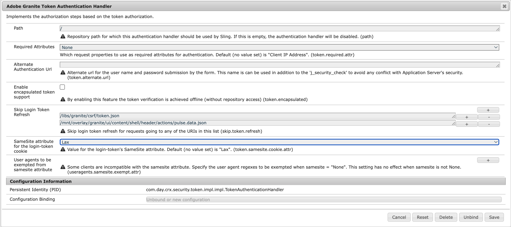

1. Change the property **SameSite attribute for the login-token cookie** to `None`.

1. Save the changes.

Now if you reload the Universal Editor, you can successfully sign in to AEM and your target page loads.

>[!TIP]
>
>* See the document [Getting Started with the Universal Editor in AEM](/help/implementing/universal-editor/getting-started.md#samesite-cookies) for more details on this OSGi configuration.
>* See the document [Configuring OSGi for Adobe Experience Manager as a Cloud Service](/help/implementing/deploying/configuring-osgi.md) for details on OSGi in AEM.

## Universal Editor Connects to the Remote Frame {#ue-connect-remote-frame}

With the page loaded in the Universal Editor and you signed into AEM, the Universal Editor tries to connect to the remote frame. This is done via a JavaScript library that must be loaded in the remote frame. If the JavaScript library is not present, the page ultimately creates a timeout error in the console.

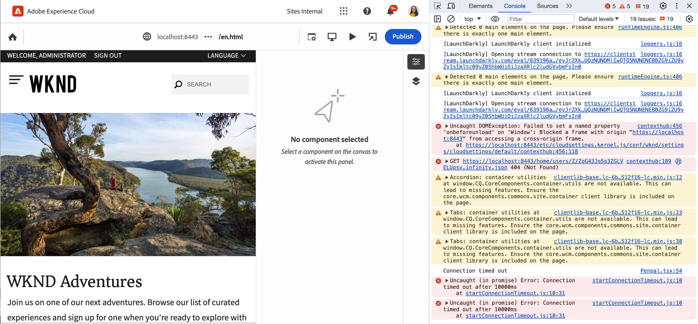

You must add the necessary JavaScript library to the page component of the WKND app.

1. Open CRXDE Lite.

   ```text
   https://localhost:8443/crx/de
   ```

1. Under `/apps/wknd/components/page`, edit the file `customheaderlibs.html`.

   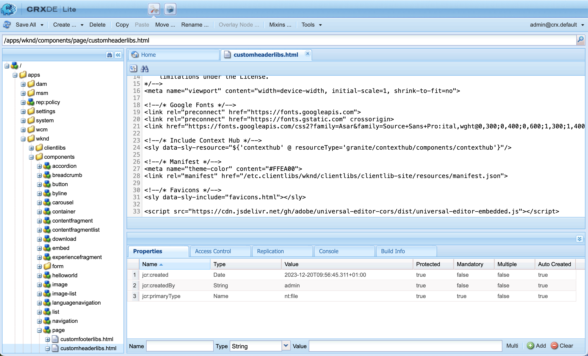

1. Add the JavaScript library to the end of the file.

   ```html
   <script src="https://universal-editor-service.adobe.io/cors.js" async></script>
   ```

1. Click **Save All** and then reload the Universal Editor.

The page now loads with the proper JavaScript library to allow the Universal Editor to connect to your page and the timeout error no longer appears in the console.

>[!TIP]
>
>* The library can be loaded either in the header or the footer.

>[!NOTE]
>
>The previously-recommend method to include the JavaScript library, `<script src="https://universal-editor-service.experiencecloud.live/corslib/LATEST"></script>` or via npmjs.com is no longer recommended as the package has been deprecated.
>
>If an app still uses the deprecated package, the Universal Editor will display a warning in the UI that an outdated package is detected.

## Defining a Connection to Persist Changes {#connection}

The WKND page now loads successfully in the Universal Editor and the JavaScript library loads to connect the editor to your app.

However you likely noticed that you can not interact with the page in the Universal Editor. The Universal Editor can not actually edit your page. For the Universal Editor to be able to edit your content, you need to define a connection so it knows where to write the content. For local development, you need to write back to your local AEM development instance at `https://localhost:8443`.

1. Open CRXDE Lite.

   ```text
   https://localhost:8443/crx/de
   ```

1. Under `/apps/wknd/components/page`, edit the file `customheaderlibs.html`.

   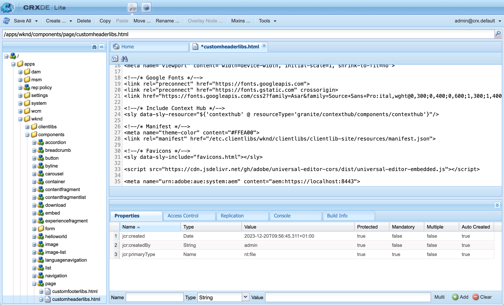

1. Add the necessary metadata for the connection to your local AEM instance to the end of the file.

   ```html
   <meta name="urn:adobe:aue:system:aem" content="aem:https://localhost:8443">
   ```

   * The latest version of the library is always recommended. If you need a prior version, please see the document [Getting Started with the Universal Editor in AEM.](/help/implementing/universal-editor/getting-started.md#alternative)

1. Add the necessary metadata for the connection to your local Universal Editor service to the end of the file.

   ```html
   <meta name="urn:adobe:aue:config:service" content="https://localhost:8000">
   ```

1. Click **Save All** and then reload the Universal Editor.

Now the Universal Editor can not only load your content successfully from your local AEM development instance, but also knows where to persist any changes you make using your local Universal Editor service. This is the first step in instrumenting your app to be editable with the Universal Editor.

>[!TIP]
>
>* See the document [Getting Started with the Universal Editor in AEM](/help/implementing/universal-editor/getting-started.md#connection) for more details on the connection metadata.
>* See the document [Universal Editor Architecture](/help/implementing/universal-editor/architecture.md#service) for more details on the structure of the Universal Editor.
>* See the document [Local AEM Development with the Universal Editor](/help/implementing/universal-editor/local-dev.md) for more details on how to connect to a self-hosted version of the Universal Editor.

## Instrumenting Components {#instrumenting-components}

However, you probably notice that you still can do little with the Universal Editor. If you attempt to click the teaser at the top of the WKND page in the Universal Editor, you can not actually select it (or anything else on the page).

Your components must also be instrumented to be editable with the Universal Editor. To do this, you must edit the teaser component. Therefore you need to overlay the Core Components since the Core Components are under `/libs`, which is immutable.

1. Open CRXDE Lite.

   ```text
   https://localhost:8443/crx/de
   ```

1. Select the node `/libs/core/wcm/components` and click **Overlay Node** on the toolbar.

1. With `/apps/` selected as the **Overlay Location**, click **OK**.

   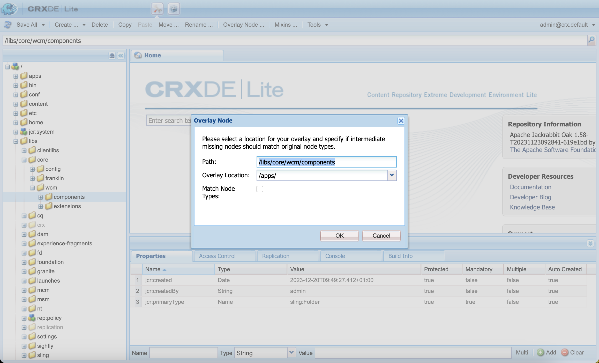

1. Select the `teaser` node under `/libs/core/wcm/components` and click **Copy** in the toolbar.

1. Select the overlaid node at `/apps/core/wcm/components` and click **Paste** in the toolbar.

1. Double-click the file `/apps/core/wcm/components/teaser/v2/teaser/teaser.html` to edit it.

   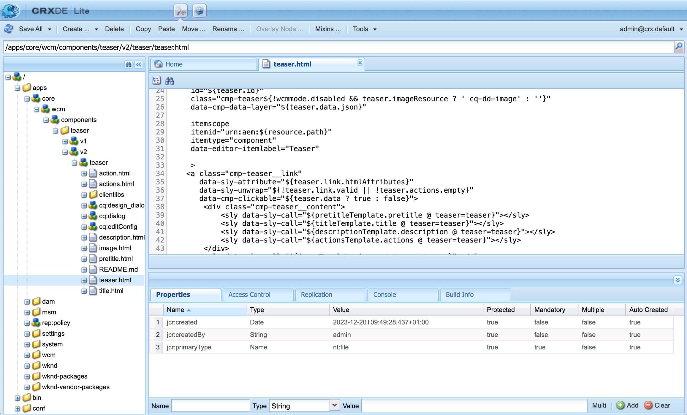

1. At the end of the first `div` at approximately line 26, add the instrumentation details for the component.

   ```text
   data-aue-resource="urn:aem:${resource.path}"
   data-aue-type="component"
   data-aue-label="Teaser"
   ```

1. Click **Save All** in the toolbar and reload the Universal Editor.

1. In the Universal Editor, click the teaser component at the top of the page and see that you can now select it.

1. If you click the **Content tree** icon in the properties panel of the Universal Editor, you can see that the editor recognized all the teasers on the page now that you have instrumented it. The teaser you selected is the one highlighted.

   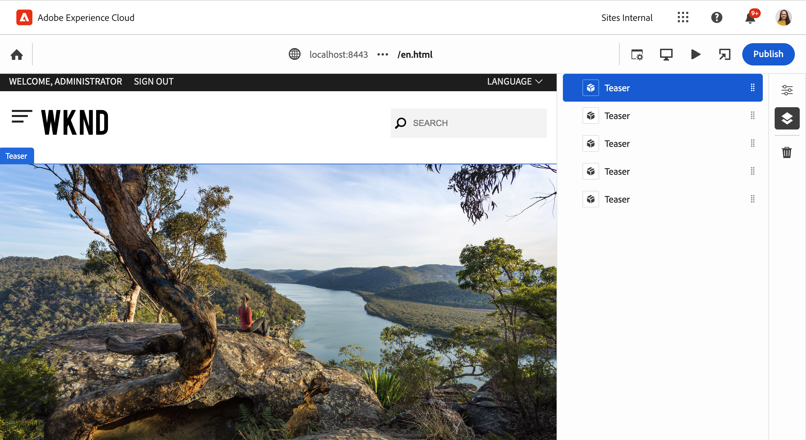

>[!TIP]
>
>See the document [Using the Sling Resource Merger in Adobe Experience Manager as a Cloud Service](/help/implementing/developing/introduction/sling-resource-merger.md) for more details on overlaying nodes.

## Instrument Subcomponents of the Teaser {#subcomponents}

You can now select the teaser, but still not edit it. This is because the teaser is a composite of different components such as the image and title component. You must instrument these sub-components in order to edit them.

1. Open CRXDE Lite.

   ```text
   https://localhost:8443/crx/de
   ```

1. Select the node `/apps/core/wcm/components/teaser/v2/teaser/` and double-click the `title.html` file.

   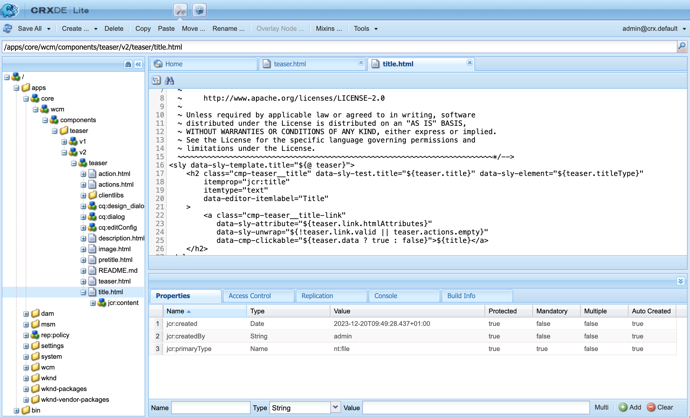

1. Insert the following properties at the end of the `h2` tag (near line 17).

   ```text
   data-aue-prop="jcr:title"
   data-aue-type="text"
   data-aue-label="Title"
   ```

1. Click **Save All** in the toolbar and reload the Universal Editor.

1. Click the title of the same teaser component at the top of the page and see that you can now select it. The content tree also shows the title as part of the selected teaser component.

   

You can now edit the title of the teaser component!

## What does it all mean? {#what-does-it-mean}

Now that you can edit the title of the teaser, let's take a moment to review what you have accomplished and how.

You have identified the teaser component to the Universal Editor by instrumenting it.

* `data-aue-resource` identifies the resource in AEM that is being edited.
* `data-aue-type` defines that the items should be treated as a page component (as opposed to say, a container).
* `data-aue-label` displays a user-friendly label in the UI for the selected teaser.

You have also instrumented the title component within the teaser component.

* `data-aue-prop` is the JCR attribute which is written.
* `data-aue-type` is how the attribute should be edited. In this case, with the text editor since it is a title (as opposed to say, the rich text editor).

## Defining Authentication Headers {#auth-header}

Now you can edit the title of the teaser in-line and changes are persisted in the browser.

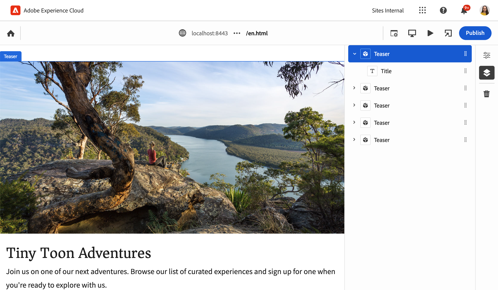

However, if you reload the browser, the previous title is reloaded. This is because although the Universal Editor knows how to connect to your AEM instance, it editor can't yet authenticate to your AEM instance to write back changes to the JCR.

If you show the network tab of the browser developer tools and search for `update`, you can see that it is encountering a 401 error when you try to edit the title.


When using the Universal Editor to edit your production AEM content, the Universal Editor uses the same IMS token that you used to log on to the editor to authenticate to AEM to facilitate writing back to the JCR.

When you are developing locally, you can't use the AEM identity provider since IMS tokens are only passed to Adobe-owned domains. You need to manually provide a way to authenticate by explicitly setting an authentication header.

1. In the Universal Editor interface, click the **Authentication Headers** icon in the toolbar.

1. Copy in the necessary authentication header to authenticate to your local AEM instance and click **Save**.

   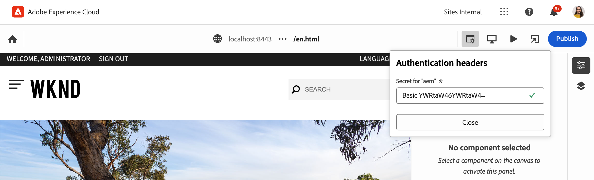

1. Reload the Universal Editor and now edit the title of the teaser.

There are no longer any errors reported in the browser console and the changes are persisted back to your local AEM development instance.

If you investigate the traffic in the browser developer tools and look for the `update` events, you can see the detail of the update.

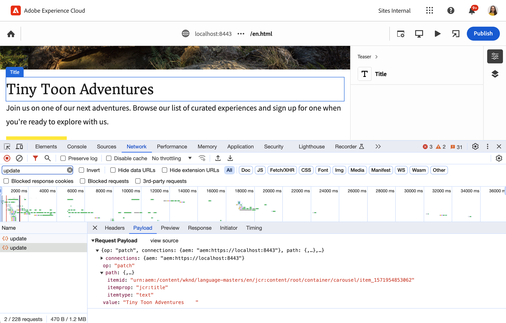

```json
{
  "connections": [
    {
      "name": "aem",
      "protocol": "aem",
      "uri": "https://localhost:8443"
    }
  ],
  "target": {
    "resource": "urn:aem:/content/wknd/language-masters/en/jcr:content/root/container/carousel/item_1571954853062",
    "type": "text",
    "prop": "jcr:title"
  },
  "value": "Tiny Toon Adventures"
}
```

* `connections` is the connection to your local AEM instance
* `target` is the exact node and properties that are updated in the JCR
* `value` is the update that you made.

You can see the change persisted in the JCR.

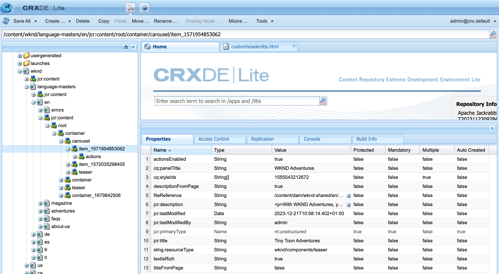

>[!TIP]
>
>There are many tools available online to generate the necessary authentication headers for your testing and development purposes.
>
>The basic authentication header example `Basic YWRtaW46YWRtaW4=` is for the user/password combination of `admin:admin` as is common for local AEM development.

## Instrumenting the App for the Properties Panel {#properties-rail}

You now have an app that is instrumented to be editable using the Universal Editor!

Editing is currently limited to in-line editing of the teaser's title. However, there are cases when editing in-place is not sufficient. Text such as the title of the teaser can be edited where it is with keyboard input. However more complicated items need to be able to display and allow editing of structured data separate from how it is rendered in the browser. This is what the properties panel is for.

To update your app to use the properties panel for editing, return to the header file of the page component of your app. This is where you already established the connections to your local AEM development instance and your local Universal Editor service. Here you must define the components that are editable in the app and their data models.

1. Open CRXDE Lite.

   ```text
   https://localhost:8443/crx/de
   ```

1. Under `/apps/wknd/components/page`, edit the file `customheaderlibs.html`.

   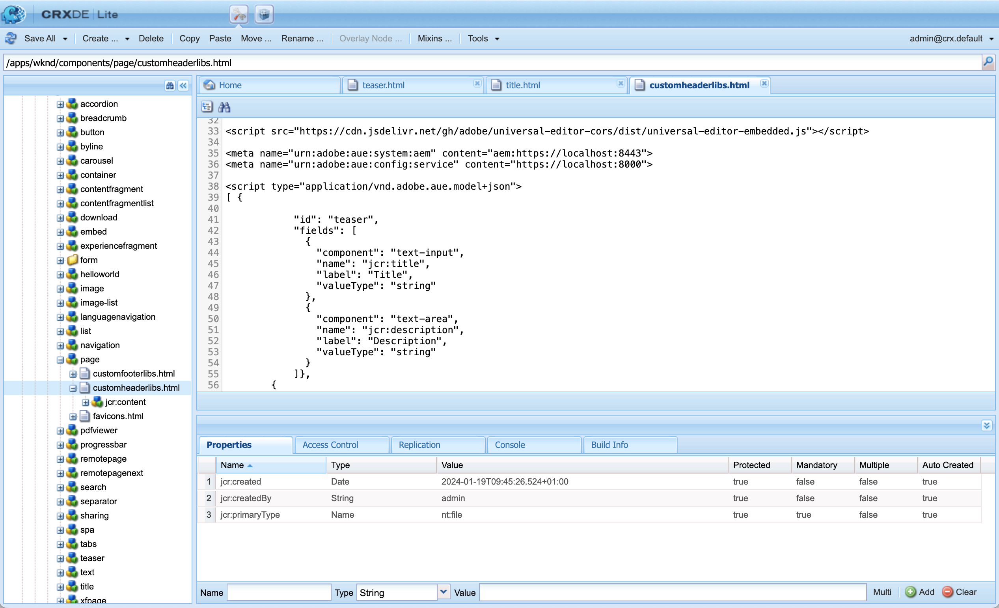

1. To the end of the file add the necessary script to define the components.

   ```html
   <script type="application/vnd.adobe.aue.component+json">
   {
     "groups": [
       {
         "title": "General Components",
         "id": "general",
         "components": [
           {
             "title": "Teaser",
             "id": "teaser",
             "plugins": {
               "aem": {
                 "page": {
                   "resourceType": "wknd/components/teaser"
                 }
               }
             }
           },
           {
             "title": "Title",
             "id": "title",
             "plugins": {
               "aem": {
                 "page": {
                   "resourceType": "wknd/components/title"
                 }
               }
             }
           }
         ]
       }
     ]
   }
   </script>
   ```

1. Below that, to the end of the file add the necessary script to define the model.

   ```html
   <script type="application/vnd.adobe.aue.model+json">
   [
     {
       "id": "teaser",
       "fields": [
         {
           "component": "text-input",
           "name": "jcr:title",
           "label": "Title",
           "valueType": "string"
         },
         {
           "component": "text-area",
           "name": "jcr:description",
           "label": "Description",
           "valueType": "string"
         }
       ]
     },
     {
       "id": "title",
       "fields": [
         {
           "component": "select",
           "name": "type",
           "value": "h1",
           "label": "Type",
           "valueType": "string",
           "options": [
             { "name": "h1", "value": "h1" },
             { "name": "h2", "value": "h2" },
             { "name": "h3", "value": "h3" },
             { "name": "h4", "value": "h4" },
             { "name": "h5", "value": "h5" },
             { "name": "h6", "value": "h6" }
           ]
         }
       ]
     }
   ]
   </script>
   ```

1. Click **Save All** in the toolbar.

## What does it all mean? {#what-does-it-mean-2}

To be editable using the properties panel, the components must be assigned to `groups`, so each definition begins as a list of groups containing the components.

* `title` is the name of the group.
* `id` is the unique identifier of the group, in this case general components that compose the page content as opposed to advanced components for page layout, for example.

Each group then has an array of `components`.

* `title` is the name of the component.
* `id` is the unique identifier of the component, in this case a teaser.

Each component then has a plugin definition that defines how the component is mapped to AEM.

* `aem` is the plugin that handles the editing. This can be thought of as the service that processes the component.
* `page` defines what kind of component it is, in this case a standard page component.
* `resourceType` is the mapping to the actual AEM component.

Each component then must be mapped to a `model` to define the individual editable fields.

* `id` is the unique identifier of the model, which must match the ID of the component.
* `fields` is an array of the individual fields.
* `component` is the type of input such as text or text area.
* `name` is the field name in the JCR that the field is mapped to.
* `label` is the description of the field that appears in the editor UI.
* `valueType` is the type of data.

## Instrumenting the Component for the Properties Panel {#properties-rail-component}

You also need to define at the component level, which model the component should use.

1. Open CRXDE Lite.

   ```text
   https://localhost:8443/crx/de
   ```

1. Double-click the file `/apps/core/wcm/components/teaser/v2/teaser/teaser.html` to edit it.

   

1. At the end of the first `div` at approximately line 32, after the properties you added previously, add the instrumentation details for the model the teaser component will use.

   ```text
   data-aue-model="teaser"
   ```

1. Click **Save All** in the toolbar and reload the Universal Editor.

Now you are ready to test out the properties panel instrumented for your component.

1. In the Universal Editor, click the title of the teaser to edit it once more.

1. Click the properties panel to show the properties tab and see the fields that you just instrumented.

   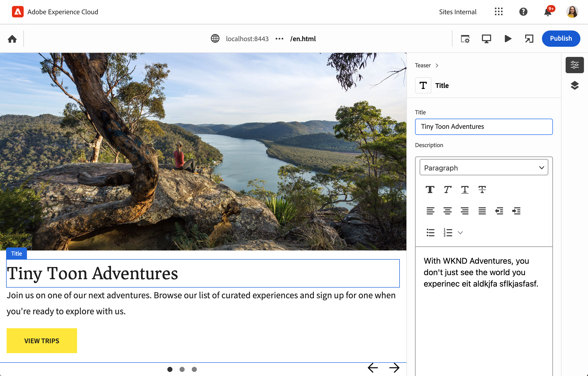

You can now edit the title of the teaser either in-line as you had before, or in the properties panel. In both cases, the changes are persisted back to your local AEM development instance.

## Add Additional Fields to the Properties Panel {#add-fields}

Using the basic structure of the data model for the component that you already implemented, you can add additional fields, following the same model.

For example, you can add a field to adjust the styling of the component.

1. Open CRXDE Lite.

   ```text
   https://localhost:8443/crx/de
   ```

1. Under `/apps/wknd/components/page`, edit the file `customheaderlibs.html`.

   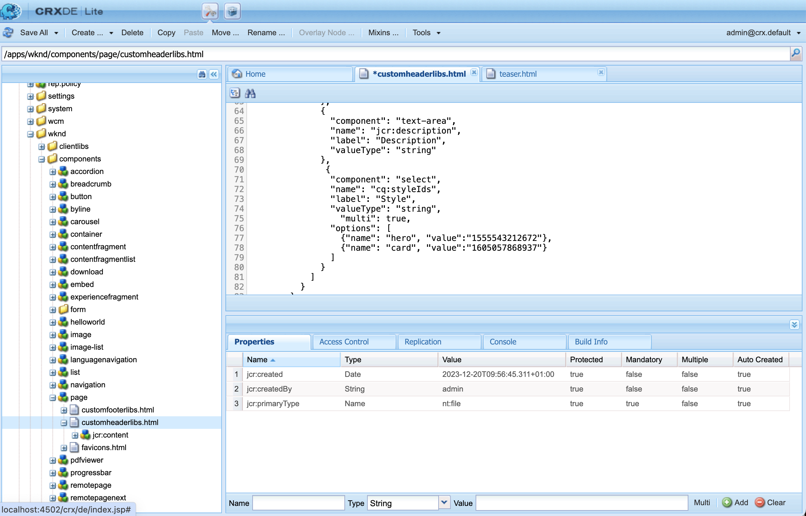

1. In the model definition script, add an additional item to the `fields` array for the style field. Remember to add a comma after the last field before inserting the new one.

   ```json
   {
      "component": "select",
      "name": "cq:styleIds",
      "label": "Style",
      "valueType": "string",
        "multi": true,
      "options": [
        {"name": "hero", "value":"1555543212672"},
        {"name": "card", "value":"1605057868937"}
      ]
   }
   ```

1. Click **Save All** in the toolbar and reload the Universal Editor.

1. Click the title of the teaser to edit it once more.

1. Click the properties panel and see that there is a new field to adjust the style of the component.

   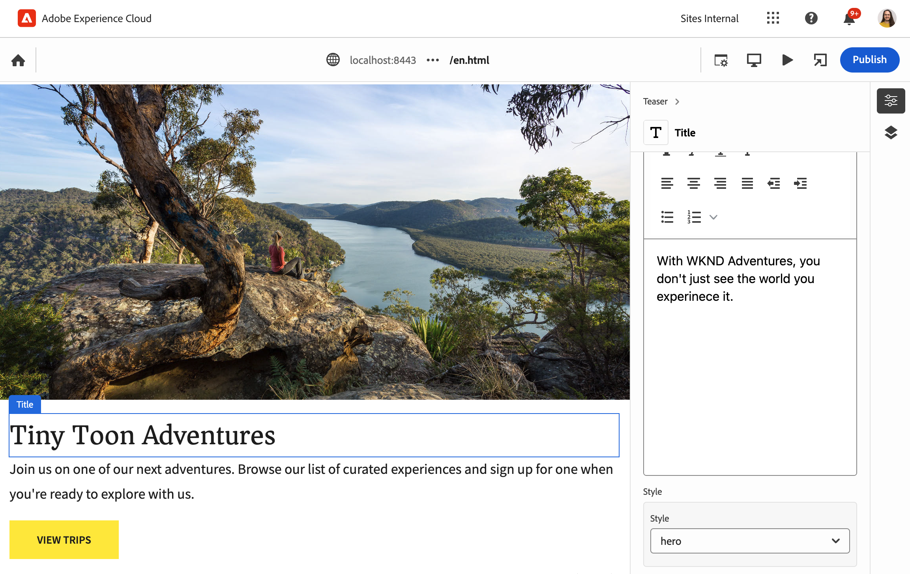

Any field in the JCR for the component can be exposed in the Universal Editor in this way.

## Summary {#summary}

Congratulations! Now you can instrument your own AEM apps to work with the Universal Editor.

When you start instrumenting your own app, keep in mind the basic steps you performed in this example.

1. [You set up your development environment.](#prerequisites)
   * AEM running locally on HTTPS with WKND installed
   * Universal Editor Service running locally on HTTPS
1. You updated AEM's OSGi settings to allow its content to be loaded remotely.
   * [`org.apache.sling.engine.impl.SlingMainServlet`](#sameorigin)
   * [`com.day.crx.security.token.impl.impl.TokenAuthenticationHandler`](#samesite-cookies)
1. [You added the `universal-editor-embedded.js` library to the `customheaderlibs.html` file of the page component of the app.](#ue-connect-remote-frame)
1. [You defined a connection to persist changes in the `customheaderlibs.html` file of the page component of the app.](#connection)
   * You defined a connection to the local AEM development instance.
   * You also defined a connection to the local Universal Editor service.
1. [You instrumented the teaser component.](#instrumenting-components)
1. [You instrumented the subcomponents of the teaser.](#subcomponents)
1. [You defined a custom authentication header so you could save changes using your local Universal Editor service.](#auth-header)
1. [You instrumented the app to use the properties panel.](#properties-rail)
1. [You instrumented the teaser component to use the properties panel.](#properties-rail-component)

You can follow these same steps to instrument your own app for use with the Universal Editor. Any properties in the JCR can be exposed to the Universal Editor.

## Additional Resources {#additional-resources}

Have a look at the following documents for more information and details on the Universal Editor features.

* If you want to get up-and-running as quickly as possible, please see the [Getting Started with the Universal Editor in AEM](/help/implementing/universal-editor/getting-started.md) document.
* See the document [Getting Started with the Universal Editor in AEM](/help/implementing/universal-editor/getting-started.md#sameorigin) for more details on the necessary OSGi configurations.
* See the document [Getting Started with the Universal Editor in AEM](/help/implementing/universal-editor/getting-started.md#connection) for more details on the connection metadata.
* See the document [Universal Editor Architecture](/help/implementing/universal-editor/architecture.md#service) for more details on the structure of the Universal Editor.
* See the document [Local AEM Development with the Universal Editor](/help/implementing/universal-editor/local-dev.md) for more details on how to connect to a self-hosted version of the Universal Editor.
* See the document [Using the Sling Resource Merger in Adobe Experience Manager as a Cloud Service](/help/implementing/developing/introduction/sling-resource-merger.md) for more details on overlaying nodes.

